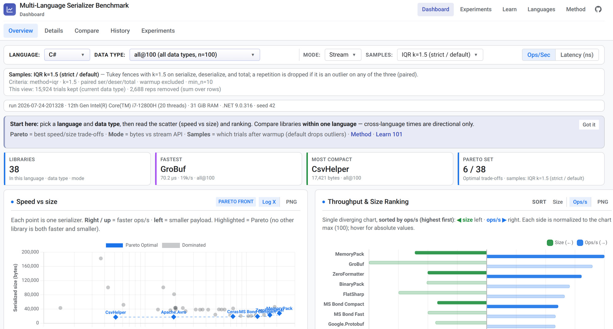

# Multi-Language Serializer Benchmark

[](https://leo-gan.github.io/GLD.SerializerBenchmark/)
[](https://leo-gan.github.io/GLD.SerializerBenchmark/dashboard/)
[](https://leo-gan.github.io/GLD.SerializerBenchmark/theory/101/)
[](LICENSE)
[](#supported-languages)

Compare 100+ serialization libraries across **ten languages**.

| Start here | |
|------------|--|
| **Home** | [Documentation](https://leo-gan.github.io/GLD.SerializerBenchmark/) |
| **Numbers** | [Live dashboard](https://leo-gan.github.io/GLD.SerializerBenchmark/dashboard/) |
| **Experiments** | [One-question tests](https://leo-gan.github.io/GLD.SerializerBenchmark/experiments/) |
| **Learn** | [Serialization 101–401](https://leo-gan.github.io/GLD.SerializerBenchmark/theory/101/) |
| **Benchmarks** | [How we measure](https://leo-gan.github.io/GLD.SerializerBenchmark/analysis/ANALYSIS_METHODOLOGY/) · [Metrics](https://leo-gan.github.io/GLD.SerializerBenchmark/analysis/METRICS/) |

<p align="center">
  <a href="https://leo-gan.github.io/GLD.SerializerBenchmark/dashboard/">
    
  </a>
  <br />
  <sub>The live <strong>Dashboard</strong>: pick a language and data type, then read speed vs size and the ranking.</sub>
</p>

---

## Who it is for

| Audience | Use case | Course |
|----------|----------|--------|
| **Computer science students** | Theory, history, worked examples | [101](https://leo-gan.github.io/GLD.SerializerBenchmark/theory/101/), [201](https://leo-gan.github.io/GLD.SerializerBenchmark/theory/201/) |
| **System integrators** | Pick formats that fit payloads and runtimes | [301](https://leo-gan.github.io/GLD.SerializerBenchmark/theory/301/) |
| **Researchers** | Reproducible measurement and experiments | [Methodology](https://leo-gan.github.io/GLD.SerializerBenchmark/analysis/ANALYSIS_METHODOLOGY/) · [301](https://leo-gan.github.io/GLD.SerializerBenchmark/theory/301/) |
| **Serializer authors** | Add a codec, version A/B, regression checks | [Adding a serializer](https://leo-gan.github.io/GLD.SerializerBenchmark/analysis/ADDING_A_SERIALIZER/) · [401](https://leo-gan.github.io/GLD.SerializerBenchmark/theory/401/) |

---

## Supported languages

- [C# (.NET)](https://leo-gan.github.io/GLD.SerializerBenchmark/c-sharp/) — 38 serializers registered
- [Python](https://leo-gan.github.io/GLD.SerializerBenchmark/python/) — 16
- [Rust](https://leo-gan.github.io/GLD.SerializerBenchmark/rust/) — 16
- [C](https://leo-gan.github.io/GLD.SerializerBenchmark/c/) — 20
- [JavaScript](https://leo-gan.github.io/GLD.SerializerBenchmark/javascript/) — 20
- [Go](https://leo-gan.github.io/GLD.SerializerBenchmark/go/) — 19
- [Java](https://leo-gan.github.io/GLD.SerializerBenchmark/java/) — 18
- [Kotlin](https://leo-gan.github.io/GLD.SerializerBenchmark/kotlin/) — 26
- [C++](https://leo-gan.github.io/GLD.SerializerBenchmark/cpp/) — 27+
- [Swift](https://leo-gan.github.io/GLD.SerializerBenchmark/swift/) — 14

[Adding a language](https://leo-gan.github.io/GLD.SerializerBenchmark/analysis/ADDING_A_LANGUAGE/) · [Adding a serializer](https://leo-gan.github.io/GLD.SerializerBenchmark/analysis/ADDING_A_SERIALIZER/).

---

## Try it: benchmark Python serializers in ~60 seconds

Requires a recent Python 3 and [uv](https://docs.astral.sh/uv/) (or pip). No Docker.

```bash
git clone https://github.com/leo-gan/GLD.SerializerBenchmark.git
cd GLD.SerializerBenchmark

./scripts/check-host-requirements.sh python   # optional: see what's missing
./scripts/install-host-requirements.sh python # optional: user-local toolchains

cd python && ./scripts/run-benchmarks.sh smoke
# → logs/python/YYYY-MM-DD-HHMMSS.csv
```

Then open the [Python Dashboard](https://leo-gan.github.io/GLD.SerializerBenchmark/dashboard/?lang=python)
(or run `analyze-benchmarks -l python` after installing the analysis package) to review the run.

Prefer Rust? `./scripts/run-all-benchmarks.sh --mode smoke --lang rust`

---

## Quick start

Benchmark runners run **natively on the host** (no Docker). Prepare toolchains once, then run benchmarks (project deps like `uv sync` / `npm install` still happen inside each runner).

```bash
# 1) Host toolchains (compilers/runtimes only)
./scripts/check-host-requirements.sh
./scripts/install-host-requirements.sh
./scripts/install-host-requirements.sh csharp   # one language

# 2) Smoke one language
./python/scripts/run-benchmarks.sh smoke
# or: ./rust/scripts/run-benchmarks.sh smoke

# Orchestrator: all languages or one language
./scripts/run-all-benchmarks.sh --mode all-single
./scripts/run-all-benchmarks.sh --mode full --lang rust

# Analysis package (writes reports/; Dashboard via sync-data.py)
cd analysis && uv pip install -e .   # or: pip install -e .
analyze-benchmarks
analyze-benchmarks -l python
analyze-benchmarks --compare-a rust:2026-07-09-194122 --compare-b rust:latest
```

**Modes**: `smoke` (2 reps) · `all-single` (10) · `full` (100) · `research` (500).

`analyze-benchmarks` writes `reports/`; Dashboard via `sync-data.py`. Review and commit before `publish-docs` deploys the site.

---

## Test data

Shared **data types**: `message`, `document`, `telemetry`, `strings`, and `event`.

Catalog and defaults: `schemas/data_catalog_v2.yaml`. Run matrices: `config/library/`.  
Docs: [Test data](https://leo-gan.github.io/GLD.SerializerBenchmark/analysis/test_data_configuration/).

---

## Statistics

- [Analysis methodology](https://leo-gan.github.io/GLD.SerializerBenchmark/analysis/ANALYSIS_METHODOLOGY/)
- [Metrics catalog](https://leo-gan.github.io/GLD.SerializerBenchmark/analysis/METRICS/)

Compare serializers **within one language** (and ideally one category). Cross-language absolute times are directional only — runtimes and GCs differ.
