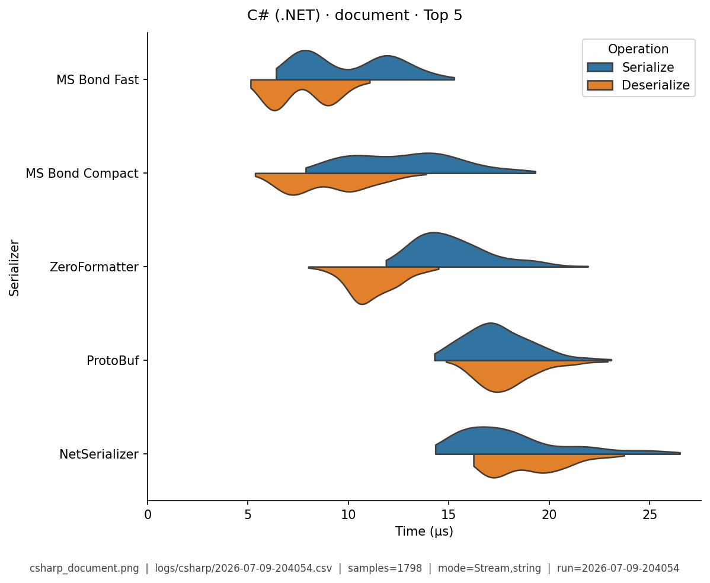
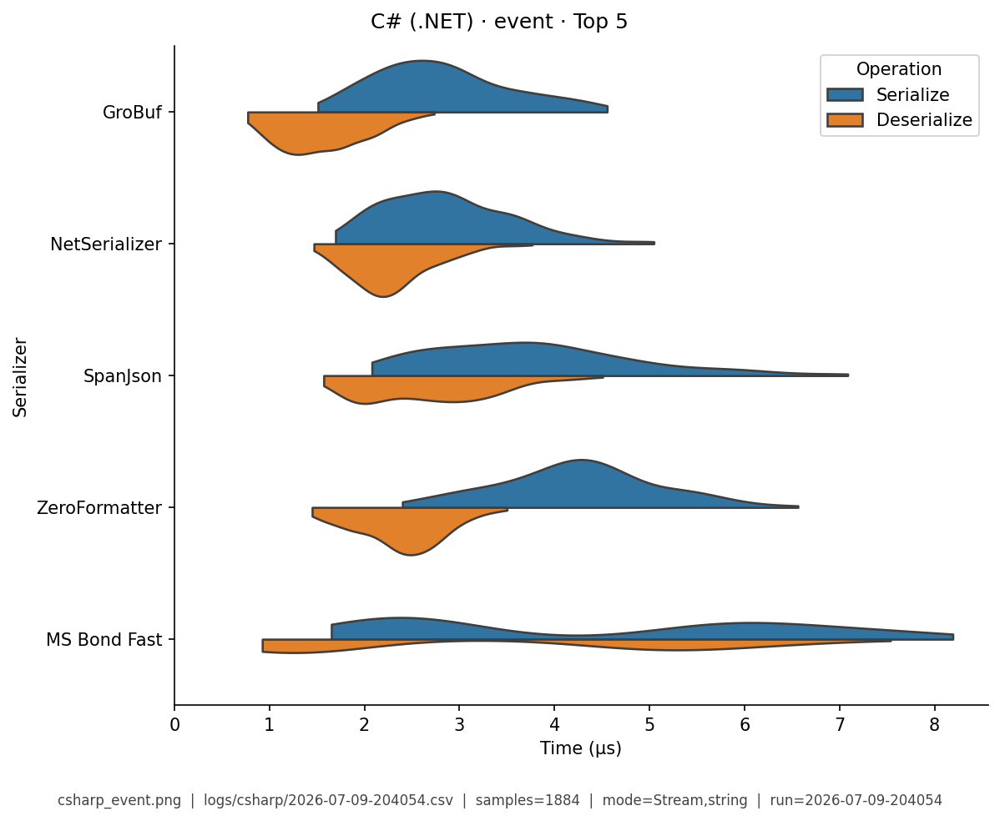
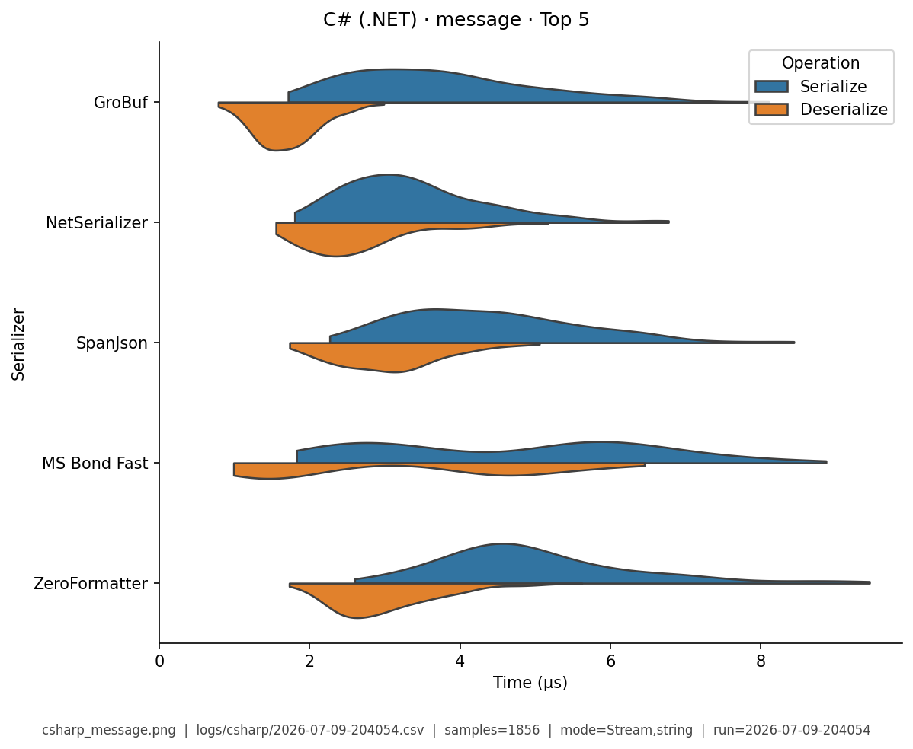
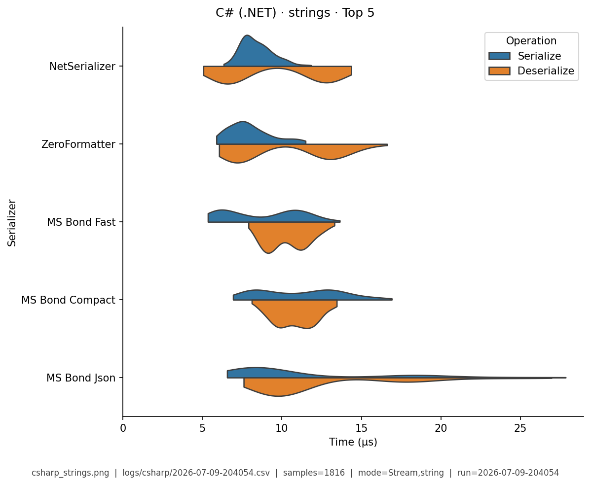
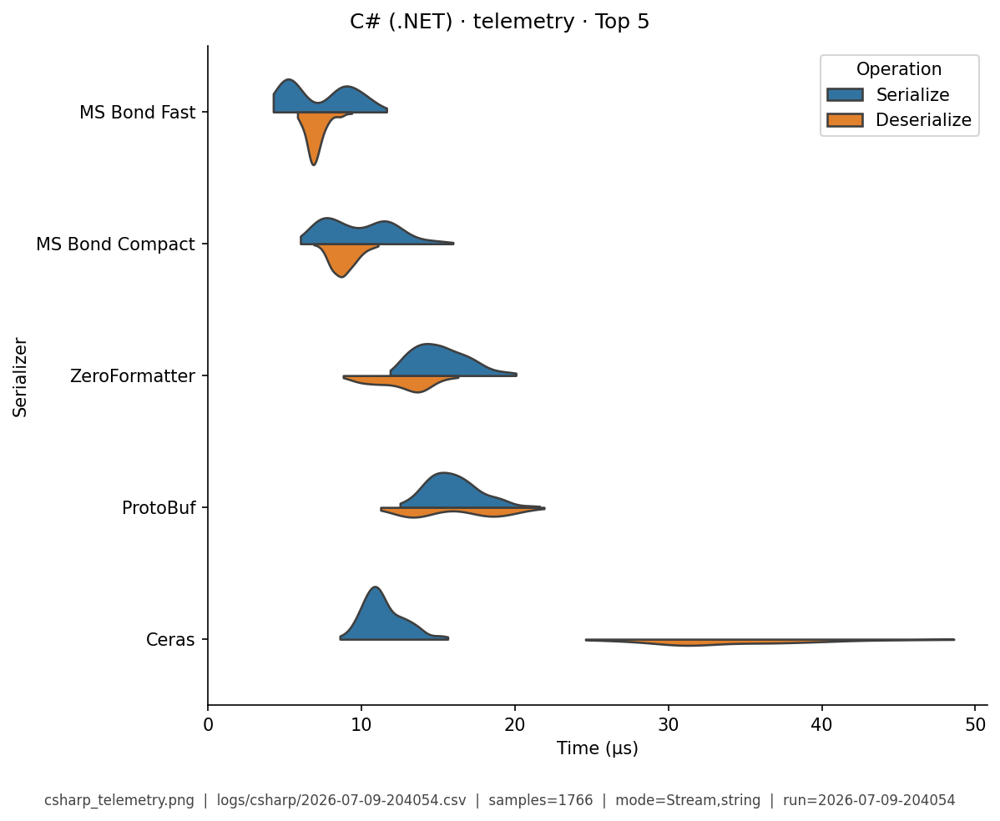

# C# (.NET) — Benchmark Results

**Generated:** 2026-07-09T21:04:42.398556

Published **local snapshot** (not regenerated by GitHub Actions). Numbers may differ if you re-run benchmarks on another machine.

Serializer inventory and caveats: [C# (.NET) overview](index.md). Methods: [Analysis Methodology](../analysis/ANALYSIS_METHODOLOGY.md). Metric definitions & importance tiers: [Metrics catalog](../analysis/METRICS.md).

## Pivot tables

Multi-way leaderboards emphasize **high-importance** metrics (configurable via `metrics.multi_way` in master config). Harness **modes** (CSV `StringOrStream`): **bytes mode** = in-memory buffer API; **stream mode** = write/read through a stream-like path. These names are *not* payload sizes. In each table, **bold** marks the semantic best value in that column (lowest time; highest ops/s). Ties are all bolded. Latency tables are in **microseconds** (µs). Data Model v2 fixtures use `type@n=<DataTypeInstanceCount>` labels.

### Summary

Default multi-serializer view shows **high-importance** metrics only ([METRICS.md](../analysis/METRICS.md)). **Primary rank:** median total latency (lower is better). Pairwise / version A/B reports use the full metric set. Latency cells are **µs** (analysis storage remains ns).

| serializer | Median total (µs) | Median ser (µs) | Median deser (µs) | Ops/s (from mean) | Median size (B) | Samples | Fidelity |
|---|---|---|---|---|---|---|---|
| GroBuf:1.9.2 | **4.78** | **3.14** | **1.58** | **207K** | **2.5** | 374 | **1.00** |
| MS Bond Fast:.NET 8.0.28 | 13.2 | 6.92 | 6.23 | 103K | 697.5 | 903 | **1.00** |
| MemoryPack | 15.6 | 8.29 | 7.11 | 79K | 584.2 | 552 | **1.00** |
| MS Bond Compact:.NET 8.0.28 | 16.3 | 9.11 | 7.14 | 74.8K | 654.5 | 906 | **1.00** |
| ZeroFormatter:1.6.4 | 17.3 | 9.42 | 7.81 | 81.7K | 679.2 | 919 | **1.00** |
| FlatSharp:7.5.1 | 19.3 | 11.1 | 8.24 | 55.2K | 637.5 | 560 | **1.00** |
| NetSerializer:4.1.2 | 22.5 | 11.3 | 11.1 | 94K | 685.2 | 914 | **1.00** |
| ProtoBuf:2.4.9.1 | 25.1 | 12.4 | 12.8 | 46.3K | 684.9 | 903 | **1.00** |
| Hyperion:0.12.2 | 32.9 | 16.8 | 16 | 48.4K | 867.6 | 905 | **1.00** |
| SpanJson:4.2.1 | 35.4 | 20.8 | 14.4 | 72K | 1056 | 894 | **1.00** |
| Ceras:4.1.7 | 39.6 | 12 | 27.4 | 28.3K | 687.6 | 912 | **1.00** |
| FsPickler:5.3.2 | 46.2 | 27.8 | 18.2 | 24.2K | 869.7 | 935 | **1.00** |
| NetJSON:1.0.0 | 46.4 | 19.7 | 26.6 | 39.4K | 1050 | 922 | **1.00** |
| MS Bond Json:.NET 8.0.28 | 58.5 | 26.3 | 32 | 40.8K | 1058 | 932 | **1.00** |
| Jil:2.17.0 | 63.9 | 24.7 | 39 | 40.5K | 1050 | 934 | **1.00** |
| Utf8Json:1.3.7 | 72.6 | 29.5 | 43.1 | 39.1K | 1056 | 921 | **1.00** |
| Json.Net:13.0.4 | 77.6 | 33.2 | 44.5 | 51.8K | 1137 | 902 | **1.00** |
| MS Binary:.NET 8.0.28 | 81.4 | 39.9 | 41.5 | 18.4K | 1580 | 928 | **1.00** |
| FsPicklerJson:5.3.2 | 90 | 37.4 | 52.6 | 21.1K | 1665 | 915 | **1.00** |
| ServiceStack:6.11.0 | 91 | 44.2 | 46.8 | 21.2K | 996.6 | 893 | **1.00** |
| fastJson:2.4.0.4 | 96.3 | 44.3 | 51.9 | 20.9K | 1302 | 908 | **1.00** |
| Migrant:0.13.0.0 | 100 | 29.7 | 70.3 | 9.89K | 1203 | 370 | **1.00** |
| ServiceStack Json:6.11.0 | 104 | 49.8 | 53.5 | 19.3K | 1052 | 910 | **1.00** |
| MS DataContract Json:.NET 8.0.28 | 109 | 39.4 | 69.4 | 19.2K | 1228 | 936 | **1.00** |
| Json.Net (Helper):13.0.4 | 113 | 52.3 | 60.9 | 16.3K | 1125 | 919 | **1.00** |
| MS XmlSerializer:.NET 8.0.28 | 115 | 50.9 | 63.3 | 14.6K | 2288 | 935 | **1.00** |
| MS DataContract:.NET 8.0.28 | 119 | 48 | 70.3 | 14.4K | 2406 | 938 | **1.00** |
| SharpSerializer | 348 | 103 | 245 | 8.41K | 3810 | 933 | **1.00** |
| SharpYaml:3.12.0 | 541 | 156 | 384 | 3.3K | 1216 | 916 | **1.00** |
| YAXLib:4.4.0 | 580 | 318 | 260 | 2.44K | 2142 | 906 | **1.00** |
| YamlDotNet:17.1.0 | 1.08e+03 | 628 | 451 | 2.32K | 1107 | 897 | **1.00** |
| CsvHelper:33.1.0 | 2.12e+03 | 1.38e+03 | 739 | 466 | 72 | 372 | **1.00** |


### Total Time

| serializer | bytes mode/mean | bytes mode/median | stream mode/mean | stream mode/median |
|---|---|---|---|---|
| GroBuf:1.9.2 | - | - | **5.03** | **5.01** |
| MS Bond Fast:.NET 8.0.28 | - | - | 11.2 | 10.9 |
| MemoryPack | - | - | 10.5 | 10.2 |
| MS Bond Compact:.NET 8.0.28 | - | - | 13.4 | 13.2 |
| ZeroFormatter:1.6.4 | - | - | 7.16 | 7.14 |
| FlatSharp:7.5.1 | - | - | 16.2 | 15.9 |
| NetSerializer:4.1.2 | - | - | 5.2 | 5.1 |
| ProtoBuf:2.4.9.1 | - | - | 15 | 14.6 |
| Hyperion:0.12.2 | - | - | 11.5 | 11.2 |
| SpanJson:4.2.1 | - | - | 7.46 | 7.34 |
| Ceras:4.1.7 | - | - | 27.6 | 26.8 |
| FsPickler:5.3.2 | - | - | 29.9 | 28.7 |
| NetJSON:1.0.0 | - | - | 15.6 | 15.1 |
| MS Bond Json:.NET 8.0.28 | - | - | 17.1 | 16.3 |
| Jil:2.17.0 | - | - | 13.5 | 13.2 |
| Utf8Json:1.3.7 | - | - | 11.9 | 11.5 |
| Json.Net:13.0.4 | - | - | 11.9 | 11.7 |
| MS Binary:.NET 8.0.28 | - | - | 42.8 | 41.2 |
| FsPicklerJson:5.3.2 | - | - | 35.9 | 35.1 |
| ServiceStack:6.11.0 | - | - | 27.7 | 26.9 |
| fastJson:2.4.0.4 | - | - | 34.5 | 32.8 |
| Migrant:0.13.0.0 | - | - | 110 | 108 |
| ServiceStack Json:6.11.0 | - | - | 30.4 | 29.6 |
| MS DataContract Json:.NET 8.0.28 | - | - | 34.2 | 33.8 |
| Json.Net (Helper):13.0.4 | - | - | 42 | 41.1 |
| MS XmlSerializer:.NET 8.0.28 | - | - | 51.5 | 50.3 |
| MS DataContract:.NET 8.0.28 | - | - | 51.9 | 50.6 |
| SharpSerializer | - | - | 71.7 | 69.1 |
| SharpYaml:3.12.0 | - | - | 178 | 177 |
| YAXLib:4.4.0 | - | - | 303 | 300 |
| YamlDotNet:17.1.0 | - | - | 196 | 192 |
| CsvHelper:33.1.0 | - | - | 2.22e+03 | 2.19e+03 |


### Ops/Sec

| serializer | document | event | message | strings | telemetry |
|---|---|---|---|---|---|
| Ceras:4.1.7 | 16K | 46K | 34K | 22K | 21K |
| CsvHelper:33.1.0 | - | 0.49K | 0.44K | - | - |
| FlatSharp:7.5.1 | - | 77K | 51K | 31K | - |
| FsPickler:5.3.2 | 15K | 40K | 29K | 18K | 17K |
| FsPicklerJson:5.3.2 | 6.4K | 42K | 23K | 16K | 5.1K |
| GroBuf:1.9.2 | - | 240K | 170K | - | - |
| Hyperion:0.12.2 | 17K | 98K | 67K | 25K | 20K |
| Jil:2.17.0 | 12K | 100K | 67K | 24K | 5.9K |
| Json.Net:13.0.4 | 6.5K | 120K | 91K | 29K | 5.5K |
| Json.Net (Helper):13.0.4 | 5K | 32K | 22K | 16K | 4.4K |
| MS Binary:.NET 8.0.28 | 5.1K | 37K | 20K | 13K | 11K |
| MS Bond Compact:.NET 8.0.28 | 56K | 170K | 130K | 48K | 58K |
| MS Bond Fast:.NET 8.0.28 | **70K** | **270K** | **220K** | **55K** | **81K** |
| MS Bond Json:.NET 8.0.28 | 11K | 85K | 58K | 37K | 7K |
| MS DataContract:.NET 8.0.28 | 7.7K | 30K | 17K | 9.2K | 3.5K |
| MS DataContract Json:.NET 8.0.28 | 7K | 42K | 26K | 11K | 3.9K |
| MS XmlSerializer:.NET 8.0.28 | 6.6K | 31K | 18K | 12K | 3.8K |
| MemoryPack | - | 120K | 83K | 35K | - |
| Migrant:0.13.0.0 | - | 11K | 8.4K | - | - |
| NetJSON:1.0.0 | 19K | 84K | 69K | 28K | 9.1K |
| NetSerializer:4.1.2 | 26K | 190K | 150K | 46K | 19K |
| ProtoBuf:2.4.9.1 | 28K | 76K | 55K | 30K | 28K |
| ServiceStack:6.11.0 | 6.6K | 43K | 34K | 17K | 5.6K |
| ServiceStack Json:6.11.0 | 5.6K | 40K | 32K | 16K | 4.9K |
| SharpSerializer | 1.5K | 20K | 12K | 4.1K | 1.4K |
| SharpYaml:3.12.0 | 1.1K | 6.8K | 5.6K | 2.1K | 1.2K |
| SpanJson:4.2.1 | 27K | 180K | 130K | 33K | 10K |
| Utf8Json:1.3.7 | 10K | 82K | 72K | 23K | 4.9K |
| YAXLib:4.4.0 | 0.96K | 3.9K | 3.3K | 3K | 1.1K |
| YamlDotNet:17.1.0 | 0.6K | 4.8K | 4.8K | 0.89K | 0.6K |
| ZeroFormatter:1.6.4 | 37K | 160K | 110K | 46K | 35K |
| fastJson:2.4.0.4 | 5.6K | 45K | 29K | 21K | 5.3K |

## Violin plots

Density of serialize / deserialize timings (µs; log scale when medians span ≥5×). **Each plot shows only the top 5 serializers by mean total time** for that fixture (same rule for every language). Full rankings are in the pivot tables above. Provenance (fixture, CSV path, modes, *n*) is printed on each image.

### document

{ width="80%" }

### event

{ width="80%" }

### message

{ width="80%" }

### strings

{ width="80%" }

### telemetry

{ width="80%" }

## Regenerate

Published snapshots are produced **locally** (not by GitHub Actions). After running benchmarks (each run creates a timestamped `YYYY-MM-DD-HHMMSS.csv`):

```bash
analyze-benchmarks              # all languages
analyze-benchmarks -l csharp   # this language only
```

That refreshes this language's results tables and violin plots under `docs/analysis/plots/violin/`. The hub [Benchmark Results](../analysis/BENCHMARK_SUMMARY.md) is a **static** index and is not rewritten. Commit the updated `results.md` / plot paths as needed.


## Run configuration (important)

??? note "Show host, seed, serializers, and source CSV"

    Key fields from the run sidecar (`*.configs.json`, or legacy `*.environment.json`). Full metric definitions: [Metrics catalog](../analysis/METRICS.md). Optional blocks (`dataset`, `serializers`) appear only when captured.
    
    - **Source CSV:** `logs/csharp/2026-07-09-204054.csv`
    - run=2026-07-09-204054
    - language=csharp
    - os=Linux 6.8.0-124-generic
    - cpu=12th Gen Intel(R) Core(TM) i7-12800H (20 threads)
    - ram=31.0 GiB
    - runtimes: python=3.14.0, node=24.15.0, rustc=rustc 1.96.0 (ac68faa20 2026-05-25)
    - git=8ab4030 dirty
    - seed=42
    - warmup_reps=1
    - serializers=32
    - metrics_profile=multi_way
    - **Fixtures (config):** message, document, telemetry, strings, event
    - **Serializers (from CSV):**
      - `Ceras` @ 4.1.7
      - `CsvHelper` @ 33.1.0
      - `FlatSharp` @ 7.5.1
      - `FsPickler` @ 5.3.2
      - `FsPicklerJson` @ 5.3.2
      - `GroBuf` @ 1.9.2
      - `Hyperion` @ 0.12.2
      - `Jil` @ 2.17.0
      - `Json.Net` @ 13.0.4
      - `Json.Net (Helper)` @ 13.0.4
      - `MS Binary` @ .NET 8.0.28
      - `MS Bond Compact` @ .NET 8.0.28
      - `MS Bond Fast` @ .NET 8.0.28
      - `MS Bond Json` @ .NET 8.0.28
      - `MS DataContract` @ .NET 8.0.28
      - `MS DataContract Json` @ .NET 8.0.28
      - `MS XmlSerializer` @ .NET 8.0.28
      - `MemoryPack`
      - `Migrant` @ 0.13.0.0
      - `NetJSON` @ 1.0.0
      - `NetSerializer` @ 4.1.2
      - `ProtoBuf` @ 2.4.9.1
      - `ServiceStack` @ 6.11.0
      - `ServiceStack Json` @ 6.11.0
      - `SharpSerializer`
      - `SharpYaml` @ 3.12.0
      - `SpanJson` @ 4.2.1
      - `Utf8Json` @ 1.3.7
      - `YAXLib` @ 4.4.0
      - `YamlDotNet` @ 17.1.0
      - `ZeroFormatter` @ 1.6.4
      - `fastJson` @ 2.4.0.4
