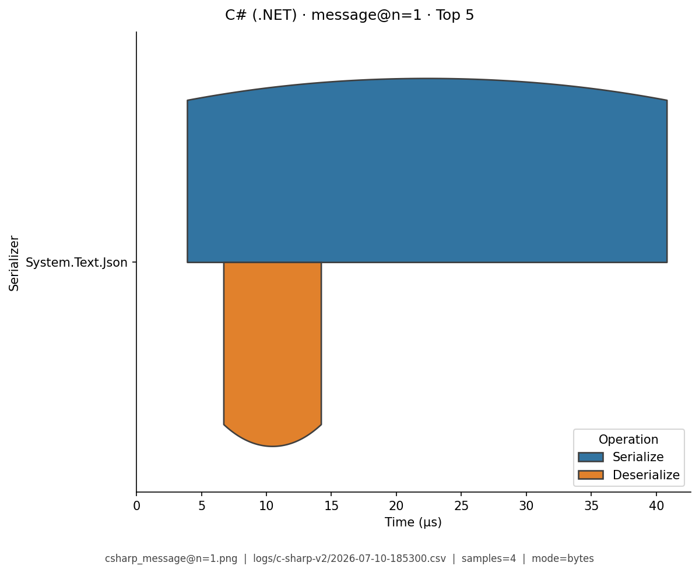
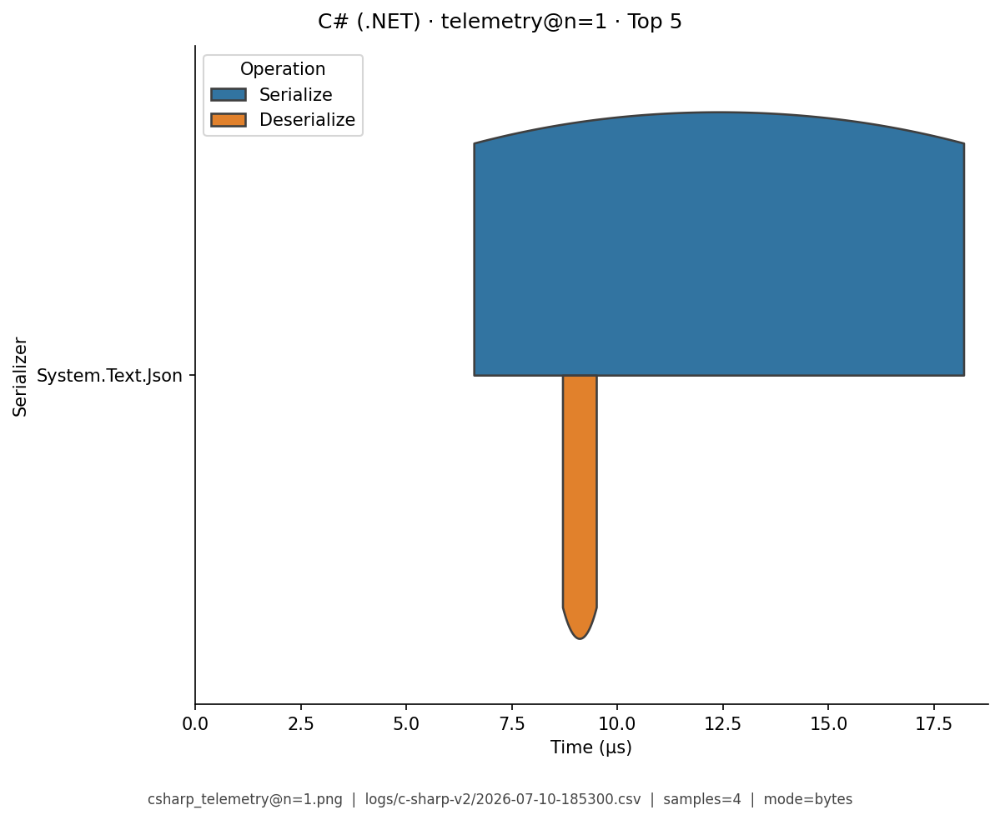

# C# (.NET) — Benchmark Results

**Generated:** 2026-07-09T18:55:59.855199

Published **local snapshot** (not regenerated by GitHub Actions). Numbers may differ if you re-run benchmarks on another machine.

Serializer inventory and caveats: [C# (.NET) overview](index.md). Methods: [Analysis Methodology](../analysis/ANALYSIS_METHODOLOGY.md). Metric definitions & importance tiers: [Metrics catalog](../analysis/METRICS.md).

## Pivot tables

Multi-way leaderboards emphasize **high-importance** metrics (configurable via `metrics.multi_way` in master config). Harness **modes** (CSV `StringOrStream`): **bytes mode** = in-memory buffer API; **stream mode** = write/read through a stream-like path. These names are *not* payload sizes. In each table, **bold** marks the semantic best value in that column (lowest time; highest ops/s). Ties are all bolded. Latency tables are in **microseconds** (µs). Data Model v2 fixtures use `type@n=<DataTypeInstanceCount>` labels.

### Summary

Default multi-serializer view shows **high-importance** metrics only ([METRICS.md](../analysis/METRICS.md)). **Primary rank:** median total latency (lower is better). Pairwise / version A/B reports use the full metric set. Latency cells are **µs** (analysis storage remains ns).

| serializer | Median total (µs) | Median ser (µs) | Median deser (µs) | Ops/s (from mean) | Median size (B) | Samples | Fidelity |
|---|---|---|---|---|---|---|---|
| System.Text.Json:8.0.28 | **27.1** | **17.4** | **9.78** | **38.5K** | **413** | 4 | **1.00** |


### Total Time

| serializer | bytes mode/mean | bytes mode/median | stream mode/mean | stream mode/median |
|---|---|---|---|---|
| System.Text.Json:8.0.28 | **32.8** | **32.8** | - | - |


### Ops/Sec

| serializer | message@n=1 | telemetry@n=1 |
|---|---|---|
| System.Text.Json:8.0.28 | **30K** | **47K** |

## Violin plots

Density of serialize / deserialize timings (µs; log scale when medians span ≥5×). **Each plot shows only the top 5 serializers by mean total time** for that fixture (same rule for every language). Full rankings are in the pivot tables above. Provenance (fixture, CSV path, modes, *n*) is printed on each image.

### message@n=1

{ width="80%" }

### telemetry@n=1

{ width="80%" }

## Regenerate

Published snapshots are produced **locally** (not by GitHub Actions). After running benchmarks (each run creates a timestamped `YYYY-MM-DD-HHMMSS.csv`):

```bash
analyze-benchmarks              # all languages
analyze-benchmarks -l csharp   # this language only
```

That refreshes this language's results tables and violin plots under `docs/analysis/plots/violin/`. The hub [Benchmark Results](../analysis/BENCHMARK_SUMMARY.md) is a **static** index and is not rewritten. Commit the updated `results.md` / plot paths as needed.


## Run configuration (important)

??? note "Show host, seed, serializers, and source CSV"

    Key fields from the run sidecar (`*.configs.json`, or legacy `*.environment.json`). Full metric definitions: [Metrics catalog](../analysis/METRICS.md). Optional blocks (`dataset`, `serializers`) appear only when captured.
    
    - **Source CSV:** `/home/leo/PycharmProjects/GLD/seriailizer-benchmark/logs/c-sharp-v2/2026-07-10-185300.csv`
    - *No sidecar config found beside the latest CSV (re-run harness with environment capture to populate).*
