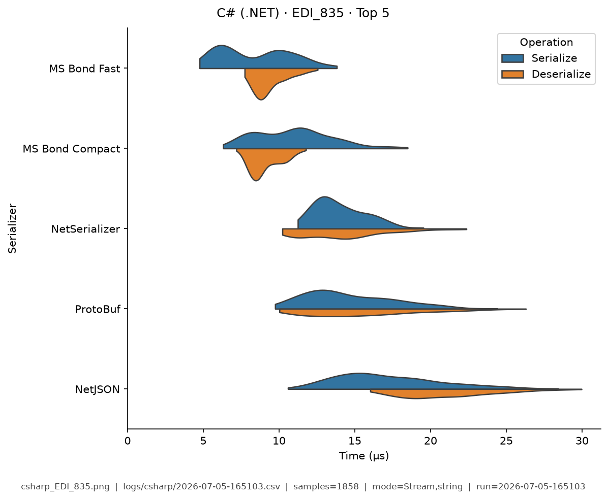
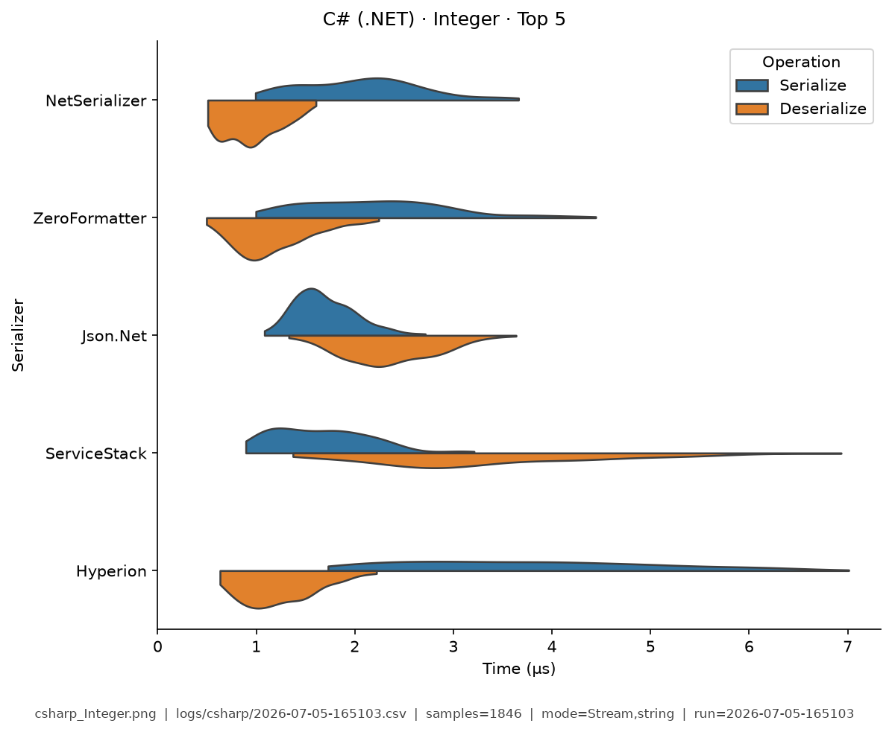
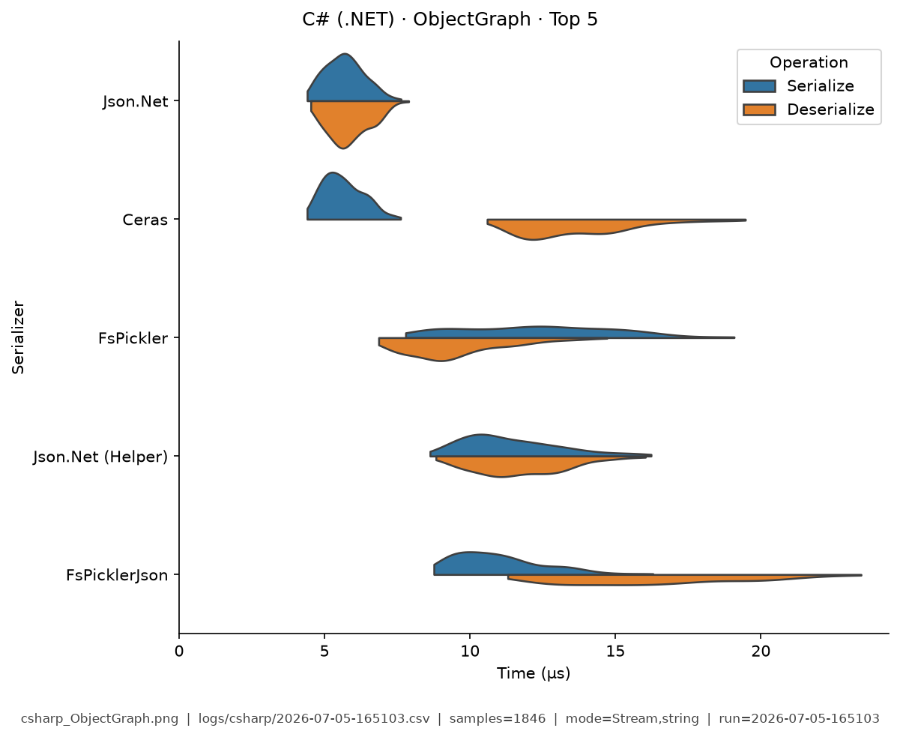
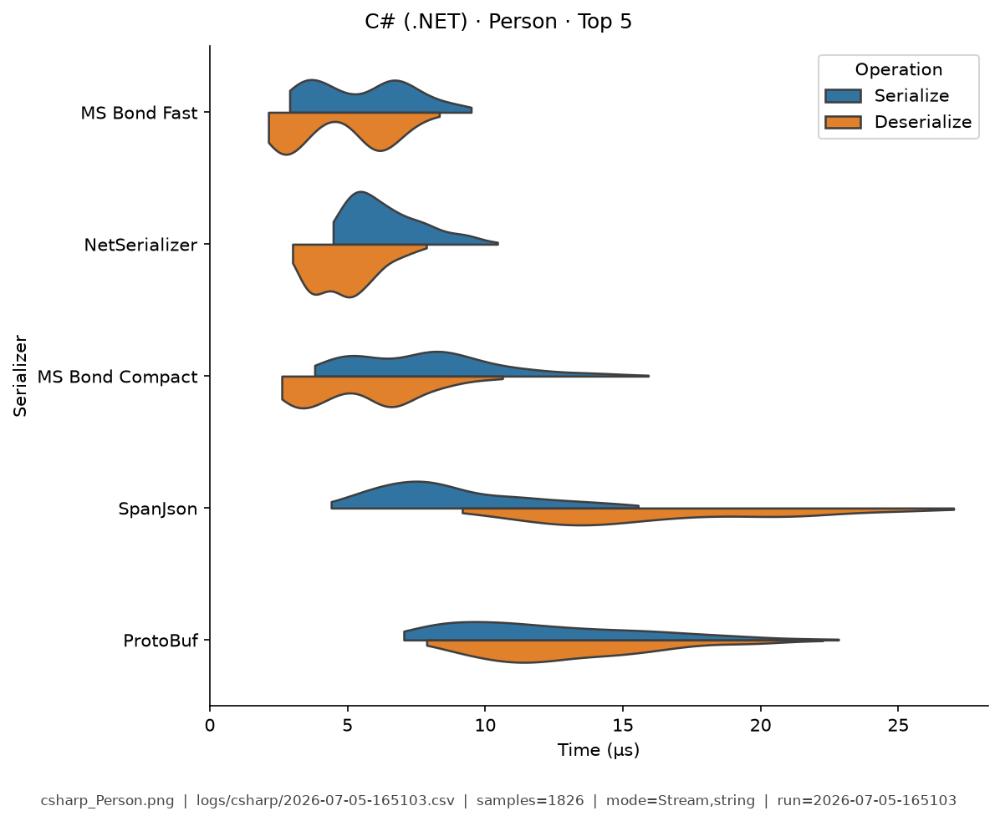
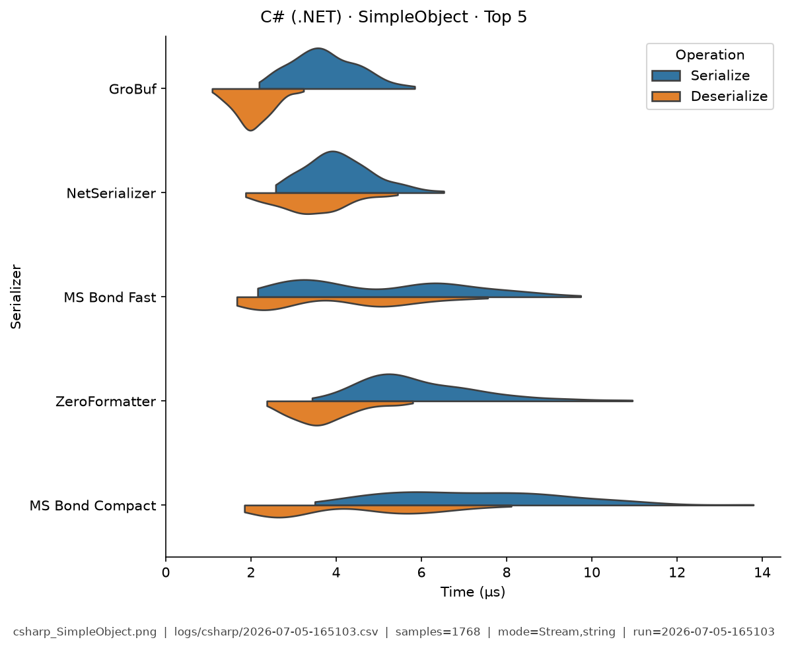
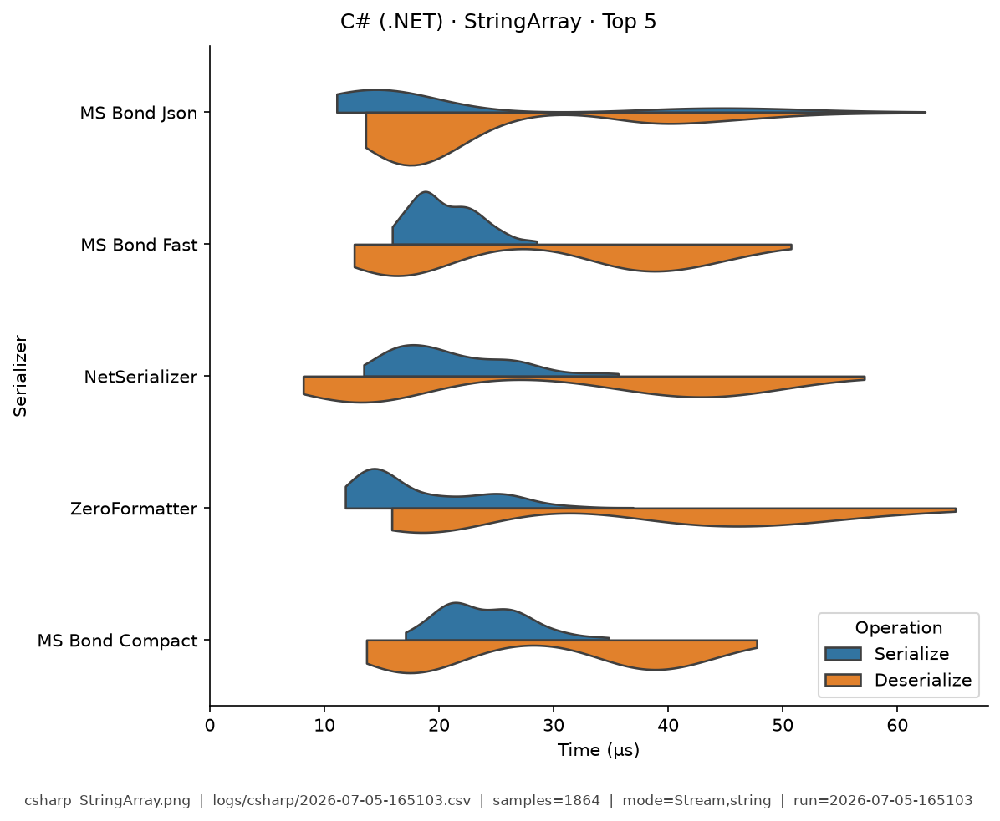
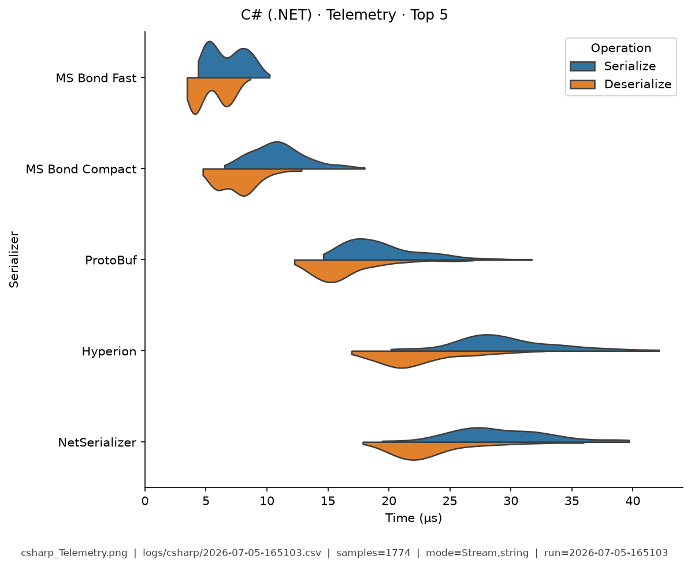

# C# (.NET) — Benchmark Results

**Generated:** 2026-07-05T16:51:47.102478

Published **local snapshot** (not regenerated by GitHub Actions). Numbers may differ if you re-run benchmarks on another machine.

Serializer inventory and caveats: [C# (.NET) overview](index.md). Methods: [Analysis Methodology](../analysis/ANALYSIS_METHODOLOGY.md). Metric definitions & importance tiers: [Metrics catalog](../analysis/METRICS.md).

## Pivot tables

Multi-way leaderboards emphasize **high-importance** metrics (configurable via `metrics.multi_way` in master config). Harness **modes** (CSV `StringOrStream`): **bytes mode** = in-memory buffer API; **stream mode** = write/read through a stream-like path. These names are *not* payload sizes. In each table, **bold** marks the semantic best value in that column (lowest time; highest ops/s). Ties are all bolded. Latency tables are in **microseconds** (µs).

### Summary

Default multi-serializer view shows **high-importance** metrics only ([METRICS.md](../analysis/METRICS.md)). **Primary rank:** median total latency (lower is better). Pairwise / version A/B reports use the full metric set. Latency cells are **µs** (analysis storage remains ns).

| serializer | Median total (µs) | Median ser (µs) | Median deser (µs) | Ops/s (from mean) | Median size (B) | Samples | Fidelity |
|---|---|---|---|---|---|---|---|
| GroBuf:1.9.2 | **5.53** | **3.59** | 1.87 | **178K** | **4.5** | 365 | **1.00** |
| MS Bond Fast:.NET 8.0.28 | 17 | 8.11 | 8.76 | 109K | 1278 | 1086 | **1.00** |
| ExtendedXmlSerializer:3.10.0.0 | 19.6 | 19 | **0.626** | 48.8K | 115.5 | 187 | **1.00** |
| MS Bond Compact:.NET 8.0.28 | 20.2 | 10.7 | 9.43 | 76.8K | 1234 | 1085 | **1.00** |
| ZeroFormatter:1.6.4 | 21.4 | 8.66 | 12.6 | 141K | 1935 | 535 | **1.00** |
| NetSerializer:4.1.2 | 24.9 | 12.6 | 12.2 | 106K | 1273 | 1097 | **1.00** |
| MemoryPack | 25.9 | 12.5 | 13.4 | 68.7K | 2092 | 536 | **1.00** |
| ProtoBuf:2.4.9.1 | 32.3 | 14.9 | 17.2 | 41.2K | 1274 | 1122 | **1.00** |
| FlatSharp:7.5.1 | 32.7 | 14.5 | 17.8 | 53.9K | 2208 | 554 | **1.00** |
| Hyperion:0.12.2 | 38.7 | 19.4 | 19 | 59.2K | 1483 | 1123 | **1.00** |
| Ceras:4.1.7 | 43.3 | 13 | 30.1 | 28.9K | 1095 | 1286 | **1.00** |
| FsPickler:5.3.2 | 47.6 | 27.4 | 19.8 | 25.4K | 1298 | 1298 | **1.00** |
| MS Bond Json:.NET 8.0.28 | 49.1 | 21.9 | 26.9 | 40K | 1520 | 1129 | **1.00** |
| SpanJson:4.2.1 | 51.9 | 23.9 | 27.6 | 35.5K | 1520 | 1117 | **1.00** |
| SharpSerializer | 52 | 22.2 | 29.7 | 18.6K | 181.5 | 185 | **1.00** |
| NetJSON:1.0.0 | 53.6 | 20.8 | 32.4 | 47.2K | 1514 | 1112 | **1.00** |
| Json.Net:13.0.4 | 54 | 24.1 | 29.4 | 63.8K | 1409 | 1306 | **1.00** |
| Jil:2.17.0 | 69.9 | 23.6 | 46.3 | 35.5K | 1515 | 1126 | **1.00** |
| FsPicklerJson:5.3.2 | 79.4 | 32.2 | 47.1 | 18K | 1993 | 1323 | **1.00** |
| MS Binary:.NET 8.0.28 | 81.1 | 37.1 | 43.6 | 14.9K | 2045 | 1322 | **1.00** |
| Utf8Json:1.3.7 | 83.4 | 33.7 | 49.6 | 28.9K | 1520 | 1110 | **1.00** |
| fastJson:2.4.0.4 | 86.8 | 39.9 | 46.2 | 21.9K | 1779 | 1143 | **1.00** |
| ServiceStack:6.11.0 | 87 | 42.6 | 43.6 | 45.1K | 1452 | 1124 | **1.00** |
| Json.Net (Helper):13.0.4 | 87.2 | 43 | 44.2 | 21K | 1395 | 1334 | **1.00** |
| ServiceStack Json:6.11.0 | 93.1 | 44.4 | 48.5 | 31.4K | 1517 | 1129 | **1.00** |
| Migrant:0.13.0.0 | 97.3 | 27.1 | 70.1 | 12.2K | 680 | 380 | **1.00** |
| MS DataContract Json:.NET 8.0.28 | 98.5 | 35.5 | 62.6 | 18K | 1769 | 1129 | **1.00** |
| MS DataContract:.NET 8.0.28 | 104 | 45 | 59.2 | 16.6K | 2698 | 1304 | **1.00** |
| MS XmlSerializer:.NET 8.0.28 | 120 | 55.1 | 63.9 | 12.4K | 2832 | 1142 | **1.00** |
| SharpYaml:3.12.0 | 500 | 153 | 347 | 6.4K | 1696 | 1102 | **1.00** |
| YAXLib:4.4.0 | 517 | 290 | 225 | 2.89K | 2705 | 1090 | **1.00** |
| YamlDotNet:17.1.0 | 933 | 553 | 376 | 3.8K | 1376 | 1336 | **1.00** |
| CsvHelper:33.1.0 | 1.52e+03 | 1.06e+03 | 462 | 1.22K | 49.5 | 375 | **1.00** |


### Total Time

| serializer | bytes mode/mean | bytes mode/median | stream mode/mean | stream mode/median |
|---|---|---|---|---|
| GroBuf:1.9.2 | - | - | 5.19 | 4.7 |
| MS Bond Fast:.NET 8.0.28 | - | - | 13.5 | 13.1 |
| ExtendedXmlSerializer:3.10.0.0 | - | - | 19 | 17.3 |
| MS Bond Compact:.NET 8.0.28 | - | - | 17.1 | 16.2 |
| ZeroFormatter:1.6.4 | - | - | **3.56** | **3.32** |
| NetSerializer:4.1.2 | - | - | 10.3 | 9.58 |
| MemoryPack | - | - | 8.38 | 7.78 |
| ProtoBuf:2.4.9.1 | - | - | 25.5 | 24 |
| FlatSharp:7.5.1 | - | - | 9.82 | 9.16 |
| Hyperion:0.12.2 | - | - | 29.2 | 28.6 |
| Ceras:4.1.7 | - | - | 41.8 | 39.2 |
| FsPickler:5.3.2 | - | - | 43.2 | 40.5 |
| MS Bond Json:.NET 8.0.28 | - | - | 32.4 | 32.3 |
| SpanJson:4.2.1 | - | - | 26 | 24.2 |
| SharpSerializer | - | - | 49.1 | 45.8 |
| NetJSON:1.0.0 | - | - | 29.3 | 28 |
| Json.Net:13.0.4 | - | - | 54.5 | 53 |
| Jil:2.17.0 | - | - | 31.7 | 30 |
| FsPicklerJson:5.3.2 | - | - | 60.8 | 57.5 |
| MS Binary:.NET 8.0.28 | - | - | 86.2 | 84.5 |
| Utf8Json:1.3.7 | - | - | 38.3 | 35.4 |
| fastJson:2.4.0.4 | - | - | 86.3 | 82.2 |
| ServiceStack:6.11.0 | - | - | 65.7 | 62.1 |
| Json.Net (Helper):13.0.4 | - | - | 106 | 99.3 |
| ServiceStack Json:6.11.0 | - | - | 72.5 | 71.2 |
| Migrant:0.13.0.0 | - | - | 54.4 | 50.9 |
| MS DataContract Json:.NET 8.0.28 | - | - | 74.2 | 72.7 |
| MS DataContract:.NET 8.0.28 | - | - | 79.7 | 74.6 |
| MS XmlSerializer:.NET 8.0.28 | - | - | 79.3 | 77 |
| SharpYaml:3.12.0 | - | - | 441 | 426 |
| YAXLib:4.4.0 | - | - | 626 | 610 |
| YamlDotNet:17.1.0 | - | - | 501 | 490 |
| CsvHelper:33.1.0 | - | - | 473 | 461 |


### Ops/Sec

| serializer | EDI_835 | Integer | ObjectGraph | Person | SimpleObject | StringArray | Telemetry |
|---|---|---|---|---|---|---|---|
| Ceras:4.1.7 | 19K | 51K | 52K | 24K | 26K | 9.3K | 17K |
| CsvHelper:33.1.0 | - | 2K | - | - | 0.39K | - | - |
| ExtendedXmlSerializer:3.10.0.0 | - | 45K | - | - | - | - | - |
| FlatSharp:7.5.1 | - | 91K | - | - | 49K | 11K | - |
| FsPickler:5.3.2 | 17K | 38K | 48K | 25K | 25K | 8.9K | 17K |
| FsPicklerJson:5.3.2 | 10K | 25K | 34K | 16K | 17K | 8K | 4.8K |
| GroBuf:1.9.2 | - | 170K | - | - | **180K** | - | - |
| Hyperion:0.12.2 | 20K | 180K | - | 30K | 56K | 8.9K | 19K |
| Jil:2.17.0 | 16K | 93K | - | 33K | 62K | 8.2K | 5.5K |
| Json.Net:13.0.4 | 19K | 260K | **91K** | 21K | 51K | 13K | 5.3K |
| Json.Net (Helper):13.0.4 | 11K | 52K | 45K | 11K | 18K | 9K | 4K |
| MS Binary:.NET 8.0.28 | 6.9K | 25K | 20K | 11K | 17K | 6K | 11K |
| MS Bond Compact:.NET 8.0.28 | 55K | 240K | - | 100K | 120K | 15K | 62K |
| MS Bond Fast:.NET 8.0.28 | **63K** | **400K** | - | **150K** | 180K | 16K | **100K** |
| MS Bond Json:.NET 8.0.28 | 24K | 120K | - | 33K | 44K | **18K** | 6.6K |
| MS DataContract:.NET 8.0.28 | 10K | 30K | 31K | 13K | 15K | 4.2K | 3.7K |
| MS DataContract Json:.NET 8.0.28 | 10K | 46K | - | 14K | 20K | 7.4K | 3.8K |
| MS XmlSerializer:.NET 8.0.28 | 9.4K | 26K | - | 14K | 14K | 5.2K | 3.7K |
| MemoryPack | - | 110K | - | - | 69K | 14K | - |
| Migrant:0.13.0.0 | - | 17K | - | - | 6.5K | - | - |
| NetJSON:1.0.0 | 28K | 160K | - | 45K | 56K | 8.4K | 8.4K |
| NetSerializer:4.1.2 | 33K | 310K | - | 82K | 120K | 15K | 18K |
| ProtoBuf:2.4.9.1 | 30K | 77K | - | 40K | 49K | 11K | 26K |
| ServiceStack:6.11.0 | 13K | 220K | - | 16K | 25K | 6K | 5.2K |
| ServiceStack Json:6.11.0 | 10K | 150K | - | 15K | 25K | 6.3K | 4.5K |
| SharpSerializer | - | 17K | - | - | - | - | - |
| SharpYaml:3.12.0 | 2.9K | 28K | - | 2.5K | 3.9K | 0.66K | 1.1K |
| SpanJson:4.2.1 | 22K | 86K | - | 42K | 46K | 10K | 9K |
| Utf8Json:1.3.7 | 11K | 82K | - | 30K | 41K | 7.4K | 4.5K |
| YAXLib:4.4.0 | 1.9K | 8.1K | - | 1.6K | 2.4K | 1.8K | 1K |
| YamlDotNet:17.1.0 | 1.8K | 10K | 8K | 2.1K | 3.1K | 0.33K | 0.44K |
| ZeroFormatter:1.6.4 | - | 310K | - | - | 100K | 14K | - |
| fastJson:2.4.0.4 | 12K | 71K | - | 14K | 25K | 9.2K | 4.7K |

## Violin plots

Density of serialize / deserialize timings (µs; log scale when medians span ≥5×). **Each plot shows only the top 5 serializers by mean total time** for that fixture (same rule for every language). Full rankings are in the pivot tables above. Provenance (fixture, CSV path, modes, *n*) is printed on each image.

### EDI_835

{ width="80%" }

### Integer

{ width="80%" }

### ObjectGraph

{ width="80%" }

### Person

{ width="80%" }

### SimpleObject

{ width="80%" }

### StringArray

{ width="80%" }

### Telemetry

{ width="80%" }

## Regenerate

Published snapshots are produced **locally** (not by GitHub Actions). After running benchmarks (each run creates a timestamped `YYYY-MM-DD-HHMMSS.csv`):

```bash
analyze-benchmarks              # all languages
analyze-benchmarks -l csharp   # this language only
```

That refreshes this language's results tables and violin plots under `docs/analysis/plots/violin/`. The hub [Benchmark Results](../analysis/BENCHMARK_SUMMARY.md) is a **static** index and is not rewritten. Commit the updated `results.md` / plot paths as needed.


## Run configuration (important)

??? note "Show host, seed, serializers, and source CSV"

    Key fields from the run sidecar (`*.configs.json`, or legacy `*.environment.json`). Full metric definitions: [Metrics catalog](../analysis/METRICS.md). Optional blocks (`dataset`, `serializers`) appear only when captured.
    
    - **Source CSV:** `/home/leo/PycharmProjects/GLD/seriailizer-benchmark/logs/csharp/2026-07-05-165103.csv`
    - run=2026-07-05-165103
    - language=csharp
    - os=Linux 6.8.0-124-generic
    - cpu=12th Gen Intel(R) Core(TM) i7-12800H (20 threads)
    - ram=31.0 GiB
    - runtimes: python=3.12.13
    - warmup_reps=1
    - serializers=33
    - metrics_profile=multi_way
    - **Serializers (from CSV):**
      - `Ceras` @ 4.1.7
      - `CsvHelper` @ 33.1.0
      - `ExtendedXmlSerializer` @ 3.10.0.0
      - `FlatSharp` @ 7.5.1
      - `FsPickler` @ 5.3.2
      - `FsPicklerJson` @ 5.3.2
      - `GroBuf` @ 1.9.2
      - `Hyperion` @ 0.12.2
      - `Jil` @ 2.17.0
      - `Json.Net` @ 13.0.4
      - `Json.Net (Helper)` @ 13.0.4
      - `MS Binary` @ .NET 8.0.28
      - `MS Bond Compact` @ .NET 8.0.28
      - `MS Bond Fast` @ .NET 8.0.28
      - `MS Bond Json` @ .NET 8.0.28
      - `MS DataContract` @ .NET 8.0.28
      - `MS DataContract Json` @ .NET 8.0.28
      - `MS XmlSerializer` @ .NET 8.0.28
      - `MemoryPack`
      - `Migrant` @ 0.13.0.0
      - `NetJSON` @ 1.0.0
      - `NetSerializer` @ 4.1.2
      - `ProtoBuf` @ 2.4.9.1
      - `ServiceStack` @ 6.11.0
      - `ServiceStack Json` @ 6.11.0
      - `SharpSerializer`
      - `SharpYaml` @ 3.12.0
      - `SpanJson` @ 4.2.1
      - `Utf8Json` @ 1.3.7
      - `YAXLib` @ 4.4.0
      - `YamlDotNet` @ 17.1.0
      - `ZeroFormatter` @ 1.6.4
      - `fastJson` @ 2.4.0.4
