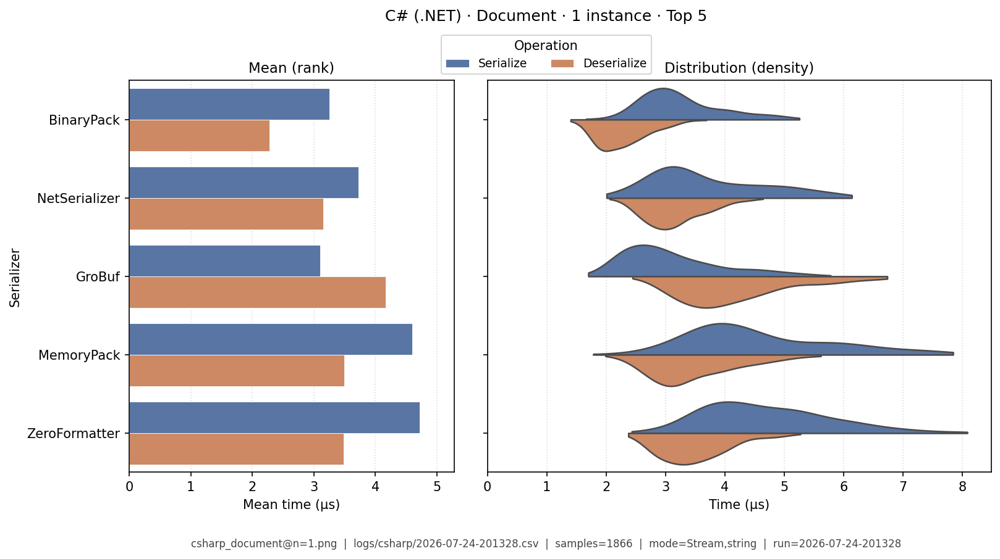
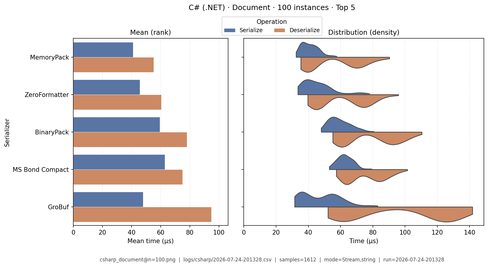
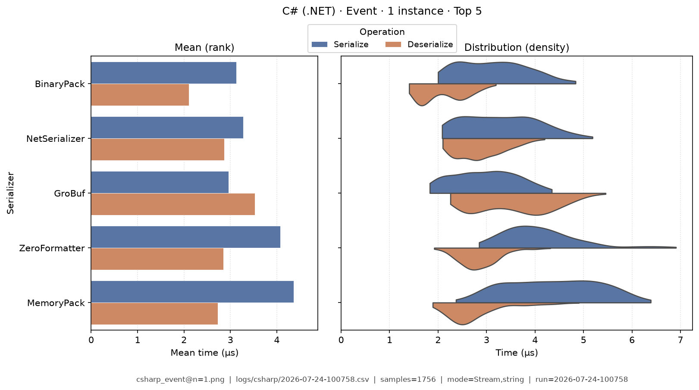
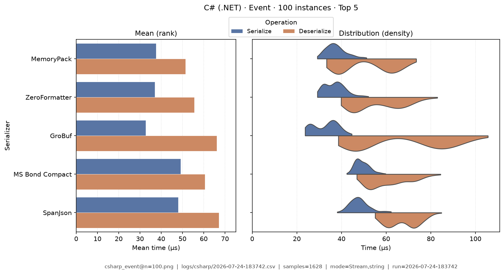
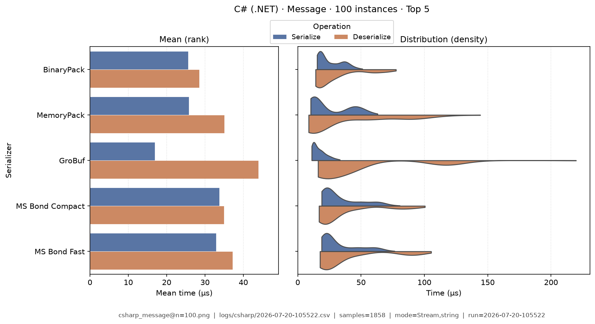
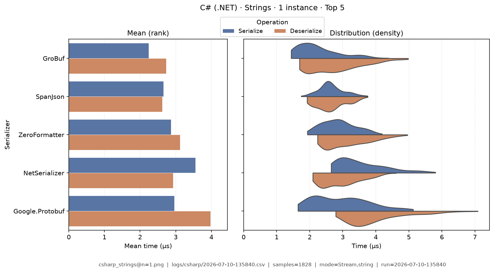
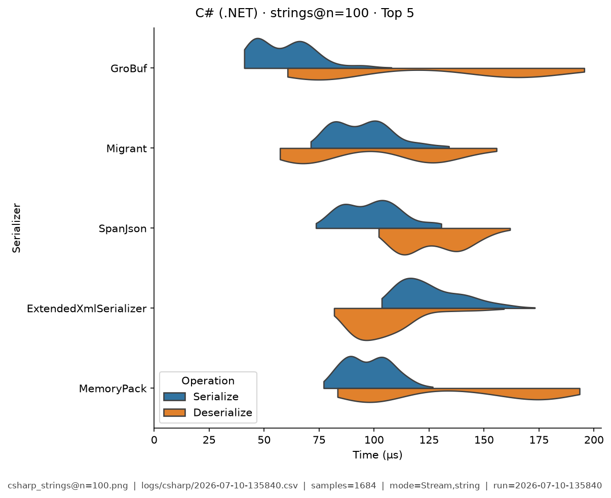
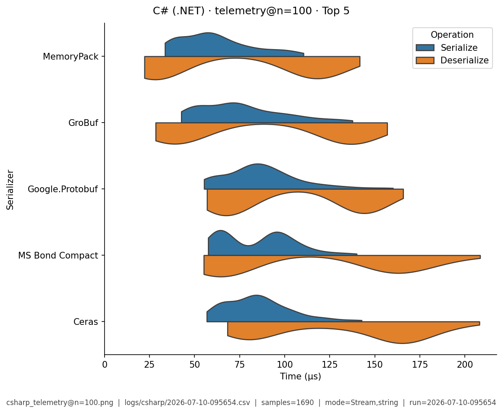

# C# (.NET) — Benchmark Results

**Generated:** 2026-07-11T10:57:31.944184

Published **local snapshot** (not regenerated by GitHub Actions). Numbers may differ if you re-run benchmarks on another machine.

Serializer inventory and caveats: [C# (.NET) overview](index.md). Methods: [Analysis Methodology](../analysis/ANALYSIS_METHODOLOGY.md). Metric definitions & importance tiers: [Metrics catalog](../analysis/METRICS.md).

## Pivot tables

Multi-way leaderboards emphasize **high-importance** metrics (configurable via `metrics.multi_way` in master config). Harness **modes** (CSV `StringOrStream`): **bytes mode** = in-memory buffer API; **stream mode** = write/read through a stream-like path. These names are *not* payload sizes. In each table, rows are sorted by **serializer name**; **bold** marks the semantic best value in that column (lowest time; highest ops/s). Ties are all bolded. Latency tables are in **microseconds** (µs). Batch fixtures show as **Type · N instances** (from `DataTypeInstanceCount`; e.g. Message · 100 instances).

### Summary

Default multi-serializer view shows **high-importance** metrics only ([METRICS.md](../analysis/METRICS.md)). Rows are sorted by **serializer name**. **Bold** marks the semantic best value in each column (lowest latency / size; highest ops/s). Pairwise / version A/B reports use the full metric set. Latency cells are **µs** (analysis storage remains ns).

| serializer | Median total (µs) | Median ser (µs) | Median deser (µs) | Ops/s (from mean) | Median size (B) | Samples | Fidelity |
|---|---|---|---|---|---|---|---|
| BinaryPack:1.0.3 | 76.2 | 33.8 | 41.9 | **108K** | 13.9K | 1778 | **1.00** |
| Ceras:4.1.7 | 116 | 41.6 | 73.9 | 25.1K | 11.4K | 1761 | **1.00** |
| CsvHelper:33.1.0 | 2,410 | 1,620 | 797 | 0.581K | **8.82K** | 1037 | **1.00** |
| ExtendedXmlSerializer:3.10.0.0 | 137 | 69.3 | 66.2 | 12.1K | 19.9K | 1740 | **1.00** |
| fastJson:2.4.0.4 | 396 | 141 | 254 | 20.7K | 22K | 1736 | **1.00** |
| FlatSharp:7.5.1 | 79.5 | 35.5 | 43.2 | 55.3K | 20.3K | 1753 | **1.00** |
| FsPickler:5.3.2 | 152 | 85.4 | 65.4 | 21.8K | 14.4K | 1788 | **1.00** |
| FsPicklerJson:5.3.2 | 341 | 138 | 202 | 21.1K | 25.5K | 1773 | **1.00** |
| Google.Protobuf:3.35.1 | 85.8 | 43.5 | 41.7 | 69.6K | 11.8K | 1741 | **1.00** |
| GroBuf:1.9.2 | **56.3** | **18.7** | 37 | 98.2K | 27.2K | 1754 | **1.00** |
| Hyperion:0.12.2 | 142 | 74.7 | 66.7 | 42K | 13.6K | 1782 | **1.00** |
| Jil:2.17.0 | 261 | 127 | 133 | 32.4K | 19.5K | 1776 | **1.00** |
| Json.Net:13.0.4 | 367 | 161 | 208 | 41.7K | 22.2K | 1752 | **1.00** |
| Json.Net (Helper):13.0.4 | 386 | 167 | 218 | 22.6K | 21.6K | 1736 | **1.00** |
| MemoryPack | 59.3 | 25.6 | **33.5** | 70K | 16.6K | 1770 | **1.00** |
| Migrant:0.13.0.0 | 123 | 52.8 | 69.1 | 12.2K | 25.3K | 1775 | **1.00** |
| MS Binary:.NET 8.0.28 | 445 | 212 | 232 | 12.5K | 21.9K | 1735 | **1.00** |
| MS Bond Compact:.NET 8.0.28 | 69.4 | 32.1 | 37.2 | 66.6K | 11.4K | 1765 | **1.00** |
| MS Bond Fast:.NET 8.0.28 | 69.3 | 31.8 | 37.4 | 76.8K | 13.6K | 1785 | **1.00** |
| MS Bond Json:.NET 8.0.28 | 235 | 93.6 | 140 | 39.9K | 19.3K | 1762 | **1.00** |
| MS DataContract:.NET 8.0.28 | 498 | 162 | 333 | 15.4K | 48.3K | 1785 | **1.00** |
| MS DataContract Json:.NET 8.0.28 | 579 | 150 | 427 | 18.4K | 22.7K | 1779 | **1.00** |
| MS XmlSerializer:.NET 8.0.28 | 542 | 209 | 331 | 14.4K | 51K | 1760 | **1.00** |
| NetJSON:1.0.0 | 192 | 78.9 | 113 | 48.8K | 19.3K | 1769 | **1.00** |
| NetSerializer:4.1.2 | 90.6 | 38.5 | 51.2 | 85.9K | 11.9K | 1800 | **1.00** |
| ProtoBuf:2.4.9.1 | 109 | 36.4 | 72.3 | 50.8K | 12.2K | 1752 | **1.00** |
| ServiceStack:6.11.0 | 315 | 142 | 172 | 37.9K | 17.2K | 1809 | **1.00** |
| ServiceStack Json:6.11.0 | 379 | 160 | 217 | 26K | 19.5K | 1805 | **1.00** |
| SharpSerializer | 2,320 | 536 | 1,780 | 6.81K | 107K | 1712 | **1.00** |
| SharpYaml:3.12.0 | 1,170 | 260 | 905 | 4.05K | 26.2K | 1759 | **1.00** |
| SpanJson:4.2.1 | 138 | 69 | 67.9 | 65.8K | 19.5K | 1789 | **1.00** |
| System.Text.Json:8.0.0.0 | 234 | 101 | 131 | 28.6K | 22.7K | 1817 | **1.00** |
| Utf8Json:1.3.7 | 175 | 69 | 106 | 42.5K | 19.5K | 1779 | **1.00** |
| YamlDotNet:17.1.0 | 4,520 | 2,420 | 2,060 | 3.03K | 21.8K | 1752 | **1.00** |
| YAXLib:4.4.0 | 1,680 | 812 | 859 | 2.21K | 50.8K | 1614 | **1.00** |
| ZeroFormatter:1.6.4 | 64 | 27.3 | 36.1 | 78K | 13.6K | 1783 | **1.00** |


### Total Time

| serializer | bytes mode/mean | bytes mode/median | stream mode/mean | stream mode/median |
|---|---|---|---|---|
| BinaryPack:1.0.3 | **5.25** | **4.83** | **4.56** | **4.45** |
| Ceras:4.1.7 | 31.2 | 29.4 | 28.4 | 27.7 |
| CsvHelper:33.1.0 | 3,840 | 3,770 | 3,750 | 3,740 |
| ExtendedXmlSerializer:3.10.0.0 | 113 | 109 | 93.4 | 91.6 |
| fastJson:2.4.0.4 | 38.4 | 36.6 | 38.6 | 37.6 |
| FlatSharp:7.5.1 | 18.1 | 15.3 | 12.9 | 12.5 |
| FsPickler:5.3.2 | 33 | 30.9 | 29 | 28.2 |
| FsPicklerJson:5.3.2 | 41.4 | 39.7 | 38.2 | 37.9 |
| Google.Protobuf:3.35.1 | 10.4 | 9.35 | 8.08 | 7.92 |
| GroBuf:1.9.2 | 8.81 | 7.95 | 6.34 | 6.18 |
| Hyperion:0.12.2 | 14.5 | 13.1 | 11.8 | 11.4 |
| Jil:2.17.0 | 17 | 16.1 | 15.2 | 14.6 |
| Json.Net:13.0.4 | 16.9 | 16.9 | 20.9 | 21 |
| Json.Net (Helper):13.0.4 | 41.7 | 39.2 | 42.8 | 42.3 |
| MemoryPack | 11.1 | 10.2 | 9.58 | 9.28 |
| Migrant:0.13.0.0 | 110 | 109 | 96.9 | 94.9 |
| MS Binary:.NET 8.0.28 | 51.2 | 48.7 | 44.7 | 43.1 |
| MS Bond Compact:.NET 8.0.28 | 7.45 | 6.92 | 13.3 | 13.2 |
| MS Bond Fast:.NET 8.0.28 | 5.27 | 5.04 | 11.2 | 11.2 |
| MS Bond Json:.NET 8.0.28 | 19.8 | 19 | 20.8 | 20.5 |
| MS DataContract:.NET 8.0.28 | 63.5 | 60.9 | 54.5 | 52.7 |
| MS DataContract Json:.NET 8.0.28 | 40.1 | 38.2 | 37.7 | 37 |
| MS XmlSerializer:.NET 8.0.28 | 54.8 | 50.5 | 49.6 | 48.3 |
| NetJSON:1.0.0 | 14.8 | 14.3 | 15.6 | 15.4 |
| NetSerializer:4.1.2 | 7.7 | 7.08 | 6.14 | 6.13 |
| ProtoBuf:2.4.9.1 | 17.1 | 16.4 | 14.2 | 13.9 |
| ServiceStack:6.11.0 | 23.3 | 22.1 | 23.4 | 23.1 |
| ServiceStack Json:6.11.0 | 35 | 33.3 | 34.6 | 34.1 |
| SharpSerializer | 90.2 | 84.9 | 83.8 | 82.5 |
| SharpYaml:3.12.0 | 257 | 250 | 288 | 288 |
| SpanJson:4.2.1 | 9.59 | 9.01 | 9.66 | 9.35 |
| System.Text.Json:8.0.0.0 | 47.3 | 46.8 | 38.5 | 36.4 |
| Utf8Json:1.3.7 | 20.3 | 18.5 | 17.9 | 17.8 |
| YamlDotNet:17.1.0 | 267 | 253 | 266 | 263 |
| YAXLib:4.4.0 | 409 | 393 | 409 | 407 |
| ZeroFormatter:1.6.4 | 8.72 | 7.73 | 7.47 | 7.23 |


### Ops/Sec

| serializer | Document · 1 instance | Document · 100 instances | Event · 1 instance | Event · 100 instances | Message · 1 instance | Message · 100 instances | Strings · 1 instance | Strings · 100 instances | Telemetry · 1 instance | Telemetry · 100 instances |
|---|---|---|---|---|---|---|---|---|---|---|
| BinaryPack:1.0.3 | **220K** | 6.2K | **200K** | 7.2K | **190K** | **15K** | 130K | 2.6K | 200K | 9.5K |
| Ceras:4.1.7 | 50K | 3.5K | 46K | 5K | 32K | 7K | 44K | 2.8K | 32K | 5.6K |
| CsvHelper:33.1.0 | - | - | 0.47K | 0.39K | 0.26K | 0.22K | 1.3K | 0.84K | - | - |
| ExtendedXmlSerializer:3.10.0.0 | 23K | 4.8K | 22K | 6.3K | 8.8K | 3.6K | 21K | 4.7K | 16K | 3.9K |
| fastJson:2.4.0.4 | 35K | 0.94K | 45K | 2K | 26K | 1.5K | 65K | 2.5K | 29K | 0.76K |
| FlatSharp:7.5.1 | 97K | 4.6K | 84K | 6.6K | 55K | 6K | 85K | 3.2K | 73K | 8K |
| FsPickler:5.3.2 | 46K | 2.8K | 40K | 4.1K | 30K | 6.5K | 39K | 2.5K | 29K | 4.2K |
| FsPicklerJson:5.3.2 | 42K | 1.4K | 48K | 2.4K | 24K | 1.9K | 47K | 1.9K | 25K | 0.68K |
| Google.Protobuf:3.35.1 | 110K | 4.9K | 120K | 6.6K | 96K | 6.6K | 120K | 2.7K | 81K | 7.7K |
| GroBuf:1.9.2 | 160K | 5.3K | 170K | 7.9K | 110K | 12K | 170K | 4.2K | 150K | **10K** |
| Hyperion:0.12.2 | 79K | 3.1K | 74K | 4.8K | 69K | 5.9K | 71K | 2.2K | 55K | 2.7K |
| Jil:2.17.0 | 66K | 2.5K | 67K | 3.8K | 59K | 2.5K | 79K | 2.7K | 35K | 0.94K |
| Json.Net:13.0.4 | 64K | 1K | 110K | 2.1K | 59K | 1.3K | 130K | 2.2K | 59K | 0.78K |
| Json.Net (Helper):13.0.4 | 40K | 1K | 53K | 2K | 24K | 1.2K | 70K | 2.2K | 33K | 0.78K |
| MemoryPack | 130K | **7.9K** | 140K | **10K** | 90K | 10K | 98K | 3.6K | 72K | 10K |
| Migrant:0.13.0.0 | 22K | 4K | 20K | 6.1K | 9.1K | 5K | 19K | 4.3K | 14K | 3.1K |
| MS Binary:.NET 8.0.28 | 20K | 0.66K | 23K | 1.1K | 20K | 1.6K | 26K | 1.1K | 20K | 1.6K |
| MS Bond Compact:.NET 8.0.28 | 160K | 6.2K | 180K | 8.7K | 130K | 12K | 180K | 3.6K | 170K | 8.5K |
| MS Bond Fast:.NET 8.0.28 | 180K | 5.6K | 200K | 8.3K | 190K | 11K | 200K | 3.8K | **230K** | 8.7K |
| MS Bond Json:.NET 8.0.28 | 79K | 2.2K | 100K | 4.4K | 51K | 3K | 110K | 3.2K | 47K | 0.9K |
| MS DataContract:.NET 8.0.28 | 32K | 1K | 37K | 1.9K | 16K | 1.2K | 33K | 0.97K | 19K | 0.5K |
| MS DataContract Json:.NET 8.0.28 | 31K | 0.7K | 43K | 1.5K | 25K | 0.85K | 45K | 1K | 26K | 0.51K |
| MS XmlSerializer:.NET 8.0.28 | 29K | 0.83K | 35K | 1.7K | 18K | 1.3K | 31K | 0.86K | 22K | 0.6K |
| NetJSON:1.0.0 | 98K | 2.9K | 120K | 5.8K | 68K | 3.6K | 140K | 3.8K | 58K | 1.2K |
| NetSerializer:4.1.2 | 170K | 4.9K | 160K | 6.8K | 130K | 7.3K | 140K | 3.2K | 130K | 4.6K |
| ProtoBuf:2.4.9.1 | 90K | 4.3K | 98K | 5.3K | 59K | 6.3K | 85K | 2.3K | 96K | 5.7K |
| ServiceStack:6.11.0 | 69K | 1.5K | 85K | 3K | 43K | 1.3K | 140K | 3K | 36K | 0.86K |
| ServiceStack Json:6.11.0 | 51K | 1.2K | 60K | 2.3K | 29K | 1.1K | 84K | 2K | 28K | 0.81K |
| SharpSerializer | 11K | 0.13K | 15K | 0.24K | 11K | 0.22K | 16K | 0.25K | 11K | 0.17K |
| SharpYaml:3.12.0 | 5.3K | 0.34K | 7.2K | 0.69K | 3.9K | 0.25K | 14K | 0.61K | 7.1K | 0.34K |
| SpanJson:4.2.1 | 120K | 6.1K | 170K | 9.7K | 100K | 7.1K | **200K** | **4.9K** | 45K | 1.3K |
| System.Text.Json:8.0.0.0 | 59K | 2.1K | 70K | 3.7K | 21K | 2.4K | 79K | 2.6K | 30K | 1.2K |
| Utf8Json:1.3.7 | 87K | 4.5K | 96K | 7.1K | 49K | 2.1K | 91K | 3.6K | 38K | 1.3K |
| YamlDotNet:17.1.0 | 4.8K | 0.07K | 7.5K | 0.15K | 3.7K | 0.079K | 7.9K | 0.15K | 5.1K | 0.098K |
| YAXLib:4.4.0 | 3.6K | 0.22K | 4.3K | 0.41K | 2.4K | 0.32K | 6.1K | 0.41K | 3.4K | 0.26K |
| ZeroFormatter:1.6.4 | 130K | 7.7K | 130K | 9.4K | 110K | 9.2K | 150K | 3.7K | 90K | 7.8K |

## Latency distributions

Each figure pairs **mean bars** (left: ser / deser mean µs, linear from 0) with **split violins** (right: full sample density, linear from 0). **Top 5 serializers by mean total time** per fixture (display only; tables list all). Provenance (fixture, CSV path, modes, *n*) is printed on each image.

### Document · 1 instance

{ width="80%" }

### Document · 100 instances

{ width="80%" }

### Event · 1 instance

{ width="80%" }

### Event · 100 instances

{ width="80%" }

### Message · 1 instance

{ width="80%" }

### Message · 100 instances

{ width="80%" }

### Strings · 1 instance

{ width="80%" }

### Strings · 100 instances

{ width="80%" }

### Telemetry · 1 instance

{ width="80%" }

### Telemetry · 100 instances

{ width="80%" }

## Regenerate

Published snapshots are produced **locally** (not by GitHub Actions). After running benchmarks (each run creates a timestamped `YYYY-MM-DD-HHMMSS.csv`):

```bash
analyze-benchmarks              # all languages
analyze-benchmarks -l csharp   # this language only
```

That refreshes this language's results tables and latency distributions under `docs/analysis/plots/violin/`. The hub [Benchmark Results](../analysis/BENCHMARK_SUMMARY.md) is a **static** index and is not rewritten. Commit the updated `results.md` / plot paths as needed.


## Run configuration (important)

??? note "Show host, seed, serializers, and source CSV"

    Key fields from the run sidecar (`*.configs.json`, or legacy `*.environment.json`). Full metric definitions: [Metrics catalog](../analysis/METRICS.md). Optional blocks (`dataset`, `serializers`) appear only when captured.
    
    - **Source CSV:** `/home/leo/PycharmProjects/GLD/seriailizer-benchmark/logs/csharp/2026-07-10-135840.csv`
    - run=2026-07-10-135840
    - language=csharp
    - os=Linux 6.8.0-124-generic
    - cpu=12th Gen Intel(R) Core(TM) i7-12800H (20 threads)
    - ram=31.0 GiB
    - runtimes: dotnet=8.0.422, python=3.14.0, node=24.15.0
    - git=9bf7224 dirty
    - seed=42
    - warmup_reps=1
    - serializers=36
    - metrics_profile=multi_way
    - **Fixtures (config):** message, document, telemetry, strings, event
    - **Serializers (from CSV):**
      - `BinaryPack` @ 1.0.3
      - `Ceras` @ 4.1.7
      - `CsvHelper` @ 33.1.0
      - `ExtendedXmlSerializer` @ 3.10.0.0
      - `FlatSharp` @ 7.5.1
      - `FsPickler` @ 5.3.2
      - `FsPicklerJson` @ 5.3.2
      - `Google.Protobuf` @ 3.35.1
      - `GroBuf` @ 1.9.2
      - `Hyperion` @ 0.12.2
      - `Jil` @ 2.17.0
      - `Json.Net` @ 13.0.4
      - `Json.Net (Helper)` @ 13.0.4
      - `MS Binary` @ .NET 8.0.28
      - `MS Bond Compact` @ .NET 8.0.28
      - `MS Bond Fast` @ .NET 8.0.28
      - `MS Bond Json` @ .NET 8.0.28
      - `MS DataContract` @ .NET 8.0.28
      - `MS DataContract Json` @ .NET 8.0.28
      - `MS XmlSerializer` @ .NET 8.0.28
      - `MemoryPack`
      - `Migrant` @ 0.13.0.0
      - `NetJSON` @ 1.0.0
      - `NetSerializer` @ 4.1.2
      - `ProtoBuf` @ 2.4.9.1
      - `ServiceStack` @ 6.11.0
      - `ServiceStack Json` @ 6.11.0
      - `SharpSerializer`
      - `SharpYaml` @ 3.12.0
      - `SpanJson` @ 4.2.1
      - `System.Text.Json` @ 8.0.0.0
      - `Utf8Json` @ 1.3.7
      - `YAXLib` @ 4.4.0
      - `YamlDotNet` @ 17.1.0
      - `ZeroFormatter` @ 1.6.4
      - `fastJson` @ 2.4.0.4
