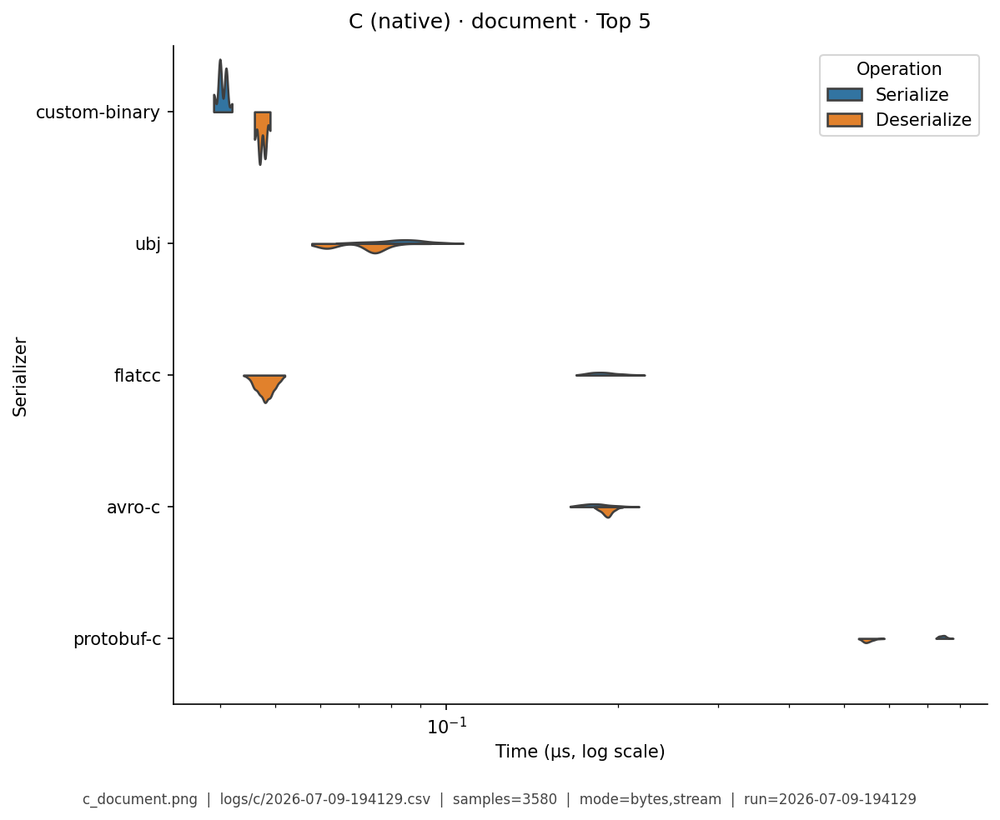
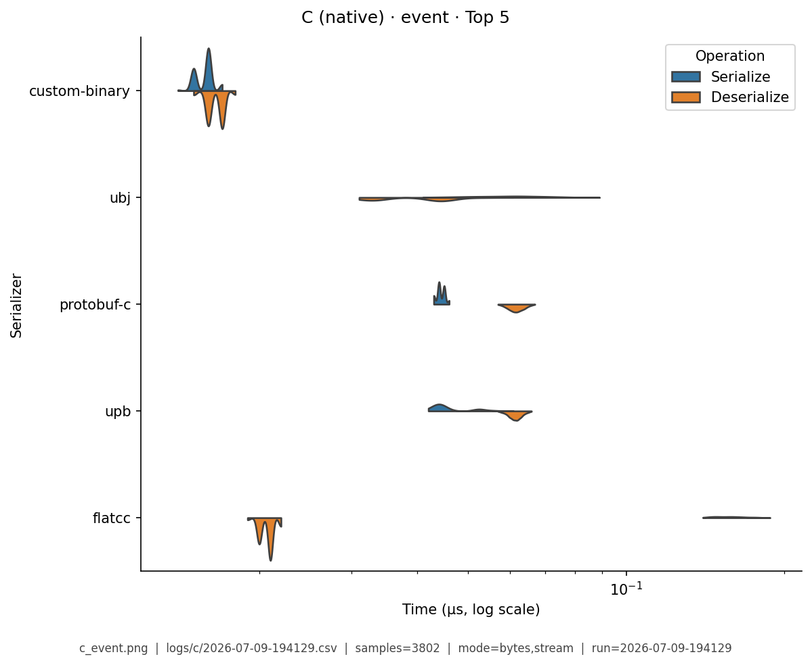
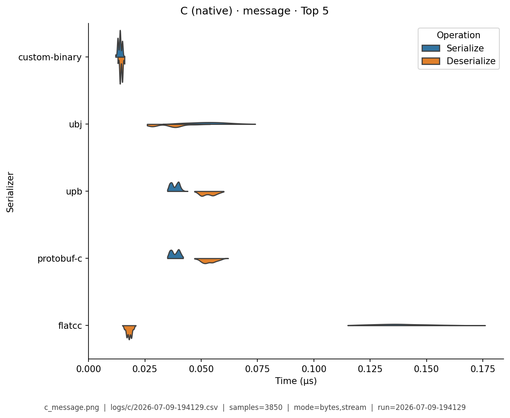
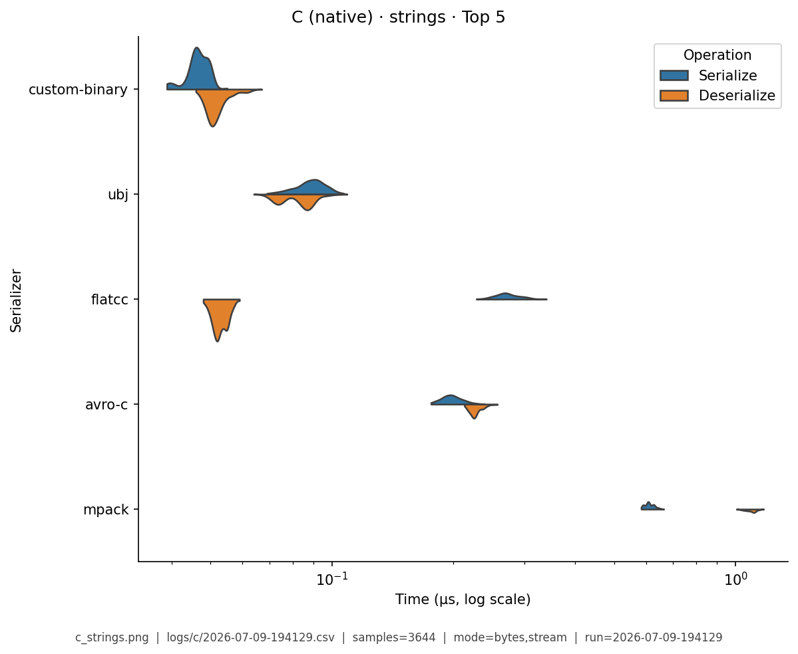
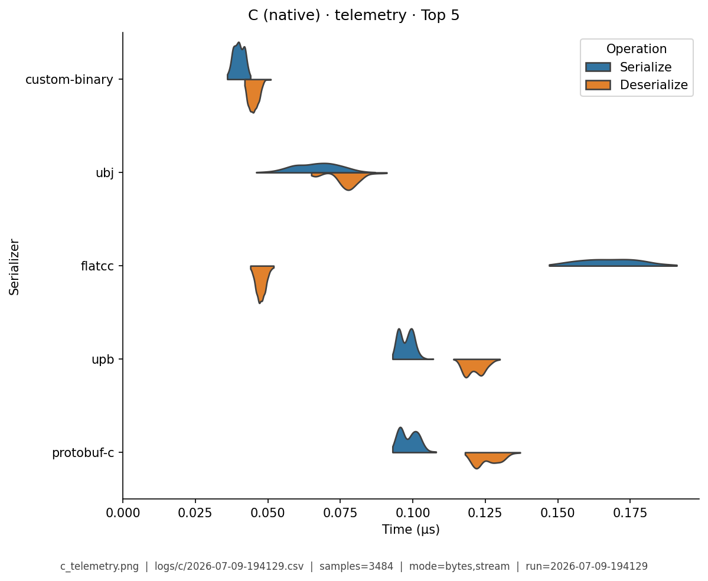

# C (native) — Benchmark Results

**Generated:** 2026-07-09T21:04:42.410114

Published **local snapshot** (not regenerated by GitHub Actions). Numbers may differ if you re-run benchmarks on another machine.

Serializer inventory and caveats: [C (native) overview](index.md). Methods: [Analysis Methodology](../analysis/ANALYSIS_METHODOLOGY.md). Metric definitions & importance tiers: [Metrics catalog](../analysis/METRICS.md).

## Pivot tables

Multi-way leaderboards emphasize **high-importance** metrics (configurable via `metrics.multi_way` in master config). Harness **modes** (CSV `StringOrStream`): **bytes mode** = in-memory buffer API; **stream mode** = write/read through a stream-like path. These names are *not* payload sizes. In each table, **bold** marks the semantic best value in that column (lowest time; highest ops/s). Ties are all bolded. Latency tables are in **microseconds** (µs). Data Model v2 fixtures use `type@n=<DataTypeInstanceCount>` labels.

### Summary

Default multi-serializer view shows **high-importance** metrics only ([METRICS.md](../analysis/METRICS.md)). **Primary rank:** median total latency (lower is better). Pairwise / version A/B reports use the full metric set. Latency cells are **µs** (analysis storage remains ns).

| serializer | Median total (µs) | Median ser (µs) | Median deser (µs) | Ops/s (from mean) | Median size (B) | Samples | Fidelity |
|---|---|---|---|---|---|---|---|
| custom-binary:1.0 | **0.0663** | **0.0313** | **0.0349** | **19.9M** | 720 | 1769 | **1.00** |
| ubj:1.0-min | 0.132 | 0.0708 | 0.0635 | 8.05M | 757 | 1817 | **1.00** |
| flatcc:0.6.1 | 0.222 | 0.184 | 0.0375 | 4.77M | 750.4 | 1876 | **1.00** |
| avro-c:1.11.3 | 0.352 | 0.167 | 0.185 | 2.89M | 723 | 1764 | **1.00** |
| protobuf-c:1.5.0 | 0.755 | 0.336 | 0.419 | 5.21M | 510.2 | 1858 | **1.00** |
| upb:wire-1.0 | 0.756 | 0.339 | 0.417 | 5.2M | **507.9** | 1896 | **1.00** |
| mpack:1.1 | 1.21 | 0.428 | 0.783 | 1.86M | 663 | 1841 | **1.00** |
| msgpack-c:6.0.1 | 1.46 | 0.648 | 0.816 | 1.91M | 666.2 | 1762 | **1.00** |
| nanopb:0.4.9 | 1.84 | 0.873 | 0.963 | 2.42M | 508.4 | 1855 | **1.00** |
| zcbor:0.9 | 2.03 | 1.08 | 0.941 | 1.45M | 669.5 | 1824 | **1.00** |
| yyjson:0.10.0 | 2.56 | 1.07 | 1.48 | 1.42M | 1029 | 1794 | **1.00** |
| libbson:1.27.5 | 4.47 | 3.37 | 1.09 | 1.24M | 963.3 | 1802 | **1.00** |
| tinycbor:0.6.0 | 4.72 | 0.63 | 4.1 | 713K | 663.8 | 1866 | **1.00** |
| cbor-encode:0.11.0 | 8.24 | 5.09 | 3.16 | 497K | 678.7 | 1786 | **1.00** |
| qcbor:1.5 | 22.4 | 1.6 | 20.8 | 397K | 663.9 | 1838 | **1.00** |
| json-c:0.15 | 24.3 | 12.3 | 12 | 229K | 1048 | 1840 | **1.00** |
| cJSON:1.7.18 | 29.1 | 21.3 | 7.76 | 464K | 1030 | 1841 | **1.00** |
| jansson:2.14 | 31.3 | 14.9 | 16.4 | 180K | 1050 | 1784 | **1.00** |
| parson:1.5.3 | 37.9 | 28.6 | 9.28 | 198K | 1049 | 1805 | **1.00** |


### Total Time

| serializer | bytes mode/mean | bytes mode/median | stream mode/mean | stream mode/median |
|---|---|---|---|---|
| custom-binary:1.0 | **0.0283** | **0.028** | **0.0285** | **0.028** |
| ubj:1.0-min | 0.0891 | 0.088 | 0.0888 | 0.089 |
| flatcc:0.6.1 | 0.158 | 0.156 | 0.156 | 0.155 |
| avro-c:1.11.3 | 0.283 | 0.283 | 0.287 | 0.287 |
| protobuf-c:1.5.0 | 0.092 | 0.091 | 0.0916 | 0.091 |
| upb:wire-1.0 | 0.0917 | 0.093 | 0.0913 | 0.0915 |
| mpack:1.1 | 0.255 | 0.257 | 0.255 | 0.255 |
| msgpack-c:6.0.1 | 0.228 | 0.224 | 0.231 | 0.229 |
| nanopb:0.4.9 | 0.198 | 0.2 | 0.205 | 0.203 |
| zcbor:0.9 | 0.305 | 0.306 | 0.312 | 0.314 |
| yyjson:0.10.0 | 0.294 | 0.294 | 0.293 | 0.293 |
| libbson:1.27.5 | 0.326 | 0.325 | 0.328 | 0.326 |
| tinycbor:0.6.0 | 0.605 | 0.608 | 0.599 | 0.6 |
| cbor-encode:0.11.0 | 0.834 | 0.831 | 0.835 | 0.836 |
| qcbor:1.5 | 1.02 | 1.03 | 1.02 | 1.03 |
| json-c:0.15 | 1.79 | 1.8 | 1.78 | 1.78 |
| cJSON:1.7.18 | 0.834 | 0.831 | 0.836 | 0.834 |
| jansson:2.14 | 2.28 | 2.29 | 2.29 | 2.29 |
| parson:1.5.3 | 2.1 | 2.09 | 2.12 | 2.11 |


### Ops/Sec

| serializer | document | event | message | strings | telemetry |
|---|---|---|---|---|---|
| avro-c:1.11.3 | 2.7M | 3.1M | 3.5M | 2.3M | 2.8M |
| cJSON:1.7.18 | 0.023M | 1M | 1.2M | 0.062M | 0.012M |
| cbor-encode:0.11.0 | 0.051M | 1M | 1.2M | 0.082M | 0.13M |
| custom-binary:1.0 | **11M** | **31M** | **35M** | **10M** | **12M** |
| flatcc:0.6.1 | 4.2M | 5.6M | 6.3M | 3M | 4.6M |
| jansson:2.14 | 0.017M | 0.39M | 0.44M | 0.038M | 0.015M |
| json-c:0.15 | 0.022M | 0.49M | 0.56M | 0.058M | 0.018M |
| libbson:1.27.5 | 0.15M | 2.7M | 3.1M | 0.12M | 0.15M |
| mpack:1.1 | 0.35M | 3.4M | 3.9M | 0.59M | 1M |
| msgpack-c:6.0.1 | 0.31M | 3.8M | 4.4M | 0.49M | 0.63M |
| nanopb:0.4.9 | 0.31M | 4.4M | 5.1M | 0.19M | 2.2M |
| parson:1.5.3 | 0.015M | 0.42M | 0.48M | 0.067M | 0.0097M |
| protobuf-c:1.5.0 | 0.77M | 9.4M | 11M | 0.49M | 4.5M |
| qcbor:1.5 | 0.019M | 0.86M | 0.98M | 0.1M | 0.021M |
| tinycbor:0.6.0 | 0.082M | 1.4M | 1.7M | 0.29M | 0.15M |
| ubj:1.0-min | 6.3M | 9.8M | 11M | 5.8M | 6.9M |
| upb:wire-1.0 | 0.76M | 9.1M | 11M | 0.49M | 4.6M |
| yyjson:0.10.0 | 0.25M | 2.9M | 3.4M | 0.23M | 0.26M |
| zcbor:0.9 | 0.23M | 2.9M | 3.3M | 0.33M | 0.49M |

## Violin plots

Density of serialize / deserialize timings (µs; log scale when medians span ≥5×). **Each plot shows only the top 5 serializers by mean total time** for that fixture (same rule for every language). Full rankings are in the pivot tables above. Provenance (fixture, CSV path, modes, *n*) is printed on each image.

### document

{ width="80%" }

### event

{ width="80%" }

### message

{ width="80%" }

### strings

{ width="80%" }

### telemetry

{ width="80%" }

## Regenerate

Published snapshots are produced **locally** (not by GitHub Actions). After running benchmarks (each run creates a timestamped `YYYY-MM-DD-HHMMSS.csv`):

```bash
analyze-benchmarks              # all languages
analyze-benchmarks -l c   # this language only
```

That refreshes this language's results tables and violin plots under `docs/analysis/plots/violin/`. The hub [Benchmark Results](../analysis/BENCHMARK_SUMMARY.md) is a **static** index and is not rewritten. Commit the updated `results.md` / plot paths as needed.


## Run configuration (important)

??? note "Show host, seed, serializers, and source CSV"

    Key fields from the run sidecar (`*.configs.json`, or legacy `*.environment.json`). Full metric definitions: [Metrics catalog](../analysis/METRICS.md). Optional blocks (`dataset`, `serializers`) appear only when captured.
    
    - **Source CSV:** `logs/c/2026-07-09-194129.csv`
    - run=2026-07-09-194129
    - language=c
    - os=Linux 6.8.0-124-generic
    - cpu=12th Gen Intel(R) Core(TM) i7-12800H (20 threads)
    - ram=31.0 GiB
    - runtimes: gcc=gcc (Ubuntu 11.4.0-1ubuntu1~22.04.3) 11.4.0, python=3.14.0, node=24.15.0
    - git=8ab4030 dirty
    - warmup_reps=1
    - serializers=19
    - metrics_profile=multi_way
    - **Fixtures (config):** message, document, telemetry, strings, event
    - **Serializers (from CSV):**
      - `avro-c` @ 1.11.3
      - `cJSON` @ 1.7.18
      - `cbor-encode` @ 0.11.0
      - `custom-binary` @ 1.0
      - `flatcc` @ 0.6.1
      - `jansson` @ 2.14
      - `json-c` @ 0.15
      - `libbson` @ 1.27.5
      - `mpack` @ 1.1
      - `msgpack-c` @ 6.0.1
      - `nanopb` @ 0.4.9
      - `parson` @ 1.5.3
      - `protobuf-c` @ 1.5.0
      - `qcbor` @ 1.5
      - `tinycbor` @ 0.6.0
      - `ubj` @ 1.0-min
      - `upb` @ wire-1.0
      - `yyjson` @ 0.10.0
      - `zcbor` @ 0.9
