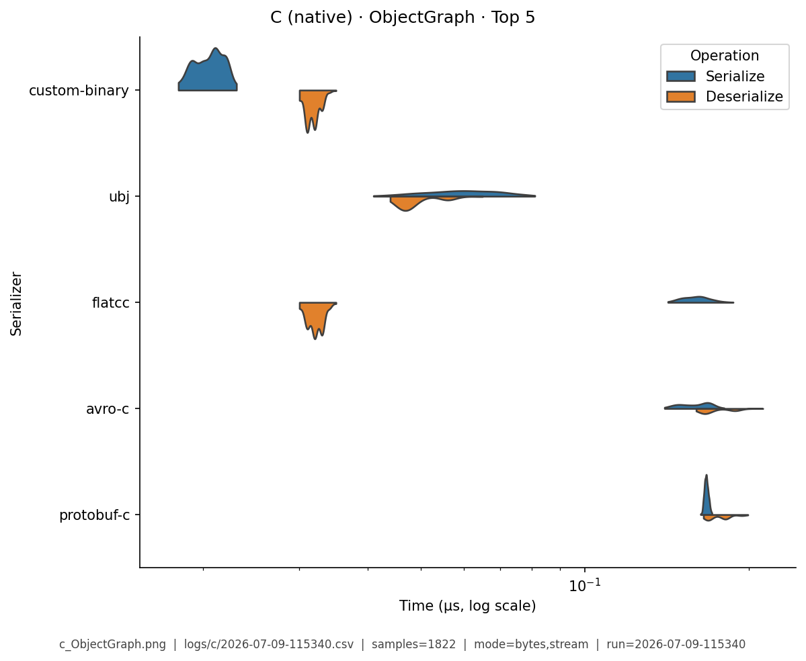

# C (native) — Benchmark Results

**Generated:** 2026-07-09T11:56:32.071582

Published **local snapshot** (not regenerated by GitHub Actions). Numbers may differ if you re-run benchmarks on another machine.

Serializer inventory and caveats: [C (native) overview](index.md). Methods: [Analysis Methodology](../analysis/ANALYSIS_METHODOLOGY.md). Metric definitions & importance tiers: [Metrics catalog](../analysis/METRICS.md).

## Pivot tables

Multi-way leaderboards emphasize **high-importance** metrics (configurable via `metrics.multi_way` in master config). Harness **modes** (CSV `StringOrStream`): **bytes mode** = in-memory buffer API; **stream mode** = write/read through a stream-like path. These names are *not* payload sizes. In each table, **bold** marks the semantic best value in that column (lowest time; highest ops/s). Ties are all bolded. Latency tables are in **microseconds** (µs).

### Summary

Default multi-serializer view shows **high-importance** metrics only ([METRICS.md](../analysis/METRICS.md)). **Primary rank:** median total latency (lower is better). Pairwise / version A/B reports use the full metric set. Latency cells are **µs** (analysis storage remains ns).

| serializer | Median total (µs) | Median ser (µs) | Median deser (µs) | Ops/s (from mean) | Median size (B) | Samples | Fidelity |
|---|---|---|---|---|---|---|---|
| custom-binary:1.0 | **0.057** | **0.027** | **0.0301** | **22M** | 564.1 | 1286 | **1.00** |
| ubj:1.0-min | 0.115 | 0.0674 | 0.0474 | 9.07M | 601.1 | 1244 | **1.00** |
| flatcc:0.6.1 | 0.209 | 0.174 | 0.0344 | 5.02M | 594.9 | 1292 | **1.00** |
| avro-c:1.11.3 | 0.336 | 0.161 | 0.174 | 3.02M | 567 | 1199 | **1.00** |
| upb:wire-1.0 | 0.604 | 0.261 | 0.342 | 5.7M | 386.4 | 1214 | **1.00** |
| protobuf-c:1.5.0 | 0.617 | 0.27 | 0.347 | 5.68M | 386.4 | 1244 | **1.00** |
| mpack:1.1 | 1.07 | 0.391 | 0.677 | 2.11M | 519.4 | 1228 | **1.00** |
| msgpack-c:6.0.1 | 1.29 | 0.598 | 0.693 | 2.2M | 519.4 | 1193 | **1.00** |
| nanopb:0.4.9 | 1.46 | 0.659 | 0.801 | 3.11M | **385** | 1212 | **1.00** |
| zcbor:0.9 | 1.72 | 0.905 | 0.815 | 1.9M | 526.3 | 1234 | **1.00** |
| yyjson:0.10.0 | 2.06 | 0.86 | 1.2 | 1.88M | 794.4 | 1241 | **1.00** |
| libbson:1.27.5 | 3.64 | 2.7 | 0.937 | 1.72M | 764.3 | 1251 | **1.00** |
| tinycbor:0.6.0 | 4 | 0.516 | 3.49 | 1.17M | 519.6 | 1274 | **1.00** |
| cbor-encode:0.11.0 | 7.02 | 4.34 | 2.7 | 636K | 551.7 | 1238 | **1.00** |
| qcbor:1.5 | 18.3 | 1.31 | 16.9 | 662K | 519.6 | 1226 | **1.00** |
| json-c:0.15 | 19.9 | 10.1 | 9.77 | 275K | 809.3 | 1250 | **1.00** |
| cJSON:1.7.18 | 20.9 | 14.8 | 6.01 | 607K | 798.9 | 1254 | **1.00** |
| jansson:2.14 | 24.6 | 11.4 | 13.1 | 265K | 809.3 | 1218 | **1.00** |
| parson:1.5.3 | 29.2 | 21.9 | 7.31 | 228K | 809.3 | 1219 | **1.00** |


### Total Time

| serializer | bytes mode/mean | bytes mode/median | stream mode/mean | stream mode/median |
|---|---|---|---|---|
| custom-binary:1.0 | **0.0317** | **0.032** | **0.0317** | **0.032** |
| ubj:1.0-min | 0.103 | 0.102 | 0.0997 | 0.101 |
| flatcc:0.6.1 | 0.168 | 0.168 | 0.168 | 0.168 |
| avro-c:1.11.3 | 0.284 | 0.284 | 0.286 | 0.286 |
| upb:wire-1.0 | 0.246 | 0.246 | 0.247 | 0.247 |
| protobuf-c:1.5.0 | 0.257 | 0.257 | 0.262 | 0.269 |
| mpack:1.1 | 0.79 | 0.788 | 0.784 | 0.784 |
| msgpack-c:6.0.1 | 0.875 | 0.874 | 0.871 | 0.871 |
| nanopb:0.4.9 | 0.695 | 0.694 | 0.723 | 0.723 |
| zcbor:0.9 | 1.12 | 1.12 | 1.08 | 1.08 |
| yyjson:0.10.0 | 1.28 | 1.28 | 1.28 | 1.28 |
| libbson:1.27.5 | 1.61 | 1.6 | 1.64 | 1.67 |
| tinycbor:0.6.0 | 2.41 | 2.41 | 2.46 | 2.46 |
| cbor-encode:0.11.0 | 4.26 | 4.46 | 4.38 | 4.61 |
| qcbor:1.5 | 6.27 | 6.22 | 6.21 | 6.19 |
| json-c:0.15 | 7.97 | 7.98 | 7.82 | 7.82 |
| cJSON:1.7.18 | 5.14 | 5.13 | 5.06 | 5.02 |
| jansson:2.14 | 12.1 | 12.1 | 8.56 | 8.53 |
| parson:1.5.3 | 8.05 | 8.02 | 7.99 | 7.97 |


### Ops/Sec

| serializer | EDI_835 | Integer | ObjectGraph | Person | SimpleObject | StringArray | Telemetry |
|---|---|---|---|---|---|---|---|
| avro-c:1.11.3 | 2.7M | 3.4M | 3M | 3.5M | 3.3M | 2.4M | 2.8M |
| cJSON:1.7.18 | 0.024M | 2.5M | 0.36M | 0.19M | 1.1M | 0.062M | 0.013M |
| cbor-encode:0.11.0 | 0.052M | 2.8M | 0.27M | 0.23M | 1M | 0.082M | 0.12M |
| custom-binary:1.0 | **13M** | **34M** | **19M** | **32M** | **33M** | **11M** | **11M** |
| flatcc:0.6.1 | 4.2M | 6.4M | 5.2M | 6M | 5.8M | 3.3M | 4.2M |
| jansson:2.14 | 0.017M | 1.1M | 0.14M | 0.083M | 0.41M | 0.037M | 0.015M |
| json-c:0.15 | 0.02M | 1.1M | 0.15M | 0.13M | 0.52M | 0.058M | 0.018M |
| libbson:1.27.5 | 0.15M | 7.4M | 0.71M | 0.62M | 2.9M | 0.12M | 0.14M |
| mpack:1.1 | 0.34M | 6.3M | 1.6M | 1.3M | 3.5M | 0.58M | 1M |
| msgpack-c:6.0.1 | 0.3M | 7.6M | 1.4M | 1.1M | 3.9M | 0.47M | 0.64M |
| nanopb:0.4.9 | 0.32M | 12M | 1.6M | 1.4M | 4.8M | 0.2M | 2.1M |
| parson:1.5.3 | 0.015M | 0.81M | 0.12M | 0.12M | 0.43M | 0.069M | 0.0099M |
| protobuf-c:1.5.0 | 0.8M | 17M | 2.9M | 3.9M | 11M | 0.48M | 4.5M |
| qcbor:1.5 | 0.019M | 3.3M | 0.19M | 0.16M | 0.88M | 0.1M | 0.019M |
| tinycbor:0.6.0 | 0.08M | 5.3M | 0.47M | 0.41M | 1.5M | 0.3M | 0.15M |
| ubj:1.0-min | 7.1M | 12M | 9.3M | 9.7M | 11M | 7.1M | 7.3M |
| upb:wire-1.0 | 0.82M | 17M | 2.9M | 4.1M | 10M | 0.49M | 4.5M |
| yyjson:0.10.0 | 0.26M | 6.9M | 1.6M | 0.78M | 3.2M | 0.23M | 0.26M |
| zcbor:0.9 | 0.23M | 7.1M | 1.1M | 0.89M | 3.1M | 0.33M | 0.45M |

## Violin plots

Density of serialize / deserialize timings (µs; log scale when medians span ≥5×). **Each plot shows only the top 5 serializers by mean total time** for that fixture (same rule for every language). Full rankings are in the pivot tables above. Provenance (fixture, CSV path, modes, *n*) is printed on each image.

### EDI_835

{ width="80%" }

### Integer

{ width="80%" }

### ObjectGraph

{ width="80%" }

### Person

{ width="80%" }

### SimpleObject

{ width="80%" }

### StringArray

{ width="80%" }

### Telemetry

{ width="80%" }

## Regenerate

Published snapshots are produced **locally** (not by GitHub Actions). After running benchmarks (each run creates a timestamped `YYYY-MM-DD-HHMMSS.csv`):

```bash
analyze-benchmarks              # all languages
analyze-benchmarks -l c   # this language only
```

That refreshes this language's results tables and violin plots under `docs/analysis/plots/violin/`. The hub [Benchmark Results](../analysis/BENCHMARK_SUMMARY.md) is a **static** index and is not rewritten. Commit the updated `results.md` / plot paths as needed.


## Run configuration (important)

??? note "Show host, seed, serializers, and source CSV"

    Key fields from the run sidecar (`*.configs.json`, or legacy `*.environment.json`). Full metric definitions: [Metrics catalog](../analysis/METRICS.md). Optional blocks (`dataset`, `serializers`) appear only when captured.
    
    - **Source CSV:** `../logs/c/2026-07-09-115340.csv`
    - run=2026-07-09-115340
    - language=c
    - os=Linux 6.8.0-124-generic
    - cpu=12th Gen Intel(R) Core(TM) i7-12800H (20 threads)
    - ram=31.0 GiB
    - runtimes: gcc=gcc (Ubuntu 11.4.0-1ubuntu1~22.04.3) 11.4.0, python=3.14.0, node=24.15.0
    - git=8d8ab58
    - seed=42
    - warmup_reps=1
    - serializers=19
    - metrics_profile=multi_way
    - **Fixtures (config):** Person, Integer, Telemetry, SimpleObject, StringArray, EDI_835, ObjectGraph
    - **Serializers (from CSV):**
      - `avro-c` @ 1.11.3
      - `cJSON` @ 1.7.18
      - `cbor-encode` @ 0.11.0
      - `custom-binary` @ 1.0
      - `flatcc` @ 0.6.1
      - `jansson` @ 2.14
      - `json-c` @ 0.15
      - `libbson` @ 1.27.5
      - `mpack` @ 1.1
      - `msgpack-c` @ 6.0.1
      - `nanopb` @ 0.4.9
      - `parson` @ 1.5.3
      - `protobuf-c` @ 1.5.0
      - `qcbor` @ 1.5
      - `tinycbor` @ 0.6.0
      - `ubj` @ 1.0-min
      - `upb` @ wire-1.0
      - `yyjson` @ 0.10.0
      - `zcbor` @ 0.9
