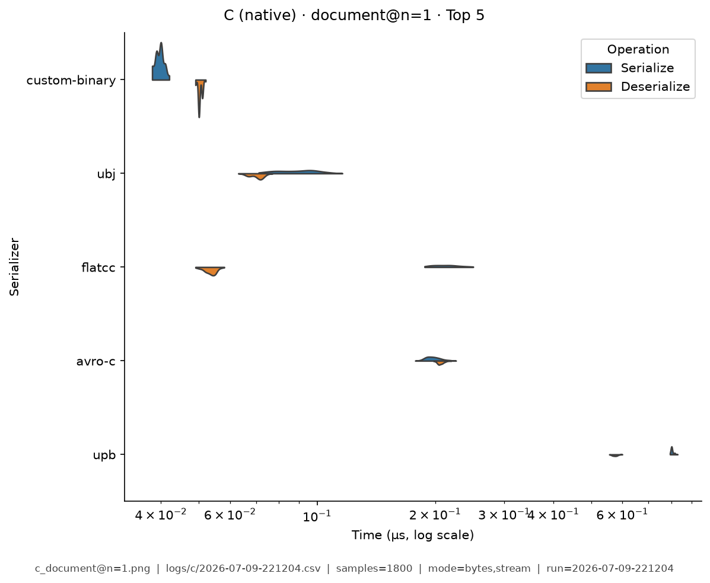
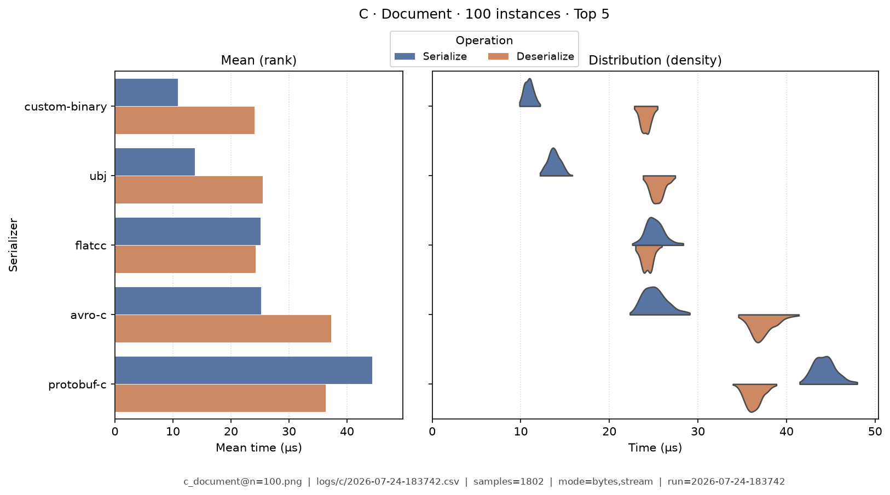
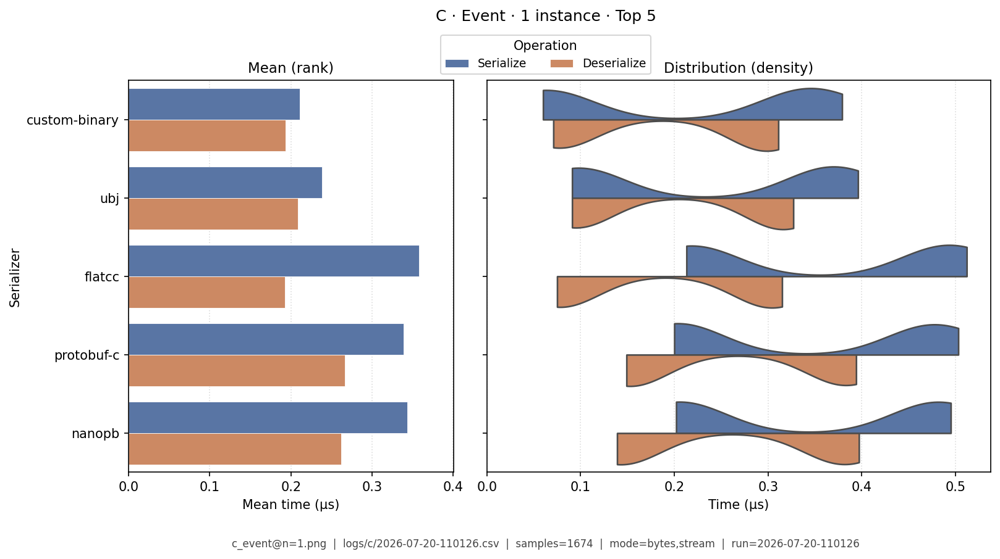
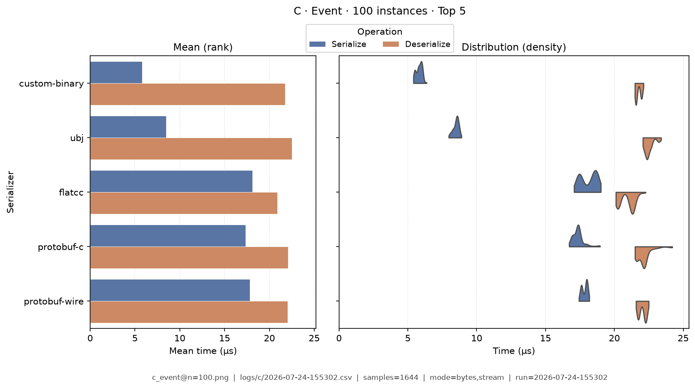
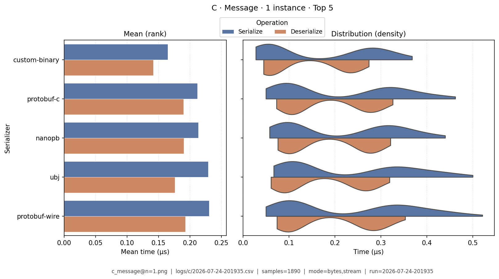
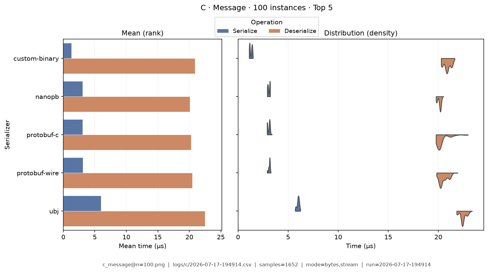
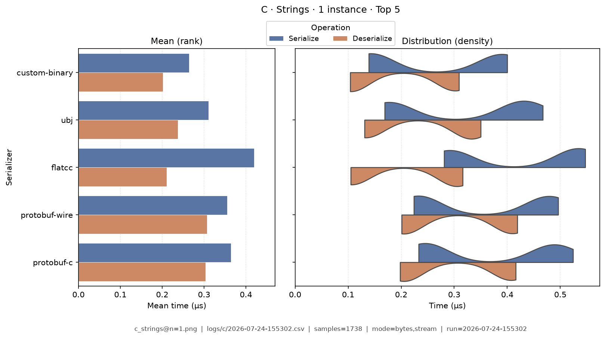
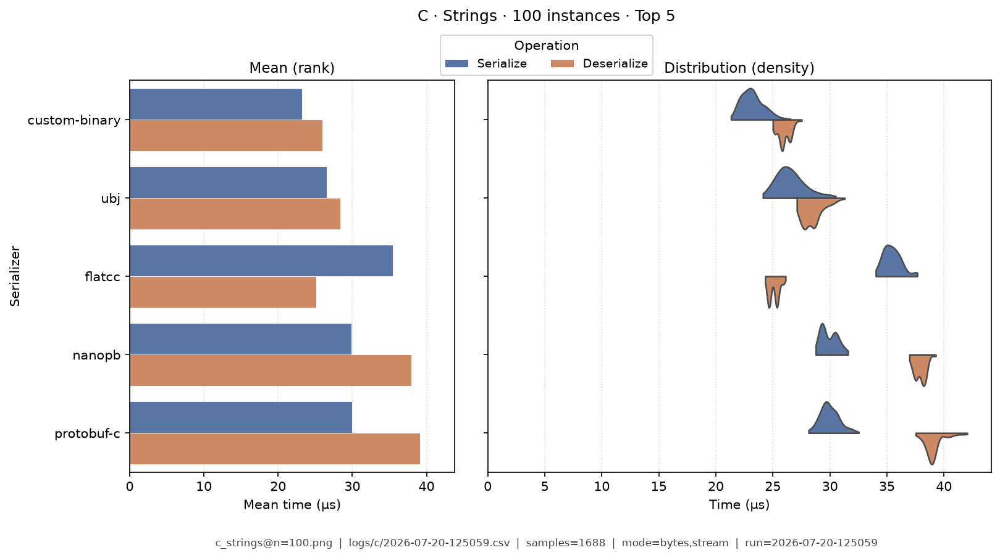
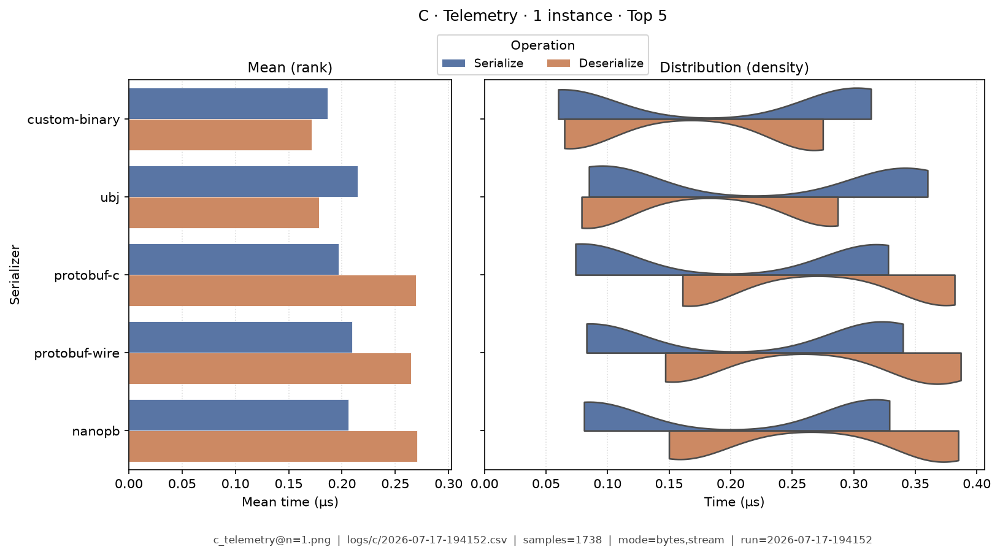
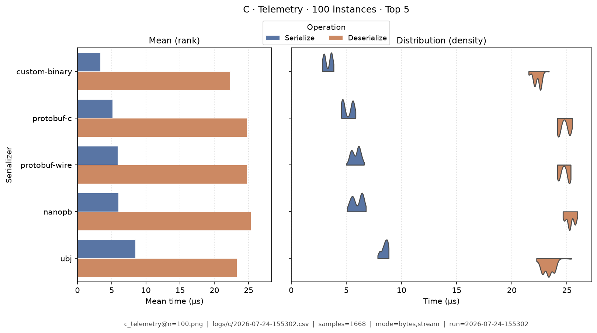

# C — Benchmark Results

**Generated:** 2026-07-11T10:57:31.975186

Published **local snapshot** (not regenerated by GitHub Actions). Numbers may differ if you re-run benchmarks on another machine.

Serializer inventory and caveats: [C overview](index.md). Methods: [Analysis Methodology](../analysis/ANALYSIS_METHODOLOGY.md). Metric definitions & importance tiers: [Metrics catalog](../analysis/METRICS.md).

## Pivot tables

Multi-way leaderboards emphasize **high-importance** metrics (configurable via `metrics.multi_way` in master config). Harness **modes** (CSV `StringOrStream`): **bytes mode** = in-memory buffer API; **stream mode** = write/read through a stream-like path. These names are *not* payload sizes. In each table, rows are sorted by **serializer name**; **bold** marks the semantic best value in that column (lowest time; highest ops/s). Ties are all bolded. Latency tables are in **microseconds** (µs). Batch fixtures show as **Type · N instances** (from `DataTypeInstanceCount`; e.g. Message · 100 instances).

### Summary

Default multi-serializer view shows **high-importance** metrics only ([METRICS.md](../analysis/METRICS.md)). Rows are sorted by **serializer name**. **Bold** marks the semantic best value in each column (lowest latency / size; highest ops/s). Pairwise / version A/B reports use the full metric set. Latency cells are **µs** (analysis storage remains ns).

| serializer | Median total (µs) | Median ser (µs) | Median deser (µs) | Ops/s (from mean) | Median size (B) | Samples | Fidelity |
|---|---|---|---|---|---|---|---|
| avro-c:1.11.3 | 20.3 | 8.58 | 11.8 | 1.05M | 36.7K | 1688 | **1.00** |
| cbor-encode:0.11.0 | 416 | 151 | 265 | 0.206M | 34.4K | 1771 | **1.00** |
| cJSON:1.7.18 | 1,560 | 1,110 | 443 | 0.181M | 52.3K | 1736 | **1.00** |
| custom-binary:1.0 | **7.68** | **2.27** | 5.42 | **5.22M** | 36.6K | 1719 | **1.00** |
| flatcc:0.6.1 | 14.4 | 9.04 | **5.33** | 1.61M | 38.1K | 1686 | **1.00** |
| jansson:2.14 | 1,600 | 772 | 823 | 0.0865M | 53K | 1792 | **1.00** |
| json-c:0.15 | 1,270 | 680 | 585 | 0.105M | 53K | 1762 | **1.00** |
| libbson:1.27.5 | 225 | 165 | 60.3 | 0.464M | 48.7K | 1756 | **1.00** |
| mpack:1.1 | 70.8 | 25 | 45.8 | 0.657M | 33.6K | 1735 | **1.00** |
| msgpack-c:6.0.1 | 83.3 | 35.6 | 47.6 | 0.665M | 33.6K | 1680 | **1.00** |
| nanopb:0.4.9 | 95.7 | 43.8 | 51.9 | 0.835M | **25.8K** | 1776 | **1.00** |
| parson:1.5.3 | 2,020 | 1,540 | 480 | 0.0925M | 53K | 1757 | **1.00** |
| protobuf-c:1.5.0 | 45.2 | 18.8 | 26.3 | 1.64M | 25.9K | 1765 | **1.00** |
| qcbor:1.5 | 974 | 80.2 | 893 | 0.176M | 33.6K | 1828 | **1.00** |
| tinycbor:0.6.0 | 246 | 33.8 | 212 | 0.286M | 33.6K | 1809 | **1.00** |
| ubj:1.0-min | 10.6 | 4.49 | 6.14 | 2.67M | 38.4K | 1756 | **1.00** |
| upb:wire-1.0 | 44.7 | 18.5 | 26.2 | 1.69M | 25.9K | 1721 | **1.00** |
| yyjson:0.10.0 | 176 | 74.2 | 102 | 0.53M | 52K | 1731 | **1.00** |
| zcbor:0.9 | 117 | 61.6 | 55.4 | 0.553M | 33.9K | 1734 | **1.00** |


### Total Time

| serializer | bytes mode/mean | bytes mode/median | stream mode/mean | stream mode/median |
|---|---|---|---|---|
| avro-c:1.11.3 | 0.31 | 0.307 | 0.722 | 0.721 |
| cbor-encode:0.11.0 | 0.89 | 0.886 | 1.45 | 1.46 |
| cJSON:1.7.18 | 0.896 | 0.898 | 1.49 | 1.49 |
| custom-binary:1.0 | **0.0313** | **0.031** | **0.421** | **0.421** |
| flatcc:0.6.1 | 0.165 | 0.165 | 0.558 | 0.553 |
| jansson:2.14 | 2.31 | 2.31 | 2.73 | 2.73 |
| json-c:0.15 | 1.77 | 1.76 | 2.19 | 2.19 |
| libbson:1.27.5 | 0.35 | 0.35 | 0.711 | 0.709 |
| mpack:1.1 | 0.268 | 0.268 | 0.646 | 0.641 |
| msgpack-c:6.0.1 | 0.252 | 0.254 | 0.655 | 0.654 |
| nanopb:0.4.9 | 0.21 | 0.21 | 0.575 | 0.574 |
| parson:1.5.3 | 2.18 | 2.16 | 2.66 | 2.65 |
| protobuf-c:1.5.0 | 0.0954 | 0.095 | 0.472 | 0.477 |
| qcbor:1.5 | 1.06 | 1.05 | 1.45 | 1.45 |
| tinycbor:0.6.0 | 0.673 | 0.677 | 1.07 | 1.07 |
| ubj:1.0-min | 0.0872 | 0.087 | 0.458 | 0.457 |
| upb:wire-1.0 | 0.0915 | 0.0915 | 0.448 | 0.448 |
| yyjson:0.10.0 | 0.3 | 0.3 | 0.72 | 0.718 |
| zcbor:0.9 | 0.308 | 0.308 | 0.704 | 0.704 |


### Ops/Sec

| serializer | Document · 1 instance | Document · 100 instances | Event · 1 instance | Event · 100 instances | Message · 1 instance | Message · 100 instances | Strings · 1 instance | Strings · 100 instances | Telemetry · 1 instance | Telemetry · 100 instances |
|---|---|---|---|---|---|---|---|---|---|---|
| avro-c:1.11.3 | 2.7M | 25K | 3.2M | 30K | 3.2M | 30K | 2.4M | 21K | 2.7M | 26K |
| cbor-encode:0.11.0 | 0.06M | 0.55K | 1.1M | 10K | 1.1M | 11K | 0.11M | 0.76K | 0.15M | 1.2K |
| cJSON:1.7.18 | 0.024M | 0.21K | 1M | 10K | 1.1M | 11K | 0.063M | 0.52K | 0.012M | 0.12K |
| custom-binary:1.0 | **12M** | **63K** | **30M** | **120K** | **32M** | **120K** | **9.7M** | **51K** | **9.6M** | **65K** |
| flatcc:0.6.1 | 4.3M | 35K | 5.7M | 51K | 6.1M | 47K | 3.3M | 27K | 4.5M | 38K |
| jansson:2.14 | 0.018M | 0.17K | 0.43M | 4.3K | 0.43M | 4.4K | 0.039M | 0.37K | 0.016M | 0.15K |
| json-c:0.15 | 0.022M | 0.22K | 0.48M | 5K | 0.57M | 5K | 0.057M | 0.49K | 0.018M | 0.18K |
| libbson:1.27.5 | 0.16M | 1.6K | 2.8M | 25K | 2.9M | 25K | 0.13M | 1.2K | 0.14M | 1.5K |
| mpack:1.1 | 0.36M | 3.4K | 3M | 31K | 3.7M | 31K | 0.58M | 4.4K | 0.96M | 9.9K |
| msgpack-c:6.0.1 | 0.32M | 3.1K | 3.6M | 30K | 4M | 15K | 0.48M | 4K | 0.64M | 6.3K |
| nanopb:0.4.9 | 0.32M | 3.2K | 4.4M | 36K | 4.8M | 36K | 0.19M | 1.9K | 2M | 19K |
| parson:1.5.3 | 0.015M | 0.14K | 0.46M | 4.3K | 0.46M | 4.5K | 0.066M | 0.54K | 0.01M | 0.093K |
| protobuf-c:1.5.0 | 0.8M | 7.7K | 9.9M | 57K | 10M | 57K | 0.47M | 4K | 4.3M | 38K |
| qcbor:1.5 | 0.021M | 0.21K | 0.92M | 8.6K | 0.95M | 9.2K | 0.1M | 0.98K | 0.029M | 0.28K |
| tinycbor:0.6.0 | 0.081M | 0.8K | 1.4M | 13K | 1.5M | 14K | 0.29M | 2.8K | 0.15M | 1.5K |
| ubj:1.0-min | 7.3M | 44K | 11M | 71K | 11M | 73K | 6.9M | 39K | 7M | 46K |
| upb:wire-1.0 | 0.78M | 7.6K | 10M | 59K | 11M | 57K | 0.45M | 4.1K | 4.3M | 38K |
| yyjson:0.10.0 | 0.27M | 2.1K | 3.1M | 28K | 3.3M | 28K | 0.22M | 1.4K | 0.25M | 2.1K |
| zcbor:0.9 | 0.23M | 2.3K | 3.1M | 23K | 3.2M | 25K | 0.33M | 2.4K | 0.48M | 4.6K |

## Latency distributions

Each figure pairs **mean bars** (left: ser / deser mean µs, linear from 0) with **split violins** (right: full sample density, linear from 0). **Top 5 serializers by mean total time** per fixture (display only; tables list all). Provenance (fixture, CSV path, modes, *n*) is printed on each image.

### Document · 1 instance

{ width="80%" }

### Document · 100 instances

{ width="80%" }

### Event · 1 instance

{ width="80%" }

### Event · 100 instances

{ width="80%" }

### Message · 1 instance

{ width="80%" }

### Message · 100 instances

{ width="80%" }

### Strings · 1 instance

{ width="80%" }

### Strings · 100 instances

{ width="80%" }

### Telemetry · 1 instance

{ width="80%" }

### Telemetry · 100 instances

{ width="80%" }

## Regenerate

Published snapshots are produced **locally** (not by GitHub Actions). After running benchmarks (each run creates a timestamped `YYYY-MM-DD-HHMMSS.csv`):

```bash
analyze-benchmarks              # all languages
analyze-benchmarks -l c   # this language only
```

That refreshes this language's results tables and latency distributions under `docs/analysis/plots/violin/`. The hub [Benchmark Results](../analysis/BENCHMARK_SUMMARY.md) is a **static** index and is not rewritten. Commit the updated `results.md` / plot paths as needed.


## Run configuration (important)

??? note "Show host, seed, serializers, and source CSV"

    Key fields from the run sidecar (`*.configs.json`, or legacy `*.environment.json`). Full metric definitions: [Metrics catalog](../analysis/METRICS.md). Optional blocks (`dataset`, `serializers`) appear only when captured.
    
    - **Source CSV:** `/home/leo/PycharmProjects/GLD/seriailizer-benchmark/logs/c/2026-07-10-140645.csv`
    - run=2026-07-10-140645
    - language=c
    - os=Linux 6.8.0-124-generic
    - cpu=12th Gen Intel(R) Core(TM) i7-12800H (20 threads)
    - ram=31.0 GiB
    - runtimes: gcc=gcc (Ubuntu 11.4.0-1ubuntu1~22.04.3) 11.4.0, python=3.14.0, node=24.15.0
    - git=fc04893 dirty
    - seed=42
    - warmup_reps=1
    - serializers=19
    - metrics_profile=multi_way
    - **Fixtures (config):** message, document, telemetry, strings, event
    - **Serializers (from CSV):**
      - `avro-c` @ 1.11.3
      - `cJSON` @ 1.7.18
      - `cbor-encode` @ 0.11.0
      - `custom-binary` @ 1.0
      - `flatcc` @ 0.6.1
      - `jansson` @ 2.14
      - `json-c` @ 0.15
      - `libbson` @ 1.27.5
      - `mpack` @ 1.1
      - `msgpack-c` @ 6.0.1
      - `nanopb` @ 0.4.9
      - `parson` @ 1.5.3
      - `protobuf-c` @ 1.5.0
      - `qcbor` @ 1.5
      - `tinycbor` @ 0.6.0
      - `ubj` @ 1.0-min
      - `upb` @ wire-1.0
      - `yyjson` @ 0.10.0
      - `zcbor` @ 0.9
