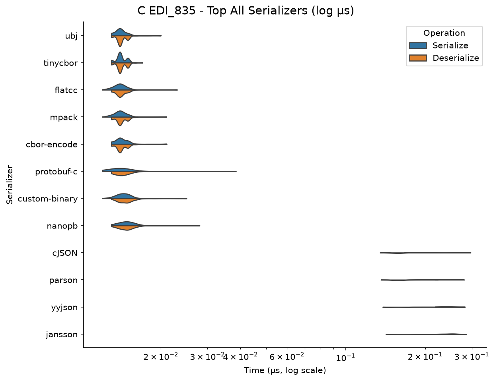
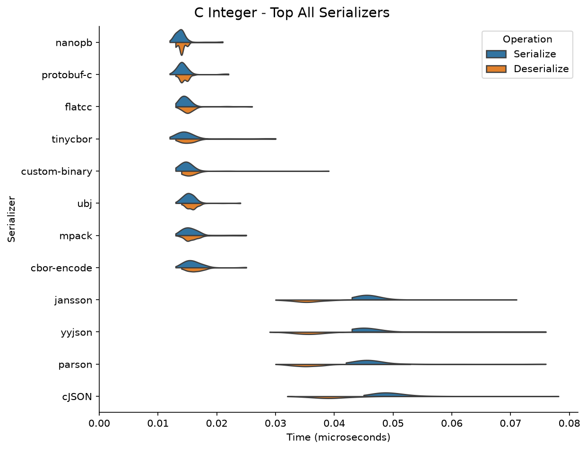
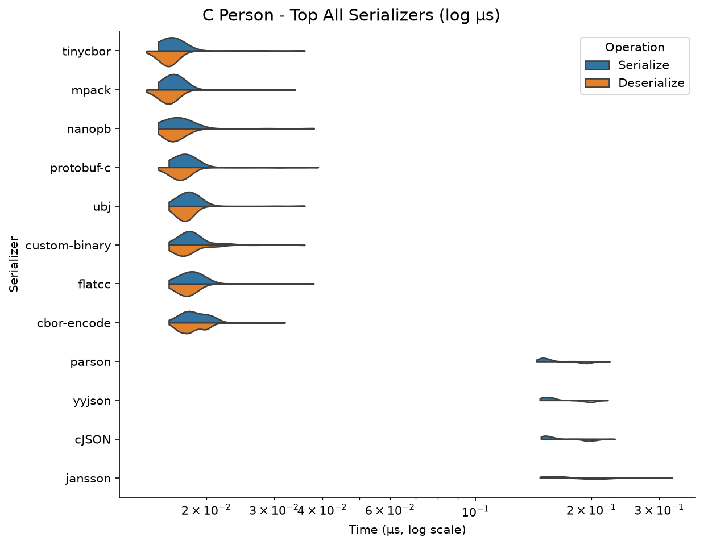
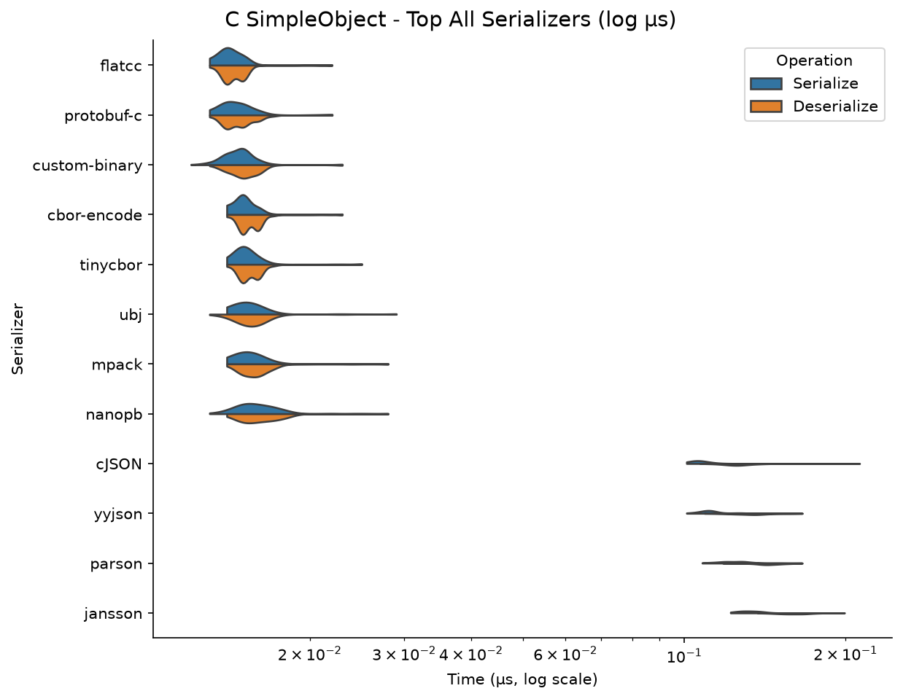
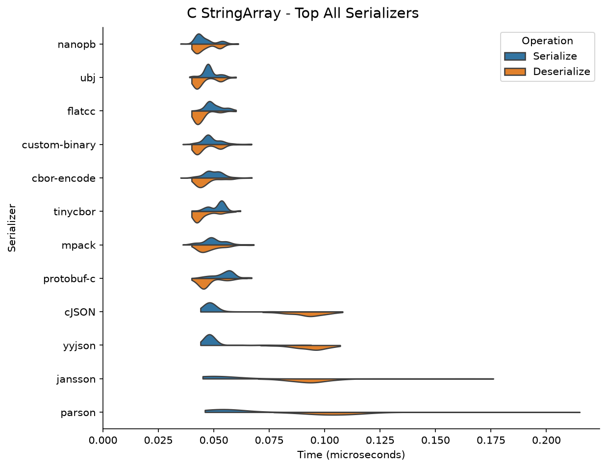
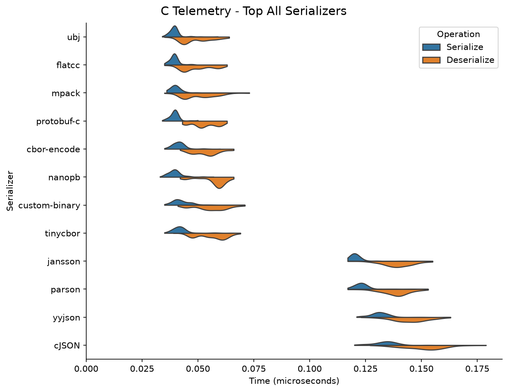

# C — Benchmark Results

**Generated:** 2026-06-30T18:22:48.224496

Published **local snapshot** (not regenerated by GitHub Actions). Numbers may differ if you re-run benchmarks on another machine.

Serializer inventory and caveats: [C overview](index.md). Methods: [Analysis Methodology](../analysis/ANALYSIS_METHODOLOGY.md).

## Pivot tables


### C: Avg Total Time (ns) by Serializer and Mode

| serializer | bytes | stream |
|---|---|---|
| cJSON | 351 | 352 |
| cbor-encode | 35 | 40 |
| custom-binary | 36 | 37 |
| flatcc | 36 | 37 |
| jansson | 380 | 352 |
| mpack | 32 | 32 |
| nanopb | 33 | 34 |
| parson | 346 | 341 |
| protobuf-c | 34 | 35 |
| tinycbor | 32 | 32 |
| ubj | 35 | 36 |
| yyjson | 356 | 349 |


### C: Ops/Sec by Serializer and Data Type

| serializer | EDI_835 | Integer | Person | SimpleObject | StringArray | Telemetry |
|---|---|---|---|---|---|---|
| cJSON | 2,516,849 | 11,007,418 | 2,845,456 | 4,279,994 | 7,050,349 | 3,443,379 |
| cbor-encode | 35,240,621 | 29,780,564 | 28,177,282 | 33,098,592 | 10,555,301 | 10,692,805 |
| custom-binary | 35,281,147 | 33,568,905 | 28,045,574 | 32,780,980 | 10,531,972 | 9,658,027 |
| flatcc | 34,945,288 | 34,023,669 | 28,057,335 | 35,060,976 | 10,372,113 | 11,409,943 |
| jansson | 2,375,537 | 12,339,056 | 2,633,330 | 3,403,987 | 7,105,221 | 3,834,683 |
| mpack | 35,507,526 | 32,897,064 | 30,769,231 | 31,818,182 | 10,041,222 | 11,319,874 |
| nanopb | 34,589,973 | 36,042,945 | 30,564,784 | 32,917,533 | 10,600,707 | 10,012,674 |
| parson | 2,453,088 | 12,313,675 | 2,886,330 | 3,589,567 | 6,235,550 | 3,816,952 |
| protobuf-c | 35,466,775 | 35,686,579 | 29,329,173 | 33,240,028 | 9,954,464 | 10,769,063 |
| tinycbor | 35,188,510 | 32,291,309 | 31,239,503 | 32,798,574 | 10,371,243 | 10,474,705 |
| ubj | 35,272,045 | 32,822,757 | 28,240,190 | 33,013,436 | 10,849,910 | 10,984,134 |
| yyjson | 2,456,194 | 12,330,623 | 2,810,984 | 4,134,274 | 7,076,010 | 3,565,263 |

### Scientific metrics (sample: cJSON / Person / bytes)

- mean total: 351 ns (95% CI [350, 353])
- median: 352 ns, CV: 0.026, vs fastest Cliff's δ: 1.000 (large)

## Violin plots

Density of serialize / deserialize timings (µs; log scale when medians span ≥5×).

| Fixture | Plot |
|---------|------|
| EDI_835 | { width="50%" } |
| Integer | { width="50%" } |
| Person | { width="50%" } |
| SimpleObject | { width="50%" } |
| StringArray | { width="50%" } |
| Telemetry | { width="50%" } |

## Regenerate

Published snapshots are produced **locally** (not by GitHub Actions). After updating `logs/<lang>/benchmark-log.csv`:

```bash
analyze-benchmarks --generate-summary --generate-plots --output-dir docs/analysis
```

That refreshes this page, other languages' `results.md`, plot images under `docs/analysis/plots/violin/`, and the [Benchmark Results](../analysis/BENCHMARK_SUMMARY.md) hub. Commit those paths to update the documentation site.
