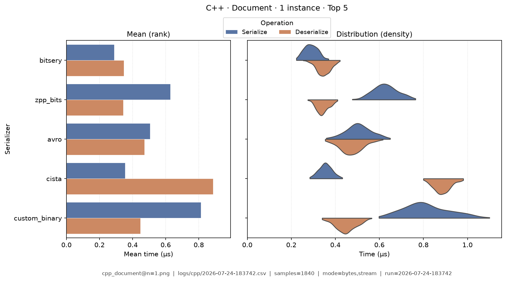
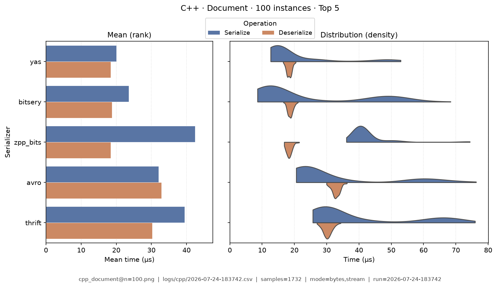
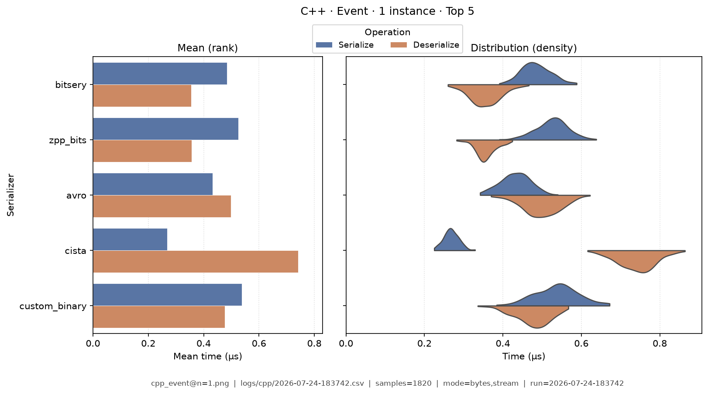
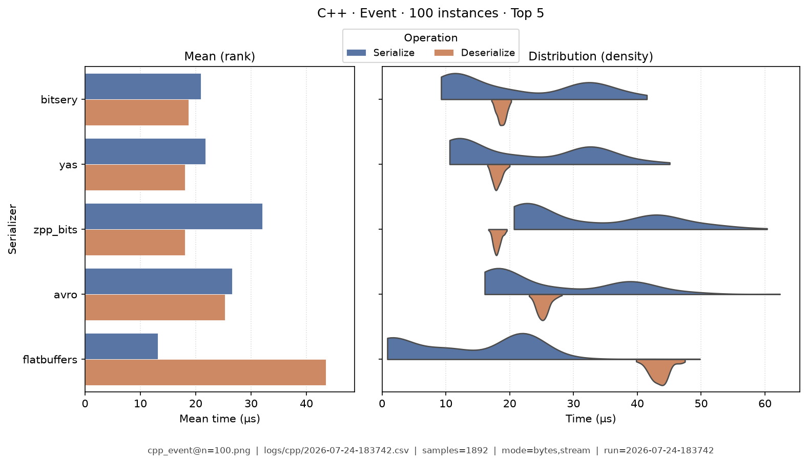
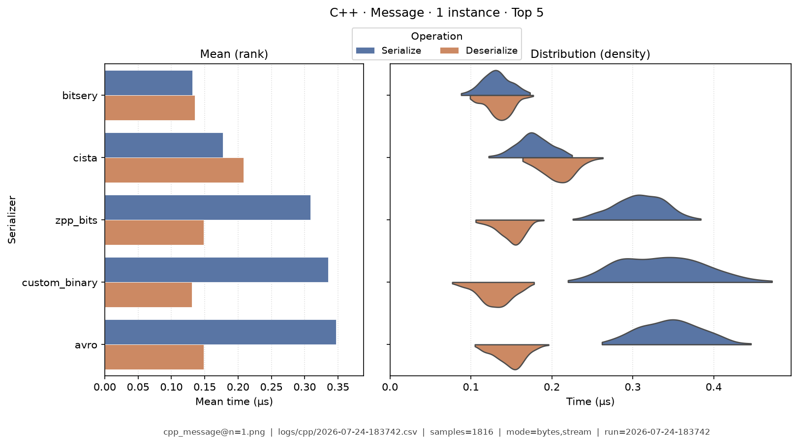
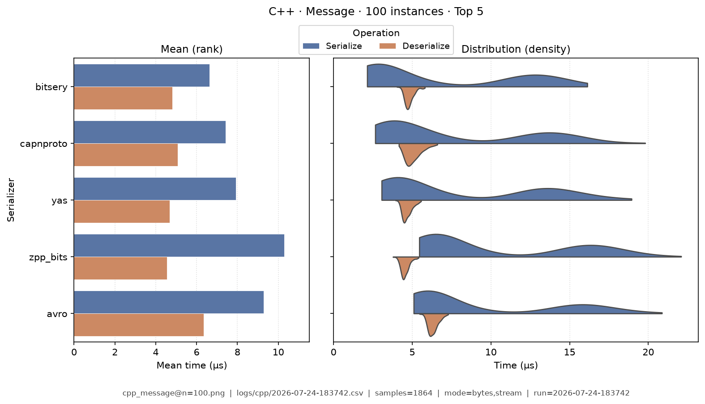
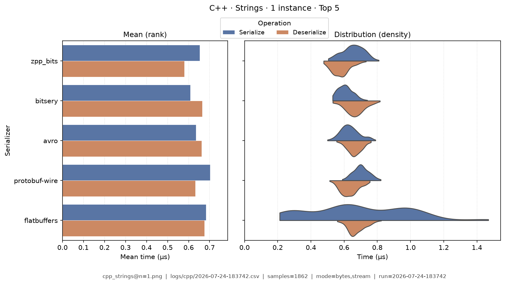
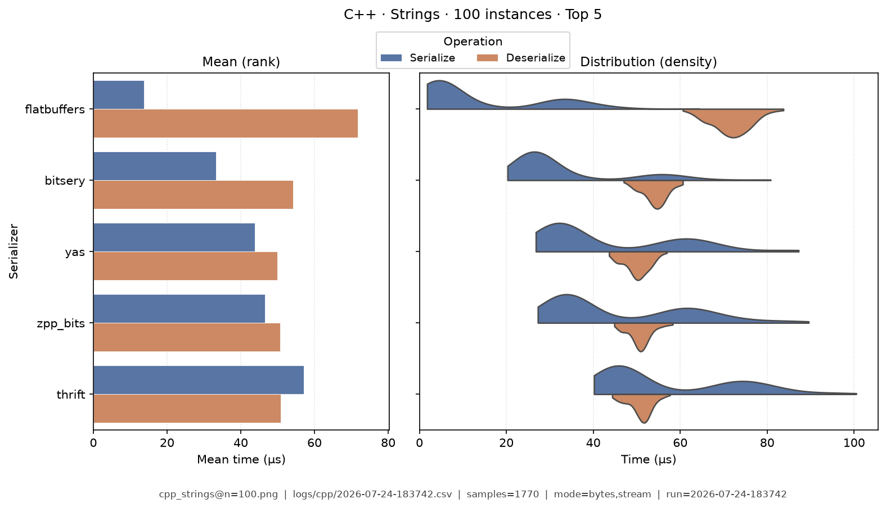
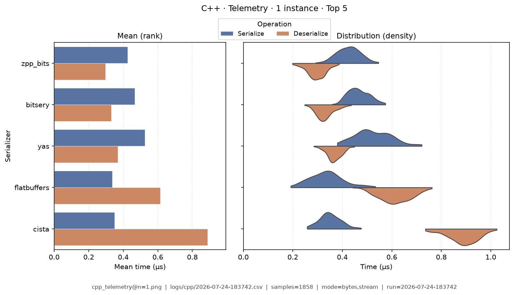
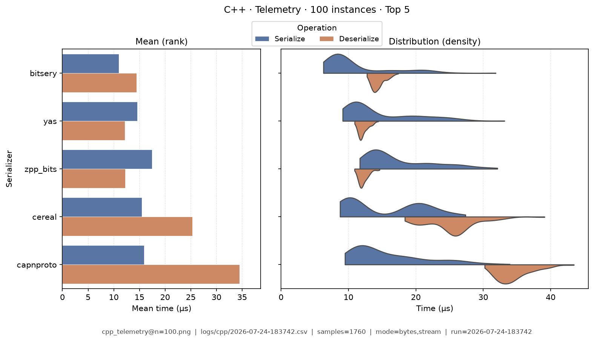

# C++ — Benchmark Results

**Generated:** 2026-07-24T18:57:57.731787

This page is a **snapshot of measured numbers** for C++ on one machine. Continuous integration deploys the documentation site; it does **not** re-run analysis when docs are published. Re-running benchmarks on another computer will usually change the numbers a little.

| Topic | Where to read |
|-------|---------------|
| Which libraries we measure, and caveats | [C++ overview](index.md) |
| I/O modes and run modes | [Modes](../analysis/modes.md) |
| How CSVs become these tables | [Analysis methodology](../analysis/ANALYSIS_METHODOLOGY.md) |
| What each metric means | [Metrics catalog](../analysis/METRICS.md) |
| All languages’ result links | [Results summary](../analysis/BENCHMARK_SUMMARY.md) |

## How to read these tables

Compare serializers **inside this language**. Prefer the same [category](../analysis/serialization_categories.md) (for example JSON with JSON) and the same [I/O mode](../analysis/modes.md) so the comparison stays fair.

| Term | Meaning |
|------|---------|
| **data type** | Sample shape: `message`, `document`, `telemetry`, `strings`, or `event` (CSV `TestDataName`; older text may say “fixture”) |
| **bytes mode** | In-memory buffer API (encode to bytes / decode from a buffer). On C# this is often the **string** path — see [Modes](../analysis/modes.md). |
| **stream mode** | Stream-style API (write/read through a stream). May be native or adapted — see [Modes](../analysis/modes.md). |
| **µs** | Microseconds (one microsecond = 1000 nanoseconds). Tables show µs; raw CSVs store nanoseconds. |
| **Ops/s** | Operations per second from mean total time — higher is faster |
| **Bold** | Best value in that column (lowest time/size; highest ops/s). Ties are all bolded. |

Rows are sorted by **serializer name** (easy lookup), not by rank. Batch workloads appear as **Data type · N instances** (for example Message · 100 instances). Default multi-serializer tables show **high-importance** metrics only; pairwise / version A/B reports can show the full set ([Metrics](../analysis/METRICS.md)).

## Summary tables

### Summary

One row per serializer (averaged across data types; bytes mode preferred when both exist). Only **high-importance** columns appear here by default ([Metrics catalog](../analysis/METRICS.md)). Times are **µs**. **Bold** = best in that column.

| serializer | Median total (µs) | Median ser (µs) | Median deser (µs) | Ops/s (from mean) | Median size (B) | Samples | Fidelity |
|---|---|---|---|---|---|---|---|
| arduinojson:7.2.1 | 2,220 | 114 | 2,100 | 49.2K | 17.6K | 1845 | **1.00** |
| avro:binary-1.11 | 30.6 | 13.9 | 16.3 | 577K | **9.01K** | 1823 | **1.00** |
| avro_c:avro-c | 139 | 62.9 | 75.4 | 146K | **9.01K** | 1825 | **1.00** |
| bitsery:5.2.4 | **19.2** | 7.57 | 11.3 | **876K** | 9.75K | 1833 | **1.00** |
| capnproto:1.0.x | 31.9 | 11.2 | 20 | 389K | 18.3K | 1865 | **1.00** |
| cereal:1.3.2 | 38.4 | 16 | 21.9 | 328K | 14.2K | 1833 | **1.00** |
| cista:0.15 | 36.2 | 6.31 | 29.3 | 573K | 15.5K | 1799 | **1.00** |
| custom_binary:harness | 40.8 | 25.5 | 15.2 | 539K | 11.7K | 1849 | **1.00** |
| flatbuffers:flatbuffers | 28.4 | **4.12** | 24.3 | 500K | 10.4K | 1844 | **1.00** |
| flexbuffers:flatbuffers-flex | 183 | 61.4 | 120 | 110K | 17.3K | 1848 | **1.00** |
| jsoncons_bson:0.177.0 | 539 | 101 | 437 | 40.7K | 20.3K | 1854 | **1.00** |
| jsoncons_cbor:0.177.0 | 508 | 66.9 | 439 | 42.6K | 13.6K | 1888 | **1.00** |
| jsoncons_msgpack:0.177.0 | 491 | 64.7 | 425 | 44.2K | 13.5K | 1894 | **1.00** |
| msgpack:msgpack-cxx | 46.2 | 19.8 | 25.8 | 283K | 13.5K | 1810 | **1.00** |
| nlohmann_bson:3.11.3 | 370 | 93.5 | 275 | 87.9K | 20.3K | 1831 | **1.00** |
| nlohmann_cbor:3.11.3 | 238 | 48.3 | 188 | 98.1K | 13.6K | 1838 | **1.00** |
| nlohmann_json:3.11.3 | 315 | 83.3 | 231 | 74.6K | 19.7K | 1836 | **1.00** |
| nlohmann_msgpack:3.11.3 | 241 | 47.4 | 192 | 96.7K | 13.5K | 1835 | **1.00** |
| nlohmann_ubjson:3.11.3 | 266 | 47 | 219 | 89.2K | 15.6K | 1835 | **1.00** |
| protobuf-wire:wire-v2 | 64.2 | 40.4 | 23.8 | 428K | 10.4K | 1840 | **1.00** |
| rapidjson:1.1.0 | 545 | 107 | 436 | 48.1K | 19.7K | 1853 | **1.00** |
| simdjson:3.10.1 | 272 | 4.86 | 265 | 89.6K | 19.7K | 1767 | **1.00** |
| thrift:TBinaryProtocol | 30.9 | 16.8 | 14.1 | 477K | 13.6K | 1828 | **1.00** |
| yas:7.x | 20.2 | 9.33 | **10.6** | 497K | 14.2K | 1831 | **1.00** |
| yyjson:0.10.0 | 293 | 24.5 | 267 | 85K | 19.7K | 1796 | **1.00** |
| zpp_bits:4.4.25 | 24.3 | 13.3 | 10.6 | 670K | 11.7K | 1818 | **1.00** |


### Total Time

| serializer | bytes mode/mean | bytes mode/median | stream mode/mean | stream mode/median |
|---|---|---|---|---|
| arduinojson:7.2.1 | 5.03 | 4.96 | 6.82 | 6.83 |
| avro:binary-1.11 | 0.492 | 0.492 | 0.498 | 0.494 |
| avro_c:avro-c | 1.88 | 1.9 | 1.96 | 1.98 |
| bitsery:5.2.4 | **0.253** | **0.253** | **0.28** | **0.281** |
| capnproto:1.0.x | 0.649 | 0.645 | 0.83 | 0.824 |
| cereal:1.3.2 | 1.34 | 1.33 | 0.777 | 0.786 |
| cista:0.15 | 0.381 | 0.382 | 0.39 | 0.39 |
| custom_binary:harness | 0.428 | 0.426 | 0.504 | 0.503 |
| flatbuffers:flatbuffers | 0.591 | 0.602 | 0.611 | 0.62 |
| flexbuffers:flatbuffers-flex | 3.09 | 3.08 | 3.03 | 3.02 |
| jsoncons_bson:0.177.0 | 6.18 | 6.17 | 6.91 | 6.9 |
| jsoncons_cbor:0.177.0 | 6.15 | 6.08 | 6.82 | 6.77 |
| jsoncons_msgpack:0.177.0 | 5.9 | 5.83 | 6.52 | 6.46 |
| msgpack:msgpack-cxx | 1.13 | 1.12 | 1.31 | 1.29 |
| nlohmann_bson:3.11.3 | 2.77 | 2.73 | 3.01 | 3.02 |
| nlohmann_cbor:3.11.3 | 2.78 | 2.79 | 3.19 | 3.19 |
| nlohmann_json:3.11.3 | 3.6 | 3.58 | 4.29 | 4.28 |
| nlohmann_msgpack:3.11.3 | 2.92 | 2.92 | 3.11 | 3.09 |
| nlohmann_ubjson:3.11.3 | 3.05 | 3.03 | 3.41 | 3.4 |
| protobuf-wire:wire-v2 | 0.545 | 0.549 | 0.575 | 0.579 |
| rapidjson:1.1.0 | 4.69 | 4.74 | 8.28 | 8.28 |
| simdjson:3.10.1 | 3.21 | 3.21 | 3.26 | 3.24 |
| thrift:TBinaryProtocol | 0.611 | 0.607 | 0.625 | 0.629 |
| yas:7.x | 0.615 | 0.613 | 0.66 | 0.659 |
| yyjson:0.10.0 | 3.39 | 3.43 | 3.31 | 3.33 |
| zpp_bits:4.4.25 | 0.45 | 0.448 | 0.464 | 0.472 |


### Ops/Sec

| serializer | Document · 1 instance | Document · 100 instances | Event · 1 instance | Event · 100 instances | Message · 1 instance | Message · 100 instances | Strings · 1 instance | Strings · 100 instances | Telemetry · 1 instance | Telemetry · 100 instances |
|---|---|---|---|---|---|---|---|---|---|---|
| arduinojson:7.2.1 | 0.068M | 0.19K | 0.12M | 0.3K | 0.2M | 1.9K | 90K | 0.093K | 0.088M | 0.92K |
| avro:binary-1.11 | 1M | 18K | 1.1M | 20K | 2M | 67K | 780K | 8.5K | 0.78M | 15K |
| avro_c:avro-c | 0.2M | 3.1K | 0.29M | 4.5K | 0.53M | 11K | 150K | 2K | 0.29M | 4.3K |
| bitsery:5.2.4 | **1.6M** | 25K | **1.2M** | 25K | **4M** | **95K** | 810K | 13K | 1.3M | **45K** |
| capnproto:1.0.x | 0.53M | 14K | 0.65M | 16K | 1.5M | 85K | 510K | 8.4K | 0.83M | 22K |
| cereal:1.3.2 | 0.37M | 10K | 0.46M | 14K | 0.75M | 37K | 320K | 5.7K | 0.54M | 21K |
| cista:0.15 | 0.81M | 13K | 0.99M | 16K | 2.6M | 53K | 440K | 6.9K | 0.83M | 18K |
| custom_binary:harness | 0.82M | 11K | 1M | 15K | 2.3M | 40K | 650K | 7.5K | 0.75M | 10K |
| flatbuffers:flatbuffers | 0.63M | 15K | 0.84M | 18K | 1.7M | 56K | 750K | **13K** | 1.1M | 20K |
| flexbuffers:flatbuffers-flex | 0.1M | 1.5K | 0.2M | 2.9K | 0.32M | 5.4K | 230K | 2.8K | 0.24M | 3.9K |
| jsoncons_bson:0.177.0 | 0.05M | 0.7K | 0.084M | 1.3K | 0.16M | 2.2K | 62K | 0.77K | 0.06M | 0.73K |
| jsoncons_cbor:0.177.0 | 0.05M | 0.71K | 0.089M | 1.3K | 0.16M | 2.3K | 71K | 0.89K | 0.063M | 0.78K |
| jsoncons_msgpack:0.177.0 | 0.053M | 0.75K | 0.092M | 1.4K | 0.17M | 2.3K | 74K | 0.92K | 0.065M | 0.79K |
| msgpack:msgpack-cxx | 0.36M | 7.4K | 0.55M | 13K | 0.88M | 23K | 530K | 10K | 0.63M | 14K |
| nlohmann_bson:3.11.3 | 0.096M | 0.9K | 0.18M | 1.7K | 0.36M | 3.6K | 120K | 1.1K | 0.16M | 1.5K |
| nlohmann_cbor:3.11.3 | 0.098M | 1.3K | 0.18M | 2.4K | 0.36M | 4.6K | 160K | 2K | 0.22M | 3K |
| nlohmann_json:3.11.3 | 0.1M | 1.4K | 0.18M | 2.6K | 0.28M | 4.1K | 150K | 2K | 0.093M | 1.1K |
| nlohmann_msgpack:3.11.3 | 0.095M | 1.3K | 0.18M | 2.3K | 0.34M | 4.4K | 150K | 1.8K | 0.22M | 2.9K |
| nlohmann_ubjson:3.11.3 | 0.096M | 1.2K | 0.17M | 2.2K | 0.33M | 4.2K | 130K | 1.6K | 0.21M | 2.9K |
| protobuf-wire:wire-v2 | 0.44M | 5.6K | 0.69M | 8.5K | 1.8M | 24K | 750K | 6.7K | 0.58M | 6.7K |
| rapidjson:1.1.0 | 0.074M | 1.1K | 0.14M | 2K | 0.21M | 3K | 120K | 1.5K | 0.071M | 0.79K |
| simdjson:3.10.1 | 0.11M | 1.5K | 0.2M | 2.9K | 0.31M | 4.3K | 180K | 2.2K | 0.091M | 1.1K |
| thrift:TBinaryProtocol | 0.71M | 14K | 0.84M | 17K | 1.6M | 45K | 720K | 9.9K | 0.81M | 18K |
| yas:7.x | 0.69M | **28K** | 0.84M | **26K** | 1.6M | 84K | 620K | 11K | 1.1M | 44K |
| yyjson:0.10.0 | 0.097M | 1.4K | 0.2M | 2.6K | 0.3M | 4K | 160K | 1.9K | 0.09M | 1K |
| zpp_bits:4.4.25 | 1M | 17K | 1.1M | 20K | 2.2M | 73K | **830K** | 11K | **1.4M** | 37K |

## Latency distributions

Each figure is a picture of **how long** serialize and deserialize took across many trials for one **data type** (and batch size):

- **Left — mean bars:** average serialize time and average deserialize time in microseconds (scale starts at 0).
- **Right — split violins:** the full distribution of sample times (thickness shows where trials cluster).
- **Top 5 only:** charts show the five fastest serializers by mean total time for that data type so the picture stays readable. Tables above still list everyone.
- Each image also prints the data type, source CSV, modes, and sample size.

### Document · 1 instance

{ width="80%" }

### Document · 100 instances

{ width="80%" }

### Event · 1 instance

{ width="80%" }

### Event · 100 instances

{ width="80%" }

### Message · 1 instance

{ width="80%" }

### Message · 100 instances

{ width="80%" }

### Strings · 1 instance

{ width="80%" }

### Strings · 100 instances

{ width="80%" }

### Telemetry · 1 instance

{ width="80%" }

### Telemetry · 100 instances

{ width="80%" }

## How to regenerate this page

Snapshots are produced on a developer machine. After a benchmark-runner run (each run writes a timestamped `YYYY-MM-DD-HHMMSS.csv`):

```bash
analyze-benchmarks              # all languages
analyze-benchmarks -l cpp   # this language only
```

That refreshes this language’s tables and the latency images under `docs/analysis/plots/violin/`. The hub [Results summary](../analysis/BENCHMARK_SUMMARY.md) is a **static** link index and is not rewritten by the CLI. Commit updated `results.md` and plot files when you want them on the site.


## Run configuration (important)

??? note "Show host, seed, serializers, and source CSV"

    These fields come from the run sidecar next to the CSV (`*.configs.json`, or older `*.environment.json` files). They describe the machine and the run setup, not the timing formulas. For metric definitions, see the [Metrics catalog](../analysis/METRICS.md). Optional blocks (`dataset`, `serializers`) appear only when the benchmark runner recorded them.
    
    - **Source CSV:** `/home/leo/PycharmProjects/GLD/seriailizer-benchmark/logs/cpp/2026-07-24-183742.csv`
    - run=2026-07-24-183742
    - language=cpp
    - os=Linux 6.8.0-124-generic
    - cpu=12th Gen Intel(R) Core(TM) i7-12800H (20 threads)
    - ram=31.0 GiB
    - runtimes: g++=g++ (Ubuntu 11.4.0-1ubuntu1~22.04.3) 11.4.0, python=3.14.0, node=24.15.0
    - git=85145fd dirty
    - seed=42
    - warmup_reps=1
    - serializers=26
    - metrics_profile=multi_way
    - **Data types (config):** message, document, telemetry, strings, event
    - **Serializers (from CSV):**
      - `arduinojson` @ 7.2.1
      - `avro` @ binary-1.11
      - `avro_c` @ avro-c
      - `bitsery` @ 5.2.4
      - `capnproto` @ 1.0.x
      - `cereal` @ 1.3.2
      - `cista` @ 0.15
      - `custom_binary` @ harness
      - `flatbuffers` @ flatbuffers
      - `flexbuffers` @ flatbuffers-flex
      - `jsoncons_bson` @ 0.177.0
      - `jsoncons_cbor` @ 0.177.0
      - `jsoncons_msgpack` @ 0.177.0
      - `msgpack` @ msgpack-cxx
      - `nlohmann_bson` @ 3.11.3
      - `nlohmann_cbor` @ 3.11.3
      - `nlohmann_json` @ 3.11.3
      - `nlohmann_msgpack` @ 3.11.3
      - `nlohmann_ubjson` @ 3.11.3
      - `protobuf-wire` @ wire-v2
      - `rapidjson` @ 1.1.0
      - `simdjson` @ 3.10.1
      - `thrift` @ TBinaryProtocol
      - `yas` @ 7.x
      - `yyjson` @ 0.10.0
      - `zpp_bits` @ 4.4.25
