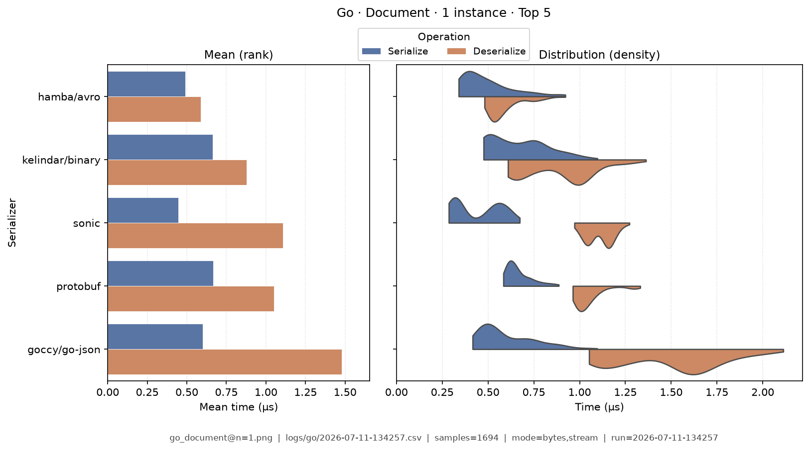
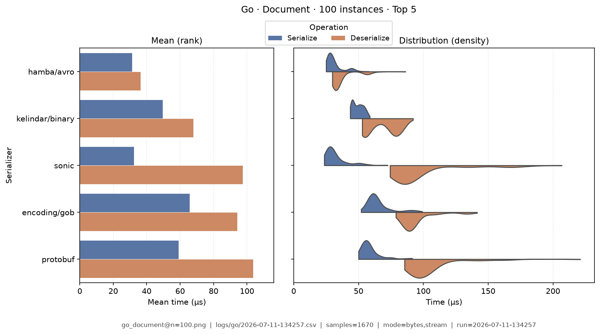
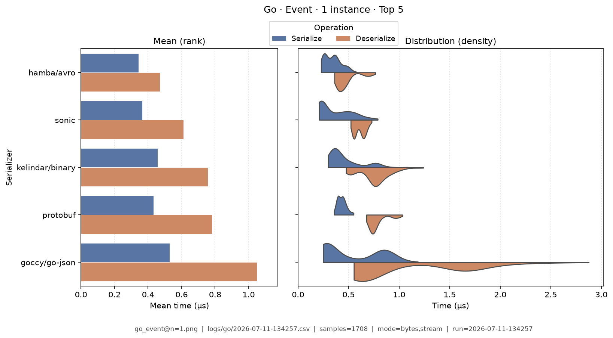
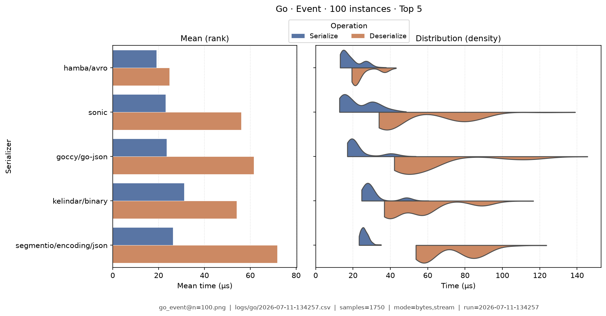
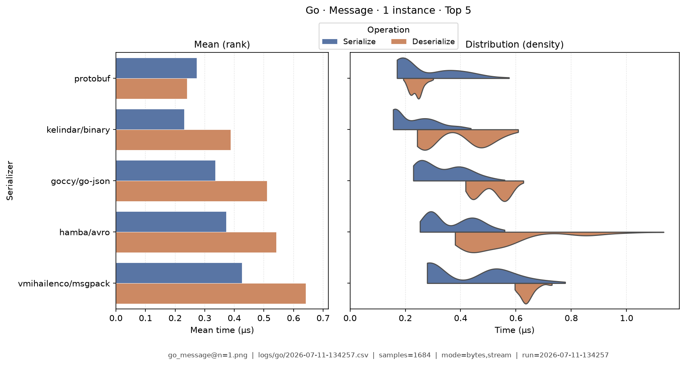
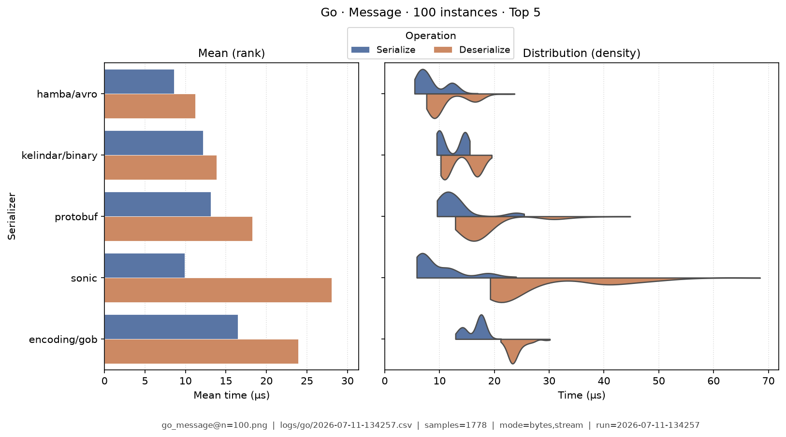
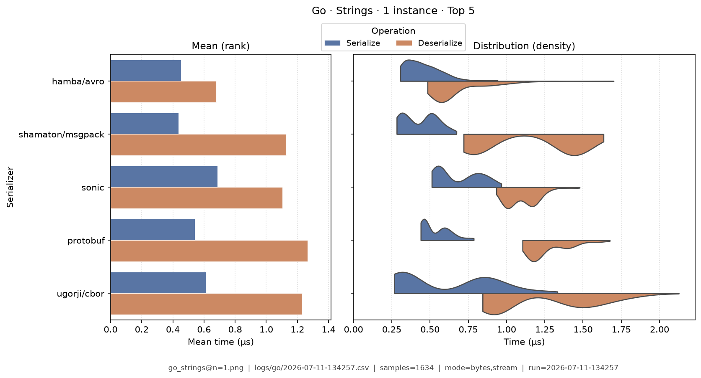
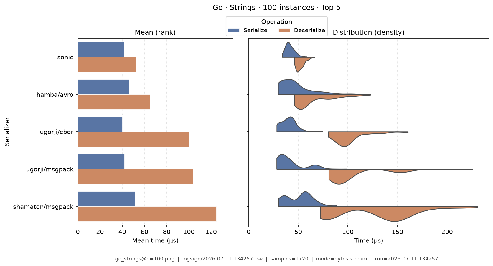
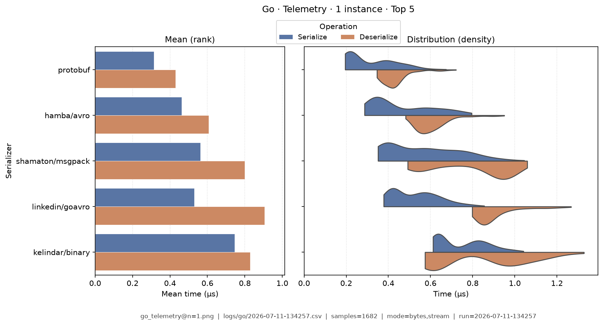
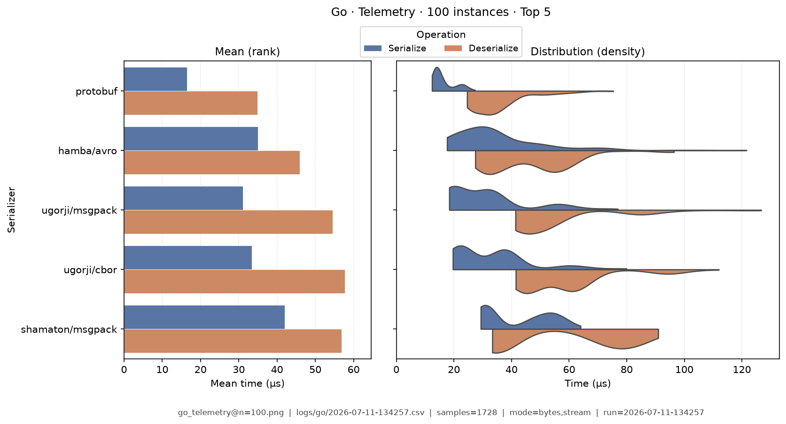

# Go — Benchmark Results

**Generated:** 2026-07-11T13:43:20.563365

Published **local snapshot** (not regenerated by GitHub Actions). Numbers may differ if you re-run benchmarks on another machine.

Serializer inventory and caveats: [Go overview](index.md). Methods: [Analysis Methodology](../analysis/ANALYSIS_METHODOLOGY.md). Metric definitions & importance tiers: [Metrics catalog](../analysis/METRICS.md).

## Pivot tables

Multi-way leaderboards emphasize **high-importance** metrics (configurable via `metrics.multi_way` in master config). Harness **modes** (CSV `StringOrStream`): **bytes mode** = in-memory buffer API; **stream mode** = write/read through a stream-like path. These names are *not* payload sizes. In each table, rows are sorted by **serializer name**; **bold** marks the semantic best value in that column (lowest time; highest ops/s). Ties are all bolded. Latency tables are in **microseconds** (µs). Batch fixtures show as **Type · N instances** (from `DataTypeInstanceCount`; e.g. Message · 100 instances).

### Summary

Default multi-serializer view shows **high-importance** metrics only ([METRICS.md](../analysis/METRICS.md)). Rows are sorted by **serializer name**. **Bold** marks the semantic best value in each column (lowest latency / size; highest ops/s). Pairwise / version A/B reports use the full metric set. Latency cells are **µs** (analysis storage remains ns).

| serializer | Median total (µs) | Median ser (µs) | Median deser (µs) | Ops/s (from mean) | Median size (B) | Samples | Fidelity |
|---|---|---|---|---|---|---|---|
| encoding/gob:go1.24.13 | 66.7 | 23.2 | 43.1 | 46.5K | 10.3K | 1721 | **1.00** |
| encoding/json:go1.24.13 | 251 | 47.6 | 202 | 94.2K | 19.7K | 1683 | **1.00** |
| fxamacker/cbor:2.9.2 | 103 | 21.3 | 81.6 | 204K | 13.6K | 1719 | **1.00** |
| goccy/go-json:0.10.6 | 103 | 37.5 | 65.1 | 325K | 19.7K | 1697 | **1.00** |
| goccy/go-yaml:1.19.2 | 4,630 | 2,120 | 2,490 | 7.58K | 22K | 1760 | **1.00** |
| hamba/avro:2.31.0 | **31.1** | **13.5** | **17.3** | 532K | 9.11K | 1741 | **1.00** |
| jsoniter:1.1.12 | 140 | 47.3 | 92.2 | 238K | 19.7K | 1664 | **1.00** |
| kelindar/binary:1.0.19 | 57.3 | 24.7 | 32.5 | 457K | **8.97K** | 1735 | **1.00** |
| linkedin/goavro:2.15.0 | 87.6 | 21.6 | 65.5 | 301K | 9.02K | 1682 | **1.00** |
| mongo-bson:1.17.9 | 180 | 58.1 | 120 | 131K | 20.7K | 1682 | **1.00** |
| pelletier/go-toml:2.4.3 | 302 | 108 | 193 | 105K | 22.2K | 1681 | **1.00** |
| protobuf:1.36.11 | 53.2 | 17.6 | 35.6 | **544K** | 10.1K | 1713 | **1.00** |
| segmentio/encoding/json:0.5.4 | 117 | 38.1 | 79 | 170K | 19.7K | 1706 | **1.00** |
| shamaton/msgpack:3.1.2 | 73.9 | 27.6 | 45.3 | 286K | 13.3K | 1728 | **1.00** |
| sonic:1.15.2 | 52.9 | 20.2 | 32.5 | 346K | 19.7K | 1670 | **1.00** |
| ugorji/cbor:1.3.1 | 61.1 | 19.7 | 41.2 | 232K | 13.6K | 1731 | **1.00** |
| ugorji/json:1.3.1 | 139 | 49.5 | 89.4 | 176K | 19.7K | 1697 | **1.00** |
| ugorji/msgpack:1.3.1 | 56.5 | 18.4 | 38.2 | 255K | 13.6K | 1727 | **1.00** |
| vmihailenco/msgpack:5.4.1 | 109 | 42.7 | 66.4 | 235K | 14.2K | 1719 | **1.00** |


### Total Time

| serializer | bytes mode/mean | bytes mode/median | stream mode/mean | stream mode/median |
|---|---|---|---|---|
| encoding/gob:go1.24.13 | 11.5 | 11.4 | 11.3 | 11.2 |
| encoding/json:go1.24.13 | 3.7 | 3.71 | 2.49 | 2.3 |
| fxamacker/cbor:2.9.2 | 1.02 | 1.02 | 2.11 | 2.24 |
| goccy/go-json:0.10.6 | 0.722 | 0.706 | 0.97 | 0.96 |
| goccy/go-yaml:1.19.2 | 36.8 | 36.5 | 37 | 36.7 |
| hamba/avro:2.31.0 | 0.726 | 0.723 | 1.1 | 1.04 |
| jsoniter:1.1.12 | 1.16 | 1.16 | 1.35 | 1.24 |
| kelindar/binary:1.0.19 | 0.432 | 0.431 | 0.78 | 0.766 |
| linkedin/goavro:2.15.0 | 1.01 | 1.18 | 1.18 | 1.23 |
| mongo-bson:1.17.9 | 1.77 | 1.76 | 1.85 | 1.84 |
| pelletier/go-toml:2.4.3 | 2.62 | 2.56 | 2.74 | 2.72 |
| protobuf:1.36.11 | **0.413** | **0.414** | **0.619** | **0.617** |
| segmentio/encoding/json:0.5.4 | 1.59 | 1.76 | 4.28 | 4.65 |
| shamaton/msgpack:3.1.2 | 1.32 | 1.32 | 1.99 | 1.97 |
| sonic:1.15.2 | 1.26 | 1.66 | 2.16 | 2.16 |
| ugorji/cbor:1.3.1 | 0.979 | 0.753 | 2.16 | 2.07 |
| ugorji/json:1.3.1 | 1.23 | 1.2 | 2.83 | 2.77 |
| ugorji/msgpack:1.3.1 | 1.38 | 1.38 | 2.55 | 2.3 |
| vmihailenco/msgpack:5.4.1 | 0.933 | 0.93 | 1.2 | 1.17 |


### Ops/Sec

| serializer | Document · 1 instance | Document · 100 instances | Event · 1 instance | Event · 100 instances | Message · 1 instance | Message · 100 instances | Strings · 1 instance | Strings · 100 instances | Telemetry · 1 instance | Telemetry · 100 instances |
|---|---|---|---|---|---|---|---|---|---|---|
| encoding/gob:go1.24.13 | 0.07M | 6K | 0.081M | 11K | 0.087M | 24K | 100K | 7.4K | 0.085M | 7.4K |
| encoding/json:go1.24.13 | 0.11M | 1.7K | 0.27M | 3.1K | 0.27M | 5.7K | 88K | 2K | 0.12M | 1.1K |
| fxamacker/cbor:2.9.2 | 0.3M | 3.2K | 0.29M | 6K | 0.98M | 15K | 440K | 4.6K | 0.27M | 5.9K |
| goccy/go-json:0.10.6 | 0.59M | 5.7K | 1.2M | 15K | 1.4M | 19K | 490K | 5.8K | 0.22M | 2K |
| goccy/go-yaml:1.19.2 | 0.0079M | 0.06K | 0.015M | 0.13K | 0.027M | 0.24K | 11K | 0.12K | 0.011M | 0.099K |
| hamba/avro:2.31.0 | **1.1M** | **17K** | **1.5M** | **28K** | 1.4M | 44K | **910K** | 10K | 1.1M | 14K |
| jsoniter:1.1.12 | 0.39M | 4.8K | 0.37M | 8.1K | 0.86M | 9.1K | 580K | 4.6K | 0.14M | 1.4K |
| kelindar/binary:1.0.19 | 0.81M | 9.7K | 0.84M | 15K | 2.3M | **48K** | 610K | 5.4K | 0.8M | 6.8K |
| linkedin/goavro:2.15.0 | 0.42M | 3.8K | 0.61M | 7K | 0.99M | 21K | 440K | 3.1K | 0.76M | 6.3K |
| mongo-bson:1.17.9 | 0.16M | 1.9K | 0.16M | 3.3K | 0.56M | 8.9K | 240K | 2.3K | 0.23M | 2.3K |
| pelletier/go-toml:2.4.3 | 0.1M | 0.96K | 0.19M | 2K | 0.38M | 4.5K | 260K | 2.3K | 0.12M | 1.2K |
| protobuf:1.36.11 | 0.62M | 6.2K | 0.83M | 8.6K | **2.4M** | 36K | 590K | 5.3K | **1.6M** | **21K** |
| segmentio/encoding/json:0.5.4 | 0.54M | 5.8K | 0.74M | 12K | 0.63M | 17K | 400K | 5.5K | 0.2M | 2K |
| shamaton/msgpack:3.1.2 | 0.42M | 4.1K | 0.38M | 7.2K | 0.76M | 16K | 890K | 7.3K | 0.95M | 15K |
| sonic:1.15.2 | 0.73M | 8.9K | 1.3M | 13K | 0.79M | 21K | 630K | **11K** | 0.52M | 4.1K |
| ugorji/cbor:1.3.1 | 0.43M | 5.2K | 0.32M | 9.6K | 1M | 24K | 800K | 7.2K | 0.42M | 15K |
| ugorji/json:1.3.1 | 0.21M | 3.7K | 0.61M | 6.7K | 0.81M | 7.3K | 540K | 5.4K | 0.18M | 1.7K |
| ugorji/msgpack:1.3.1 | 0.48M | 4.5K | 0.36M | 10K | 0.72M | 25K | 660K | 8.3K | 1.1M | 16K |
| vmihailenco/msgpack:5.4.1 | 0.18M | 3.2K | 0.26M | 5.8K | 1.1M | 11K | 600K | 6.4K | 0.39M | 4.3K |

## Latency distributions

Each figure pairs **mean bars** (left: ser / deser mean µs, linear from 0) with **split violins** (right: full sample density, linear from 0). **Top 5 serializers by mean total time** per fixture (display only; tables list all). Provenance (fixture, CSV path, modes, *n*) is printed on each image.

### Document · 1 instance

{ width="80%" }

### Document · 100 instances

{ width="80%" }

### Event · 1 instance

{ width="80%" }

### Event · 100 instances

{ width="80%" }

### Message · 1 instance

{ width="80%" }

### Message · 100 instances

{ width="80%" }

### Strings · 1 instance

{ width="80%" }

### Strings · 100 instances

{ width="80%" }

### Telemetry · 1 instance

{ width="80%" }

### Telemetry · 100 instances

{ width="80%" }

## Regenerate

Published snapshots are produced **locally** (not by GitHub Actions). After running benchmarks (each run creates a timestamped `YYYY-MM-DD-HHMMSS.csv`):

```bash
analyze-benchmarks              # all languages
analyze-benchmarks -l go   # this language only
```

That refreshes this language's results tables and latency distributions under `docs/analysis/plots/violin/`. The hub [Benchmark Results](../analysis/BENCHMARK_SUMMARY.md) is a **static** index and is not rewritten. Commit the updated `results.md` / plot paths as needed.


## Run configuration (important)

??? note "Show host, seed, serializers, and source CSV"

    Key fields from the run sidecar (`*.configs.json`, or legacy `*.environment.json`). Full metric definitions: [Metrics catalog](../analysis/METRICS.md). Optional blocks (`dataset`, `serializers`) appear only when captured.
    
    - **Source CSV:** `/home/leo/PycharmProjects/GLD/seriailizer-benchmark/logs/go/2026-07-11-134257.csv`
    - run=2026-07-11-134257
    - language=go
    - os=Linux 6.8.0-124-generic
    - cpu=12th Gen Intel(R) Core(TM) i7-12800H (20 threads)
    - ram=31.0 GiB
    - runtimes: go=go version go1.23.6 linux/amd64, python=3.14.0, node=24.15.0
    - git=0dce770 dirty
    - seed=42
    - warmup_reps=1
    - serializers=19
    - metrics_profile=multi_way
    - **Fixtures (config):** message, document, telemetry, strings, event
    - **Serializers (from CSV):**
      - `encoding/gob` @ go1.24.13
      - `encoding/json` @ go1.24.13
      - `fxamacker/cbor` @ 2.9.2
      - `goccy/go-json` @ 0.10.6
      - `goccy/go-yaml` @ 1.19.2
      - `hamba/avro` @ 2.31.0
      - `jsoniter` @ 1.1.12
      - `kelindar/binary` @ 1.0.19
      - `linkedin/goavro` @ 2.15.0
      - `mongo-bson` @ 1.17.9
      - `pelletier/go-toml` @ 2.4.3
      - `protobuf` @ 1.36.11
      - `segmentio/encoding/json` @ 0.5.4
      - `shamaton/msgpack` @ 3.1.2
      - `sonic` @ 1.15.2
      - `ugorji/cbor` @ 1.3.1
      - `ugorji/json` @ 1.3.1
      - `ugorji/msgpack` @ 1.3.1
      - `vmihailenco/msgpack` @ 5.4.1
