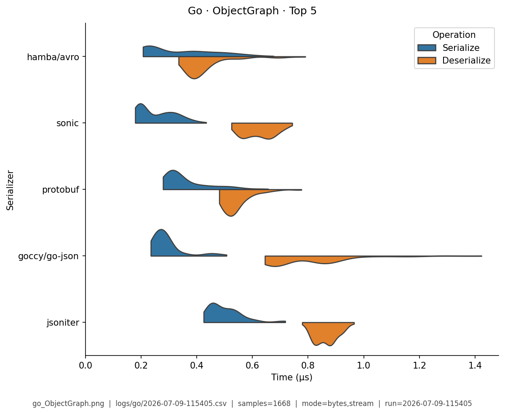

# Go — Benchmark Results

**Generated:** 2026-07-09T11:56:41.362351

Published **local snapshot** (not regenerated by GitHub Actions). Numbers may differ if you re-run benchmarks on another machine.

Serializer inventory and caveats: [Go overview](index.md). Methods: [Analysis Methodology](../analysis/ANALYSIS_METHODOLOGY.md). Metric definitions & importance tiers: [Metrics catalog](../analysis/METRICS.md).

## Pivot tables

Multi-way leaderboards emphasize **high-importance** metrics (configurable via `metrics.multi_way` in master config). Harness **modes** (CSV `StringOrStream`): **bytes mode** = in-memory buffer API; **stream mode** = write/read through a stream-like path. These names are *not* payload sizes. In each table, **bold** marks the semantic best value in that column (lowest time; highest ops/s). Ties are all bolded. Latency tables are in **microseconds** (µs).

### Summary

Default multi-serializer view shows **high-importance** metrics only ([METRICS.md](../analysis/METRICS.md)). **Primary rank:** median total latency (lower is better). Pairwise / version A/B reports use the full metric set. Latency cells are **µs** (analysis storage remains ns).

| serializer | Median total (µs) | Median ser (µs) | Median deser (µs) | Ops/s (from mean) | Median size (B) | Samples | Fidelity |
|---|---|---|---|---|---|---|---|
| hamba/avro:2.31.0 | **1.37** | **0.548** | **0.809** | **1.39M** | **333.4** | 1177 | **1.00** |
| protobuf:1.36.11 | 2.33 | 0.88 | 1.46 | 841K | 418.2 | 986 | **1.00** |
| shamaton/msgpack:3.1.2 | 2.54 | 1.14 | 1.38 | 758K | 564.9 | 1137 | **1.00** |
| sonic:1.15.2 | 2.93 | 1.05 | 1.86 | 968K | 838.4 | 1184 | **1.00** |
| fxamacker/cbor:2.9.2 | 4.26 | 0.991 | 3.26 | 633K | 564.9 | 1201 | **1.00** |
| vmihailenco/msgpack:5.4.1 | 5.13 | 1.94 | 3.18 | 518K | 575.3 | 1168 | **1.00** |
| goccy/go-json:0.10.6 | 5.17 | 2.01 | 3.11 | 943K | 838.4 | 1215 | **1.00** |
| jsoniter:1.1.12 | 6.61 | 2.26 | 4.34 | 854K | 838.4 | 1168 | **1.00** |
| segmentio/encoding/json:0.5.4 | 6.9 | 2.01 | 4.83 | 464K | 838.4 | 1128 | **1.00** |
| mongo-bson:1.17.9 | 7.42 | 2.4 | 5.02 | 345K | 805.4 | 1195 | **1.00** |
| encoding/json:go1.24.13 | 11.9 | 2.76 | 8.97 | 378K | 838.4 | 1154 | **1.00** |
| encoding/gob:go1.24.13 | 16 | 3.14 | 12.8 | 63.9K | 540.4 | 1196 | **1.00** |


### Total Time

| serializer | bytes mode/mean | bytes mode/median | stream mode/mean | stream mode/median |
|---|---|---|---|---|
| hamba/avro:2.31.0 | **0.744** | **0.726** | **1.07** | **0.977** |
| protobuf:1.36.11 | 2.4 | 2.4 | 2.6 | 2.56 |
| shamaton/msgpack:3.1.2 | 2.26 | 2.14 | 2.21 | 2.19 |
| sonic:1.15.2 | 2.45 | 2.43 | 4.19 | 4.67 |
| fxamacker/cbor:2.9.2 | 2.37 | 2.34 | 3.08 | 2.61 |
| vmihailenco/msgpack:5.4.1 | 6.02 | 6.59 | 4.97 | 4.84 |
| goccy/go-json:0.10.6 | 2.35 | 2.36 | 2.78 | 2.83 |
| jsoniter:1.1.12 | 2.83 | 2.82 | 3.19 | 3.11 |
| segmentio/encoding/json:0.5.4 | 2.91 | 2.9 | 7.94 | 7.36 |
| mongo-bson:1.17.9 | 4.53 | 4.52 | 5.76 | 4.89 |
| encoding/json:go1.24.13 | 6.89 | 6.89 | 6.36 | 6.06 |
| encoding/gob:go1.24.13 | 19.5 | 16.5 | 15.3 | 15.3 |


### Ops/Sec

| serializer | EDI_835 | Integer | ObjectGraph | Person | SimpleObject | StringArray | Telemetry |
|---|---|---|---|---|---|---|---|
| encoding/gob:go1.24.13 | 51K | 0.076M | 0.066M | 0.051M | 0.099M | 45K | 50K |
| encoding/json:go1.24.13 | 41K | 1.9M | 0.2M | 0.15M | 0.42M | 72K | 34K |
| fxamacker/cbor:2.9.2 | 120K | 3.6M | 0.54M | 0.42M | 0.51M | 160K | 190K |
| goccy/go-json:0.10.6 | 110K | 4M | 1.1M | 0.42M | 2.7M | 170K | 66K |
| hamba/avro:2.31.0 | **290K** | **4.6M** | **1.6M** | **1.3M** | **3.3M** | **510K** | **710K** |
| jsoniter:1.1.12 | 76K | 4.1M | 0.77M | 0.35M | 1.8M | 210K | 46K |
| mongo-bson:1.17.9 | 64K | 0.6M | 0.15M | 0.22M | 0.95M | 65K | 110K |
| protobuf:1.36.11 | 280K | - | 1.2M | 0.42M | 2.8M | 230K | 580K |
| segmentio/encoding/json:0.5.4 | 110K | 2.1M | 0.78M | 0.34M | 1.6M | 210K | 72K |
| shamaton/msgpack:3.1.2 | 170K | 3.4M | 0.6M | 0.44M | 0.77M | 350K | 370K |
| sonic:1.15.2 | 210K | 3.5M | 1.3M | 0.41M | 2.6M | 180K | 190K |
| vmihailenco/msgpack:5.4.1 | 100K | 2.7M | 0.29M | 0.17M | 0.63M | 110K | 160K |

## Violin plots

Density of serialize / deserialize timings (µs; log scale when medians span ≥5×). **Each plot shows only the top 5 serializers by mean total time** for that fixture (same rule for every language). Full rankings are in the pivot tables above. Provenance (fixture, CSV path, modes, *n*) is printed on each image.

### EDI_835

{ width="80%" }

### Integer

{ width="80%" }

### ObjectGraph

{ width="80%" }

### Person

{ width="80%" }

### SimpleObject

{ width="80%" }

### StringArray

{ width="80%" }

### Telemetry

{ width="80%" }

## Regenerate

Published snapshots are produced **locally** (not by GitHub Actions). After running benchmarks (each run creates a timestamped `YYYY-MM-DD-HHMMSS.csv`):

```bash
analyze-benchmarks              # all languages
analyze-benchmarks -l go   # this language only
```

That refreshes this language's results tables and violin plots under `docs/analysis/plots/violin/`. The hub [Benchmark Results](../analysis/BENCHMARK_SUMMARY.md) is a **static** index and is not rewritten. Commit the updated `results.md` / plot paths as needed.


## Run configuration (important)

??? note "Show host, seed, serializers, and source CSV"

    Key fields from the run sidecar (`*.configs.json`, or legacy `*.environment.json`). Full metric definitions: [Metrics catalog](../analysis/METRICS.md). Optional blocks (`dataset`, `serializers`) appear only when captured.
    
    - **Source CSV:** `../logs/go/2026-07-09-115405.csv`
    - run=2026-07-09-115405
    - language=go
    - os=Linux 6.8.0-124-generic
    - cpu=12th Gen Intel(R) Core(TM) i7-12800H (20 threads)
    - ram=31.0 GiB
    - runtimes: go=go version go1.23.6 linux/amd64, python=3.14.0, node=24.15.0
    - git=8d8ab58 dirty
    - seed=42
    - warmup_reps=1
    - serializers=12
    - metrics_profile=multi_way
    - **Fixtures (config):** Person, Integer, Telemetry, SimpleObject, StringArray, EDI_835, ObjectGraph
    - **Serializers (from CSV):**
      - `encoding/gob` @ go1.24.13
      - `encoding/json` @ go1.24.13
      - `fxamacker/cbor` @ 2.9.2
      - `goccy/go-json` @ 0.10.6
      - `hamba/avro` @ 2.31.0
      - `jsoniter` @ 1.1.12
      - `mongo-bson` @ 1.17.9
      - `protobuf` @ 1.36.11
      - `segmentio/encoding/json` @ 0.5.4
      - `shamaton/msgpack` @ 3.1.2
      - `sonic` @ 1.15.2
      - `vmihailenco/msgpack` @ 5.4.1
