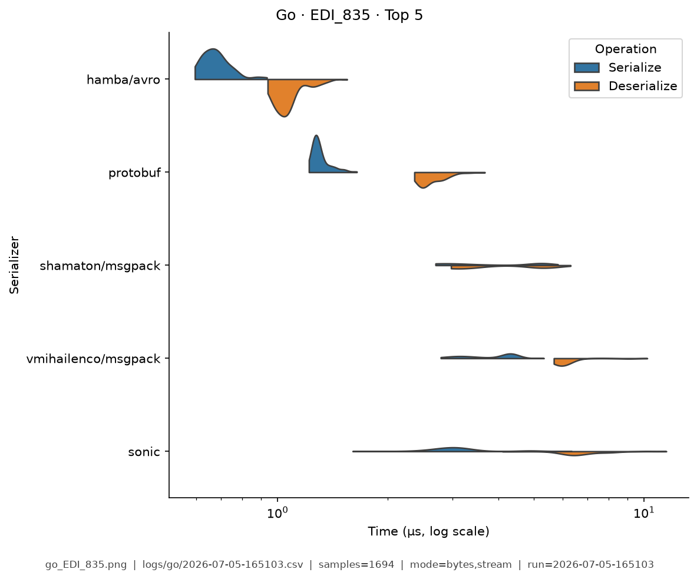
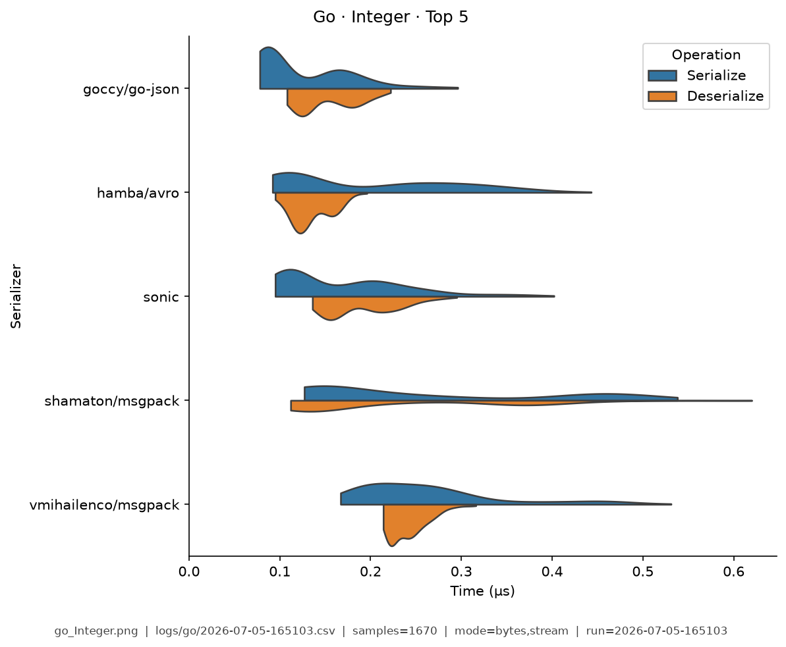
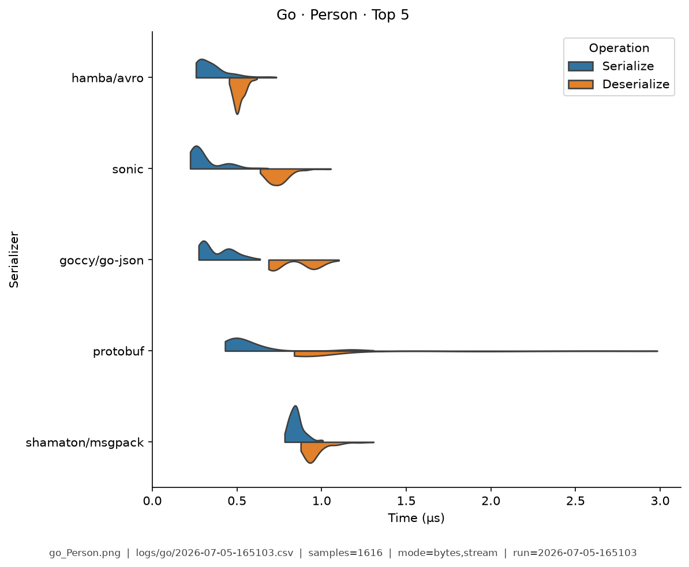
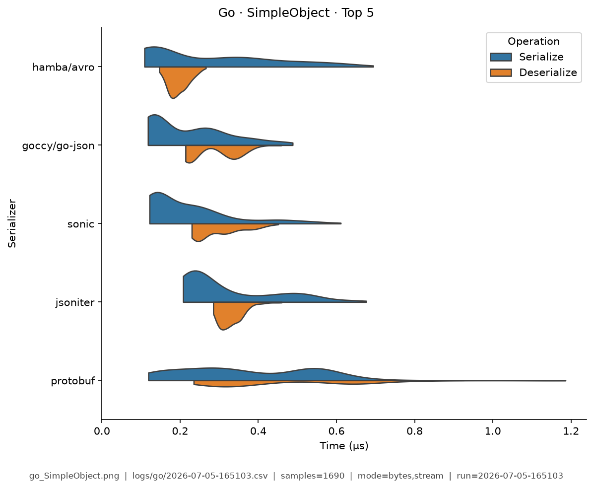
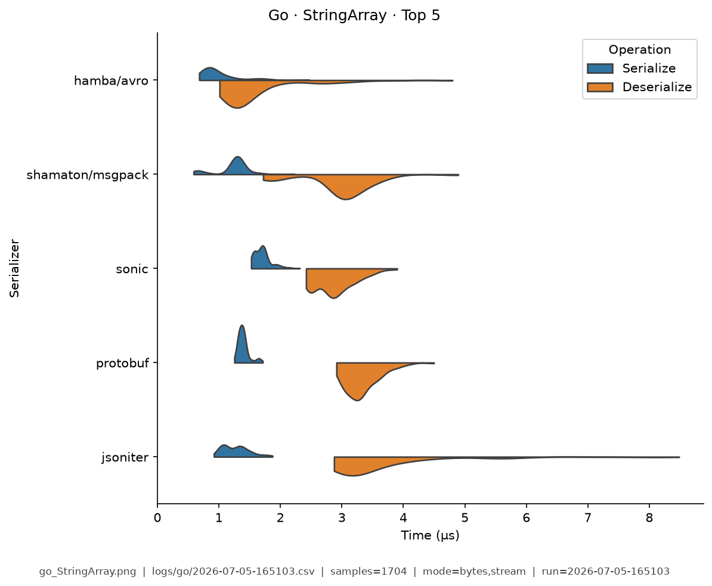
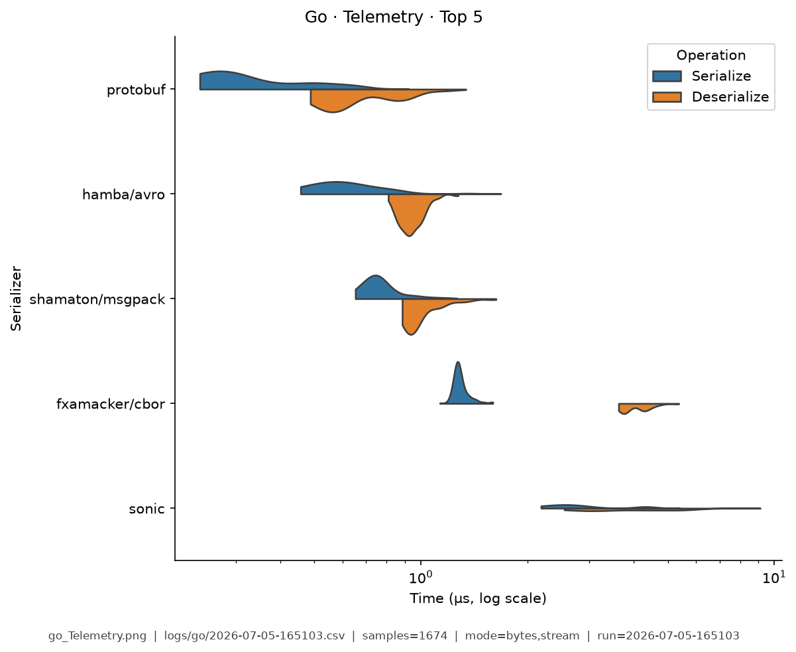

# Go — Benchmark Results

**Generated:** 2026-07-05T16:51:47.121214

Published **local snapshot** (not regenerated by GitHub Actions). Numbers may differ if you re-run benchmarks on another machine.

Serializer inventory and caveats: [Go overview](index.md). Methods: [Analysis Methodology](../analysis/ANALYSIS_METHODOLOGY.md). Metric definitions & importance tiers: [Metrics catalog](../analysis/METRICS.md).

## Pivot tables

Multi-way leaderboards emphasize **high-importance** metrics (configurable via `metrics.multi_way` in master config). Harness **modes** (CSV `StringOrStream`): **bytes mode** = in-memory buffer API; **stream mode** = write/read through a stream-like path. These names are *not* payload sizes. In each table, **bold** marks the semantic best value in that column (lowest time; highest ops/s). Ties are all bolded. Latency tables are in **microseconds** (µs).

### Summary

Default multi-serializer view shows **high-importance** metrics only ([METRICS.md](../analysis/METRICS.md)). **Primary rank:** median total latency (lower is better). Pairwise / version A/B reports use the full metric set. Latency cells are **µs** (analysis storage remains ns).

| serializer | Median total (µs) | Median ser (µs) | Median deser (µs) | Ops/s (from mean) | Median size (B) | Samples | Fidelity |
|---|---|---|---|---|---|---|---|
| hamba/avro:2.31.0 | **1.19** | **0.484** | **0.685** | **1.42M** | **383** | 987 | **1.00** |
| protobuf:1.36.11 | 2.4 | 0.801 | 1.58 | 659K | 490.2 | 856 | **1.00** |
| shamaton/msgpack:3.1.2 | 2.97 | 1.29 | 1.66 | 834K | 636.7 | 993 | **1.00** |
| sonic:1.15.2 | 4.13 | 1.4 | 2.52 | 1.08M | 946.7 | 1037 | **1.00** |
| vmihailenco/msgpack:5.4.1 | 4.53 | 1.8 | 2.72 | 634K | 642.8 | 1010 | **1.00** |
| fxamacker/cbor:2.9.2 | 4.87 | 1.16 | 3.71 | 440K | 636.7 | 992 | **1.00** |
| goccy/go-json:0.10.6 | 6.41 | 2.49 | 3.89 | 1.2M | 946.7 | 978 | **1.00** |
| segmentio/encoding/json:0.5.4 | 7.41 | 2.44 | 4.94 | 477K | 946.7 | 991 | **1.00** |
| mongo-bson:1.17.9 | 8.1 | 2.61 | 5.45 | 401K | 900.7 | 1000 | **1.00** |
| jsoniter:1.1.12 | 9.18 | 3.31 | 5.85 | 804K | 946.7 | 1003 | **1.00** |
| encoding/json:go1.24.13 | 12.6 | 2.74 | 9.87 | 325K | 946.7 | 1041 | **1.00** |
| encoding/gob:go1.24.13 | 14.7 | 2.95 | 11.6 | 74.5K | 593.5 | 1017 | **1.00** |


### Total Time

| serializer | bytes mode/mean | bytes mode/median | stream mode/mean | stream mode/median |
|---|---|---|---|---|
| hamba/avro:2.31.0 | **0.784** | **0.781** | **0.947** | **0.91** |
| protobuf:1.36.11 | 1.35 | 1.35 | 1.95 | 1.54 |
| shamaton/msgpack:3.1.2 | 1.82 | 1.76 | 1.81 | 1.8 |
| sonic:1.15.2 | 0.944 | 0.94 | 1.17 | 1.15 |
| vmihailenco/msgpack:5.4.1 | 2.75 | 2.78 | 3.14 | 3.12 |
| fxamacker/cbor:2.9.2 | 2.29 | 2.29 | 4.27 | 4.26 |
| goccy/go-json:0.10.6 | 1.02 | 1.01 | 1.43 | 1.42 |
| segmentio/encoding/json:0.5.4 | 1.36 | 1.35 | 3.21 | 3.02 |
| mongo-bson:1.17.9 | 4.13 | 4.12 | 4.51 | 4.42 |
| jsoniter:1.1.12 | 3.25 | 3.14 | 1.79 | 1.78 |
| encoding/json:go1.24.13 | 5.28 | 4.85 | 8.46 | 8.42 |
| encoding/gob:go1.24.13 | 22.4 | 24.7 | 15 | 14.9 |


### Ops/Sec

| serializer | EDI_835 | Integer | Person | SimpleObject | StringArray | Telemetry |
|---|---|---|---|---|---|---|
| encoding/gob:go1.24.13 | 49K | 0.12M | 0.045M | 0.064M | 73K | 0.067M |
| encoding/json:go1.24.13 | 40K | 0.88M | 0.19M | 0.83M | 62K | 0.032M |
| fxamacker/cbor:2.9.2 | 80K | 1.3M | 0.44M | 0.88M | 160K | 0.2M |
| goccy/go-json:0.10.6 | 110K | **4.8M** | 0.98M | 2.8M | 200K | 0.07M |
| hamba/avro:2.31.0 | **600K** | 4.4M | **1.3M** | **3.2M** | **360K** | 0.62M |
| jsoniter:1.1.12 | 44K | 4M | 0.31M | 1.8M | 200K | 0.039M |
| mongo-bson:1.17.9 | 69K | 1.6M | 0.24M | 0.44M | 94K | 0.051M |
| protobuf:1.36.11 | 260K | - | 0.74M | 1M | 210K | **1.1M** |
| segmentio/encoding/json:0.5.4 | 110K | 2M | 0.74M | 1.6M | 230K | 0.073M |
| shamaton/msgpack:3.1.2 | 160K | 3.8M | 0.55M | 0.94M | 230K | 0.59M |
| sonic:1.15.2 | 93K | 3.7M | 1.1M | 2.6M | 230K | 0.13M |
| vmihailenco/msgpack:5.4.1 | 100K | 2.2M | 0.36M | 1.5M | 240K | 0.13M |

## Violin plots

Density of serialize / deserialize timings (µs; log scale when medians span ≥5×). **Each plot shows only the top 5 serializers by mean total time** for that fixture (same rule for every language). Full rankings are in the pivot tables above. Provenance (fixture, CSV path, modes, *n*) is printed on each image.

### EDI_835

{ width="80%" }

### Integer

{ width="80%" }

### Person

{ width="80%" }

### SimpleObject

{ width="80%" }

### StringArray

{ width="80%" }

### Telemetry

{ width="80%" }

## Regenerate

Published snapshots are produced **locally** (not by GitHub Actions). After running benchmarks (each run creates a timestamped `YYYY-MM-DD-HHMMSS.csv`):

```bash
analyze-benchmarks              # all languages
analyze-benchmarks -l go   # this language only
```

That refreshes this language's results tables and violin plots under `docs/analysis/plots/violin/`. The hub [Benchmark Results](../analysis/BENCHMARK_SUMMARY.md) is a **static** index and is not rewritten. Commit the updated `results.md` / plot paths as needed.


## Run configuration (important)

??? note "Show host, seed, serializers, and source CSV"

    Key fields from the run sidecar (`*.configs.json`, or legacy `*.environment.json`). Full metric definitions: [Metrics catalog](../analysis/METRICS.md). Optional blocks (`dataset`, `serializers`) appear only when captured.
    
    - **Source CSV:** `/home/leo/PycharmProjects/GLD/seriailizer-benchmark/logs/go/2026-07-05-165103.csv`
    - run=2026-07-05-165103
    - language=go
    - os=Linux 6.8.0-124-generic
    - cpu=12th Gen Intel(R) Core(TM) i7-12800H (20 threads)
    - ram=31.0 GiB
    - runtimes: python=3.14.0, node=24.15.0, rustc=rustc 1.96.0 (ac68faa20 2026-05-25)
    - git=b6f7420
    - seed=42
    - warmup_reps=1
    - serializers=12
    - metrics_profile=multi_way
    - **Fixtures (config):** Person, Integer, Telemetry, SimpleObject, StringArray, EDI_835, ObjectGraph
    - **Serializers (from CSV):**
      - `encoding/gob` @ go1.24.13
      - `encoding/json` @ go1.24.13
      - `fxamacker/cbor` @ 2.9.2
      - `goccy/go-json` @ 0.10.6
      - `hamba/avro` @ 2.31.0
      - `jsoniter` @ 1.1.12
      - `mongo-bson` @ 1.17.9
      - `protobuf` @ 1.36.11
      - `segmentio/encoding/json` @ 0.5.4
      - `shamaton/msgpack` @ 3.1.2
      - `sonic` @ 1.15.2
      - `vmihailenco/msgpack` @ 5.4.1
