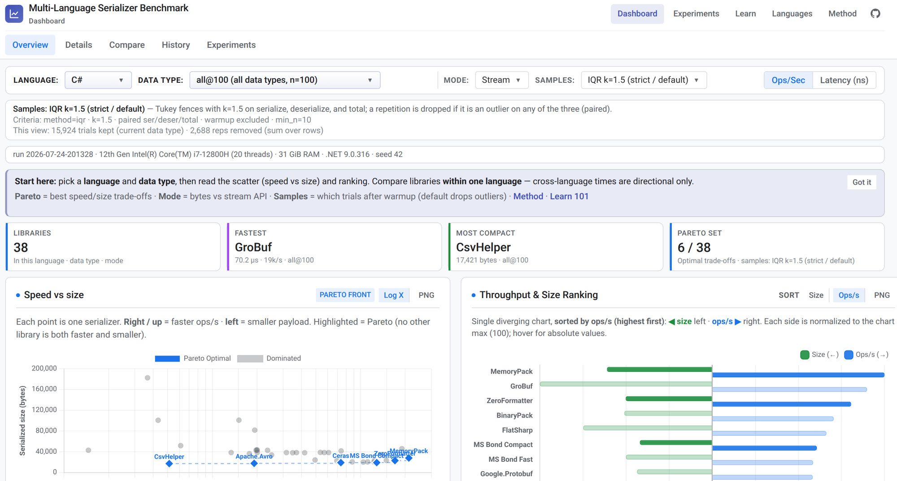

---
# No in-page title (site header has the product name). Browser tab uses site_name.
hide:
  - navigation
  - toc
  - title
---

Compare **200+** serialization libraries across **13 languages** with fair
within-language rankings—not marketing microbenchmarks.

[Open live Dashboard](dashboard/){ .md-button .md-button--primary }
[Start Serialization 101](theory/101/){ .md-button }
[How we measure](analysis/){ .md-button }

---

## What this project is

This suite runs the **same data shapes** through serializers in many programming
languages, writes a **shared CSV contract**, and analyzes results with one
statistics pipeline. Use it to compare libraries **inside one language** (and
ideally one format family), not to crown a single global winner.

| You want… | Go here |
|-----------|---------|
| Interactive charts, Pareto trade-offs, compare lab | **[Dashboard](dashboard/)** |
| One-question tests (why we do not only use the big table) | **[Experiments](experiments/)** |
| Does this library match the RFC / spec section? | **[Dashboard · Compliance](dashboard/#compliance)** (`#compliance/{lang}/{serializer}`) · [catalog notes](compliance/) |
| Course on formats and trade-offs (101–401) | **[Learn](theory/101/)** |
| Per-language runtime primer, library lists, and caveats | **[Languages](c/)** (sidebar: C, C#, C++, …) |
| Methodology, metrics, how to add a codec | **[Benchmarks](analysis/)** |

---

## Same data · same pipeline

The live **Dashboard** is the published home for measured numbers. Pick a
language and a data type, then read speed vs size and the ranking. Language
indexes list the roster and caveats.

[{ width="780" }](dashboard/)

---

## Languages

Thirteen runners share the same fixtures and analysis rules.

| Language | Serializers |
|----------|------------:|
| [C](c/) · [Dashboard](dashboard/?lang=c) | 20 |
| [C#](c-sharp/) · [Dashboard](dashboard/?lang=csharp) | 50 |
| [C++](cpp/) · [Dashboard](dashboard/?lang=cpp) | 35 |
| [Go](go/) · [Dashboard](dashboard/?lang=go) | 26 |
| [Java](java/) · [Dashboard](dashboard/?lang=java) | 27 |
| [JavaScript](javascript/) · [Dashboard](dashboard/?lang=javascript) | 25 |
| [Kotlin](kotlin/) · [Dashboard](dashboard/?lang=kotlin) | 32 |
| [Mojo](mojo/) · [Dashboard](dashboard/?lang=mojo) | 13 |
| [PHP](php/) · [Dashboard](dashboard/?lang=php) | 15 |
| [Python](python/) · [Dashboard](dashboard/?lang=python) | 23 |
| [Rust](rust/) · [Dashboard](dashboard/?lang=rust) | 22 |
| [Swift](swift/) · [Dashboard](dashboard/?lang=swift) | 14 |
| [Zig](zig/) · [Dashboard](dashboard/?lang=zig) | 17 |

C++ is 35 when `ARROW_ROOT` points at Arrow 25.0.1. Without that prefix the five Arrow rows are skipped and `sbe` still registers.

---

## Learn the ideas first (optional path)

If you are new to serialization, start with the course under **Learn**:

1. [Serialization 101](theory/101/) — what serialization is; three lenses  
2. [Serialization 201](theory/201/) — how formats work under the hood  
3. [Serialization 301](theory/301/) — production judgment  
4. [Serialization 401](theory/401/) — wire formats and labs  

Then return to the **[Dashboard](dashboard/)** with clearer questions.

---

## Honesty rules (short)

- Prefer comparisons **within one language and one standard**. A family is a teaching cut, coarser than the standard. See [Serialization categories](analysis/serialization_categories.md).  
- Implementation quality often matters more than the format brand name.  
- Payload shape changes costs a great deal.  
- Numbers on this site are from **this** suite’s runners and analysis—not a universal ranking of all software.

Full methodology: [Benchmarks overview](analysis/) · [Analysis methodology](analysis/ANALYSIS_METHODOLOGY/) · [Claims and replication](analysis/CLAIMS_AND_REPLICATION/).
