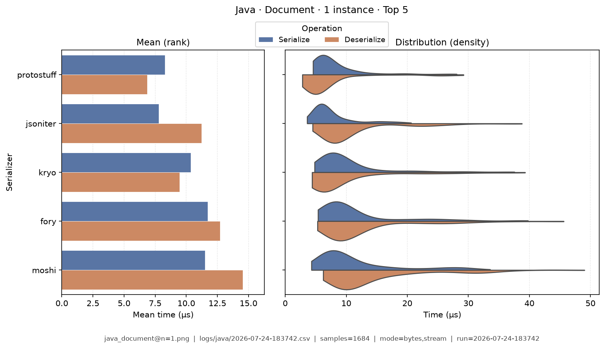
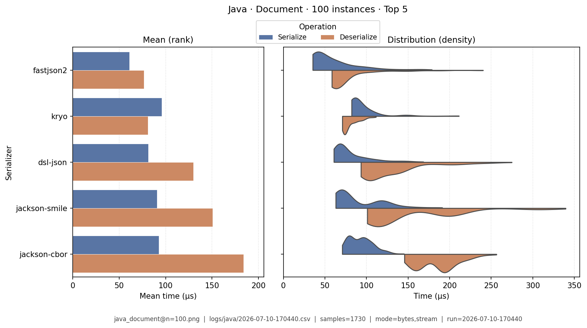
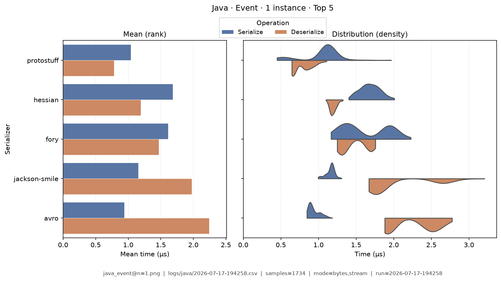
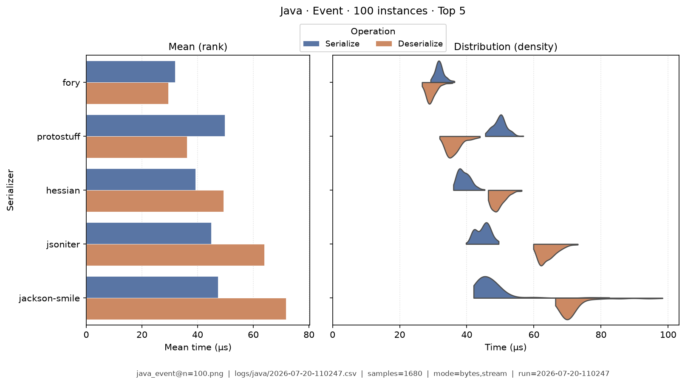
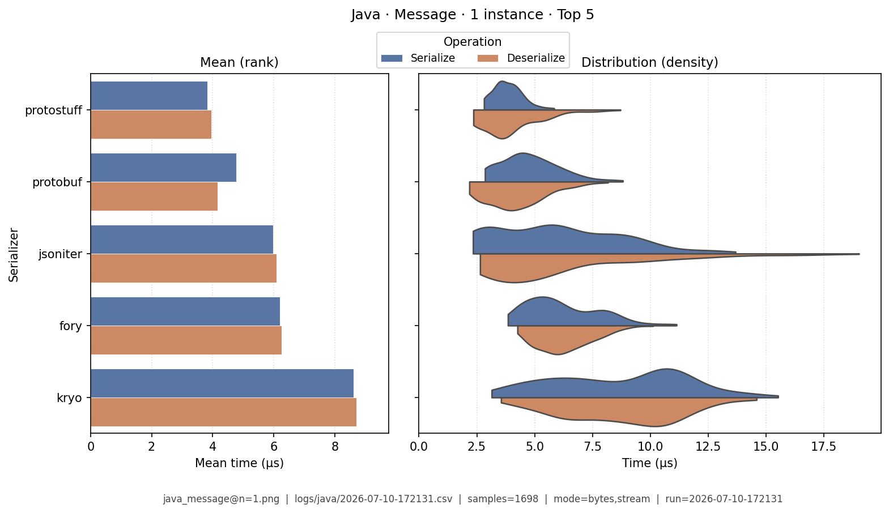
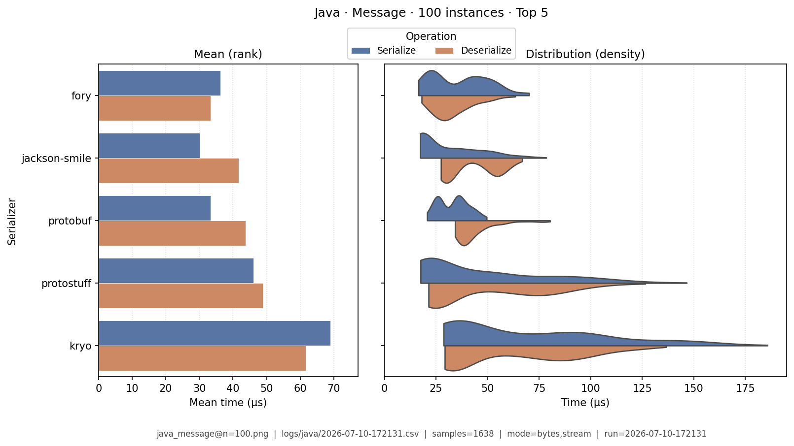
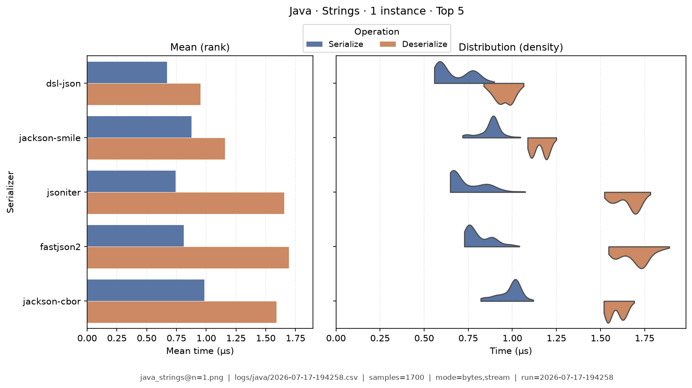
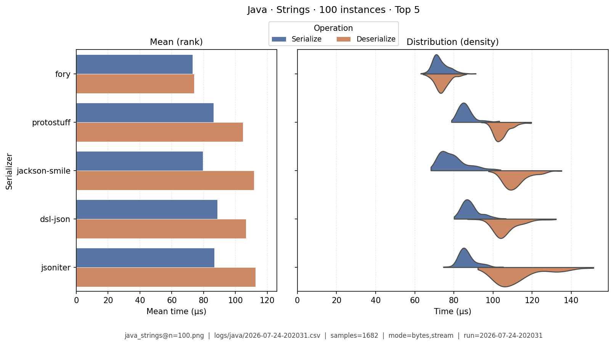
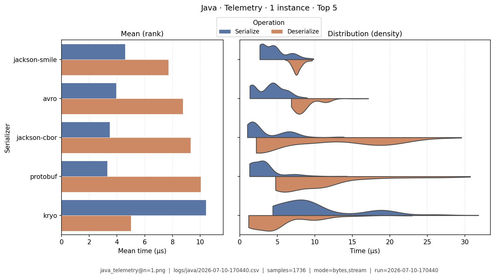
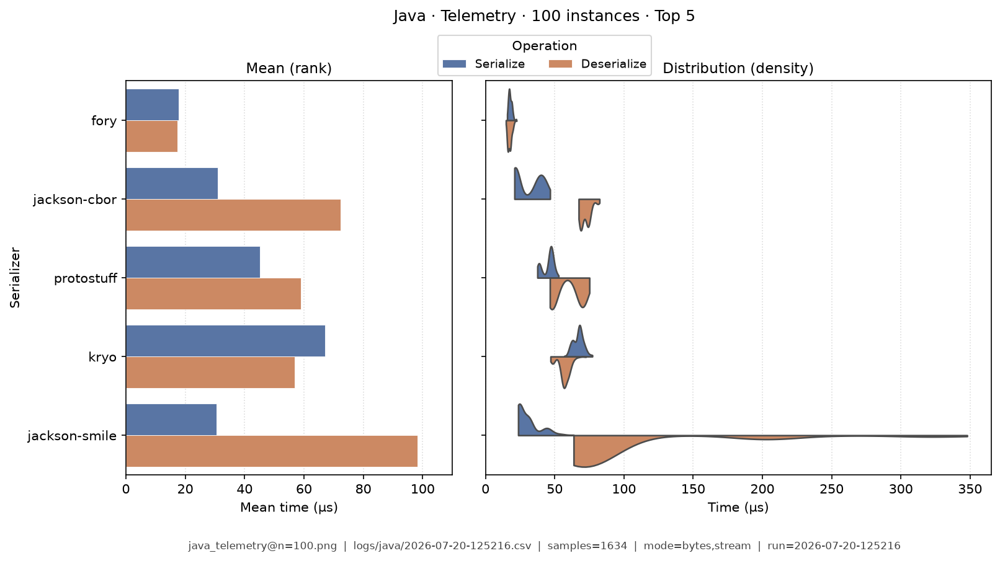

# Java — Benchmark Results

**Generated:** 2026-07-20T12:52:37.715499

This page is a **snapshot of measured numbers** for Java on one machine. Continuous integration deploys the documentation site; it does **not** re-run analysis when docs are published. Re-running benchmarks on another computer will usually change the numbers a little.

| Topic | Where to read |
|-------|---------------|
| Which libraries we measure, and caveats | [Java overview](index.md) |
| How CSVs become these tables | [Analysis methodology](../analysis/ANALYSIS_METHODOLOGY.md) |
| What each metric means | [Metrics catalog](../analysis/METRICS.md) |
| All languages’ result links | [Results summary](../analysis/BENCHMARK_SUMMARY.md) |

## How to read these tables

Compare serializers **inside this language**. Prefer the same [category](../analysis/serialization_categories.md) (for example JSON with JSON) so the comparison stays fair.

| Term | Meaning |
|------|---------|
| **bytes mode** | In-memory buffer API (encode to bytes / decode from a buffer) |
| **stream mode** | Stream-style API (write/read through a stream) |
| **µs** | Microseconds (one microsecond = 1000 nanoseconds). Tables show µs; raw CSVs store nanoseconds. |
| **Ops/s** | Operations per second from mean total time — higher is faster |
| **Bold** | Best value in that column (lowest time/size; highest ops/s). Ties are all bolded. |

Rows are sorted by **serializer name** (easy lookup), not by rank. Batch workloads appear as **Type · N instances** (for example Message · 100 instances). Default multi-serializer tables show **high-importance** metrics only; pairwise / version A/B reports can show the full set ([Metrics](../analysis/METRICS.md)).

## Summary tables

### Summary

One row per serializer (averaged across fixtures; bytes mode preferred when both exist). Only **high-importance** columns appear here by default ([Metrics catalog](../analysis/METRICS.md)). Times are **µs**. **Bold** = best in that column.

| serializer | Median total (µs) | Median ser (µs) | Median deser (µs) | Ops/s (from mean) | Median size (B) | Samples | Fidelity |
|---|---|---|---|---|---|---|---|
| avro:1.12.0 | 132 | 35.5 | 96.4 | 70K | **9.02K** | 1702 | **1.00** |
| bson:5.3.1 | 214 | 107 | 106 | 62.4K | 20.5K | 1691 | **1.00** |
| dsl-json:2.0.2 | 156 | 76.2 | 79.6 | 94.4K | 19.5K | 1734 | **1.00** |
| fastjson2:2.0.57 | 109 | 45.2 | 62.4 | 55.1K | 19.5K | 1721 | **1.00** |
| fory:1.3.0 | **45.6** | **21.7** | **23.7** | 93.6K | 9.65K | 1643 | **1.00** |
| gson:2.12.1 | 379 | 225 | 153 | 37.3K | 19.5K | 1694 | **1.00** |
| hessian:4.0.66 | 88 | 37 | 50.8 | 72.5K | 9.75K | 1700 | **1.00** |
| ion:2.18.3 | 426 | 106 | 317 | 28.3K | 19K | 1742 | **1.00** |
| jackson:2.18.3 | 253 | 77.8 | 175 | 45.3K | 19.5K | 1718 | **1.00** |
| jackson-cbor:2.18.3 | 98.6 | 32.9 | 65.4 | 82.8K | 13.6K | 1670 | **1.00** |
| jackson-smile:2.18.3 | 78.4 | 29.3 | 48.8 | 100K | 11.3K | 1667 | **1.00** |
| java-serialization:21.0.11 | 189 | 78.3 | 111 | 26.6K | 13K | 1750 | **1.00** |
| jsoniter:0.9.23 | 77.9 | 32.1 | 45.9 | 87.4K | 16.7K | 1638 | **1.00** |
| kryo:5.6.2 | 92.9 | 51.2 | 41.1 | 47.4K | 9.25K | 1717 | **1.00** |
| moshi:1.15.2 | 285 | 102 | 180 | 68.7K | 19.5K | 1750 | **1.00** |
| msgpack:0.9.8 | 155 | 63.2 | 91.3 | 65.7K | 13.3K | 1734 | **1.00** |
| protobuf:4.28.3 | 109 | 41.9 | 66.1 | 62.3K | 10.1K | 1690 | **1.00** |
| protostuff:1.8.0 | 65.9 | 33.6 | 32.7 | **101K** | 10.4K | 1659 | **1.00** |


### Total Time

| serializer | bytes mode/mean | bytes mode/median | stream mode/mean | stream mode/median |
|---|---|---|---|---|
| avro:1.12.0 | 35.6 | 36.7 | 21.6 | 20.9 |
| bson:5.3.1 | 61.6 | 52.3 | 29.7 | 29.7 |
| dsl-json:2.0.2 | 55.1 | 52.2 | 49.7 | 42.1 |
| fastjson2:2.0.57 | 33.2 | 33.2 | 27.4 | 26.5 |
| fory:1.3.0 | 14.3 | 14.4 | 12.6 | 12.8 |
| gson:2.12.1 | 62.2 | 60.2 | 136 | 132 |
| hessian:4.0.66 | 26 | 26.9 | 15.4 | 15.1 |
| ion:2.18.3 | 169 | 144 | 80.6 | 79.1 |
| jackson:2.18.3 | 113 | 106 | 67.9 | 65.3 |
| jackson-cbor:2.18.3 | 37.6 | 38.2 | 18.9 | 18.4 |
| jackson-smile:2.18.3 | 32.1 | 32.9 | 15.9 | 15.8 |
| java-serialization:21.0.11 | 80.8 | 72.3 | 52.3 | 52.6 |
| jsoniter:0.9.23 | 15.1 | 14.5 | 8.41 | **7.68** |
| kryo:5.6.2 | 23.7 | 24.1 | 12.7 | 13.1 |
| moshi:1.15.2 | 57.8 | 54.7 | 32.3 | 32.1 |
| msgpack:0.9.8 | 57.6 | 54.9 | 27 | 27.1 |
| protobuf:4.28.3 | 9.18 | **8.77** | 11.4 | 11.9 |
| protostuff:1.8.0 | **8.68** | 8.91 | **8.3** | 7.72 |


### Ops/Sec

| serializer | Document · 1 instance | Document · 100 instances | Event · 1 instance | Event · 100 instances | Message · 1 instance | Message · 100 instances | Strings · 1 instance | Strings · 100 instances | Telemetry · 1 instance | Telemetry · 100 instances |
|---|---|---|---|---|---|---|---|---|---|---|
| avro:1.12.0 | 50K | 1.5K | 210K | 6.4K | 28K | 4.5K | 320K | 3.3K | 62K | 5.5K |
| bson:5.3.1 | 62K | 1.3K | 230K | 3.6K | 16K | 2K | 240K | 2.5K | 52K | 2.8K |
| dsl-json:2.0.2 | 36K | 2.2K | 320K | 7.9K | 18K | 4K | **580K** | 5.3K | 21K | 1.8K |
| fastjson2:2.0.57 | 36K | 3.4K | 160K | 8.6K | 30K | 5.8K | 230K | 4.5K | 38K | 2.5K |
| fory:1.3.0 | **110K** | 5.6K | 280K | **20K** | 70K | **16K** | 210K | **5.9K** | **94K** | **27K** |
| gson:2.12.1 | 23K | 1.1K | 160K | 3K | 16K | 1.9K | 180K | 2.3K | 21K | 0.76K |
| hessian:4.0.66 | 87K | 2.9K | 310K | 12K | 39K | 6.1K | 170K | 4K | 60K | 6.8K |
| ion:2.18.3 | 42K | 0.92K | 120K | 2.1K | 5.9K | 1.5K | 110K | 2.1K | 13K | 0.65K |
| jackson:2.18.3 | 18K | 2.1K | 190K | 5.6K | 8.9K | 2.1K | 100K | 4.1K | 38K | 0.75K |
| jackson-cbor:2.18.3 | 37K | 3.4K | 210K | 6.3K | 27K | 5.1K | 320K | 5K | 74K | 9.1K |
| jackson-smile:2.18.3 | 75K | 3.3K | 260K | 8.6K | 31K | 6.4K | 410K | 5.1K | 83K | 9.4K |
| java-serialization:21.0.11 | 37K | 1.7K | 76K | 3.1K | 12K | 4.1K | 74K | 1.6K | 35K | 4.4K |
| jsoniter:0.9.23 | 75K | **5.7K** | 280K | 10K | 66K | 6.1K | 260K | 5K | 88K | 4.9K |
| kryo:5.6.2 | 36K | 3.9K | 97K | 8.7K | 42K | 6.9K | 190K | 3.1K | 34K | 7.9K |
| moshi:1.15.2 | 45K | 2.2K | 280K | 4.5K | 17K | 2.9K | 310K | 3.1K | 22K | 0.7K |
| msgpack:0.9.8 | 52K | 1.7K | 220K | 4.2K | 17K | 3.2K | 310K | 3.4K | 25K | 4.8K |
| protobuf:4.28.3 | 61K | 2.3K | 200K | 7.7K | 110K | 10K | 130K | 3.1K | 54K | 7.6K |
| protostuff:1.8.0 | 61K | 4K | **500K** | 14K | **120K** | 8.8K | 190K | 4.9K | 65K | 8.5K |

## Latency distributions

Each figure is a picture of **how long** serialize and deserialize took across many trials for one sample data type:

- **Left — mean bars:** average serialize time and average deserialize time in microseconds (scale starts at 0).
- **Right — split violins:** the full distribution of sample times (thickness shows where trials cluster).
- **Top 5 only:** charts show the five fastest serializers by mean total time for that fixture so the picture stays readable. Tables above still list everyone.
- Each image also prints fixture name, source CSV, modes, and sample size.

### Document · 1 instance

{ width="80%" }

### Document · 100 instances

{ width="80%" }

### Event · 1 instance

{ width="80%" }

### Event · 100 instances

{ width="80%" }

### Message · 1 instance

{ width="80%" }

### Message · 100 instances

{ width="80%" }

### Strings · 1 instance

{ width="80%" }

### Strings · 100 instances

{ width="80%" }

### Telemetry · 1 instance

{ width="80%" }

### Telemetry · 100 instances

{ width="80%" }

## How to regenerate this page

Snapshots are produced on a developer machine. After a harness run (each run writes a timestamped `YYYY-MM-DD-HHMMSS.csv`):

```bash
analyze-benchmarks              # all languages
analyze-benchmarks -l java   # this language only
```

That refreshes this language’s tables and the latency images under `docs/analysis/plots/violin/`. The hub [Results summary](../analysis/BENCHMARK_SUMMARY.md) is a **static** link index and is not rewritten by the CLI. Commit updated `results.md` and plot files when you want them on the site.


## Run configuration (important)

??? note "Show host, seed, serializers, and source CSV"

    These fields come from the run sidecar next to the CSV (`*.configs.json`, or older `*.environment.json` files). They describe the machine and the run setup, not the timing formulas. For metric definitions, see the [Metrics catalog](../analysis/METRICS.md). Optional blocks (`dataset`, `serializers`) appear only when the harness recorded them.
    
    - **Source CSV:** `/home/leo/PycharmProjects/GLD/seriailizer-benchmark/logs/java/2026-07-20-125216.csv`
    - run=2026-07-20-125216
    - language=java
    - os=Linux 6.8.0-124-generic
    - cpu=12th Gen Intel(R) Core(TM) i7-12800H (20 threads)
    - ram=31.0 GiB
    - runtimes: java=openjdk version "21.0.11" 2026-04-21 LTS, python=3.14.0, node=24.15.0
    - git=61a38cf dirty
    - seed=42
    - warmup_reps=1
    - serializers=18
    - metrics_profile=multi_way
    - **Fixtures (config):** message, document, telemetry, strings, event
    - **Serializers (from CSV):**
      - `avro` @ 1.12.0
      - `bson` @ 5.3.1
      - `dsl-json` @ 2.0.2
      - `fastjson2` @ 2.0.57
      - `fory` @ 1.3.0
      - `gson` @ 2.12.1
      - `hessian` @ 4.0.66
      - `ion` @ 2.18.3
      - `jackson` @ 2.18.3
      - `jackson-cbor` @ 2.18.3
      - `jackson-smile` @ 2.18.3
      - `java-serialization` @ 21.0.11
      - `jsoniter` @ 0.9.23
      - `kryo` @ 5.6.2
      - `moshi` @ 1.15.2
      - `msgpack` @ 0.9.8
      - `protobuf` @ 4.28.3
      - `protostuff` @ 1.8.0
