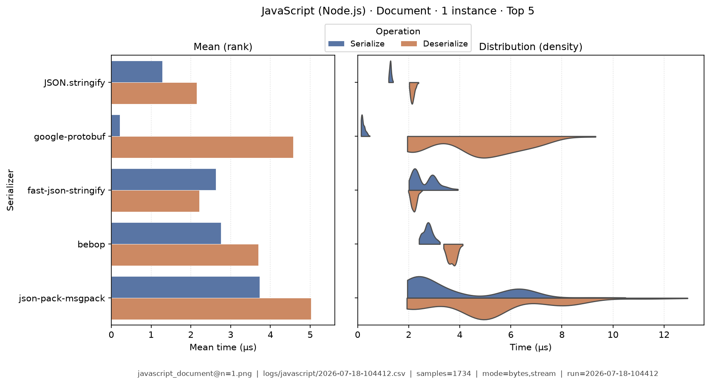
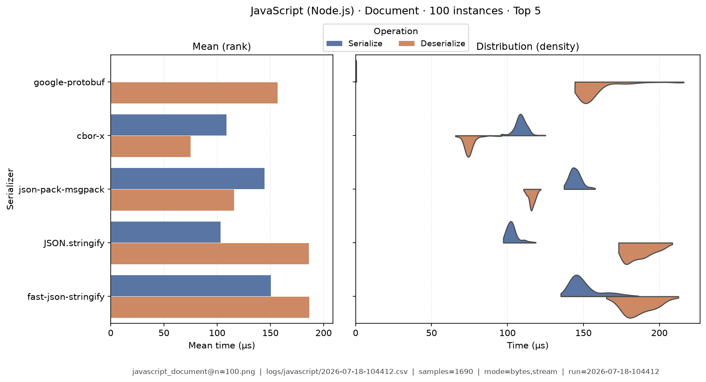
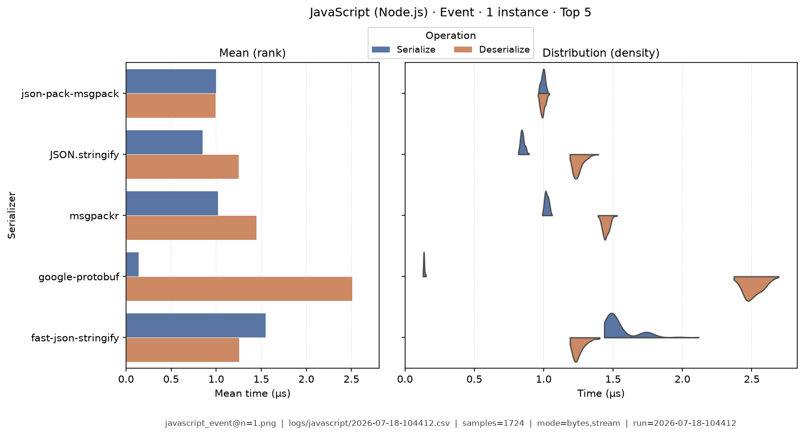
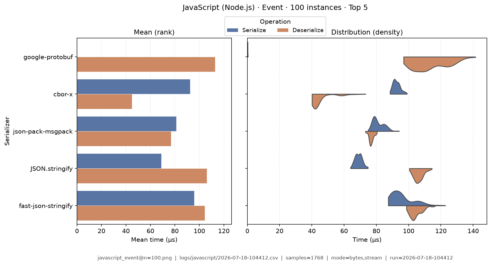
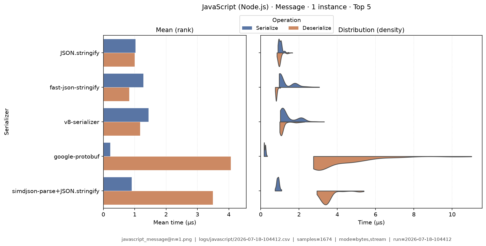
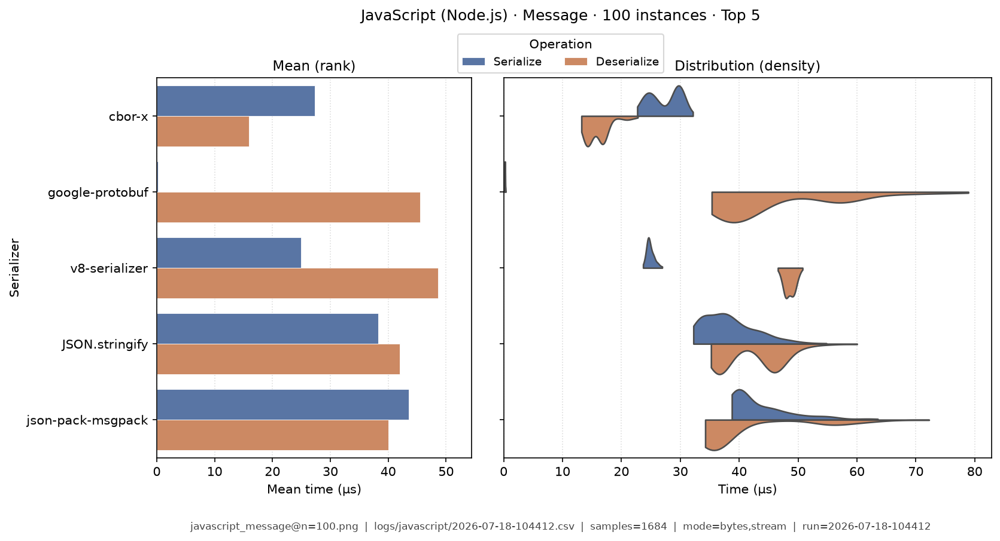
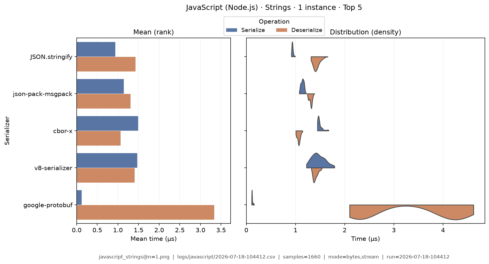
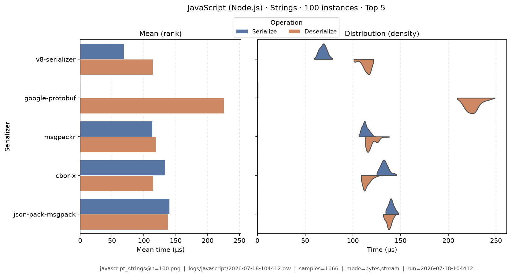
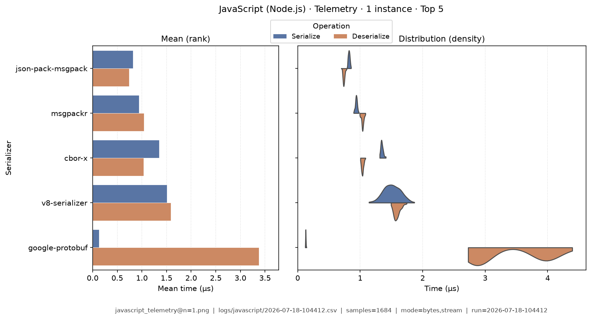
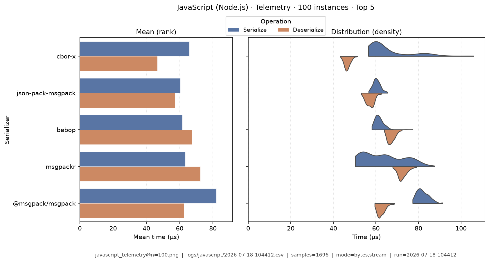

# JavaScript (Node.js) — Benchmark Results

**Generated:** 2026-07-18T10:44:36.638338

Published **local snapshot** (not regenerated by GitHub Actions). Numbers may differ if you re-run benchmarks on another machine.

Serializer inventory and caveats: [JavaScript (Node.js) overview](index.md). Methods: [Analysis Methodology](../analysis/ANALYSIS_METHODOLOGY.md). Metric definitions & importance tiers: [Metrics catalog](../analysis/METRICS.md).

## Pivot tables

Multi-way leaderboards emphasize **high-importance** metrics (configurable via `metrics.multi_way` in master config). Harness **modes** (CSV `StringOrStream`): **bytes mode** = in-memory buffer API; **stream mode** = write/read through a stream-like path. These names are *not* payload sizes. In each table, rows are sorted by **serializer name**; **bold** marks the semantic best value in that column (lowest time; highest ops/s). Ties are all bolded. Latency tables are in **microseconds** (µs). Batch fixtures show as **Type · N instances** (from `DataTypeInstanceCount`; e.g. Message · 100 instances).

### Summary

Default multi-serializer view shows **high-importance** metrics only ([METRICS.md](../analysis/METRICS.md)). Rows are sorted by **serializer name**. **Bold** marks the semantic best value in each column (lowest latency / size; highest ops/s). Pairwise / version A/B reports use the full metric set. Latency cells are **µs** (analysis storage remains ns).

| serializer | Median total (µs) | Median ser (µs) | Median deser (µs) | Ops/s (from mean) | Median size (B) | Samples | Fidelity |
|---|---|---|---|---|---|---|---|
| @msgpack/msgpack:3.1.3 | 133 | 65.4 | 67.1 | 86.2K | 13.5K | 1637 | **1.00** |
| avsc:5.7.9 | 347 | 188 | 158 | 68.7K | **9.02K** | 1710 | **1.00** |
| bebop:3.2.3 | 139 | 50.1 | 89.5 | 114K | 19K | 1721 | **1.00** |
| bser:2.1.1 | 330 | 175 | 153 | 32.5K | 16.4K | 1719 | **1.00** |
| bson:6.10.4 | 197 | 92.9 | 103 | 78.9K | 20.3K | 1639 | **1.00** |
| cbor:9.0.2 | 1,190 | 509 | 677 | 12.9K | 13.6K | 1705 | **1.00** |
| cbor-x:1.6.4 | 74.6 | 44.1 | **30.5** | 140K | 10.3K | 1624 | **1.00** |
| devalue:5.8.1 | 440 | 327 | 111 | 33.8K | 25.6K | 1696 | **1.00** |
| fast-json-stringify:6.4.0 | 131 | 68.5 | 61.6 | 159K | 19.7K | 1702 | **1.00** |
| flatbuffers:24.12.23 | 372 | 256 | 114 | 51.9K | 18.7K | 1606 | **1.00** |
| flexbuffers:24.12.23 | 2,060 | 1,170 | 883 | 4.21K | 27.2K | 1624 | **1.00** |
| google-protobuf:3.21.4 | **69.8** | **0.218** | 69.6 | 151K | 10.2K | 1624 | **1.00** |
| json-pack-msgpack:18.28.0 | 91.3 | 47.5 | 43.4 | 191K | 14.1K | 1763 | **1.00** |
| JSON.stringify:node-24.15.0 | 129 | 66.1 | 62.2 | **192K** | 19.7K | 1696 | **1.00** |
| msgpackr:1.12.1 | 104 | 44.3 | 59.8 | 151K | 13.9K | 1747 | **1.00** |
| protobuf-es:2.12.1 | 650 | 457 | 192 | 36.2K | 10.1K | 1619 | **1.00** |
| protobufjs:7.6.5 | 159 | 75.4 | 83.2 | 69.4K | 10.2K | 1677 | **1.00** |
| sia:2.3.0 | 487 | 326 | 159 | 49.8K | 19K | 1631 | **1.00** |
| simdjson-parse+JSON.stringify:0.9.2 | 245 | 61.1 | 183 | 75.3K | 19.7K | 1731 | **1.00** |
| v8-serializer:v8-13.6.233.17-node.48 | 102 | 33.1 | 69 | 146K | 15.3K | 1708 | **1.00** |


### Total Time

| serializer | bytes mode/mean | bytes mode/median | stream mode/mean | stream mode/median |
|---|---|---|---|---|
| @msgpack/msgpack:3.1.3 | 10.3 | 9.4 | 4.69 | 4.69 |
| avsc:5.7.9 | 7.01 | 7.07 | 4.87 | 4.86 |
| bebop:3.2.3 | 5.74 | 5.32 | 4.56 | 4.62 |
| bser:2.1.1 | 23.2 | 22.7 | 16.8 | 16.7 |
| bson:6.10.4 | 10.6 | 9.23 | 7.98 | 7.95 |
| cbor:9.0.2 | 68.6 | 54.5 | 69.9 | 58.6 |
| cbor-x:1.6.4 | 9.49 | 9.33 | 4.04 | 4.35 |
| devalue:5.8.1 | 8.6 | 8.24 | 7.47 | 7.38 |
| fast-json-stringify:6.4.0 | 2.42 | 2.55 | **1.81** | **1.81** |
| flatbuffers:24.12.23 | 10.5 | 9.47 | 7.22 | 7.15 |
| flexbuffers:24.12.23 | 50.1 | 49.1 | 230 | 306 |
| google-protobuf:3.21.4 | 5.42 | 5.04 | 3.15 | 3.13 |
| json-pack-msgpack:18.28.0 | 7.19 | 6.21 | 4.02 | 4.14 |
| JSON.stringify:node-24.15.0 | **2.17** | **2.08** | 1.89 | 1.89 |
| msgpackr:1.12.1 | 9.19 | 9.02 | 4.26 | 4.4 |
| protobuf-es:2.12.1 | 13.7 | 14 | 8.96 | 8.65 |
| protobufjs:7.6.5 | 8.58 | 7.6 | 5.81 | 5.76 |
| sia:2.3.0 | 11.9 | 12.3 | 8.54 | 8.63 |
| simdjson-parse+JSON.stringify:0.9.2 | 4.26 | 4.17 | 4.52 | 4.42 |
| v8-serializer:v8-13.6.233.17-node.48 | 2.63 | 2.3 | 2.6 | 2.25 |


### Ops/Sec

| serializer | Document · 1 instance | Document · 100 instances | Event · 1 instance | Event · 100 instances | Message · 1 instance | Message · 100 instances | Strings · 1 instance | Strings · 100 instances | Telemetry · 1 instance | Telemetry · 100 instances |
|---|---|---|---|---|---|---|---|---|---|---|
| @msgpack/msgpack:3.1.3 | 66K | 2.6K | 290K | 4K | 97K | 7.6K | 86K | 2.4K | 120K | 6.8K |
| avsc:5.7.9 | 95K | 1.3K | 180K | 2K | 140K | 4.8K | 130K | 1.1K | 82K | 0.92K |
| bebop:3.2.3 | 150K | 2.3K | 290K | 3.8K | 170K | 5.8K | 240K | 2.5K | 210K | 7.8K |
| bser:2.1.1 | 69K | 0.9K | 35K | 1.5K | 43K | 3.1K | 110K | 1.4K | 8.1K | 1.6K |
| bson:6.10.4 | 44K | 1.4K | 230K | 2.8K | 94K | 5.2K | 180K | 2.5K | 150K | 3.5K |
| cbor:9.0.2 | 17K | 0.23K | 34K | 0.48K | 15K | 0.9K | 27K | 0.46K | 31K | 0.47K |
| cbor-x:1.6.4 | 62K | 5.4K | 240K | 7.1K | 110K | **21K** | 390K | 4K | 420K | 8.5K |
| devalue:5.8.1 | 33K | 0.76K | 69K | 1.5K | 120K | 3.1K | 53K | 1.1K | 49K | 0.94K |
| fast-json-stringify:6.4.0 | 190K | 2.9K | 350K | 4.9K | 410K | 10K | 220K | 2.8K | 230K | 3K |
| flatbuffers:24.12.23 | 54K | 1.2K | 99K | 1.4K | 95K | 3.6K | 61K | 0.65K | 150K | 2.6K |
| flexbuffers:24.12.23 | 5.4K | 0.19K | 14K | 0.47K | 20K | 0.77K | 9.5K | 0.24K | 4.5K | 0.14K |
| google-protobuf:3.21.4 | 170K | **6.2K** | 380K | **8.4K** | 180K | 19K | 230K | 4.4K | 240K | 6.6K |
| json-pack-msgpack:18.28.0 | 86K | 3.8K | **500K** | 6.4K | 140K | 11K | 410K | 3.6K | **640K** | **8.6K** |
| JSON.stringify:node-24.15.0 | **290K** | 3.4K | 480K | 5.7K | **460K** | 12K | **420K** | 3.4K | 210K | 2.3K |
| msgpackr:1.12.1 | 83K | 2.7K | 400K | 4.9K | 110K | 9.5K | 280K | 4.3K | 500K | 7.4K |
| protobuf-es:2.12.1 | 51K | 0.62K | 95K | 0.95K | 73K | 2.5K | 53K | 0.49K | 62K | 0.72K |
| protobufjs:7.6.5 | 69K | 2.2K | 170K | 3.5K | 120K | 9.5K | 97K | 2K | 110K | 3.7K |
| sia:2.3.0 | 55K | 0.59K | 91K | 1K | 84K | 2.2K | 80K | 0.81K | 120K | 2.6K |
| simdjson-parse+JSON.stringify:0.9.2 | 110K | 1.5K | 170K | 2.8K | 230K | 5.5K | 150K | 2.1K | 99K | 1.4K |
| v8-serializer:v8-13.6.233.17-node.48 | 57K | 2.5K | 260K | 4.9K | 380K | 14K | 340K | **5.7K** | 320K | 6.8K |

## Latency distributions

Each figure pairs **mean bars** (left: ser / deser mean µs, linear from 0) with **split violins** (right: full sample density, linear from 0). **Top 5 serializers by mean total time** per fixture (display only; tables list all). Provenance (fixture, CSV path, modes, *n*) is printed on each image.

### Document · 1 instance

{ width="80%" }

### Document · 100 instances

{ width="80%" }

### Event · 1 instance

{ width="80%" }

### Event · 100 instances

{ width="80%" }

### Message · 1 instance

{ width="80%" }

### Message · 100 instances

{ width="80%" }

### Strings · 1 instance

{ width="80%" }

### Strings · 100 instances

{ width="80%" }

### Telemetry · 1 instance

{ width="80%" }

### Telemetry · 100 instances

{ width="80%" }

## Regenerate

Published snapshots are produced **locally** (not by GitHub Actions). After running benchmarks (each run creates a timestamped `YYYY-MM-DD-HHMMSS.csv`):

```bash
analyze-benchmarks              # all languages
analyze-benchmarks -l javascript   # this language only
```

That refreshes this language's results tables and latency distributions under `docs/analysis/plots/violin/`. The hub [Benchmark Results](../analysis/BENCHMARK_SUMMARY.md) is a **static** index and is not rewritten. Commit the updated `results.md` / plot paths as needed.


## Run configuration (important)

??? note "Show host, seed, serializers, and source CSV"

    Key fields from the run sidecar (`*.configs.json`, or legacy `*.environment.json`). Full metric definitions: [Metrics catalog](../analysis/METRICS.md). Optional blocks (`dataset`, `serializers`) appear only when captured.
    
    - **Source CSV:** `/home/leo/PycharmProjects/GLD/seriailizer-benchmark/logs/javascript/2026-07-18-104412.csv`
    - run=2026-07-18-104412
    - language=javascript
    - os=Linux 6.8.0-124-generic
    - cpu=12th Gen Intel(R) Core(TM) i7-12800H (20 threads)
    - ram=31.0 GiB
    - runtimes: node=24.15.0, python=3.14.0, dotnet=8.0.422
    - git=7736932 dirty
    - seed=42
    - warmup_reps=1
    - serializers=20
    - metrics_profile=multi_way
    - **Fixtures (config):** message, document, telemetry, strings, event
    - **Serializers (from CSV):**
      - `@msgpack/msgpack` @ 3.1.3
      - `JSON.stringify` @ node-24.15.0
      - `avsc` @ 5.7.9
      - `bebop` @ 3.2.3
      - `bser` @ 2.1.1
      - `bson` @ 6.10.4
      - `cbor` @ 9.0.2
      - `cbor-x` @ 1.6.4
      - `devalue` @ 5.8.1
      - `fast-json-stringify` @ 6.4.0
      - `flatbuffers` @ 24.12.23
      - `flexbuffers` @ 24.12.23
      - `google-protobuf` @ 3.21.4
      - `json-pack-msgpack` @ 18.28.0
      - `msgpackr` @ 1.12.1
      - `protobuf-es` @ 2.12.1
      - `protobufjs` @ 7.6.5
      - `sia` @ 2.3.0
      - `simdjson-parse+JSON.stringify` @ 0.9.2
      - `v8-serializer` @ v8-13.6.233.17-node.48
