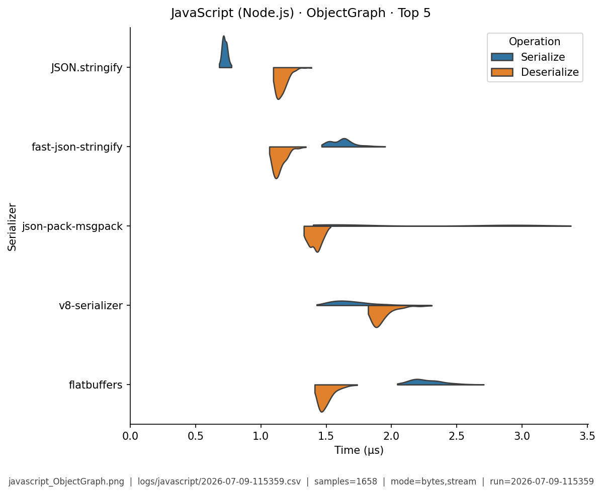

# JavaScript (Node.js) — Benchmark Results

**Generated:** 2026-07-09T11:56:38.458852

Published **local snapshot** (not regenerated by GitHub Actions). Numbers may differ if you re-run benchmarks on another machine.

Serializer inventory and caveats: [JavaScript (Node.js) overview](index.md). Methods: [Analysis Methodology](../analysis/ANALYSIS_METHODOLOGY.md). Metric definitions & importance tiers: [Metrics catalog](../analysis/METRICS.md).

## Pivot tables

Multi-way leaderboards emphasize **high-importance** metrics (configurable via `metrics.multi_way` in master config). Harness **modes** (CSV `StringOrStream`): **bytes mode** = in-memory buffer API; **stream mode** = write/read through a stream-like path. These names are *not* payload sizes. In each table, **bold** marks the semantic best value in that column (lowest time; highest ops/s). Ties are all bolded. Latency tables are in **microseconds** (µs).

### Summary

Default multi-serializer view shows **high-importance** metrics only ([METRICS.md](../analysis/METRICS.md)). **Primary rank:** median total latency (lower is better). Pairwise / version A/B reports use the full metric set. Latency cells are **µs** (analysis storage remains ns).

| serializer | Median total (µs) | Median ser (µs) | Median deser (µs) | Ops/s (from mean) | Median size (B) | Samples | Fidelity |
|---|---|---|---|---|---|---|---|
| v8-serializer:v8-13.6.233.17-node.48 | **5.13** | **2.19** | 2.93 | 239K | 608 | 1214 | **1.00** |
| JSON.stringify:node-24.15.0 | 5.97 | 3.33 | 2.62 | **573K** | 822.4 | 1211 | **1.00** |
| json-pack-msgpack:18.28.0 | 6.05 | 2.91 | 3.1 | 371K | 567.1 | 1111 | **1.00** |
| msgpackr:1.12.1 | 6.08 | 2.81 | 3.12 | 313K | 558.1 | 1205 | **1.00** |
| fast-json-stringify:6.4.0 | 6.33 | 3.86 | **2.45** | 468K | 822.4 | 1179 | **1.00** |
| bebop:3.2.3 | 7.6 | 3.7 | 3.87 | 331K | 723 | 1245 | **1.00** |
| @msgpack/msgpack:3.1.3 | 8.71 | 4.35 | 4.33 | 194K | 548.1 | 1179 | **1.00** |
| flatbuffers:24.12.23 | 9.28 | 5.98 | 3.24 | 168K | 846.3 | 1210 | **1.00** |
| protobufjs:7.6.5 | 9.55 | 3.96 | 5.4 | 329K | 366 | 1138 | **1.00** |
| cbor-x:1.6.4 | 9.92 | 5.43 | 4.29 | 277K | 438 | 1165 | **1.00** |
| avsc:5.7.9 | 10.3 | 7.28 | 2.91 | 278K | **328.1** | 1144 | **1.00** |
| simdjson-parse+JSON.stringify:0.9.2 | 13.1 | 3.02 | 10.1 | 103K | 822.4 | 1187 | **1.00** |
| bson:6.10.4 | 13.3 | 5.75 | 7.31 | 145K | 919.3 | 942 | **1.00** |
| sia:2.3.0 | 18.6 | 12.2 | 6.25 | 262K | 723 | 1211 | **1.00** |
| bser:2.1.1 | 19.6 | 9.58 | 10 | 72.2K | 754.5 | 1007 | **1.00** |
| devalue:5.8.1 | 24.8 | 18 | 6.81 | 133K | 967.7 | 1229 | **1.00** |
| protobuf-es:2.12.1 | 30.2 | 20.3 | 9.66 | 106K | 364.6 | 1194 | **1.00** |
| cbor:9.0.2 | 63.8 | 30.6 | 34.6 | 27.7K | 548.1 | 1136 | **1.00** |
| flexbuffers:24.12.23 | 174 | 135 | 38.7 | 8.19K | 1206 | 1144 | **1.00** |


### Total Time

| serializer | bytes mode/mean | bytes mode/median | stream mode/mean | stream mode/median |
|---|---|---|---|---|
| v8-serializer:v8-13.6.233.17-node.48 | 4.66 | 4.63 | 4.48 | 4.47 |
| JSON.stringify:node-24.15.0 | **4.4** | **4.02** | **3.3** | **3.25** |
| json-pack-msgpack:18.28.0 | 12.9 | 11.6 | 5.53 | 5.45 |
| msgpackr:1.12.1 | 10.8 | 8.63 | 4.39 | 4.38 |
| fast-json-stringify:6.4.0 | 4.76 | 4.03 | 3.66 | 3.68 |
| bebop:3.2.3 | 9.93 | 9.6 | 6.12 | 6.12 |
| @msgpack/msgpack:3.1.3 | 15.5 | 11.5 | 6.87 | 6.95 |
| flatbuffers:24.12.23 | 10 | 9.89 | 8.24 | 8.08 |
| protobufjs:7.6.5 | 13.7 | 13 | 6.53 | 6.36 |
| cbor-x:1.6.4 | 15.1 | 14.2 | 5.7 | 5.6 |
| avsc:5.7.9 | 7.12 | 6.82 | 6.08 | 6.17 |
| simdjson-parse+JSON.stringify:0.9.2 | 10 | 10.2 | 7.22 | 6.89 |
| bson:6.10.4 | 17.6 | 18.5 | 7.23 | 7.21 |
| sia:2.3.0 | 23.8 | 21.3 | 16.4 | 16.5 |
| bser:2.1.1 | 27.2 | 23.1 | 22.8 | 23 |
| devalue:5.8.1 | 20.8 | 22.5 | 14 | 11.6 |
| protobuf-es:2.12.1 | 36.7 | 34.5 | 19.2 | 19.1 |
| cbor:9.0.2 | 93.6 | 91.2 | 56.7 | 56.2 |
| flexbuffers:24.12.23 | 86.6 | 67.3 | 266 | 323 |


### Ops/Sec

| serializer | EDI_835 | Integer | ObjectGraph | Person | SimpleObject | StringArray | Telemetry |
|---|---|---|---|---|---|---|---|
| @msgpack/msgpack:3.1.3 | 55K | 0.56M | 140K | 65K | 0.28M | 78K | 59K |
| JSON.stringify:node-24.15.0 | 84K | 1.7M | **530K** | **230K** | **1.2M** | **190K** | 53K |
| avsc:5.7.9 | 55K | 0.89M | 220K | 140K | 0.49M | 49K | 46K |
| bebop:3.2.3 | 54K | 0.82M | 200K | 100K | 0.87M | 100K | 80K |
| bser:2.1.1 | 32K | - | 100K | 37K | 0.15M | 32K | 43K |
| bson:6.10.4 | 36K | - | 140K | 57K | 0.44M | 77K | 42K |
| cbor:9.0.2 | 8.1K | 0.055M | 30K | 11K | 0.062M | 10K | 6.1K |
| cbor-x:1.6.4 | 57K | 1.1M | 120K | 66K | 0.17M | 160K | 30K |
| devalue:5.8.1 | 15K | 0.48M | 71K | 48K | 0.25M | 20K | 21K |
| fast-json-stringify:6.4.0 | 75K | **1.7M** | 350K | 210K | 0.57M | 180K | 60K |
| flatbuffers:24.12.23 | 57K | 0.33M | 260K | 100K | 0.23M | 110K | 48K |
| flexbuffers:24.12.23 | 4.9K | 0.015M | 11K | 12K | 0.012M | 4.1K | 2.7K |
| json-pack-msgpack:18.28.0 | 80K | 1.4M | 230K | 78K | 0.23M | 85K | 93K |
| msgpackr:1.12.1 | 71K | 1.2M | 130K | 93K | 0.22M | 140K | 71K |
| protobuf-es:2.12.1 | 17K | 0.46M | 95K | 27K | 0.12M | 15K | 19K |
| protobufjs:7.6.5 | 48K | 1.4M | 140K | 73K | 0.42M | 44K | 43K |
| sia:2.3.0 | 23K | 1.2M | 100K | 42K | 0.35M | 23K | 46K |
| simdjson-parse+JSON.stringify:0.9.2 | 41K | 0.14M | 180K | 100K | 0.12M | 77K | 40K |
| v8-serializer:v8-13.6.233.17-node.48 | **88K** | 0.27M | 270K | 210K | 0.22M | 180K | **190K** |

## Violin plots

Density of serialize / deserialize timings (µs; log scale when medians span ≥5×). **Each plot shows only the top 5 serializers by mean total time** for that fixture (same rule for every language). Full rankings are in the pivot tables above. Provenance (fixture, CSV path, modes, *n*) is printed on each image.

### EDI_835

{ width="80%" }

### Integer

{ width="80%" }

### ObjectGraph

{ width="80%" }

### Person

{ width="80%" }

### SimpleObject

{ width="80%" }

### StringArray

{ width="80%" }

### Telemetry

{ width="80%" }

## Regenerate

Published snapshots are produced **locally** (not by GitHub Actions). After running benchmarks (each run creates a timestamped `YYYY-MM-DD-HHMMSS.csv`):

```bash
analyze-benchmarks              # all languages
analyze-benchmarks -l javascript   # this language only
```

That refreshes this language's results tables and violin plots under `docs/analysis/plots/violin/`. The hub [Benchmark Results](../analysis/BENCHMARK_SUMMARY.md) is a **static** index and is not rewritten. Commit the updated `results.md` / plot paths as needed.


## Run configuration (important)

??? note "Show host, seed, serializers, and source CSV"

    Key fields from the run sidecar (`*.configs.json`, or legacy `*.environment.json`). Full metric definitions: [Metrics catalog](../analysis/METRICS.md). Optional blocks (`dataset`, `serializers`) appear only when captured.
    
    - **Source CSV:** `../logs/javascript/2026-07-09-115359.csv`
    - run=2026-07-09-115359
    - language=javascript
    - os=Linux 6.8.0-124-generic
    - cpu=12th Gen Intel(R) Core(TM) i7-12800H (20 threads)
    - ram=31.0 GiB
    - runtimes: node=24.15.0, python=3.14.0, dotnet=8.0.422
    - git=8d8ab58 dirty
    - seed=42
    - warmup_reps=1
    - serializers=19
    - metrics_profile=multi_way
    - **Fixtures (config):** Person, Integer, Telemetry, SimpleObject, StringArray, EDI_835, ObjectGraph
    - **Serializers (from CSV):**
      - `@msgpack/msgpack` @ 3.1.3
      - `JSON.stringify` @ node-24.15.0
      - `avsc` @ 5.7.9
      - `bebop` @ 3.2.3
      - `bser` @ 2.1.1
      - `bson` @ 6.10.4
      - `cbor` @ 9.0.2
      - `cbor-x` @ 1.6.4
      - `devalue` @ 5.8.1
      - `fast-json-stringify` @ 6.4.0
      - `flatbuffers` @ 24.12.23
      - `flexbuffers` @ 24.12.23
      - `json-pack-msgpack` @ 18.28.0
      - `msgpackr` @ 1.12.1
      - `protobuf-es` @ 2.12.1
      - `protobufjs` @ 7.6.5
      - `sia` @ 2.3.0
      - `simdjson-parse+JSON.stringify` @ 0.9.2
      - `v8-serializer` @ v8-13.6.233.17-node.48
