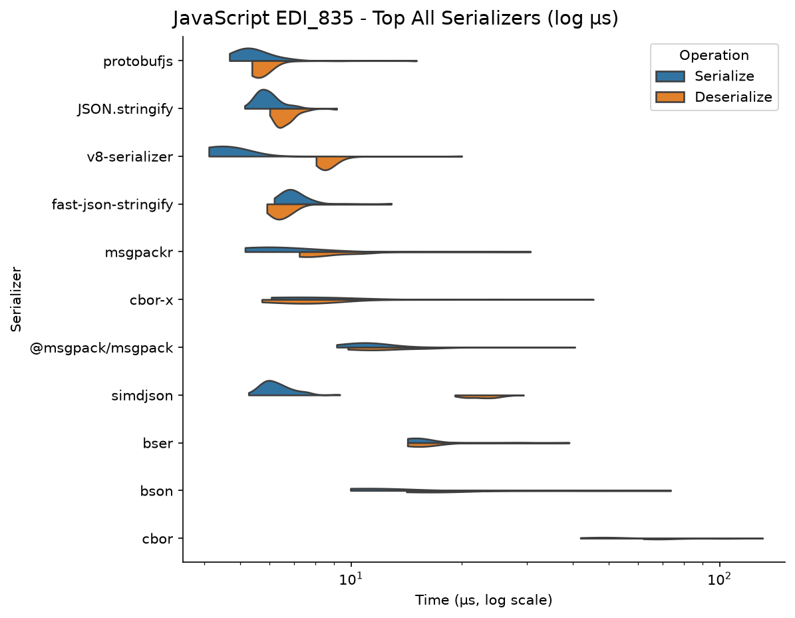
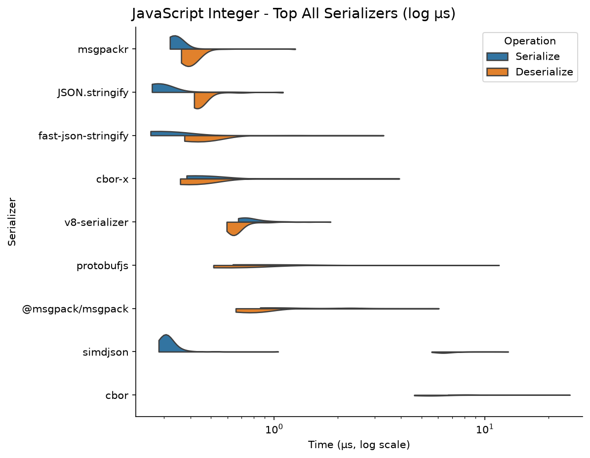
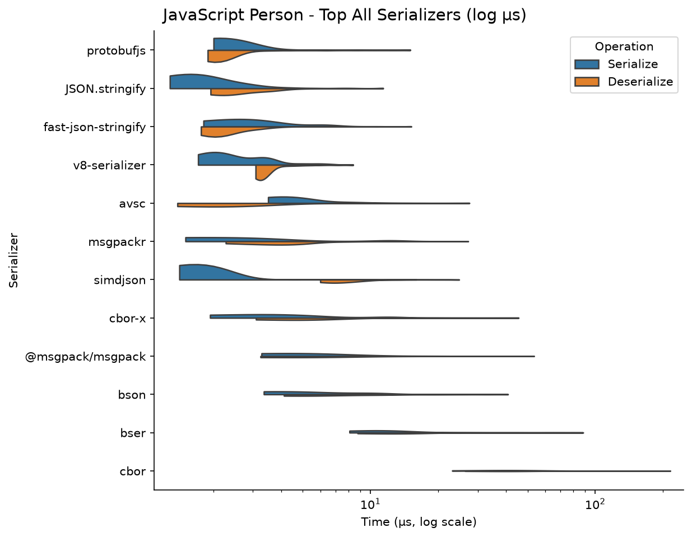
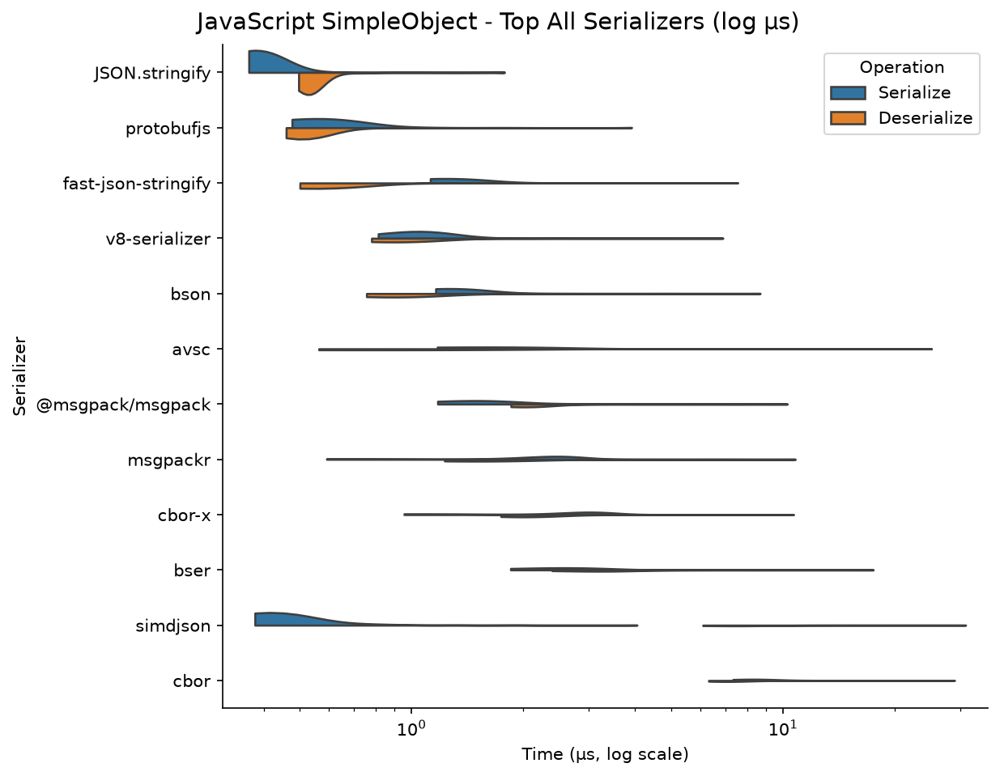
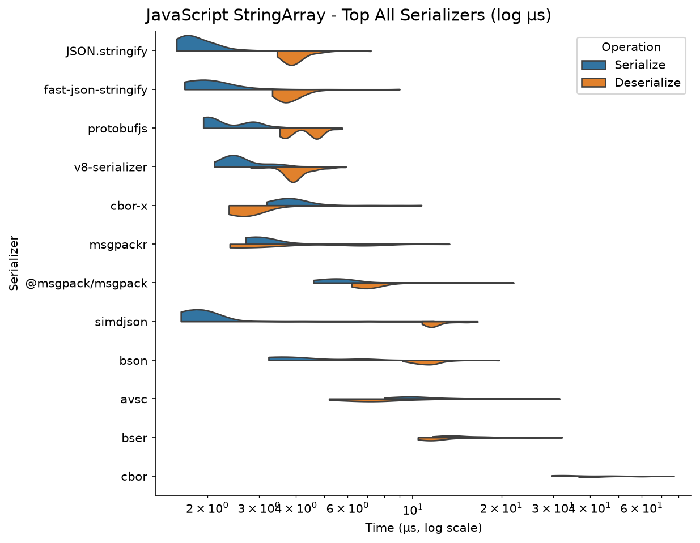
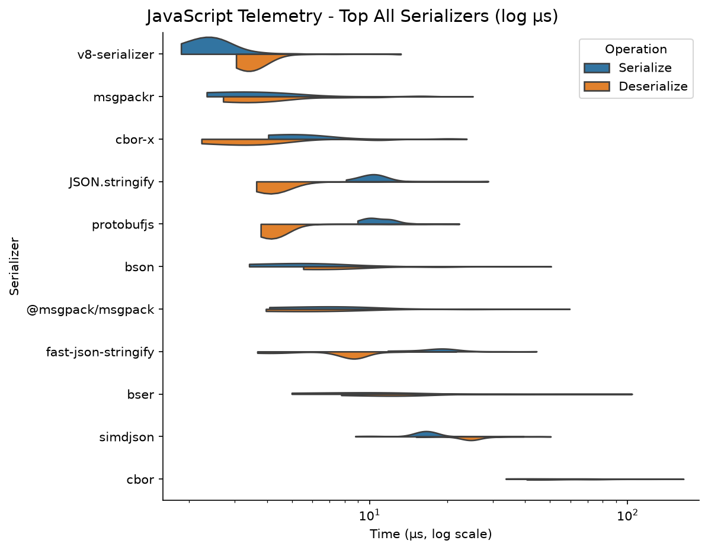

# JavaScript — Benchmark Results

**Generated:** 2026-06-30T18:22:48.225178

Published **local snapshot** (not regenerated by GitHub Actions). Numbers may differ if you re-run benchmarks on another machine.

Serializer inventory and caveats: [JavaScript overview](index.md). Methods: [Analysis Methodology](../analysis/ANALYSIS_METHODOLOGY.md).

## Pivot tables


### JavaScript: Avg Total Time (ns) by Serializer and Mode

| serializer | bytes | stream |
|---|---|---|
| @msgpack/msgpack | 15,968 | 7,053 |
| JSON.stringify | 4,532 | 4,344 |
| avsc | 8,768 | 5,398 |
| bser | 28,715 | 22,060 |
| bson | 20,884 | 7,827 |
| cbor | 98,030 | 77,449 |
| cbor-x | 14,536 | 7,157 |
| fast-json-stringify | 6,450 | 4,686 |
| msgpackr | 12,358 | 4,904 |
| protobufjs | 4,144 | 4,113 |
| simdjson | 9,465 | 8,412 |
| v8-serializer | 5,332 | 7,035 |


### JavaScript: Ops/Sec by Serializer and Data Type

| serializer | EDI_835 | Integer | Person | SimpleObject | StringArray | Telemetry |
|---|---|---|---|---|---|---|
| @msgpack/msgpack | 38,899 | 420,383 | 62,624 | 281,744 | 77,087 | 48,179 |
| JSON.stringify | 78,747 | 1,384,691 | 220,676 | 1,092,801 | 173,595 | 68,613 |
| avsc | - | - | 114,046 | 402,941 | 49,248 | - |
| bser | 32,203 | - | 34,825 | 168,787 | 32,957 | 35,329 |
| bson | 36,124 | - | 47,883 | 458,192 | 60,396 | 59,947 |
| cbor | 7,279 | 69,126 | 10,201 | 65,834 | 13,492 | 7,339 |
| cbor-x | 48,658 | 1,245,480 | 68,793 | 190,714 | 149,823 | 77,948 |
| fast-json-stringify | 73,611 | 1,378,448 | 155,036 | 566,543 | 165,949 | 38,079 |
| msgpackr | 64,064 | 1,383,063 | 80,918 | 231,897 | 98,793 | 87,566 |
| protobufjs | 87,948 | 663,810 | 241,323 | 915,389 | 148,978 | 62,724 |
| simdjson | 35,537 | 148,711 | 105,655 | 122,912 | 74,483 | 23,664 |
| v8-serializer | 75,228 | 656,571 | 187,547 | 489,197 | 143,704 | 166,267 |

### Scientific metrics (sample: JSON.stringify / Person / bytes)

- mean total: 4532 ns (95% CI [4344, 4738])
- median: 4570 ns, CV: 0.213, vs fastest Cliff's δ: 0.089 (negligible)

## Violin plots

Density of serialize / deserialize timings (µs; log scale when medians span ≥5×).

| Fixture | Plot |
|---------|------|
| EDI_835 | { width="50%" } |
| Integer | { width="50%" } |
| Person | { width="50%" } |
| SimpleObject | { width="50%" } |
| StringArray | { width="50%" } |
| Telemetry | { width="50%" } |

## Regenerate

Published snapshots are produced **locally** (not by GitHub Actions). After updating `logs/<lang>/benchmark-log.csv`:

```bash
analyze-benchmarks --generate-summary --generate-plots --output-dir docs/analysis
```

That refreshes this page, other languages' `results.md`, plot images under `docs/analysis/plots/violin/`, and the [Benchmark Results](../analysis/BENCHMARK_SUMMARY.md) hub. Commit those paths to update the documentation site.
