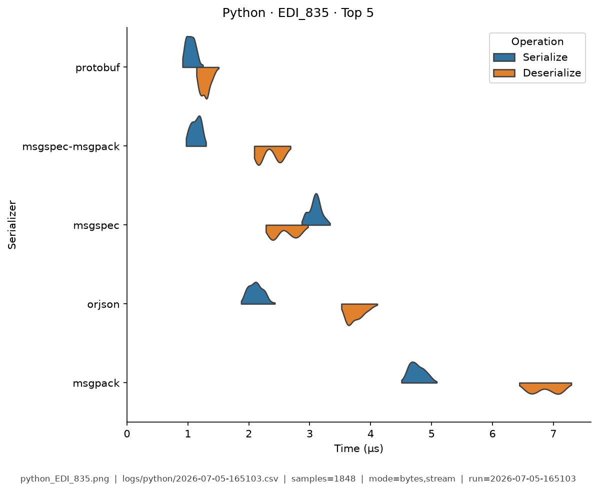
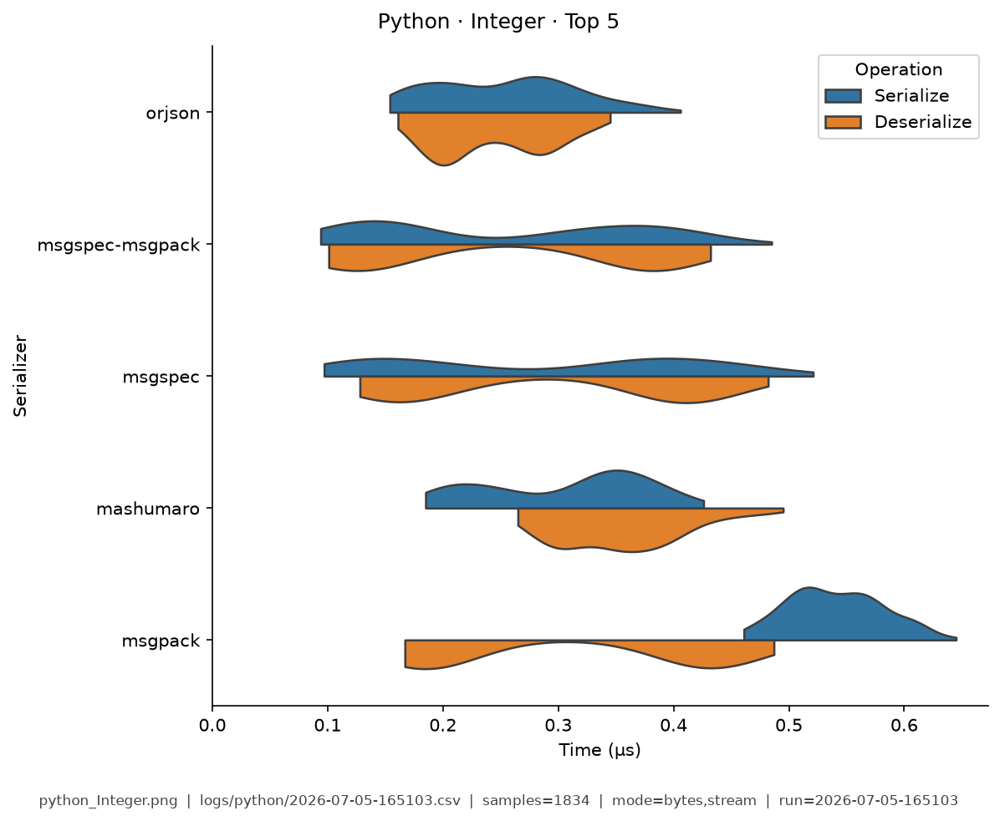
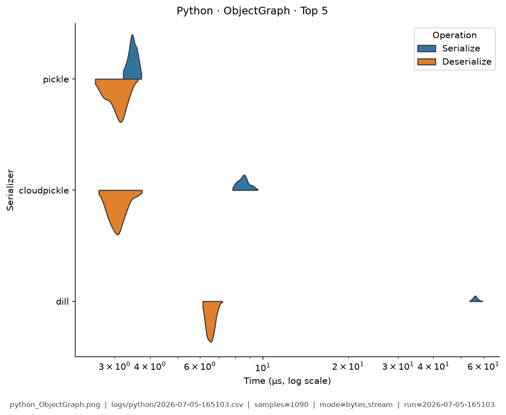
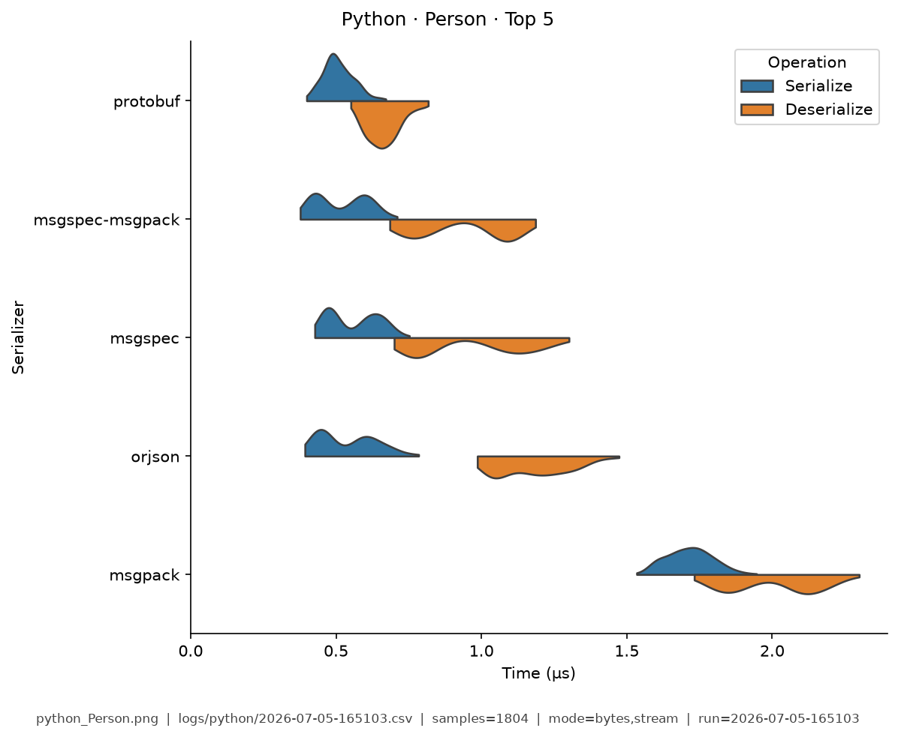
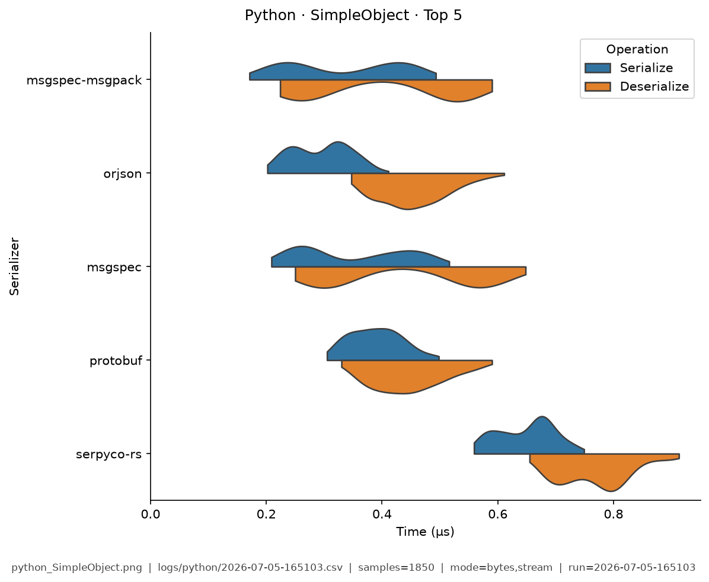
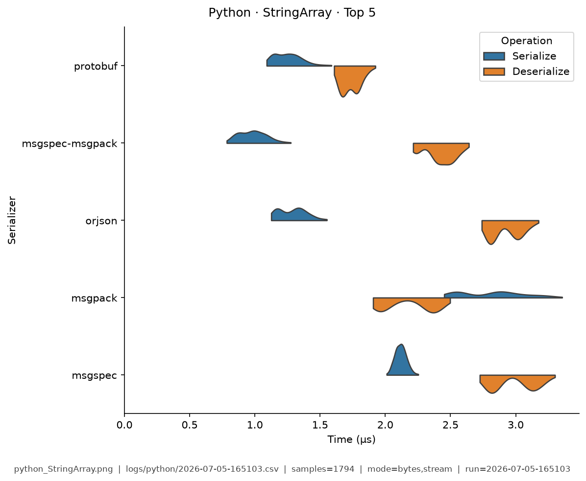
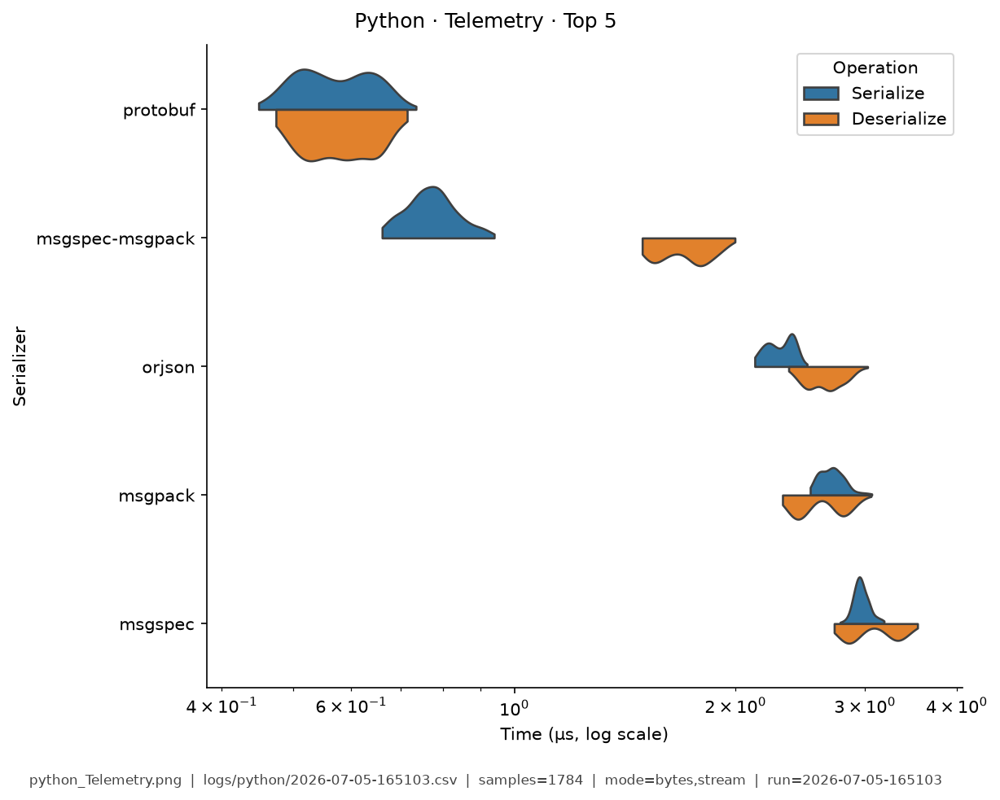

# Python — Benchmark Results

**Generated:** 2026-07-05T16:51:47.107992

Published **local snapshot** (not regenerated by GitHub Actions). Numbers may differ if you re-run benchmarks on another machine.

Serializer inventory and caveats: [Python overview](index.md). Methods: [Analysis Methodology](../analysis/ANALYSIS_METHODOLOGY.md). Metric definitions & importance tiers: [Metrics catalog](../analysis/METRICS.md).

## Pivot tables

Multi-way leaderboards emphasize **high-importance** metrics (configurable via `metrics.multi_way` in master config). Harness **modes** (CSV `StringOrStream`): **bytes mode** = in-memory buffer API; **stream mode** = write/read through a stream-like path. These names are *not* payload sizes. In each table, **bold** marks the semantic best value in that column (lowest time; highest ops/s). Ties are all bolded. Latency tables are in **microseconds** (µs).

### Summary

Default multi-serializer view shows **high-importance** metrics only ([METRICS.md](../analysis/METRICS.md)). **Primary rank:** median total latency (lower is better). Pairwise / version A/B reports use the full metric set. Latency cells are **µs** (analysis storage remains ns).

| serializer | Median total (µs) | Median ser (µs) | Median deser (µs) | Ops/s (from mean) | Median size (B) | Samples | Fidelity |
|---|---|---|---|---|---|---|---|
| protobuf:7.35.1 | **1.69** | 0.75 | **0.937** | 739K | 1214 | 922 | **1.00** |
| msgspec-msgpack:0.21.1 | 2.01 | **0.664** | 1.34 | **956K** | **1028** | 1087 | **1.00** |
| orjson:3.11.9 | 2.99 | 1.12 | 1.85 | 775K | 1474 | 1101 | **1.00** |
| msgspec:0.21.1 | 3.28 | 1.56 | 1.72 | 788K | 1225 | 1099 | **1.00** |
| msgpack:1.2.1 | 4.64 | 2.2 | 2.44 | 441K | 1240 | 1063 | **1.00** |
| serpyco-rs:1.20.0 | 6.23 | 2.5 | 3.71 | 270K | 1765 | 892 | **1.00** |
| mashumaro:3.22 | 8.2 | 2.16 | 6.02 | 425K | 1473 | 1060 | **1.00** |
| pydantic:2.13.4 | 8.61 | 3.61 | 5.01 | 296K | 1473 | 1100 | **1.00** |
| cbor2:6.1.3 | 11.4 | 7.33 | 4.06 | 287K | 1243 | 1082 | **1.00** |
| pickle:python-3.12.12 | 12.2 | 7.3 | 4.95 | 219K | 1116 | 1277 | **1.00** |
| rapidjson:1.23 | 17.8 | 10.6 | 7.27 | 310K | 1474 | 1086 | **1.00** |
| cloudpickle:3.1.2 | 21.7 | 16.5 | 5.17 | 119K | 1116 | 1247 | **1.00** |
| json:python-3.12.12 | 24.9 | 15.5 | 9.35 | 113K | 1474 | 1079 | **1.00** |
| avro:1.12.2 | 26.7 | 12.7 | 14 | 88.9K | 1170 | 903 | **1.00** |
| dill:0.4.1 | 116 | 107 | 8.62 | 32.2K | 1116 | 1231 | **1.00** |
| flatbuffers:25.12.19 | 118 | 116 | 1.65 | 16.7K | 1547 | 909 | **1.00** |


### Total Time

| serializer | bytes mode/mean | bytes mode/median | stream mode/mean | stream mode/median |
|---|---|---|---|---|
| protobuf:7.35.1 | **1.12** | **1.1** | **1.23** | **1.21** |
| msgspec-msgpack:0.21.1 | 1.21 | 1.2 | 1.69 | 1.68 |
| orjson:3.11.9 | 1.52 | 1.51 | 1.89 | 1.9 |
| msgspec:0.21.1 | 1.25 | 1.25 | 1.78 | 1.77 |
| msgpack:1.2.1 | 3.53 | 3.52 | 3.9 | 3.89 |
| serpyco-rs:1.20.0 | 4.17 | 4.17 | 4.3 | 4.3 |
| mashumaro:3.22 | 7.27 | 7.23 | 7.38 | 7.38 |
| pydantic:2.13.4 | 7.61 | 7.58 | 7.66 | 7.65 |
| cbor2:6.1.3 | 9.07 | 9.03 | 9.76 | 9.65 |
| pickle:python-3.12.12 | 15.7 | 15.6 | 15.8 | 15.8 |
| rapidjson:1.23 | 4.64 | 4.62 | 4.75 | 4.74 |
| cloudpickle:3.1.2 | 33.6 | 33.5 | 33.5 | 33.4 |
| json:python-3.12.12 | 9.8 | 9.66 | 9.84 | 9.82 |
| avro:1.12.2 | 15.4 | 15.4 | 15.1 | 15.1 |
| dill:0.4.1 | 142 | 142 | 142 | 141 |
| flatbuffers:25.12.19 | 76.5 | 76.6 | 78.1 | 77.6 |


### Ops/Sec

| serializer | EDI_835 | Integer | ObjectGraph | Person | SimpleObject | StringArray | Telemetry |
|---|---|---|---|---|---|---|---|
| avro:1.12.2 | 22K | - | - | 65K | 0.29M | 22K | 39K |
| cbor2:6.1.3 | 35K | 1.3M | - | 110K | 0.43M | 76K | 78K |
| cloudpickle:3.1.2 | 16K | 0.49M | 86K | 30K | 0.096M | 67K | 53K |
| dill:0.4.1 | 3.4K | 0.16M | 16K | 7K | 0.021M | 7.5K | 7.9K |
| flatbuffers:25.12.19 | 4.7K | - | - | 13K | 0.048M | 4.9K | 13K |
| json:python-3.12.12 | 34K | 0.31M | - | 100K | 0.2M | 37K | 13K |
| mashumaro:3.22 | 43K | 1.8M | - | 140K | 0.59M | 150K | 110K |
| msgpack:1.2.1 | 88K | 1.4M | - | 280K | 0.76M | 200K | 200K |
| msgspec:0.21.1 | 180K | 3M | - | 800K | 1.8M | 200K | 170K |
| msgspec-msgpack:0.21.1 | 300K | **3.7M** | - | 830K | **2M** | 290K | 420K |
| orjson:3.11.9 | 180K | 2.5M | - | 660K | 1.5M | 250K | 210K |
| pickle:python-3.12.12 | 31K | 1M | **160K** | 64K | 0.2M | 89K | 82K |
| protobuf:7.35.1 | **450K** | - | - | **900K** | 1.3M | **350K** | **940K** |
| pydantic:2.13.4 | 47K | 1M | - | 130K | 0.45M | 100K | 110K |
| rapidjson:1.23 | 57K | 1M | - | 220K | 0.58M | 85K | 14K |
| serpyco-rs:1.20.0 | 77K | - | - | 240K | 0.75M | 190K | 150K |

## Violin plots

Density of serialize / deserialize timings (µs; log scale when medians span ≥5×). **Each plot shows only the top 5 serializers by mean total time** for that fixture (same rule for every language). Full rankings are in the pivot tables above. Provenance (fixture, CSV path, modes, *n*) is printed on each image.

### EDI_835

{ width="80%" }

### Integer

{ width="80%" }

### ObjectGraph

{ width="80%" }

### Person

{ width="80%" }

### SimpleObject

{ width="80%" }

### StringArray

{ width="80%" }

### Telemetry

{ width="80%" }

## Regenerate

Published snapshots are produced **locally** (not by GitHub Actions). After running benchmarks (each run creates a timestamped `YYYY-MM-DD-HHMMSS.csv`):

```bash
analyze-benchmarks              # all languages
analyze-benchmarks -l python   # this language only
```

That refreshes this language's results tables and violin plots under `docs/analysis/plots/violin/`. The hub [Benchmark Results](../analysis/BENCHMARK_SUMMARY.md) is a **static** index and is not rewritten. Commit the updated `results.md` / plot paths as needed.


## Run configuration (important)

??? note "Show host, seed, serializers, and source CSV"

    Key fields from the run sidecar (`*.configs.json`, or legacy `*.environment.json`). Full metric definitions: [Metrics catalog](../analysis/METRICS.md). Optional blocks (`dataset`, `serializers`) appear only when captured.
    
    - **Source CSV:** `/home/leo/PycharmProjects/GLD/seriailizer-benchmark/logs/python/2026-07-05-165103.csv`
    - run=2026-07-05-165103
    - language=python
    - os=Linux 6.8.0-124-generic
    - cpu=12th Gen Intel(R) Core(TM) i7-12800H (20 threads)
    - ram=31.0 GiB
    - runtimes: python=3.14.0, node=24.15.0, rustc=rustc 1.96.0 (ac68faa20 2026-05-25)
    - git=b6f7420
    - seed=42
    - warmup_reps=1
    - serializers=16
    - metrics_profile=multi_way
    - **Fixtures (config):** Person, Integer, Telemetry, SimpleObject, StringArray, EDI_835, ObjectGraph
    - **Serializers (from CSV):**
      - `avro` @ 1.12.2
      - `cbor2` @ 6.1.3
      - `cloudpickle` @ 3.1.2
      - `dill` @ 0.4.1
      - `flatbuffers` @ 25.12.19
      - `json` @ python-3.12.12
      - `mashumaro` @ 3.22
      - `msgpack` @ 1.2.1
      - `msgspec` @ 0.21.1
      - `msgspec-msgpack` @ 0.21.1
      - `orjson` @ 3.11.9
      - `pickle` @ python-3.12.12
      - `protobuf` @ 7.35.1
      - `pydantic` @ 2.13.4
      - `rapidjson` @ 1.23
      - `serpyco-rs` @ 1.20.0
