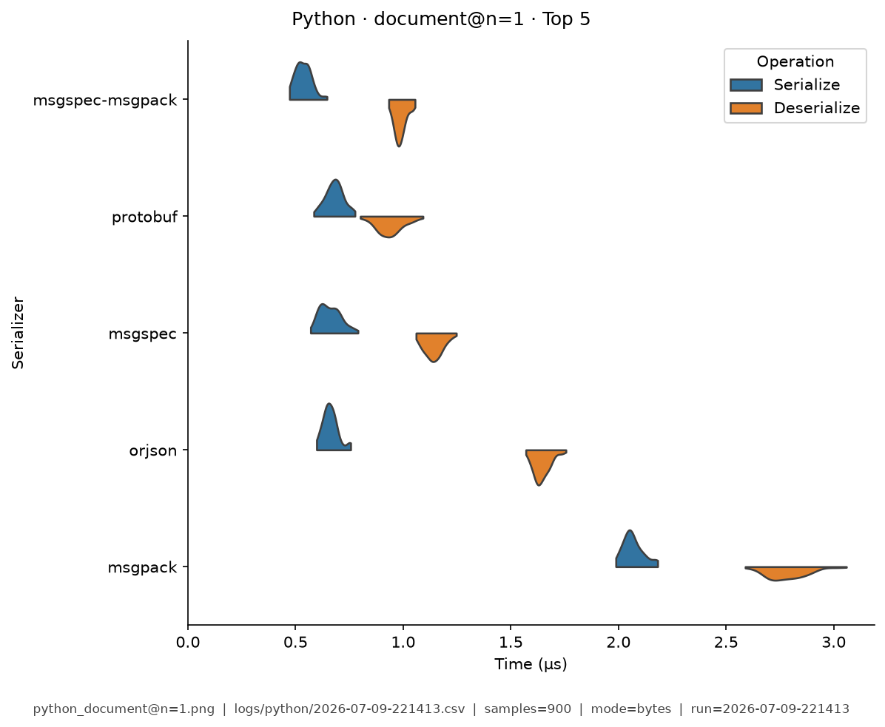
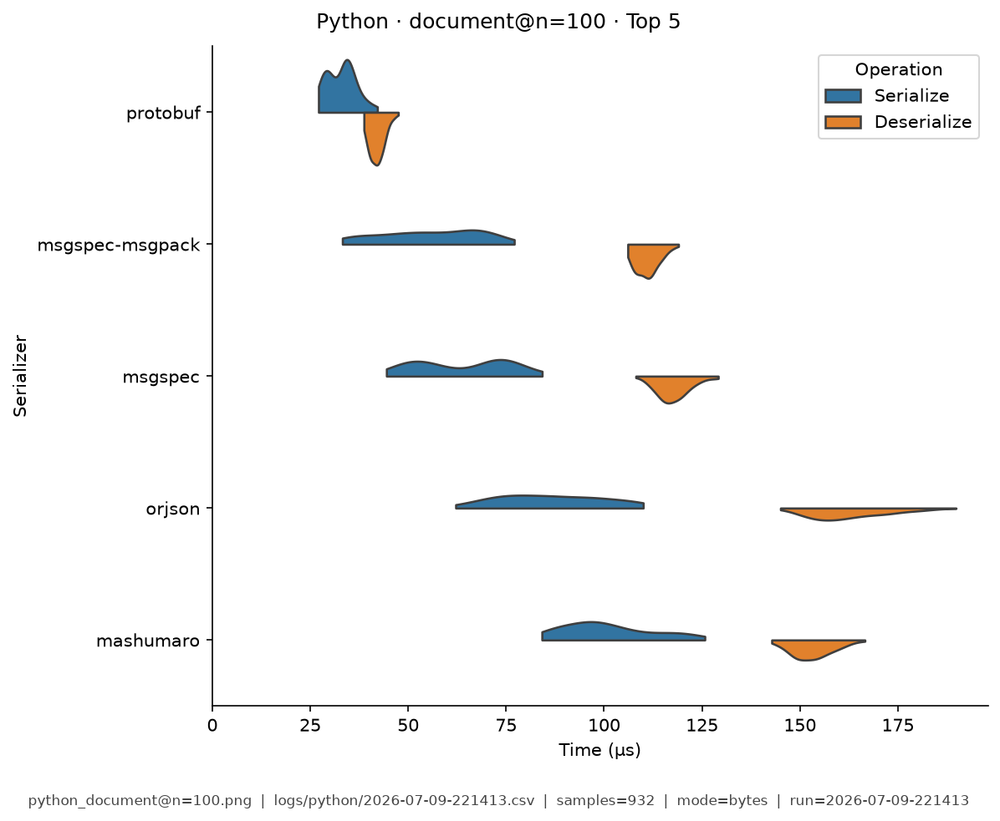
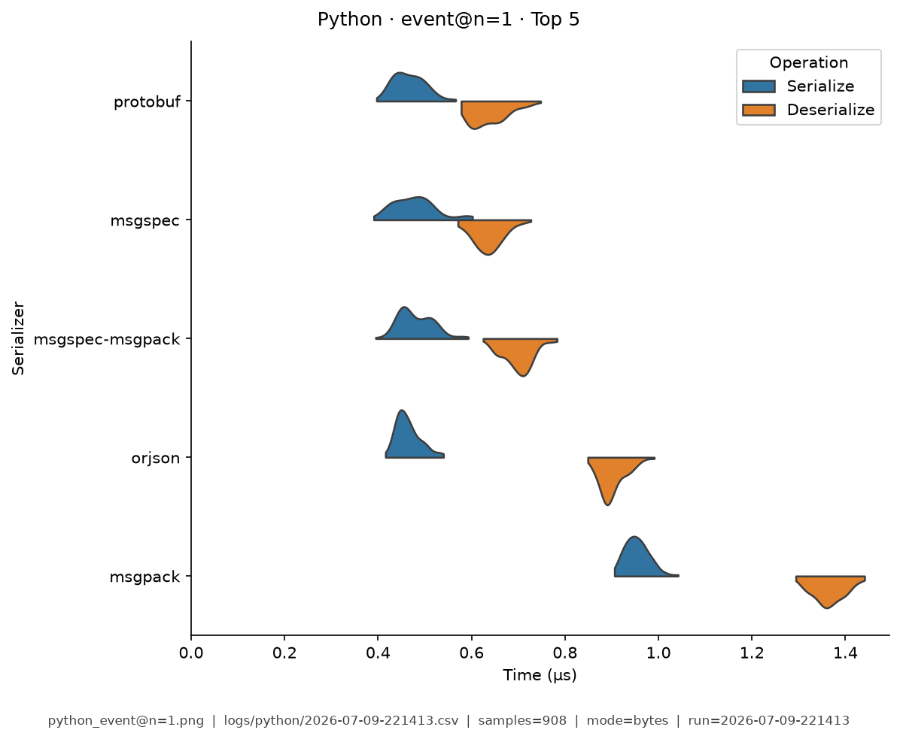
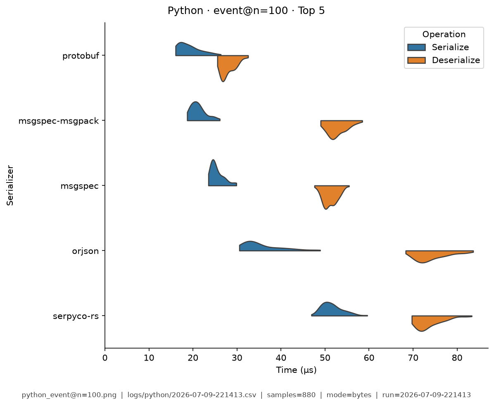
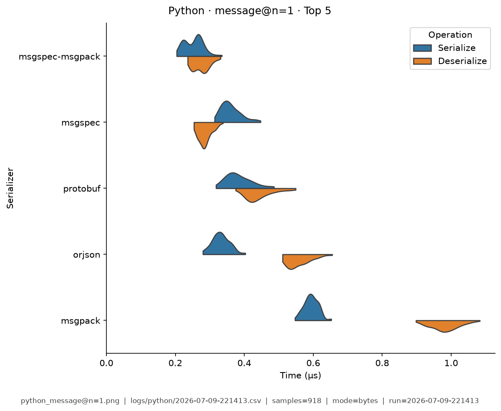
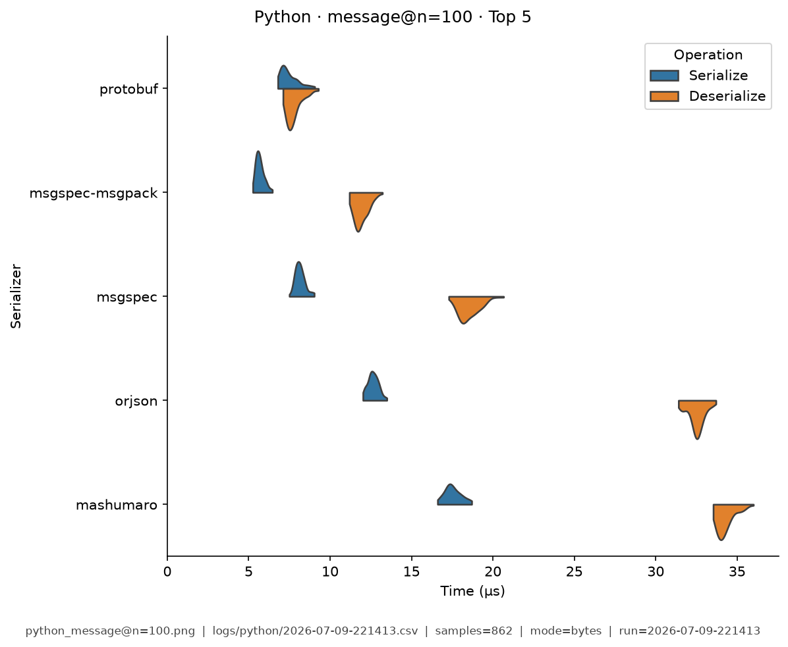
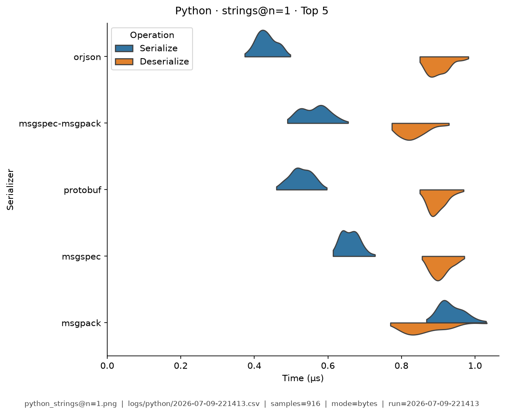
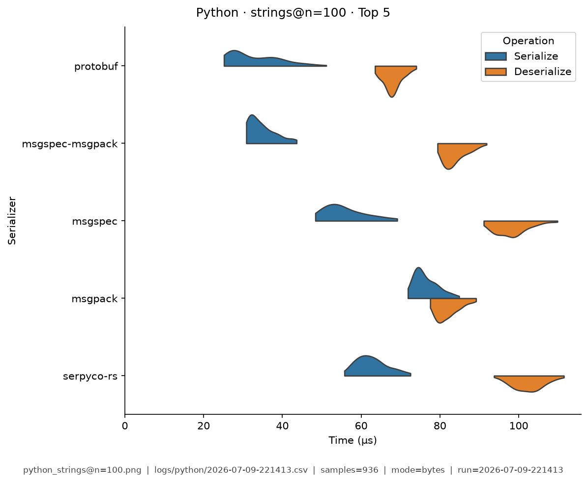
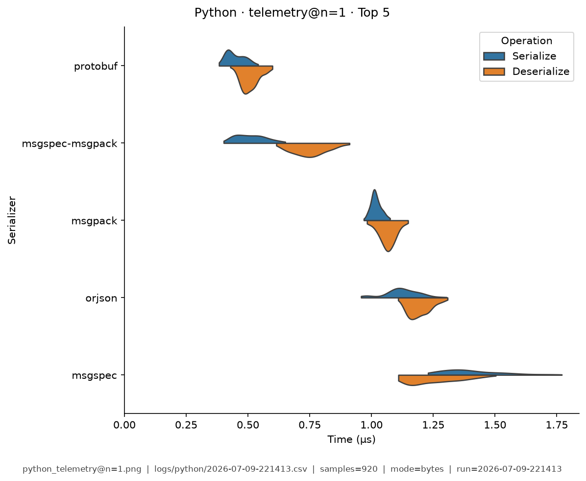
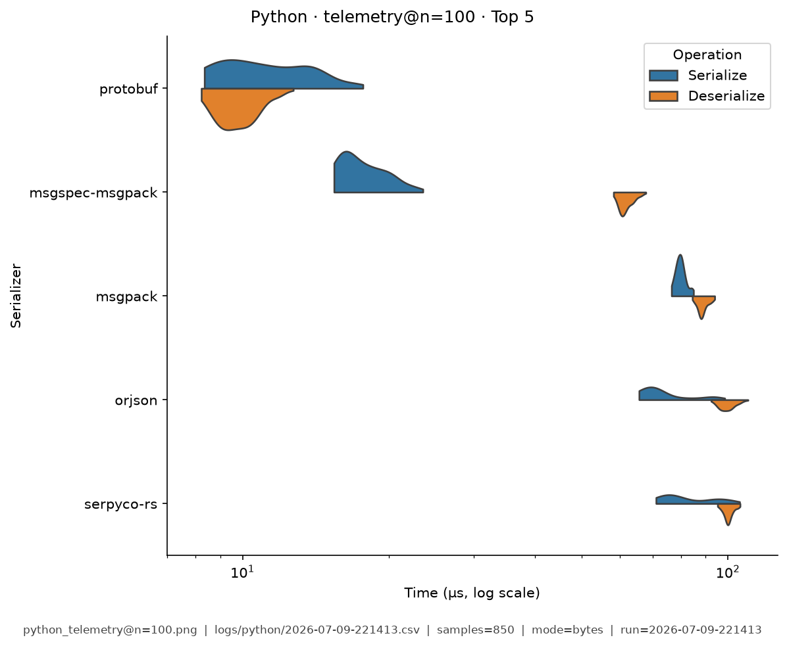

# Python — Benchmark Results

**Generated:** 2026-07-09T22:15:40.150822

Published **local snapshot** (not regenerated by GitHub Actions). Numbers may differ if you re-run benchmarks on another machine.

Serializer inventory and caveats: [Python overview](index.md). Methods: [Analysis Methodology](../analysis/ANALYSIS_METHODOLOGY.md). Metric definitions & importance tiers: [Metrics catalog](../analysis/METRICS.md).

## Pivot tables

Multi-way leaderboards emphasize **high-importance** metrics (configurable via `metrics.multi_way` in master config). Harness **modes** (CSV `StringOrStream`): **bytes mode** = in-memory buffer API; **stream mode** = write/read through a stream-like path. These names are *not* payload sizes. In each table, **bold** marks the semantic best value in that column (lowest time; highest ops/s). Ties are all bolded. Latency tables are in **microseconds** (µs). Batch cells use `type@n=<DataTypeInstanceCount>` labels.

### Summary

Default multi-serializer view shows **high-importance** metrics only ([METRICS.md](../analysis/METRICS.md)). **Primary rank:** median total latency (lower is better). Pairwise / version A/B reports use the full metric set. Latency cells are **µs** (analysis storage remains ns).

| serializer | Median total (µs) | Median ser (µs) | Median deser (µs) | Ops/s (from mean) | Median size (B) | Samples | Fidelity |
|---|---|---|---|---|---|---|---|
| protobuf:7.35.1 | **26.2** | **10.4** | **15.8** | 464K | 1.015e+04 | 901 | **1.00** |
| msgspec-msgpack:0.21.1 | 46 | 13.6 | 32.3 | **501K** | 9690 | 906 | **1.00** |
| msgspec:0.21.1 | 67 | 25.5 | 41.1 | 408K | 1.472e+04 | 900 | **1.00** |
| orjson:3.11.9 | 74.6 | 26.7 | 47.3 | 352K | 1.972e+04 | 903 | **1.00** |
| serpyco-rs:1.20.0 | 79.9 | 32.1 | 47.1 | 198K | 1.972e+04 | 903 | **1.00** |
| mashumaro:3.22 | 80.8 | 31.9 | 48.3 | 159K | 1.972e+04 | 899 | **1.00** |
| msgpack:1.2.1 | 109 | 47.5 | 60.5 | 234K | 1.356e+04 | 912 | **1.00** |
| pickle:python-3.12.12 | 262 | 165 | 96.4 | 76.6K | 1.364e+04 | 918 | **1.00** |
| cbor2:6.1.3 | 301 | 199 | 102 | 87K | 1.36e+04 | 906 | **1.00** |
| rapidjson:1.23 | 345 | 194 | 150 | 114K | 1.972e+04 | 921 | **1.00** |
| cloudpickle:3.1.2 | 414 | 318 | 96.5 | 43.2K | 1.364e+04 | 904 | **1.00** |
| json:python-3.12.12 | 433 | 258 | 175 | 56.4K | 1.972e+04 | 901 | **1.00** |
| flatbuffers:25.12.19 | 453 | 272 | 180 | 23.4K | 1.974e+04 | 906 | **1.00** |
| avro:1.12.2 | 590 | 296 | 293 | 48.8K | **9034** | 926 | **1.00** |
| pydantic:2.13.4 | 659 | 350 | 310 | 59.5K | 2.144e+04 | 895 | **1.00** |
| dill:0.4.1 | 2.44e+03 | 2.33e+03 | 108 | 7.44K | 1.364e+04 | 898 | **1.00** |


### Total Time

| serializer | bytes mode/mean | bytes mode/median | stream mode/mean | stream mode/median |
|---|---|---|---|---|
| protobuf:7.35.1 | 0.826 | 0.805 | - | - |
| msgspec-msgpack:0.21.1 | **0.528** | **0.54** | - | - |
| msgspec:0.21.1 | 0.646 | 0.64 | - | - |
| orjson:3.11.9 | 0.889 | 0.882 | - | - |
| serpyco-rs:1.20.0 | 1.68 | 1.68 | - | - |
| mashumaro:3.22 | 1.98 | 1.97 | - | - |
| msgpack:1.2.1 | 1.58 | 1.58 | - | - |
| pickle:python-3.12.12 | 4.29 | 4.29 | - | - |
| cbor2:6.1.3 | 3.29 | 3.27 | - | - |
| rapidjson:1.23 | 3.1 | 3.08 | - | - |
| cloudpickle:3.1.2 | 7.9 | 7.83 | - | - |
| json:python-3.12.12 | 6.07 | 6.08 | - | - |
| flatbuffers:25.12.19 | 16.9 | 16.8 | - | - |
| avro:1.12.2 | 5.06 | 5.06 | - | - |
| pydantic:2.13.4 | 5.87 | 5.71 | - | - |
| dill:0.4.1 | 42.6 | 42.6 | - | - |


### Ops/Sec

| serializer | document@n=1 | document@n=100 | event@n=1 | event@n=100 | message@n=1 | message@n=100 | strings@n=1 | strings@n=100 | telemetry@n=1 | telemetry@n=100 |
|---|---|---|---|---|---|---|---|---|---|---|
| avro:1.12.2 | 52K | 0.58K | 89K | 0.93K | 0.2M | 2.3K | 61K | 0.65K | 0.082M | 0.95K |
| cbor2:6.1.3 | 70K | 0.81K | 150K | 1.8K | 0.3M | 4.5K | 180K | 2.2K | 0.15M | 1.9K |
| cloudpickle:3.1.2 | 33K | 0.53K | 56K | 0.99K | 0.13M | 4.1K | 110K | 2K | 0.099M | 2.3K |
| dill:0.4.1 | 6.7K | 0.1K | 11K | 0.2K | 0.023M | 0.61K | 16K | 0.25K | 0.016M | 0.29K |
| flatbuffers:25.12.19 | 37K | 1.2K | 51K | 2.4K | 0.059M | 3.5K | 53K | 2.2K | 0.024M | 0.41K |
| json:python-3.12.12 | 80K | 1.2K | 140K | 2.6K | 0.16M | 3.8K | 130K | 2.3K | 0.036M | 0.43K |
| mashumaro:3.22 | 130K | 3.9K | 250K | 7.9K | 0.51M | 19K | 390K | 5.9K | 0.27M | 5.3K |
| msgpack:1.2.1 | 210K | 2.2K | 430K | 5.1K | 0.63M | 9.9K | 560K | 6.3K | 0.48M | 5.9K |
| msgspec:0.21.1 | 560K | 5.5K | 900K | 13K | 1.5M | 37K | 640K | 6.5K | 0.38M | 4.5K |
| msgspec-msgpack:0.21.1 | **660K** | 6K | 850K | 14K | **1.9M** | 57K | 720K | 8.4K | 0.79M | 13K |
| orjson:3.11.9 | 430K | 4K | 730K | 9.1K | 1.1M | 22K | **750K** | 6K | 0.43M | 5.7K |
| pickle:python-3.12.12 | 63K | 0.92K | 110K | 1.6K | 0.23M | 6.3K | 180K | 2.5K | 0.17M | 2.9K |
| protobuf:7.35.1 | 620K | **13K** | **910K** | **21K** | 1.2M | **66K** | 700K | **9.9K** | **1M** | **46K** |
| pydantic:2.13.4 | 68K | 0.56K | 120K | 1.1K | 0.17M | 2K | 170K | 1.5K | 0.068M | 0.37K |
| rapidjson:1.23 | 150K | 1.7K | 300K | 4.2K | 0.32M | 5K | 320K | 3.7K | 0.043M | 0.47K |
| serpyco-rs:1.20.0 | 180K | 3.9K | 320K | 8K | 0.6M | 19K | 510K | 6.1K | 0.33M | 5.4K |

## Violin plots

Density of serialize / deserialize timings (µs; log scale when medians span ≥5×). **Each plot shows only the top 5 serializers by mean total time** for that fixture (same rule for every language). Full rankings are in the pivot tables above. Provenance (fixture, CSV path, modes, *n*) is printed on each image.

### document@n=1

{ width="80%" }

### document@n=100

{ width="80%" }

### event@n=1

{ width="80%" }

### event@n=100

{ width="80%" }

### message@n=1

{ width="80%" }

### message@n=100

{ width="80%" }

### strings@n=1

{ width="80%" }

### strings@n=100

{ width="80%" }

### telemetry@n=1

{ width="80%" }

### telemetry@n=100

{ width="80%" }

## Regenerate

Published snapshots are produced **locally** (not by GitHub Actions). After running benchmarks (each run creates a timestamped `YYYY-MM-DD-HHMMSS.csv`):

```bash
analyze-benchmarks              # all languages
analyze-benchmarks -l python   # this language only
```

That refreshes this language's results tables and violin plots under `docs/analysis/plots/violin/`. The hub [Benchmark Results](../analysis/BENCHMARK_SUMMARY.md) is a **static** index and is not rewritten. Commit the updated `results.md` / plot paths as needed.


## Run configuration (important)

??? note "Show host, seed, serializers, and source CSV"

    Key fields from the run sidecar (`*.configs.json`, or legacy `*.environment.json`). Full metric definitions: [Metrics catalog](../analysis/METRICS.md). Optional blocks (`dataset`, `serializers`) appear only when captured.
    
    - **Source CSV:** `/home/leo/PycharmProjects/GLD/seriailizer-benchmark/logs/python/2026-07-09-221413.csv`
    - run=2026-07-09-221413
    - language=python
    - os=Linux 6.8.0-124-generic
    - cpu=12th Gen Intel(R) Core(TM) i7-12800H (20 threads)
    - ram=31.0 GiB
    - runtimes: python=3.12.13
    - warmup_reps=1
    - serializers=16
    - metrics_profile=multi_way
    - **Serializers (from CSV):**
      - `avro` @ 1.12.2
      - `cbor2` @ 6.1.3
      - `cloudpickle` @ 3.1.2
      - `dill` @ 0.4.1
      - `flatbuffers` @ 25.12.19
      - `json` @ python-3.12.12
      - `mashumaro` @ 3.22
      - `msgpack` @ 1.2.1
      - `msgspec` @ 0.21.1
      - `msgspec-msgpack` @ 0.21.1
      - `orjson` @ 3.11.9
      - `pickle` @ python-3.12.12
      - `protobuf` @ 7.35.1
      - `pydantic` @ 2.13.4
      - `rapidjson` @ 1.23
      - `serpyco-rs` @ 1.20.0
