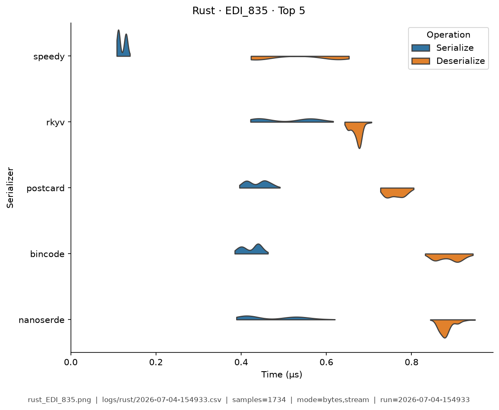
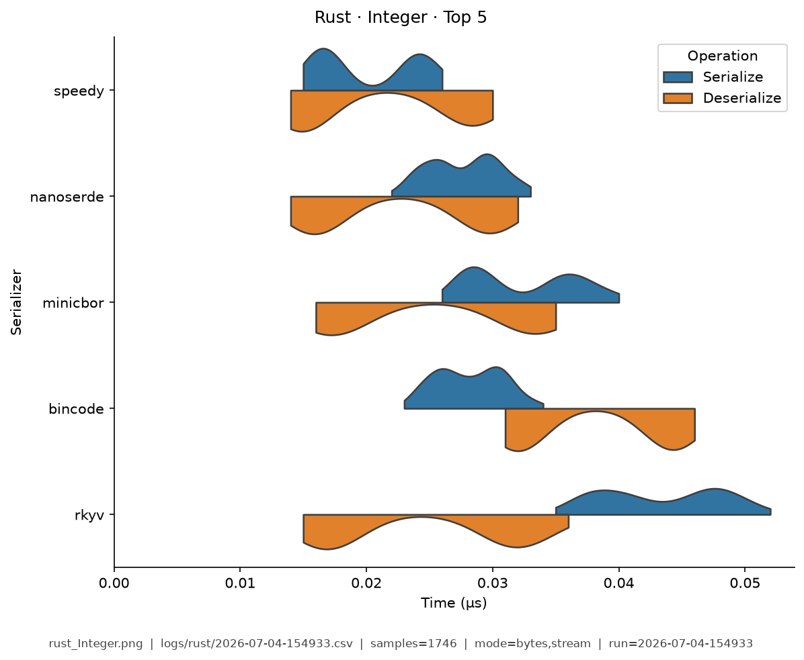
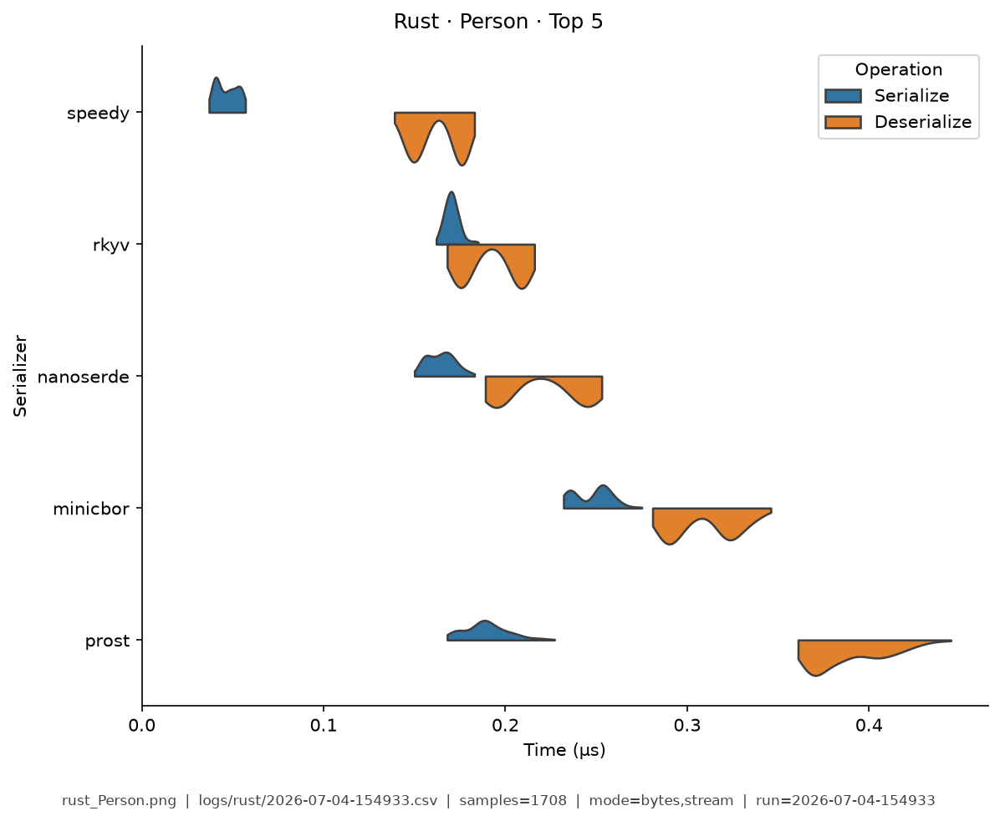
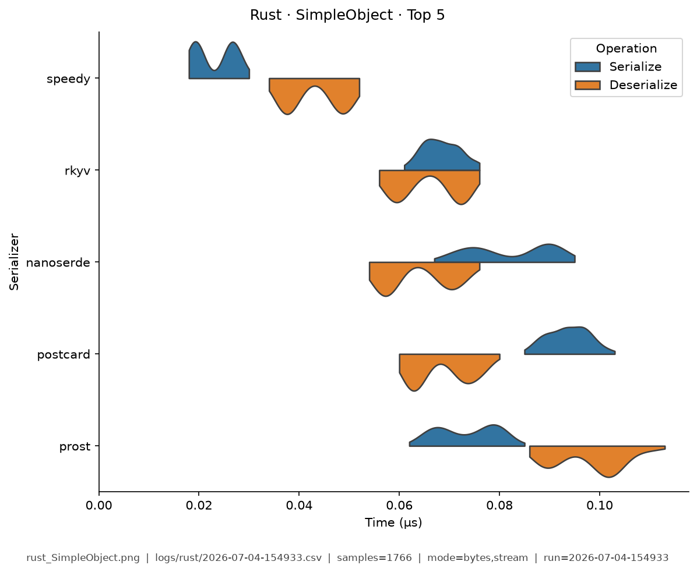
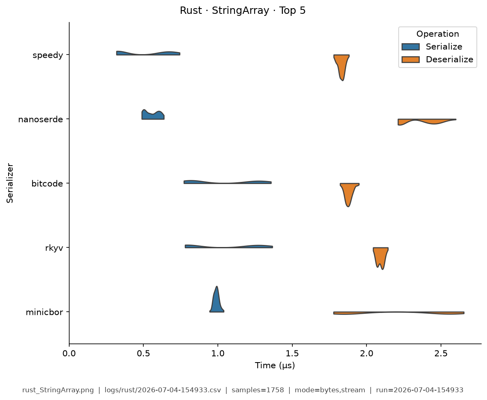
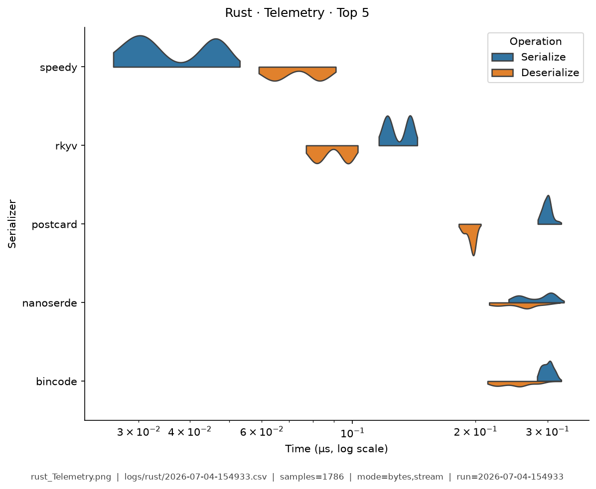

# Rust — Benchmark Results

**Generated:** 2026-07-04T15:50:14.945877

Published **local snapshot** (not regenerated by GitHub Actions). Numbers may differ if you re-run benchmarks on another machine.

Serializer inventory and caveats: [Rust overview](index.md). Methods: [Analysis Methodology](../analysis/ANALYSIS_METHODOLOGY.md). Metric definitions & importance tiers: [Metrics catalog](../analysis/METRICS.md).

## Pivot tables

Multi-way leaderboards emphasize **high-importance** metrics (configurable via `metrics.multi_way` in master config). Harness **modes** (CSV `StringOrStream`): **bytes mode** = in-memory buffer API; **stream mode** = write/read through a stream-like path. These names are *not* payload sizes. In each table, **bold** marks the semantic best value in that column (lowest time; highest ops/s). Ties are all bolded. Latency tables are in **microseconds** (µs).

### Rust: scientific summary (multi-way, important metrics)

Default multi-serializer view shows **high-importance** metrics only ([METRICS.md](../analysis/METRICS.md)). **Primary rank:** median total latency (lower is better). Pairwise / version A/B reports use the full metric set. Latency cells are **µs** (analysis storage remains ns).

| serializer | Median total (µs) | Median ser (µs) | Median deser (µs) | Ops/s (from mean) | Median size (B) | n | Version | Fidelity |
|---|---|---|---|---|---|---|---|---|
| speedy | **0.568** | 0.123 | 0.444 | 9.44e+06 | 460.5 | 1057 | 0.8.7 | 1.00 |
| rkyv | 0.846 | 0.324 | 0.522 | 5.19e+06 | 477.3 | 1036 | 0.8.17 | 1.00 |
| nanoserde | 0.895 | 0.264 | 0.63 | 5.49e+06 | 562 | 1066 | 0.1.37 | 1.00 |
| postcard | 0.975 | 0.317 | 0.657 | 4.2e+06 | 379.7 | 1053 | 1.1.3 | 1.00 |
| bincode | 1 | 0.278 | 0.723 | 4.21e+06 | 380.5 | 1040 | 2.0.1 | 1.00 |
| minicbor | 1.23 | 0.533 | 0.695 | 4.55e+06 | 409 | 1057 | 0.25.1 | 1.00 |
| prost | 1.39 | 0.344 | 1.04 | 1.99e+06 | 489.2 | 864 | 0.13.5 | 1.00 |
| rmp-serde | 1.63 | 0.576 | 1.05 | 2.53e+06 | 644.8 | 1071 | 1.3.1 | 1.00 |
| bitcode | 1.88 | 0.972 | 0.909 | 1.07e+06 | 370.8 | 1058 | 0.6.9 | 1.00 |
| sonic-rs | 2.12 | 0.86 | 1.26 | 2.52e+06 | 956.5 | 1047 | 0.3.17 | 1.00 |
| simd-json | 2.59 | 0.878 | 1.71 | 1.32e+06 | 956.5 | 1066 | 0.14.3 | 1.00 |
| ciborium | 2.97 | 0.497 | 2.47 | 2.01e+06 | 645 | 1037 | 0.2.2 | 1.00 |
| serde_json | 3.51 | 0.81 | 2.7 | 2.25e+06 | 956.5 | 1043 | 1.0.150 | 1.00 |
| bson | 3.72 | 1.08 | 2.64 | 1.52e+06 | 913.7 | 1031 | 2.15.0 | 1.00 |
| flexbuffers | 4.13 | 2.08 | 2.05 | 1.03e+06 | 772.3 | 1052 | 2.0.0 | 1.00 |


### Rust: Median Total Time (µs) by Serializer and API Mode

| serializer | bytes mode | stream mode |
|---|---|---|
| bincode | 0.61 | 0.75 |
| bitcode | 3.2 | 2.9 |
| bson | 2.5 | 1.7 |
| ciborium | 2.2 | 2.6 |
| flexbuffers | 3.8 | 4 |
| minicbor | 0.53 | 0.58 |
| nanoserde | 0.35 | 0.41 |
| postcard | 0.55 | 0.62 |
| prost | 0.56 | 0.58 |
| rkyv | 0.34 | 0.38 |
| rmp-serde | 1.4 | 1.5 |
| serde_json | 1.8 | 3 |
| simd-json | 1.9 | 2 |
| sonic-rs | 1.4 | 1.5 |
| speedy | **0.19** | **0.23** |


### Rust: Mean Total Time (µs) by Serializer and API Mode

| serializer | bytes mode | stream mode |
|---|---|---|
| bincode | 0.61 | 0.75 |
| bitcode | 3.2 | 2.9 |
| bson | 2.5 | 1.7 |
| ciborium | 2.2 | 2.6 |
| flexbuffers | 3.8 | 4 |
| minicbor | 0.53 | 0.58 |
| nanoserde | 0.35 | 0.41 |
| postcard | 0.55 | 0.62 |
| prost | 0.56 | 0.59 |
| rkyv | 0.34 | 0.38 |
| rmp-serde | 1.4 | 1.5 |
| serde_json | 1.8 | 3 |
| simd-json | 1.9 | 2 |
| sonic-rs | 1.4 | 1.5 |
| speedy | **0.19** | **0.23** |


### Rust: Ops/Sec (from mean) by Serializer and Data Type

| serializer | EDI_835 (M) | Integer (M) | Person (M) | SimpleObject (M) | StringArray (K) | Telemetry (M) |
|---|---|---|---|---|---|---|
| bincode | 0.79M | 17M | 1.6M | 5.9M | 290K | 1.9M |
| bitcode | 0.35M | 3.2M | 0.31M | 1.6M | 320K | 0.76M |
| bson | 0.14M | 6.3M | 0.4M | 2.3M | 150K | 0.18M |
| ciborium | 0.18M | 8.2M | 0.44M | 2.9M | 140K | 0.46M |
| flexbuffers | 0.1M | 4.3M | 0.26M | 1.3M | 150K | 0.3M |
| minicbor | 0.47M | 22M | 1.9M | 6.4M | 350K | 0.79M |
| nanoserde | 0.71M | 24M | 2.8M | 7.6M | 340K | 2M |
| postcard | 0.86M | 15M | 1.8M | 6.5M | 290K | 2M |
| prost | 0.51M | - | 1.8M | 6.1M | 280K | 1.6M |
| rkyv | 0.81M | 18M | 2.9M | 8M | 300K | 4.5M |
| rmp-serde | 0.31M | 11M | 0.72M | 3.7M | 270K | 0.88M |
| serde_json | 0.2M | 12M | 0.56M | 3.7M | 330K | 0.25M |
| simd-json | 0.2M | 4.4M | 0.54M | 2.6M | 240K | 0.25M |
| sonic-rs | 0.27M | 11M | 0.71M | 4.1M | 290K | 0.25M |
| speedy | **1.8M** | **32M** | **5.2M** | **18M** | **400K** | **10M** |

### Rust: within-category ranking (bytes mode only)

Compare serializers **within the same paradigm** (not across JSON vs zero-copy).
Values are mean Ser+Deser **ops/s** over fixtures, using the harness **bytes mode** only (buffer API: encode to a byte buffer / decode from a slice — not “number of bytes”). Higher is better. Stream mode is excluded here. Each numeric column uses **one** unit (K or M) for the whole column, with **2 significant digits** (display only; CSV unchanged). **Bold** = best in column (ops/s: highest).

#### JSON

| serializer | mean ops/s (bytes mode) (M) |
|---|---:|
| serde_json | **2.9M** |
| sonic-rs | 2.8M |
| simd-json | 1.4M |

#### Rust-centric binary

| serializer | mean ops/s (bytes mode) (M) |
|---|---:|
| speedy | **11M** |
| nanoserde | 6.3M |
| bincode | 4.6M |
| postcard | 4.4M |
| bitcode | 1.1M |

#### Schema / zero-copy family

| serializer | mean ops/s (bytes mode) (M) |
|---|---:|
| rkyv | **5.7M** |
| prost | 2.1M |
| flexbuffers | 1.1M |

#### Schemaless binary (interop)

| serializer | mean ops/s (bytes mode) (M) |
|---|---:|
| minicbor | **5.3M** |
| rmp-serde | 2.7M |
| ciborium | 2.1M |
| bson | 1.6M |

### Fidelity notes (Rust)

- **prost** maps ISO timestamps through millisecond integers; harness fidelity allows date-string drift on Person/Simple/Telemetry/EDI.
- **rkyv** timed deserialize **materializes** owned values for comparison; pure `access` (zero-copy) would be faster and is documented on the overview.
- **simd-json** serialize uses `serde_json` (crate optimizes parse).

## Violin plots

Density of serialize / deserialize timings (µs; log scale when medians span ≥5×). **Each plot shows only the top 5 serializers by mean total time** for that fixture (same rule for every language). Full rankings are in the pivot tables above. Provenance (fixture, CSV path, modes, *n*) is printed on each image.

### EDI_835

{ width="80%" }

### Integer

{ width="80%" }

### Person

{ width="80%" }

### SimpleObject

{ width="80%" }

### StringArray

{ width="80%" }

### Telemetry

{ width="80%" }

## Regenerate

Published snapshots are produced **locally** (not by GitHub Actions). After running benchmarks (each run creates a timestamped `YYYY-MM-DD-HHMMSS.csv`):

```bash
analyze-benchmarks              # all languages
analyze-benchmarks -l rust   # this language only
```

That refreshes this language's results tables and violin plots under `docs/analysis/plots/violin/`. The hub [Benchmark Results](../analysis/BENCHMARK_SUMMARY.md) is a **static** index and is not rewritten. Commit the updated `results.md` / plot paths as needed.


## Run configuration (important)

??? note "Show host, seed, serializers, and source CSV"

    Key fields from the run sidecar (`*.configs.json`, or legacy `*.environment.json`). Full metric definitions: [Metrics catalog](../analysis/METRICS.md). Optional blocks (`dataset`, `serializers`) appear only when captured.
    
    - **Source CSV:** `/home/leo/PycharmProjects/GLD/seriailizer-benchmark/logs/rust/2026-07-04-154933.csv`
    - run=2026-07-04-154933
    - language=rust
    - os=Linux 6.8.0-124-generic
    - cpu=12th Gen Intel(R) Core(TM) i7-12800H (20 threads)
    - ram=31.0 GiB
    - runtimes: rustc=rustc 1.96.0 (ac68faa20 2026-05-25), python=3.14.0, node=24.15.0
    - git=7cf884f dirty
    - seed=42
    - warmup_reps=1
    - serializers=15
    - metrics_profile=multi_way
    - **Serializers (from CSV):**
      - `bincode` @ 2.0.1
      - `bitcode` @ 0.6.9
      - `bson` @ 2.15.0
      - `ciborium` @ 0.2.2
      - `flexbuffers` @ 2.0.0
      - `minicbor` @ 0.25.1
      - `nanoserde` @ 0.1.37
      - `postcard` @ 1.1.3
      - `prost` @ 0.13.5
      - `rkyv` @ 0.8.17
      - `rmp-serde` @ 1.3.1
      - `serde_json` @ 1.0.150
      - `simd-json` @ 0.14.3
      - `sonic-rs` @ 0.3.17
      - `speedy` @ 0.8.7
