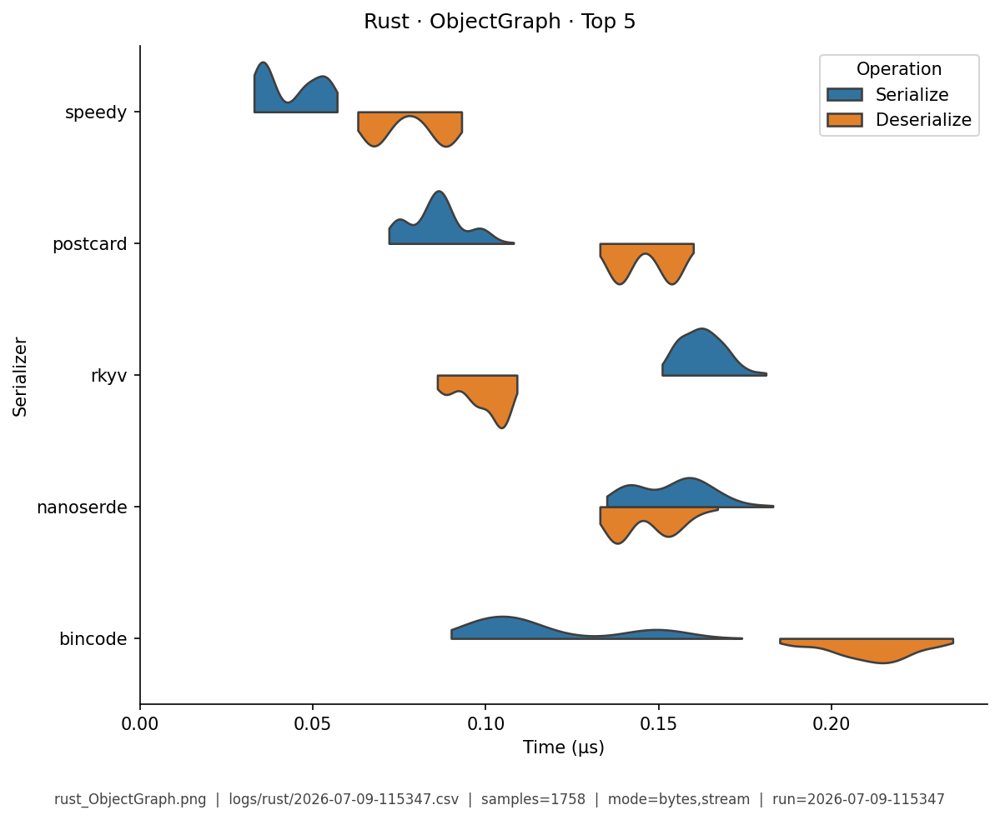

# Rust — Benchmark Results

**Generated:** 2026-07-09T11:56:35.122771

Published **local snapshot** (not regenerated by GitHub Actions). Numbers may differ if you re-run benchmarks on another machine.

Serializer inventory and caveats: [Rust overview](index.md). Methods: [Analysis Methodology](../analysis/ANALYSIS_METHODOLOGY.md). Metric definitions & importance tiers: [Metrics catalog](../analysis/METRICS.md).

## Pivot tables

Multi-way leaderboards emphasize **high-importance** metrics (configurable via `metrics.multi_way` in master config). Harness **modes** (CSV `StringOrStream`): **bytes mode** = in-memory buffer API; **stream mode** = write/read through a stream-like path. These names are *not* payload sizes. In each table, **bold** marks the semantic best value in that column (lowest time; highest ops/s). Ties are all bolded. Latency tables are in **microseconds** (µs).

### Summary

Default multi-serializer view shows **high-importance** metrics only ([METRICS.md](../analysis/METRICS.md)). **Primary rank:** median total latency (lower is better). Pairwise / version A/B reports use the full metric set. Latency cells are **µs** (analysis storage remains ns).

| serializer | Median total (µs) | Median ser (µs) | Median deser (µs) | Ops/s (from mean) | Median size (B) | Samples | Fidelity |
|---|---|---|---|---|---|---|---|
| speedy:0.8.7 | **0.52** | **0.124** | **0.396** | **9.34M** | 406.1 | 1228 | **1.00** |
| postcard:1.1.3 | 0.727 | 0.196 | 0.533 | 4.99M | 330.1 | 1271 | **1.00** |
| rkyv:0.8.17 | 0.762 | 0.282 | 0.479 | 5.04M | 422.3 | 1213 | **1.00** |
| bincode:2.0.1 | 0.832 | 0.235 | 0.597 | 4.02M | 330.9 | 1276 | **1.00** |
| nanoserde:0.1.37 | 0.847 | 0.269 | 0.577 | 4.91M | 497.1 | 1223 | **1.00** |
| rmp-serde:1.3.1 | 1.18 | 0.273 | 0.9 | 3.14M | 573.7 | 1245 | **1.00** |
| prost:0.13.5 | 1.19 | 0.256 | 0.936 | 2.27M | 417.3 | 1090 | **1.00** |
| minicbor:0.25.1 | 1.23 | 0.538 | 0.688 | 4.28M | 355.7 | 1240 | **1.00** |
| bitcode:0.6.9 | 1.65 | 0.846 | 0.799 | 1.06M | **325.6** | 1217 | **1.00** |
| sonic-rs:0.3.17 | 1.86 | 0.711 | 1.15 | 2.28M | 849 | 1241 | **1.00** |
| simd-json:0.14.3 | 2.45 | 0.836 | 1.61 | 1.23M | 849 | 1217 | **1.00** |
| ciborium:0.2.2 | 3.15 | 0.902 | 2.25 | 1.58M | 573.9 | 1219 | **1.00** |
| bson:2.15.0 | 3.52 | 1.01 | 2.5 | 1.42M | 819.1 | 1228 | **1.00** |
| flexbuffers:2.0.0 | 3.75 | 1.92 | 1.82 | 962K | 683.9 | 1239 | **1.00** |
| serde_json:1.0.150 | 4.39 | 1.25 | 3.15 | 1.56M | 849 | 1203 | **1.00** |


### Total Time

| serializer | bytes mode/mean | bytes mode/median | stream mode/mean | stream mode/median |
|---|---|---|---|---|
| speedy:0.8.7 | **0.184** | **0.183** | **0.227** | **0.227** |
| postcard:1.1.3 | 0.371 | 0.371 | 0.373 | 0.373 |
| rkyv:0.8.17 | 0.38 | 0.38 | 0.418 | 0.417 |
| bincode:2.0.1 | 0.504 | 0.502 | 0.514 | 0.513 |
| nanoserde:0.1.37 | 0.374 | 0.375 | 0.489 | 0.488 |
| rmp-serde:1.3.1 | 0.723 | 0.723 | 0.688 | 0.685 |
| prost:0.13.5 | 0.641 | 0.638 | 0.611 | 0.611 |
| minicbor:0.25.1 | 0.568 | 0.565 | 0.647 | 0.644 |
| bitcode:0.6.9 | 1.86 | 1.83 | 2.02 | 2.01 |
| sonic-rs:0.3.17 | 0.859 | 0.859 | 0.876 | 0.875 |
| simd-json:0.14.3 | 1.27 | 1.27 | 1.28 | 1.28 |
| ciborium:0.2.2 | 1.5 | 1.49 | 2.11 | 2.1 |
| bson:2.15.0 | 1.73 | 1.73 | 1.91 | 1.92 |
| flexbuffers:2.0.0 | 2.76 | 2.81 | 2.77 | 2.77 |
| serde_json:1.0.150 | 1.12 | 1.12 | 3.28 | 3.22 |


### Ops/Sec

| serializer | EDI_835 | Integer | ObjectGraph | Person | SimpleObject | StringArray | Telemetry |
|---|---|---|---|---|---|---|---|
| bincode:2.0.1 | 0.76M | 14M | 3M | 2M | 7M | 300K | 2.5M |
| bitcode:0.6.9 | 0.32M | 3.3M | 0.78M | 0.54M | 1.5M | 350K | 0.8M |
| bson:2.15.0 | 0.14M | 6.5M | 0.65M | 0.58M | 2.3M | 130K | 0.17M |
| ciborium:0.2.2 | 0.17M | 6.7M | 0.98M | 0.67M | 2.7M | 130K | 0.46M |
| flexbuffers:2.0.0 | 0.096M | 4.3M | 0.46M | 0.36M | 1.3M | 160K | 0.29M |
| minicbor:0.25.1 | 0.45M | 23M | 2.6M | 1.8M | 6.1M | 280K | 0.65M |
| nanoserde:0.1.37 | 0.69M | 23M | 3.5M | 2.7M | 7.4M | 310K | 2M |
| postcard:1.1.3 | 0.89M | 15M | 4.6M | 2.7M | 10M | 320K | 3.6M |
| prost:0.13.5 | 0.54M | - | 3M | 1.6M | 7M | 280K | 1.7M |
| rkyv:0.8.17 | 0.8M | 19M | 4M | 2.6M | 8.2M | 320K | 4.8M |
| rmp-serde:1.3.1 | 0.36M | 12M | 2.2M | 1.4M | 5.6M | 280K | 1.5M |
| serde_json:1.0.150 | 0.19M | 8.9M | 1.3M | 0.89M | 3.2M | 230K | 0.24M |
| simd-json:0.14.3 | 0.18M | 4M | 0.88M | 0.79M | 2.1M | 230K | 0.24M |
| sonic-rs:0.3.17 | 0.24M | 8.8M | 1.6M | 1.2M | 4.5M | 300K | 0.25M |
| speedy:0.8.7 | **1.9M** | **33M** | **9.7M** | **5.4M** | **19M** | **380K** | **8.9M** |

### Within-category ranking

Compare serializers **within the same paradigm** (not across JSON vs zero-copy).
Values are mean Ser+Deser **ops/s** over fixtures, using the harness **bytes mode** only (buffer API: encode to a byte buffer / decode from a slice — not “number of bytes”). Higher is better. Stream mode is excluded here. Each numeric column uses **one** unit (K or M) for the whole column, with **2 significant digits** (display only; CSV unchanged). **Bold** = best in column (ops/s: highest).

#### JSON

| serializer | mean ops/s (bytes mode) (M) |
|---|---:|
| sonic-rs:0.3.17 | **2.4M** |
| serde_json:1.0.150 | 2.1M |
| simd-json:0.14.3 | 1.2M |

#### Rust-centric binary

| serializer | mean ops/s (bytes mode) (M) |
|---|---:|
| speedy:0.8.7 | **11M** |
| nanoserde:0.1.37 | 5.6M |
| postcard:1.1.3 | 5.3M |
| bincode:2.0.1 | 4.3M |
| bitcode:0.6.9 | 1.1M |

#### Schema / zero-copy family

| serializer | mean ops/s (bytes mode) (M) |
|---|---:|
| rkyv:0.8.17 | **5.7M** |
| prost:0.13.5 | 2.3M |
| flexbuffers:2.0.0 | 1M |

#### Schemaless binary (interop)

| serializer | mean ops/s (bytes mode) (M) |
|---|---:|
| minicbor:0.25.1 | **4.9M** |
| rmp-serde:1.3.1 | 3.4M |
| ciborium:0.2.2 | 1.7M |
| bson:2.15.0 | 1.5M |

### Fidelity notes (Rust)

- **prost** maps ISO timestamps through millisecond integers; harness fidelity allows date-string drift on Person/Simple/Telemetry/EDI.
- **rkyv** timed deserialize **materializes** owned values for comparison; pure `access` (zero-copy) would be faster and is documented on the overview.
- **simd-json** serialize uses `serde_json` (crate optimizes parse).

## Violin plots

Density of serialize / deserialize timings (µs; log scale when medians span ≥5×). **Each plot shows only the top 5 serializers by mean total time** for that fixture (same rule for every language). Full rankings are in the pivot tables above. Provenance (fixture, CSV path, modes, *n*) is printed on each image.

### EDI_835

{ width="80%" }

### Integer

{ width="80%" }

### ObjectGraph

{ width="80%" }

### Person

{ width="80%" }

### SimpleObject

{ width="80%" }

### StringArray

{ width="80%" }

### Telemetry

{ width="80%" }

## Regenerate

Published snapshots are produced **locally** (not by GitHub Actions). After running benchmarks (each run creates a timestamped `YYYY-MM-DD-HHMMSS.csv`):

```bash
analyze-benchmarks              # all languages
analyze-benchmarks -l rust   # this language only
```

That refreshes this language's results tables and violin plots under `docs/analysis/plots/violin/`. The hub [Benchmark Results](../analysis/BENCHMARK_SUMMARY.md) is a **static** index and is not rewritten. Commit the updated `results.md` / plot paths as needed.


## Run configuration (important)

??? note "Show host, seed, serializers, and source CSV"

    Key fields from the run sidecar (`*.configs.json`, or legacy `*.environment.json`). Full metric definitions: [Metrics catalog](../analysis/METRICS.md). Optional blocks (`dataset`, `serializers`) appear only when captured.
    
    - **Source CSV:** `../logs/rust/2026-07-09-115347.csv`
    - run=2026-07-09-115347
    - language=rust
    - os=Linux 6.8.0-124-generic
    - cpu=12th Gen Intel(R) Core(TM) i7-12800H (20 threads)
    - ram=31.0 GiB
    - runtimes: rustc=rustc 1.96.0 (ac68faa20 2026-05-25), python=3.14.0, node=24.15.0
    - git=8d8ab58 dirty
    - seed=42
    - warmup_reps=1
    - serializers=15
    - metrics_profile=multi_way
    - **Fixtures (config):** Person, Integer, Telemetry, SimpleObject, StringArray, EDI_835, ObjectGraph
    - **Serializers (from CSV):**
      - `bincode` @ 2.0.1
      - `bitcode` @ 0.6.9
      - `bson` @ 2.15.0
      - `ciborium` @ 0.2.2
      - `flexbuffers` @ 2.0.0
      - `minicbor` @ 0.25.1
      - `nanoserde` @ 0.1.37
      - `postcard` @ 1.1.3
      - `prost` @ 0.13.5
      - `rkyv` @ 0.8.17
      - `rmp-serde` @ 1.3.1
      - `serde_json` @ 1.0.150
      - `simd-json` @ 0.14.3
      - `sonic-rs` @ 0.3.17
      - `speedy` @ 0.8.7
