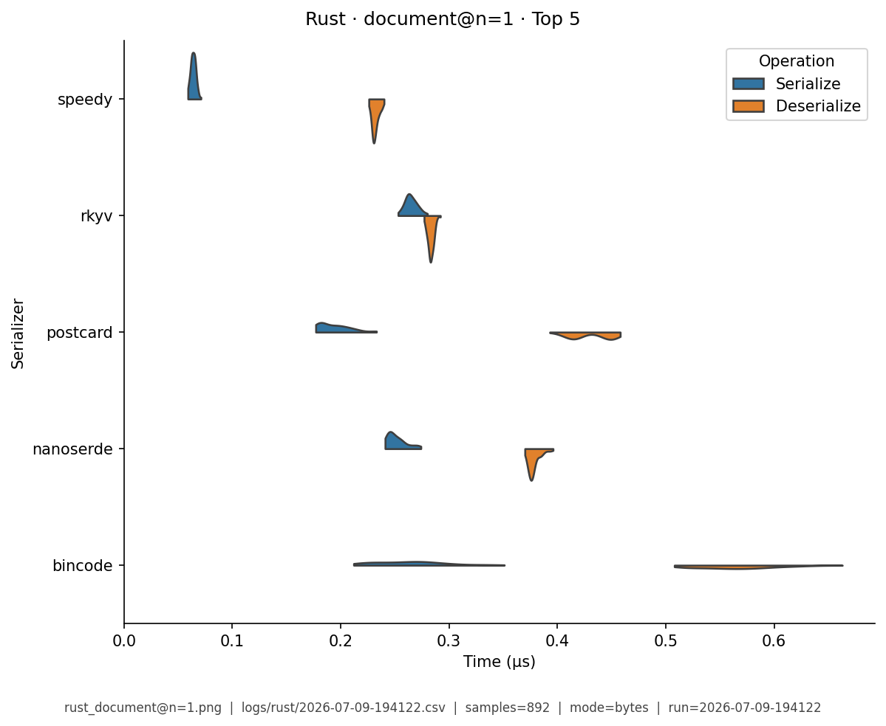
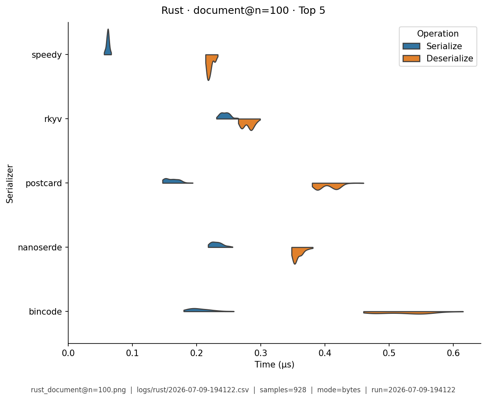
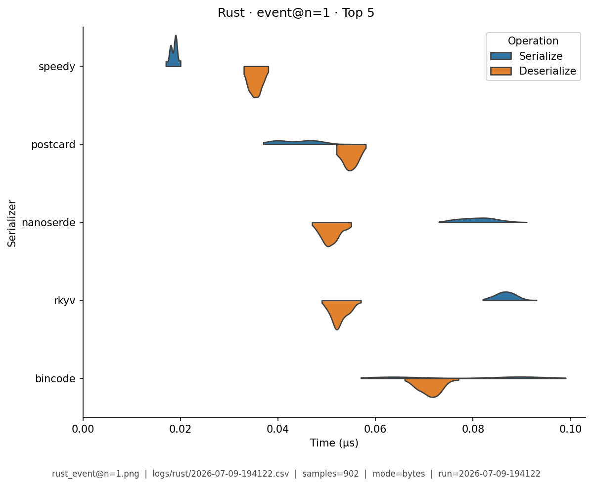
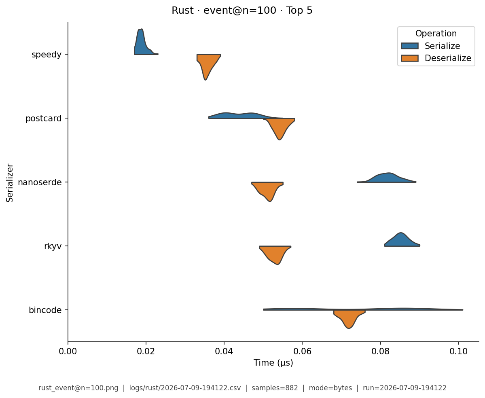
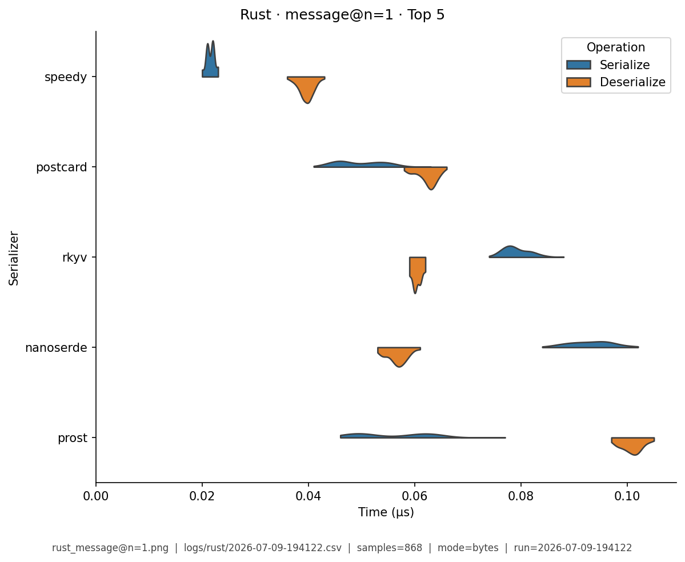
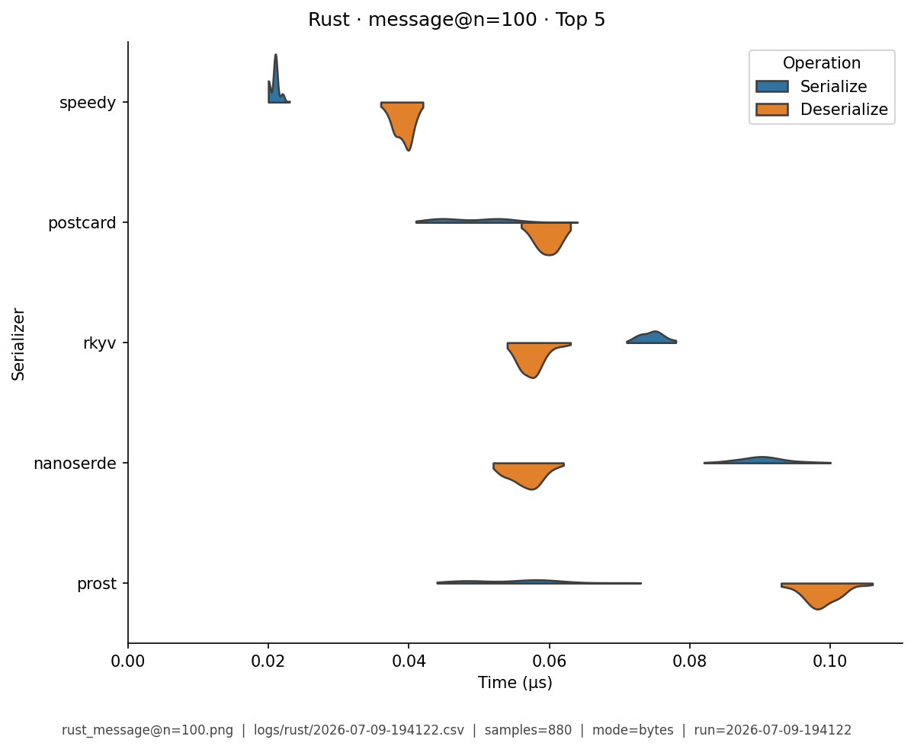
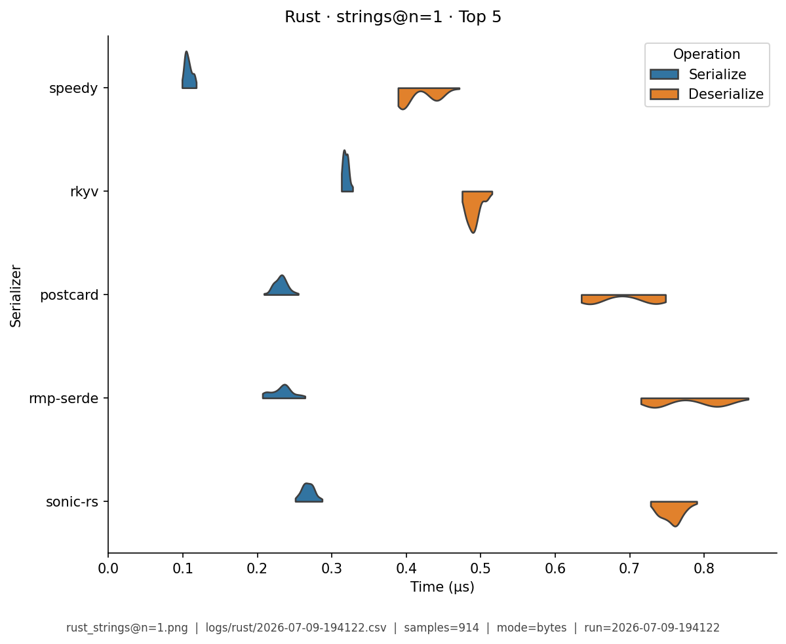
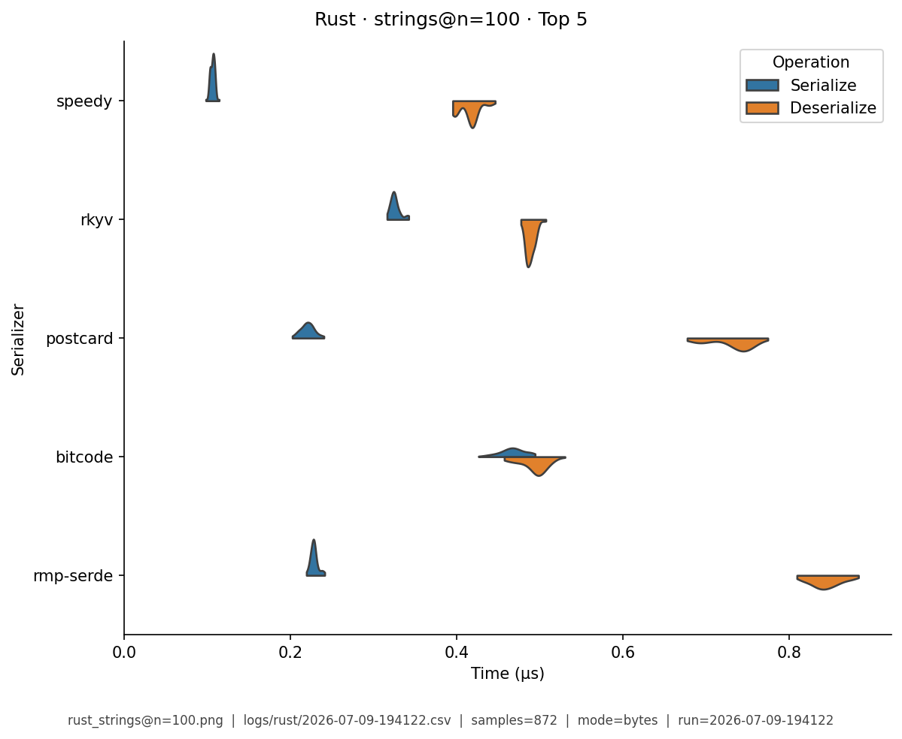
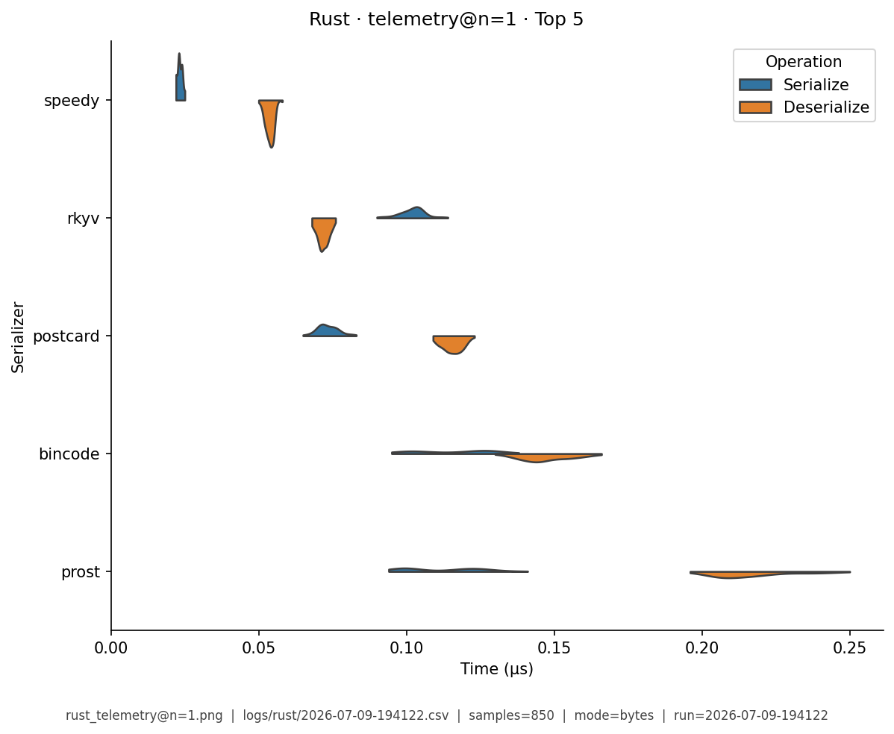
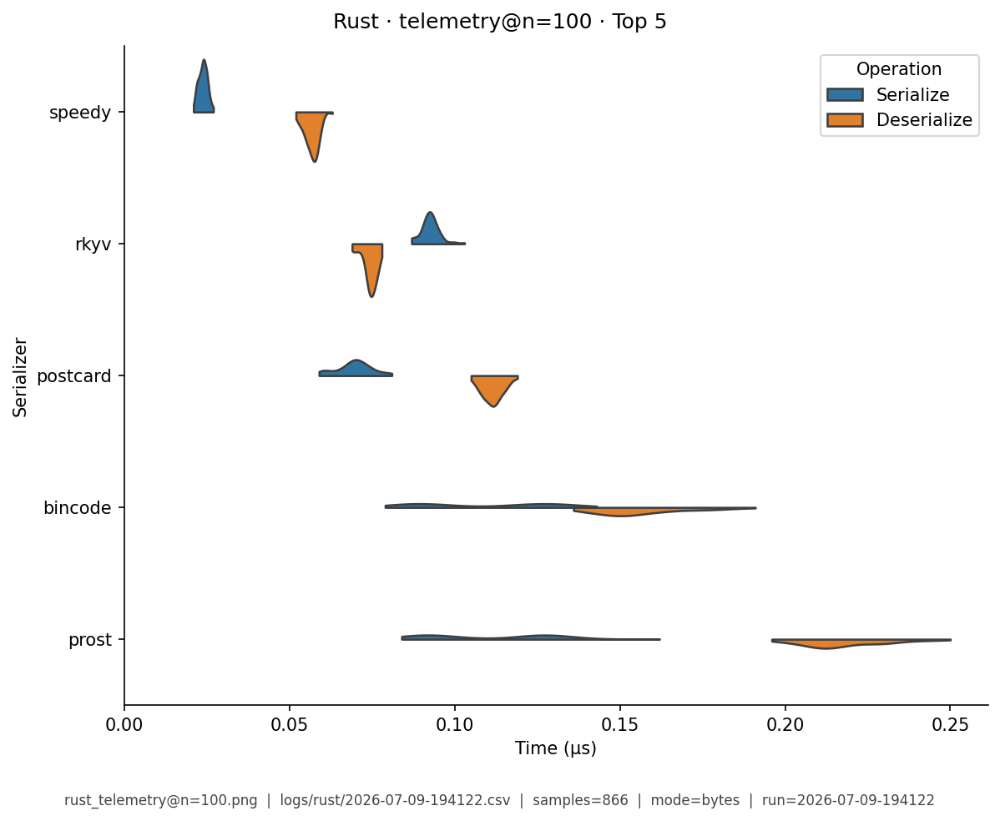

# Rust — Benchmark Results

**Generated:** 2026-07-09T21:04:42.406940

Published **local snapshot** (not regenerated by GitHub Actions). Numbers may differ if you re-run benchmarks on another machine.

Serializer inventory and caveats: [Rust overview](index.md). Methods: [Analysis Methodology](../analysis/ANALYSIS_METHODOLOGY.md). Metric definitions & importance tiers: [Metrics catalog](../analysis/METRICS.md).

## Pivot tables

Multi-way leaderboards emphasize **high-importance** metrics (configurable via `metrics.multi_way` in master config). Harness **modes** (CSV `StringOrStream`): **bytes mode** = in-memory buffer API; **stream mode** = write/read through a stream-like path. These names are *not* payload sizes. In each table, **bold** marks the semantic best value in that column (lowest time; highest ops/s). Ties are all bolded. Latency tables are in **microseconds** (µs). Data Model v2 fixtures use `type@n=<DataTypeInstanceCount>` labels.

### Summary

Default multi-serializer view shows **high-importance** metrics only ([METRICS.md](../analysis/METRICS.md)). **Primary rank:** median total latency (lower is better). Pairwise / version A/B reports use the full metric set. Latency cells are **µs** (analysis storage remains ns).

| serializer | Median total (µs) | Median ser (µs) | Median deser (µs) | Ops/s (from mean) | Median size (B) | Samples | Fidelity |
|---|---|---|---|---|---|---|---|
| speedy:0.8.7 | **0.199** | **0.0466** | **0.153** | **10.6M** | 227.2 | 885 | **1.00** |
| rkyv:0.8.17 | 0.359 | 0.167 | 0.191 | 4.71M | 248 | 823 | **1.00** |
| postcard:1.1.3 | 0.39 | 0.114 | 0.275 | 5.48M | 188.8 | 923 | **1.00** |
| nanoserde:0.1.37 | 0.48 | 0.219 | 0.26 | 3.94M | 276.8 | 886 | **1.00** |
| bincode:2.0.1 | 0.491 | 0.155 | 0.338 | 3.58M | 189 | 902 | **1.00** |
| prost:0.13.5 | 0.573 | 0.168 | 0.404 | 3.55M | 198.6 | 923 | **1.00** |
| minicbor:0.25.1 | 0.622 | 0.304 | 0.316 | 3.21M | 201 | 880 | **1.00** |
| rmp-serde:1.3.1 | 0.642 | 0.158 | 0.481 | 3.02M | 343.4 | 892 | **1.00** |
| sonic-rs:0.3.17 | 1.04 | 0.453 | 0.591 | 2.02M | 447.4 | 898 | **1.00** |
| bitcode:0.6.9 | 1.19 | 0.669 | 0.519 | 1.03M | **187.2** | 886 | **1.00** |
| serde_json:1.0.150 | 1.2 | 0.403 | 0.795 | 1.73M | 447.4 | 897 | **1.00** |
| simd-json:0.14.3 | 1.32 | 0.396 | 0.927 | 1.22M | 447.4 | 885 | **1.00** |
| ciborium:0.2.2 | 1.43 | 0.29 | 1.14 | 1.34M | 333.8 | 885 | **1.00** |
| bson:2.15.0 | 1.85 | 0.603 | 1.25 | 1.06M | 463 | 908 | **1.00** |
| flexbuffers:2.0.0 | 2.22 | 1.26 | 0.965 | 711K | 451.2 | 903 | **1.00** |


### Total Time

| serializer | bytes mode/mean | bytes mode/median | stream mode/mean | stream mode/median |
|---|---|---|---|---|
| speedy:0.8.7 | **0.0611** | **0.061** | - | - |
| rkyv:0.8.17 | 0.14 | 0.139 | - | - |
| postcard:1.1.3 | 0.112 | 0.111 | - | - |
| nanoserde:0.1.37 | 0.15 | 0.149 | - | - |
| bincode:2.0.1 | 0.2 | 0.201 | - | - |
| prost:0.13.5 | 0.157 | 0.156 | - | - |
| minicbor:0.25.1 | 0.176 | 0.175 | - | - |
| rmp-serde:1.3.1 | 0.2 | 0.201 | - | - |
| sonic-rs:0.3.17 | 0.269 | 0.271 | - | - |
| bitcode:0.6.9 | 0.722 | 0.722 | - | - |
| serde_json:1.0.150 | 0.314 | 0.316 | - | - |
| simd-json:0.14.3 | 0.463 | 0.458 | - | - |
| ciborium:0.2.2 | 0.441 | 0.439 | - | - |
| bson:2.15.0 | 0.523 | 0.519 | - | - |
| flexbuffers:2.0.0 | 0.886 | 0.885 | - | - |


### Ops/Sec

| serializer | document@n=1 | document@n=100 | event@n=1 | event@n=100 | message@n=1 | message@n=100 | strings@n=1 | strings@n=100 | telemetry@n=1 | telemetry@n=100 |
|---|---|---|---|---|---|---|---|---|---|---|
| bincode:2.0.1 | 1.2M | 1.4M | 6.7M | 6.9M | 5M | 5.1M | 0.96M | 0.92M | 3.8M | 3.8M |
| bitcode:0.6.9 | 0.43M | 0.44M | 1.5M | 1.6M | 1.4M | 1.5M | 0.79M | 1M | 0.8M | 0.82M |
| bson:2.15.0 | 0.29M | 0.31M | 2.2M | 2.2M | 1.9M | 2M | 0.38M | 0.38M | 0.43M | 0.42M |
| ciborium:0.2.2 | 0.32M | 0.36M | 2.7M | 2.7M | 2.3M | 2.4M | 0.43M | 0.43M | 0.92M | 0.89M |
| flexbuffers:2.0.0 | 0.19M | 0.21M | 1.3M | 1.3M | 1.1M | 1.2M | 0.42M | 0.4M | 0.49M | 0.47M |
| minicbor:0.25.1 | 1M | 1.1M | 6.7M | 6.8M | 5.7M | 6M | 0.76M | 0.91M | 1.6M | 1.5M |
| nanoserde:0.1.37 | 1.6M | 1.7M | 7.6M | 7.5M | 6.7M | 6.8M | 0.83M | 0.88M | 3M | 2.8M |
| postcard:1.1.3 | 1.6M | 1.8M | 10M | 10M | 8.9M | 9.2M | 1.1M | 1.1M | 5.3M | 5.5M |
| prost:0.13.5 | 0.98M | 1.1M | 6.4M | 6.4M | 6.4M | 6.5M | 0.78M | 0.81M | 3M | 3M |
| rkyv:0.8.17 | 1.8M | 1.9M | 7.2M | 7.2M | 7.2M | 7.6M | 1.2M | 1.2M | 5.8M | 6M |
| rmp-serde:1.3.1 | 0.7M | 0.78M | 6.1M | 6M | 5M | 5.2M | 0.99M | 0.93M | 2.3M | 2.2M |
| serde_json:1.0.150 | 0.39M | 0.44M | 3.8M | 3.6M | 3.2M | 3.2M | 0.77M | 0.72M | 0.59M | 0.6M |
| simd-json:0.14.3 | 0.39M | 0.43M | 2.2M | 2.3M | 2.2M | 2.3M | 0.65M | 0.62M | 0.58M | 0.58M |
| sonic-rs:0.3.17 | 0.44M | 0.5M | 4.3M | 4.3M | 3.7M | 3.7M | 0.98M | 0.92M | 0.66M | 0.65M |
| speedy:0.8.7 | **3.4M** | **3.5M** | **19M** | **18M** | **16M** | **17M** | **1.9M** | **1.9M** | **13M** | **12M** |

### Within-category ranking

Compare serializers **within the same paradigm** (not across JSON vs zero-copy).
Values are mean Ser+Deser **ops/s** over fixtures, using the harness **bytes mode** only (buffer API: encode to a byte buffer / decode from a slice — not “number of bytes”). Higher is better. Stream mode is excluded here. Each numeric column uses **one** unit (K or M) for the whole column, with **2 significant digits** (display only; CSV unchanged). **Bold** = best in column (ops/s: highest).

#### JSON

| serializer | mean ops/s (bytes mode) (M) |
|---|---:|
| sonic-rs:0.3.17 | **2M** |
| serde_json:1.0.150 | 1.7M |
| simd-json:0.14.3 | 1.2M |

#### Rust-centric binary

| serializer | mean ops/s (bytes mode) (M) |
|---|---:|
| speedy:0.8.7 | **11M** |
| postcard:1.1.3 | 5.5M |
| nanoserde:0.1.37 | 3.9M |
| bincode:2.0.1 | 3.6M |
| bitcode:0.6.9 | 1M |

#### Schema / zero-copy family

| serializer | mean ops/s (bytes mode) (M) |
|---|---:|
| rkyv:0.8.17 | **4.7M** |
| prost:0.13.5 | 3.6M |
| flexbuffers:2.0.0 | 0.71M |

#### Schemaless binary (interop)

| serializer | mean ops/s (bytes mode) (M) |
|---|---:|
| minicbor:0.25.1 | **3.2M** |
| rmp-serde:1.3.1 | 3M |
| ciborium:0.2.2 | 1.3M |
| bson:2.15.0 | 1.1M |

### Fidelity notes (Rust)

- **prost** maps ISO timestamps through millisecond integers; harness fidelity allows date-string drift on v2 types that carry timestamps (e.g. message/event/document/telemetry).
- **rkyv** timed deserialize **materializes** owned values for comparison; pure `access` (zero-copy) would be faster and is documented on the overview.
- **simd-json** serialize uses `serde_json` (crate optimizes parse).

## Violin plots

Density of serialize / deserialize timings (µs; log scale when medians span ≥5×). **Each plot shows only the top 5 serializers by mean total time** for that fixture (same rule for every language). Full rankings are in the pivot tables above. Provenance (fixture, CSV path, modes, *n*) is printed on each image.

### document@n=1

{ width="80%" }

### document@n=100

{ width="80%" }

### event@n=1

{ width="80%" }

### event@n=100

{ width="80%" }

### message@n=1

{ width="80%" }

### message@n=100

{ width="80%" }

### strings@n=1

{ width="80%" }

### strings@n=100

{ width="80%" }

### telemetry@n=1

{ width="80%" }

### telemetry@n=100

{ width="80%" }

## Regenerate

Published snapshots are produced **locally** (not by GitHub Actions). After running benchmarks (each run creates a timestamped `YYYY-MM-DD-HHMMSS.csv`):

```bash
analyze-benchmarks              # all languages
analyze-benchmarks -l rust   # this language only
```

That refreshes this language's results tables and violin plots under `docs/analysis/plots/violin/`. The hub [Benchmark Results](../analysis/BENCHMARK_SUMMARY.md) is a **static** index and is not rewritten. Commit the updated `results.md` / plot paths as needed.


## Run configuration (important)

??? note "Show host, seed, serializers, and source CSV"

    Key fields from the run sidecar (`*.configs.json`, or legacy `*.environment.json`). Full metric definitions: [Metrics catalog](../analysis/METRICS.md). Optional blocks (`dataset`, `serializers`) appear only when captured.
    
    - **Source CSV:** `logs/rust/2026-07-09-194122.csv`
    - run=2026-07-09-194122
    - language=rust
    - os=Linux 6.8.0-124-generic
    - cpu=12th Gen Intel(R) Core(TM) i7-12800H (20 threads)
    - ram=31.0 GiB
    - runtimes: rustc=rustc 1.96.0 (ac68faa20 2026-05-25), python=3.14.0, node=24.15.0
    - git=8ab4030 dirty
    - warmup_reps=1
    - serializers=15
    - metrics_profile=multi_way
    - **Fixtures (config):** message, document, telemetry, strings, event
    - **Serializers (from CSV):**
      - `bincode` @ 2.0.1
      - `bitcode` @ 0.6.9
      - `bson` @ 2.15.0
      - `ciborium` @ 0.2.2
      - `flexbuffers` @ 2.0.0
      - `minicbor` @ 0.25.1
      - `nanoserde` @ 0.1.37
      - `postcard` @ 1.1.3
      - `prost` @ 0.13.5
      - `rkyv` @ 0.8.17
      - `rmp-serde` @ 1.3.1
      - `serde_json` @ 1.0.150
      - `simd-json` @ 0.14.3
      - `sonic-rs` @ 0.3.17
      - `speedy` @ 0.8.7
