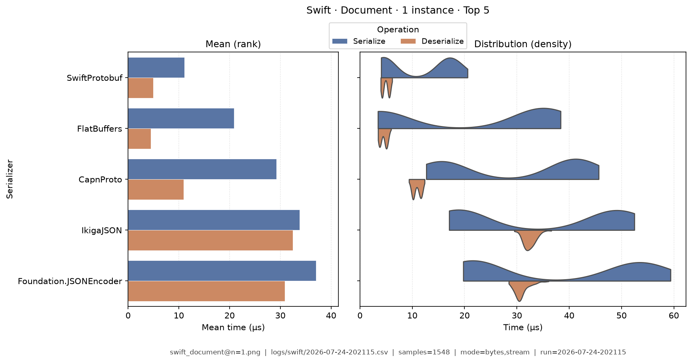
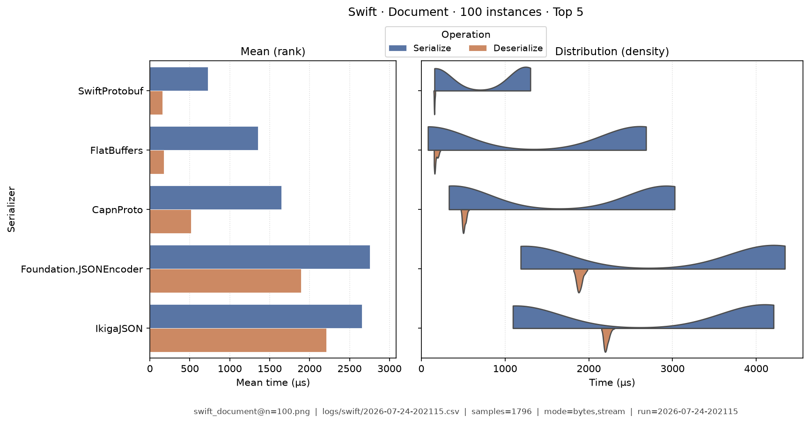
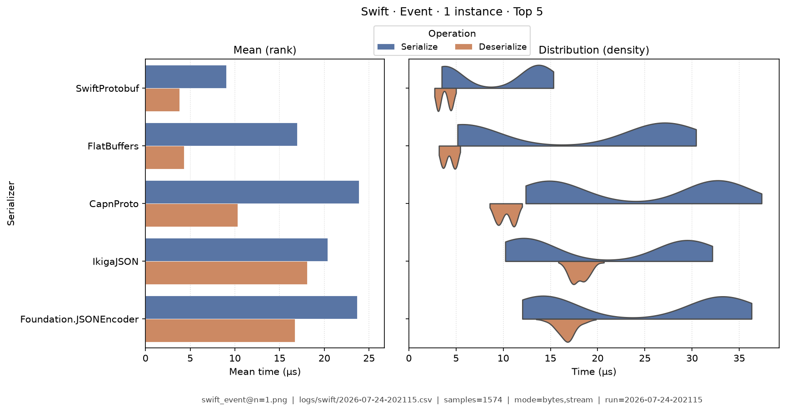
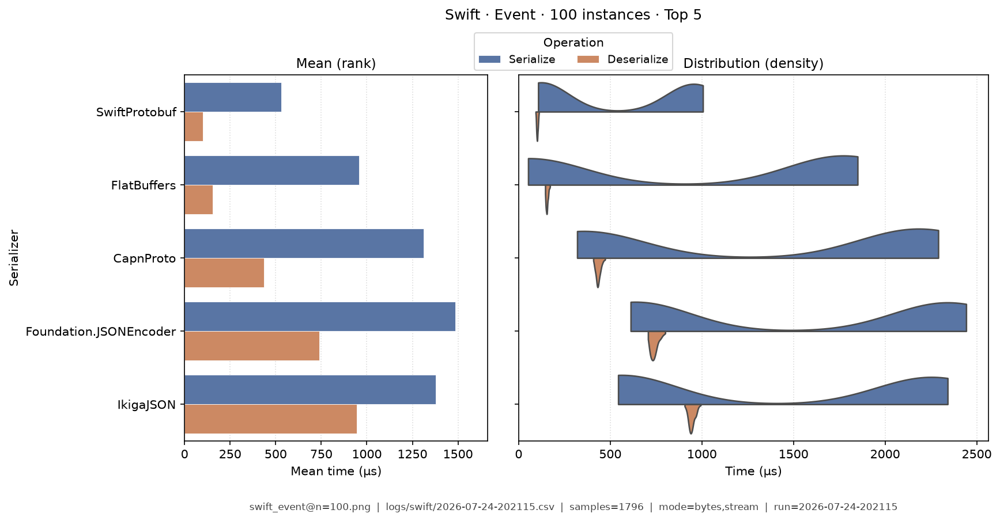
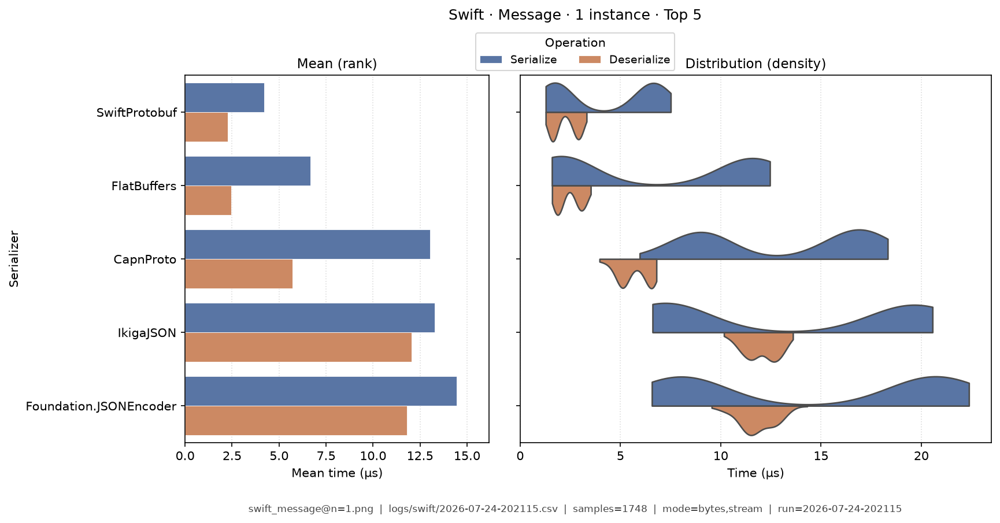
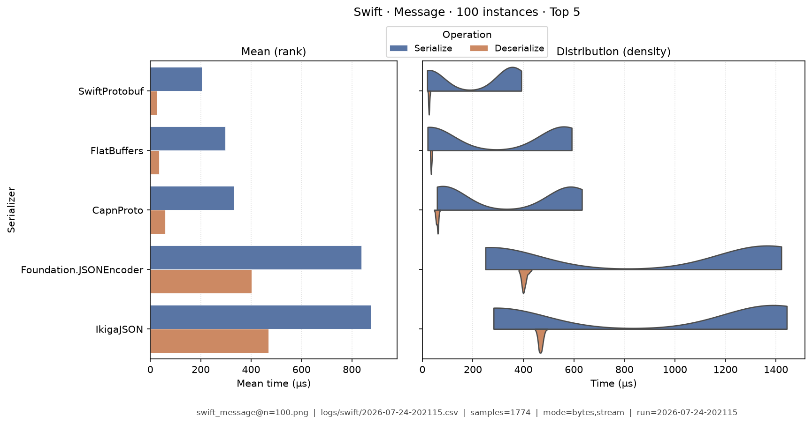
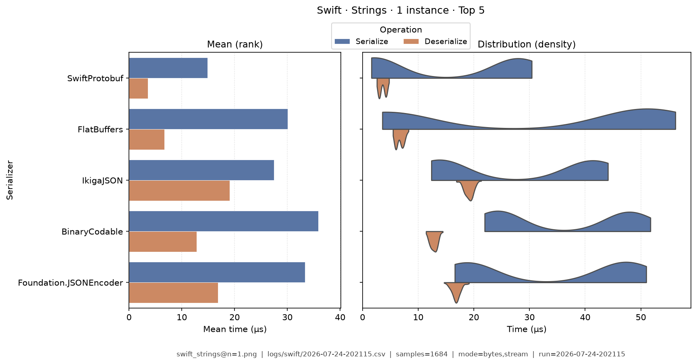
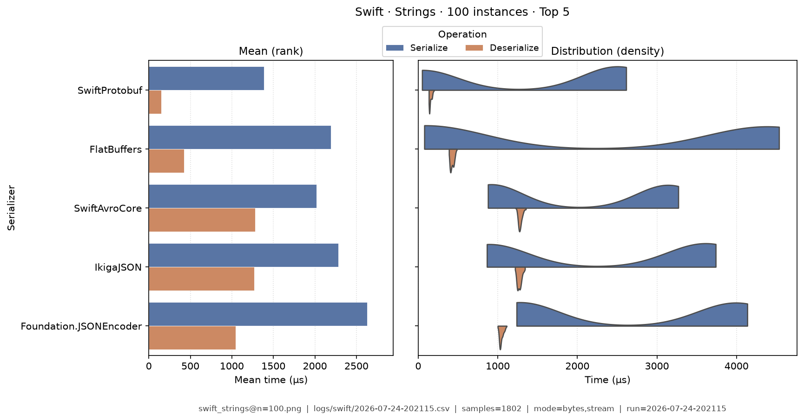
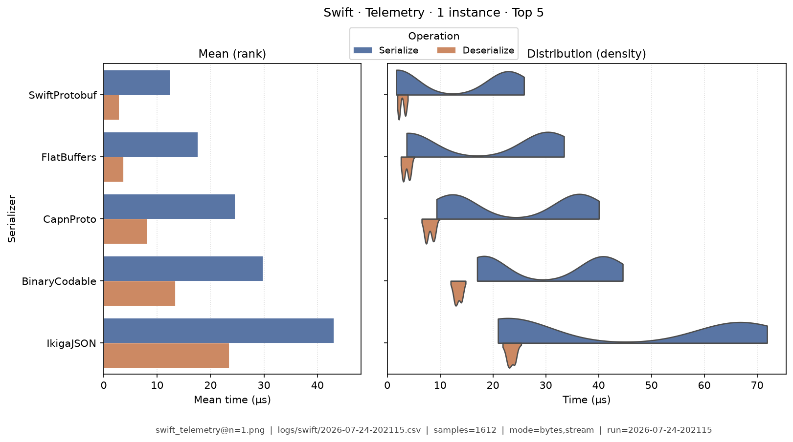
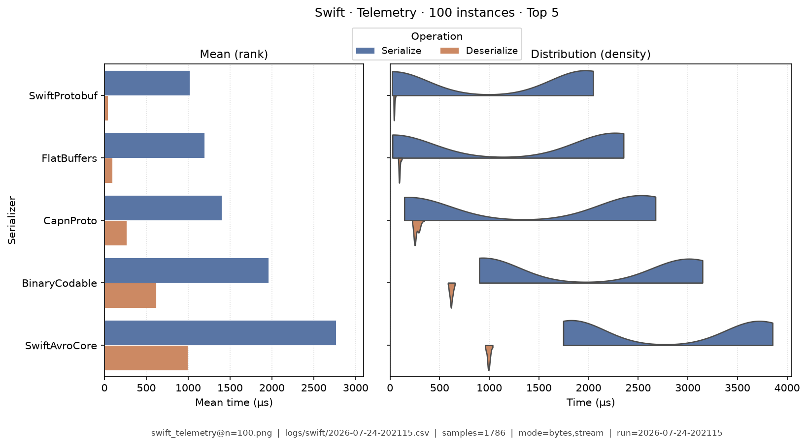

# Swift — Benchmark Results

**Generated:** 2026-07-24T20:24:25.567549

This page is a **snapshot of measured numbers** for Swift on one machine. Continuous integration deploys the documentation site; it does **not** re-run analysis when docs are published. Re-running benchmarks on another computer will usually change the numbers a little.

| Topic | Where to read |
|-------|---------------|
| Which libraries we measure, and caveats | [Swift overview](index.md) |
| I/O modes and run modes | [Modes](../analysis/modes.md) |
| How CSVs become these tables | [Analysis methodology](../analysis/ANALYSIS_METHODOLOGY.md) |
| What each metric means | [Metrics catalog](../analysis/METRICS.md) |
| All languages’ result links | [Results summary](../analysis/BENCHMARK_SUMMARY.md) |

## How to read these tables

Compare serializers **inside this language**. Prefer the same [category](../analysis/serialization_categories.md) (for example JSON with JSON) and the same [I/O mode](../analysis/modes.md) so the comparison stays fair.

| Term | Meaning |
|------|---------|
| **data type** | Sample shape: `message`, `document`, `telemetry`, `strings`, or `event` (CSV `TestDataName`; older text may say “fixture”) |
| **bytes mode** | In-memory buffer API (encode to bytes / decode from a buffer). On C# this is often the **string** path — see [Modes](../analysis/modes.md). |
| **stream mode** | Stream-style API (write/read through a stream). May be native or adapted — see [Modes](../analysis/modes.md). |
| **µs** | Microseconds (one microsecond = 1000 nanoseconds). Tables show µs; raw CSVs store nanoseconds. |
| **Ops/s** | Operations per second from mean total time — higher is faster |
| **Bold** | Best value in that column (lowest time/size; highest ops/s). Ties are all bolded. |

Rows are sorted by **serializer name** (easy lookup), not by rank. Batch workloads appear as **Data type · N instances** (for example Message · 100 instances). Default multi-serializer tables show **high-importance** metrics only; pairwise / version A/B reports can show the full set ([Metrics](../analysis/METRICS.md)).

> **Stream honesty:** all stream rows are **`adapted`** (in-memory encode/decode then dump to a stream, or equivalent). Do **not** treat stream columns as proof of incremental I/O. Labels: **adapted** 140. See [Modes — stream honesty](../analysis/modes.md#three-levels-of-stream-honesty).


## Summary tables

### Summary

One row per serializer (averaged across data types; bytes mode preferred when both exist). Only **high-importance** columns appear here by default ([Metrics catalog](../analysis/METRICS.md)). Times are **µs**. **Bold** = best in that column.

| serializer | Median total (µs) | Median ser (µs) | Median deser (µs) | Ops/s (from mean) | Median size (B) | Samples | Fidelity |
|---|---|---|---|---|---|---|---|
| BinaryCodable:4.0.0 | 1,820 | 1,270 | 554 | 11.4K | 13.4K | 1751 | **1.00** |
| CapnProto:capnproto-1.0.2 | 1,000 | 787 | 216 | 18.5K | 18.3K | 1686 | **1.00** |
| FlatBuffers:24.3.25 | 692 | 602 | 90.3 | 47K | 17.4K | 1721 | **1.00** |
| Foundation.JSONEncoder:Foundation | 1,740 | 1,170 | 569 | 12.2K | 19.7K | 1727 | **1.00** |
| Foundation.PropertyListEncoder:Foundation | 2,740 | 1,330 | 1,410 | 7.66K | 16.3K | 1743 | **1.00** |
| IkigaJSON:2.5.3 | 1,750 | 1,100 | 651 | 12.8K | 19.7K | 1723 | **1.00** |
| SwiftAvroCore:2.3.0 | 2,560 | 1,990 | 569 | 7.37K | **9.02K** | 1773 | **1.00** |
| SwiftBSON:3.1.0 | 3,760 | 1,950 | 1,820 | 6.48K | 20.7K | 1757 | **1.00** |
| SwiftCbor:0.0.4 | 2,410 | 1,570 | 836 | 9.11K | 13.6K | 1759 | **1.00** |
| SwiftMsgpack:1.2.1 | 2,290 | 1,460 | 828 | 9.57K | 13.6K | 1771 | **1.00** |
| SwiftProtobuf:1.38.1 | **426** | **376** | **49.5** | **65.8K** | 10.1K | 1679 | **1.00** |
| TOML:2.0.0 | 5,210 | 4,030 | 1,180 | 4.9K | 22.4K | 1757 | **1.00** |
| XMLCoder:0.18.2 | 14,700 | 7,860 | 6,810 | 1.83K | 34K | 1806 | **1.00** |
| Yams:5.4.0 | 13,300 | 9,420 | 3,880 | 1.93K | 22.5K | 1791 | **1.00** |


### Total Time

| serializer | bytes mode/mean | bytes mode/median | stream mode/mean | stream mode/median |
|---|---|---|---|---|
| BinaryCodable:4.0.0 | 24.7 | 24.7 | 35.8 | 35.8 |
| CapnProto:capnproto-1.0.2 | 13.9 | 14.1 | 23.2 | 23.5 |
| FlatBuffers:24.3.25 | 3.93 | 3.98 | 14.7 | 14.6 |
| Foundation.JSONEncoder:Foundation | 19.2 | 19.4 | 33.2 | 33.1 |
| Foundation.PropertyListEncoder:Foundation | 30.6 | 31 | 47 | 47.2 |
| IkigaJSON:2.5.3 | 18.6 | 18.7 | 32.4 | 32.4 |
| SwiftAvroCore:2.3.0 | 46.6 | 46.7 | 53.7 | 54.1 |
| SwiftBSON:3.1.0 | 34.1 | 34.3 | 47.2 | 47.3 |
| SwiftCbor:0.0.4 | 26.3 | 26.5 | 38.2 | 38.1 |
| SwiftMsgpack:1.2.1 | 24.4 | 24.4 | 35.8 | 35.9 |
| SwiftProtobuf:1.38.1 | **3.36** | **3.41** | **9.54** | **9.55** |
| TOML:2.0.0 | 60.2 | 60.2 | 75.8 | 76 |
| XMLCoder:0.18.2 | 135 | 135 | 157 | 157 |
| Yams:5.4.0 | 132 | 132 | 147 | 147 |


### Ops/Sec

| serializer | Document · 1 instance | Document · 100 instances | Event · 1 instance | Event · 100 instances | Message · 1 instance | Message · 100 instances | Strings · 1 instance | Strings · 100 instances | Telemetry · 1 instance | Telemetry · 100 instances |
|---|---|---|---|---|---|---|---|---|---|---|
| BinaryCodable:4.0.0 | 13K | 0.18K | 23K | 0.37K | 40K | 0.78K | 27K | 0.4K | 32K | 0.64K |
| CapnProto:capnproto-1.0.2 | 39K | 1.1K | 41K | 1.3K | 72K | 7.2K | 32K | 0.62K | 51K | 2.3K |
| FlatBuffers:24.3.25 | **130K** | **4.1K** | 110K | **4.8K** | 250K | 16K | 98K | 2K | 140K | 8.2K |
| Foundation.JSONEncoder:Foundation | 19K | 0.32K | 33K | 0.73K | 52K | 1.5K | 28K | 0.43K | 20K | 0.31K |
| Foundation.PropertyListEncoder:Foundation | 11K | 0.16K | 19K | 0.32K | 33K | 0.76K | 14K | 0.18K | 13K | 0.17K |
| IkigaJSON:2.5.3 | 20K | 0.3K | 34K | 0.66K | 54K | 1.3K | 31K | 0.46K | 22K | 0.32K |
| SwiftAvroCore:2.3.0 | 7.4K | 0.1K | 13K | 0.21K | 21K | 0.4K | 23K | 0.45K | 18K | 0.35K |
| SwiftBSON:3.1.0 | 9.5K | 0.13K | 15K | 0.24K | 29K | 0.54K | 11K | 0.13K | 8.7K | 0.11K |
| SwiftCbor:0.0.4 | 11K | 0.16K | 21K | 0.33K | 38K | 0.78K | 17K | 0.22K | 17K | 0.23K |
| SwiftMsgpack:1.2.1 | 13K | 0.18K | 22K | 0.36K | 41K | 0.88K | 19K | 0.23K | 16K | 0.22K |
| SwiftProtobuf:1.38.1 | 110K | 3.1K | **140K** | 4.5K | **300K** | **19K** | **200K** | **5K** | **240K** | **15K** |
| TOML:2.0.0 | 5.3K | 0.054K | 9.8K | 0.11K | 17K | 0.25K | 14K | 0.19K | 9.5K | 0.13K |
| XMLCoder:0.18.2 | 2.5K | 0.03K | 4.7K | 0.065K | 7.4K | 0.11K | 2.7K | 0.031K | 2K | 0.023K |
| Yams:5.4.0 | 2.5K | 0.03K | 4.3K | 0.06K | 7.6K | 0.11K | 3.3K | 0.039K | 2.2K | 0.025K |

## Latency distributions

Each figure is a picture of **how long** serialize and deserialize took across many trials for one **data type** (and batch size):

- **Left — mean bars:** average serialize time and average deserialize time in microseconds (scale starts at 0).
- **Right — split violins:** the full distribution of sample times (thickness shows where trials cluster).
- **Top 5 only:** charts show the five fastest serializers by mean total time for that data type so the picture stays readable. Tables above still list everyone.
- Each image also prints the data type, source CSV, modes, and sample size.

### Document · 1 instance

{ width="80%" }

### Document · 100 instances

{ width="80%" }

### Event · 1 instance

{ width="80%" }

### Event · 100 instances

{ width="80%" }

### Message · 1 instance

{ width="80%" }

### Message · 100 instances

{ width="80%" }

### Strings · 1 instance

{ width="80%" }

### Strings · 100 instances

{ width="80%" }

### Telemetry · 1 instance

{ width="80%" }

### Telemetry · 100 instances

{ width="80%" }

## How to regenerate this page

Snapshots are produced on a developer machine. After a benchmark-runner run (each run writes a timestamped `YYYY-MM-DD-HHMMSS.csv`):

```bash
analyze-benchmarks              # all languages
analyze-benchmarks -l swift   # this language only
```

That refreshes this language’s tables and the latency images under `docs/analysis/plots/violin/`. The hub [Results summary](../analysis/BENCHMARK_SUMMARY.md) is a **static** link index and is not rewritten by the CLI. Commit updated `results.md` and plot files when you want them on the site.


## Run configuration (important)

??? note "Show host, seed, serializers, and source CSV"

    These fields come from the run sidecar next to the CSV (`*.configs.json`, or older `*.environment.json` files). They describe the machine and the run setup, not the timing formulas. For metric definitions, see the [Metrics catalog](../analysis/METRICS.md). Optional blocks (`dataset`, `serializers`) appear only when the benchmark runner recorded them.
    
    - **Source CSV:** `logs/swift/2026-07-24-202115.csv`
    - run=2026-07-24-202115
    - language=swift
    - os=Linux 6.8.0-124-generic
    - cpu=12th Gen Intel(R) Core(TM) i7-12800H (20 threads)
    - ram=31.0 GiB
    - runtimes: python=3.14.0, node=24.15.0, dotnet=9.0.316
    - git=40f6a8e dirty
    - seed=42
    - warmup_reps=1
    - serializers=14
    - metrics_profile=multi_way
    - **Data types (config):** message, document, telemetry, strings, event
    - **Serializers (from CSV):**
      - `BinaryCodable` @ 4.0.0
      - `CapnProto` @ capnproto-1.0.2
      - `FlatBuffers` @ 24.3.25
      - `Foundation.JSONEncoder` @ Foundation
      - `Foundation.PropertyListEncoder` @ Foundation
      - `IkigaJSON` @ 2.5.3
      - `SwiftAvroCore` @ 2.3.0
      - `SwiftBSON` @ 3.1.0
      - `SwiftCbor` @ 0.0.4
      - `SwiftMsgpack` @ 1.2.1
      - `SwiftProtobuf` @ 1.38.1
      - `TOML` @ 2.0.0
      - `XMLCoder` @ 0.18.2
      - `Yams` @ 5.4.0
